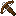
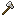
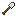
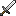
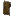
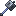

# 附魔列表

下表中的每个附魔都包含一个属性，决定玩家是否可在生存模式下合法获取。属性可以在附魔配置文件中修改。

* **最大等级**：附魔的最大等级。
* **初级物品**：在生存模式下，可以通过附魔台获得该附魔的物品类型。
* **次级物品**：在生存模式下，可以通过附魔书与铁砧获得该附魔的物品类型。
* **权重**：附魔出现的可能性。

::: info

大多数附魔的每级触发能力都可以配置。

:::

## 盔甲附魔

|附魔名称|附魔描述|冲突附魔|最大等级|初级物品|次级物品|权重|
|---|---|---|---|---|---|---|
|霜甲 （Cold Steel）|给予攻击者[挖掘疲劳](https://zh.minecraft.wiki/w/%E6%8C%96%E6%8E%98%E7%96%B2%E5%8A%B3)效果。||III|||5|
|暗御 （Darkness Cloak）|给予攻击者[黑暗](https://zh.minecraft.wiki/w/%E9%BB%91%E6%9A%97)效果。||III|||10|
|元素之御 （Elemental Protection）|降低药水与元素（着火、中毒、冻伤等）伤害。||IV|||10|
|炽炎之盾 （Fire Shield）|点燃攻击者。||IV|||2|
|炽炎行者 （Flame Walker）|与原版的冰霜行者类似，行走在岩浆上可产生临时的岩浆块防止玩家坠入岩浆，同时免疫岩浆块的灼烧伤害。|[冰霜行者](https://zh.minecraft.wiki/w/%E5%86%B0%E9%9C%9C%E8%A1%8C%E8%80%85)|II|||1|
|硬化 （Hardened）|受击后获得[抗性提升](https://zh.minecraft.wiki/w/%E6%8A%97%E6%80%A7%E6%8F%90%E5%8D%87)效果。||II|||5|
|霜寒之御 （Ice Shield）|[冻结](https://zh.minecraft.wiki/w/%E7%BB%86%E9%9B%AA#%E5%86%B0%E5%86%BB)并[降低敌人移速](https://zh.minecraft.wiki/w/%E7%BC%93%E6%85%A2)。||III|||10|
|灵跃 （Jumping）|获得[跳跃提升](https://zh.minecraft.wiki/w/%E8%B7%B3%E8%B7%83%E6%8F%90%E5%8D%87)效果。||II|||2|
|自爆 （Kamikadze）|死亡后产生爆炸。||III|||5|
|夜视 （Night Vision）|给予[夜视](https://zh.minecraft.wiki/w/%E5%A4%9C%E8%A7%86)效果。||I|||1|
|粘弹 （Rebound）|落地时获得[粘液块](https://zh.minecraft.wiki/w/%E9%BB%8F%E6%B6%B2%E5%9D%97?variant=zh-cn)的效果。|[摔落缓冲](https://zh.minecraft.wiki/w/%E6%91%94%E8%90%BD%E7%BC%93%E5%86%B2)|I|||2|
|再生 （Regrowth）|无视饱食度与饱和度随时间缓慢恢复生命值。||IV|||2|
|饱食 （Saturation）|随时间缓慢恢复饱食度与饱和度。||II|||2|
|疾步 （Sonic）|获得[迅捷](https://zh.minecraft.wiki/w/%E8%BF%85%E6%8D%B7)效果。||II|||2|
|坚挺 （Stopping Force）|受伤时增加[击退](https://zh.minecraft.wiki/w/%E5%B1%9E%E6%80%A7/%E5%87%BB%E9%80%80)抗性。||III|||5|
|水下呼吸 （Water Breathing）|获得[水下呼吸](https://zh.minecraft.wiki/w/%E6%B0%B4%E4%B8%8B%E5%91%BC%E5%90%B8%EF%BC%88%E7%8A%B6%E6%80%81%E6%95%88%E6%9E%9C%EF%BC%89)效果。||I|||1|

## 弓类附魔

|附魔名称|附魔描述|冲突附魔|最大等级|初级物品|次级物品|权重|
|---|---|---|---|---|---|---|
|爆裂之矢 （Bomber）|概率将射出的箭替换成 [TNT](https://zh.minecraft.wiki/w/TNT)。|（非）箭类附魔[^1][^2]|III|||1|
|惑乱之矢 （Confusing Arrows）|命中目标后概率施加[反胃](https://zh.minecraft.wiki/w/%E5%8F%8D%E8%83%83)效果。|非箭类附魔[^2]|III|||10|
|暗黑之矢 （Darkness Arrows）|命中目标后概率施加[黑暗](https://zh.minecraft.wiki/w/%E9%BB%91%E6%9A%97)效果。|非箭类附魔[^2]|III|||10|
|龙涎之矢 （Dragonfire Arrows）|概率在箭落地时生成一团[龙息](https://zh.minecraft.wiki/w/%E9%BE%99%E6%81%AF)。|非箭类附魔[^2]|III|||2|
|唤雷之矢 （Electrified Arrows）|命中目标后概率生成[闪电](https://zh.minecraft.wiki/w/%E9%97%AA%E7%94%B5%E6%9D%9F)。|非箭类附魔[^2]|III|||5|
|末影之矢 （Ender Bow）|概率将射出的箭替换成[末影珍珠](https://zh.minecraft.wiki/w/%E6%9C%AB%E5%BD%B1%E7%8F%8D%E7%8F%A0)。|（非）箭类附魔[^1][^2]|I|||1|
|爆破之矢 （Explosive Arrows）|概率射出落地[爆炸](https://zh.minecraft.wiki/w/%E7%88%86%E7%82%B8)的箭。|非箭类附魔[^2]|III|||5|
|飞火之矢 （Flare）|概率在箭落地时放置一根[火把](https://zh.minecraft.wiki/w/%E7%81%AB%E6%8A%8A)。|非箭类附魔[^2]|I|||5|
|恶魂之矢 （Ghast）|概率将射出的箭替换成恶魂的[烈焰弹](https://zh.minecraft.wiki/w/%E7%81%AB%E7%84%B0%E5%BC%B9)。|（非）箭类附魔[^1][^2]|I|||1|
|虚浮之矢 （Hover）|命中目标后概率施加[漂浮](https://zh.minecraft.wiki/w/%E9%A3%98%E6%B5%AE)效果。|非箭类附魔[^2]|III|||10|
|滞留 （Lingering）|箭矢落地时生成[药水效果云](https://zh.minecraft.wiki/w/%E5%8C%BA%E5%9F%9F%E6%95%88%E6%9E%9C%E4%BA%91)。|非箭类附魔[^2]|III|||2|
|淬毒之矢 （Poisoned Arrows）|命中目标后概率施加[中毒](https://zh.minecraft.wiki/w/%E4%B8%AD%E6%AF%92)。|非箭类附魔[^2]|III|||5|
|乘风快矢 （Sniper）|提升箭矢的速度。||II|||10|
|歃血之矢 （Vampiric Arrows）|命中目标后概率恢复生命值。|非箭类附魔[^2]|III|||2|
|凋谢之矢 （Withered Arrows）|命中目标后概率施加[凋零](https://zh.minecraft.wiki/w/%E5%87%8B%E9%9B%B6)。|非箭类附魔[^2]|III|||5|

## 工具附魔

|附魔名称|附魔描述|冲突附魔|最大等级|初级物品|次级物品|权重|
|---|---|---|---|---|---|---|
|爆破发掘 （Blast Mining）|概率在挖掘时产生[爆炸](https://zh.minecraft.wiki/w/%E7%88%86%E7%82%B8)并破坏范围内所有方块。|穿隧、连锁挖掘|V|||2|
|玻璃之触 （Glass Breaker）|立即破坏玻璃。||I|||10|
|急迫 （Haste）|在挖掘时产生[急迫](https://zh.minecraft.wiki/w/%E6%80%A5%E8%BF%AB)效果。||III|||2|
|幸运矿工 （Lucky Miner）|概率从挖掘的方块中获取更多[经验值](https://zh.minecraft.wiki/w/%E7%BB%8F%E9%AA%8C)。|镐||III|||5|
|复种 （Replanter）|右键或破坏[作物](https://zh.minecraft.wiki/w/%E5%86%9C%E4%BD%9C%E7%89%A9)时自动补种。||I|||1|
|搬箱 （Silk Chest）|破坏[箱子](https://zh.minecraft.wiki/w/%E7%AE%B1%E5%AD%90)后有几率使箱子保留内容物而不掉落。|||1|
|封魔之触 （Divine Touch）|概率挖下[刷怪笼](https://zh.minecraft.wiki/w/%E5%88%B7%E6%80%AA%E7%AC%BC)。|熔炼|I|||1|
|熔炼 （Smelter）|按[配方](https://zh.minecraft.wiki/w/%E7%83%A7%E7%82%BC?variant=zh-cn#%E9%85%8D%E6%96%B9)自动熔炼挖下的矿物。|[精准采集](https://zh.minecraft.wiki/w/%E7%B2%BE%E5%87%86%E9%87%87%E9%9B%86)、封魔之触|V|||5|
|心灵遥感 （Telekinesis）|概率将掉落物直接送入背包。||I|||1|
|连锁伐树 （Treefeller）|一次砍下整棵树。||I|||2|
|穿隧 （Tunnel）|概率范围挖掘。I 级为 1x2 范围，II 级为 2x2，III 级为 3x3。|连锁挖掘、爆破发掘|III|||1|
|连锁挖掘 （Veinminer）|一次挖下所有相邻的矿物。|穿隧、爆破发掘|III|||1|

## 鱼竿附魔

|附魔名称|附魔描述|冲突附魔|最大等级|初级物品|次级物品|权重|
|---|---|---|---|---|---|---|
|自动收杆 （Auto Reel）|在鱼咬钩时自动收杆。||I|||1|
|溺尸诅咒 （Curse Of Drowned）|概率钓上溺尸。||III|||5|
|二重钓 （Double Catch）|钓上来的物品数量翻倍。||III|||2|
|抛钩大师 （River Master）|提升抛钩距离。||V|||10|
|捕鱼大师 （Seasoned Angler）|提升钓鱼获得的经验数量。||III|||5|
|烈焰鱼钩 （Survivalist）|自动将钓上来的食物按配方[烤熟](https://zh.minecraft.wiki/w/%E7%83%A7%E7%82%BC?variant=zh-cn#%E9%A3%9F%E7%89%A9)。||I|||2|

## 武器附魔

|附魔名称|附魔描述|冲突附魔|最大等级|初级物品|次级物品|权重|
|---|---|---|---|---|---|---|
|下界杀手 （Bane of Netherspawn）|对[下界生物](https://zh.minecraft.wiki/w/%E4%B8%8B%E7%95%8C#%E7%94%9F%E7%89%A9)造成额外伤害。||V|||10|
|致盲 （Blindness）|命中时附加[失明](https://zh.minecraft.wiki/w/%E5%A4%B1%E6%98%8E)效果。||II|||10|
|混乱 （Confusion）|命中时附加[反胃](https://zh.minecraft.wiki/w/%E5%8F%8D%E8%83%83)效果。||II|||10|
|治愈 （Cure）|命中时概率治愈[僵尸村民](https://zh.minecraft.wiki/w/%E5%83%B5%E5%B0%B8%E6%9D%91%E6%B0%91)与[僵尸猪灵](https://zh.minecraft.wiki/w/%E5%83%B5%E5%B0%B8%E7%8C%AA%E7%81%B5)。||III|||10|
|唤死诅咒 （Curse of Death）|若击杀玩家，武器持有者也有概率被杀死。||III|||2|
|剥蚀 （Cutter）|概率除去敌方防具并使其额外减少耐久。||III|||2|
|斩首 （Decapitator）|被击杀的敌怪概率掉落头颅。||II|||1|
|复击 （Double Strike）|概率造成双倍伤害。||II|||1|
|饥饿 （Exhaust）|命中时概率附加[饥饿](https://zh.minecraft.wiki/w/%E9%A5%A5%E9%A5%BF%EF%BC%88%E7%8A%B6%E6%80%81%E6%95%88%E6%9E%9C%EF%BC%89)效果。||IV|||10|
|霜寒之刃 （Ice Aspect）|命中时概率附加缓慢效果。||III|||10|
|淬火之戟 （Infernus）|概率投出附带火焰的三叉戟。||III|||10|
|掠夺 （Nimble）|击杀敌怪的掉落物有几率直接进入背包。||I|||2|
|瘫痪 （Paralyze）|命中时有概率附加[挖掘疲劳](https://zh.minecraft.wiki/w/%E6%8C%96%E6%8E%98%E7%96%B2%E5%8A%B3)效果。||V|||5|
|怒气 （Rage）|命中时概率获得[力量](https://zh.minecraft.wiki/w/%E5%8A%9B%E9%87%8F%EF%BC%88%E7%8A%B6%E6%80%81%E6%95%88%E6%9E%9C%EF%BC%89)效果。||II|||5|
|升空 （Rocket）|命中时概率将敌怪击飞。||III|||5|
|知识窃取 （Swiper）|命中时概率窃取玩家[经验值](https://zh.minecraft.wiki/w/%E7%BB%8F%E9%AA%8C)。||III|||2|
|顽抗 （Temper）|损失生命值越多，造成的伤害越高。||V|||1|
|猎捕 （Thrifty）|概率将击杀的敌怪转化为[刷怪蛋](https://zh.minecraft.wiki/w/%E5%88%B7%E6%80%AA%E8%9B%8B)。||III|||2|
|落雷 （Thunder）|命中时概率召唤[闪电](https://zh.minecraft.wiki/w/%E9%97%AA%E7%94%B5%E6%9D%9F)，造成额外伤害。||V|||5|
|歃血 （Vampire）|命中时窃取目标生命值。||III|||2|
|淬毒 （Venom）|命中时概率附加[中毒](https://zh.minecraft.wiki/w/%E4%B8%AD%E6%AF%92)效果。||II|||10|
|村庄卫士 （Village Defender）|概率对[灾厄村民](https://zh.minecraft.wiki/w/%E7%81%BE%E5%8E%84%E6%9D%91%E6%B0%91)造成额外伤害。||V|||10|
|智慧 （Wisdom）|击杀生物可以获得更多[经验值](https://zh.minecraft.wiki/w/%E7%BB%8F%E9%AA%8C)。||V|||5|
|凋零 （Wither）|命中时概率附加[凋零](https://zh.minecraft.wiki/w/%E5%87%8B%E9%9B%B6)效果。||II|||5|

## 通用附魔

|附魔名称|附魔描述|作用物品|冲突附魔|
|---|---|---|---|
|锈斑诅咒 （Curse of Breaking）|几率在使用工具时花费额外的耐久度。|[耐久](https://zh.minecraft.wiki/w/%E8%80%90%E4%B9%85)|III|||10|
|脆弱诅咒 （Curse of Fragility）|物品不能在砂轮或铁砧中使用。||I|||10|
|祛魔诅咒 （Curse of Mediocrity）|概率消除从玩家/实体身上掉落物品/方块的附魔。||III|||5|
|厄运诅咒 （Curse of Misfortune）|概率导致实体不产生掉落物。|[时运](https://zh.minecraft.wiki/w/%E6%97%B6%E8%BF%90)、[抢夺](https://zh.minecraft.wiki/w/%E6%8A%A2%E5%A4%BA)|III|||5|
|传承 （Restore）|物品损坏时以失去所有附魔的代价阻止损坏并回复一定耐久度。||III|||2|
|归魂 （Soulbound）|阻止物品的死亡掉落。|[消失诅咒](https://zh.minecraft.wiki/w/%E6%B6%88%E5%A4%B1%E8%AF%85%E5%92%92)|I|||2|

[^1]: 箭类附魔，即效果只能作用在箭上的附魔。

[^2]: 非箭类附魔[^2]，即替换弹射物的附魔，例如：爆炸箭矢、末影之矢、恶魂之矢等。