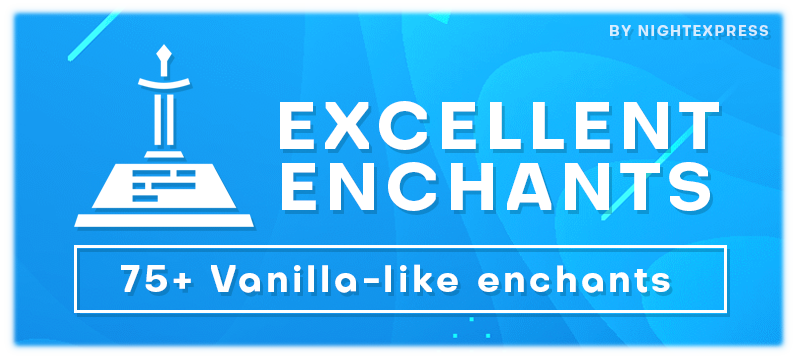

# 关于

**ExcellentEnchants** 是一款轻量且高度可配置的自定义附魔插件。它为你的服务器提供了超 75 种贴近原版设计的附魔。

## 插件特色

* 完全支持[**铁砧**](features.compatbility.md)。
* 完全支持[**砂轮**](features.compatbility.md)。
* 完全支持[**村民交易**](features.compatbility.md)。
* 完全支持[**战利品表**](features.compatbility.md)。
* 完全支持[**渔获**](features.compatbility.md)。
* 完全支持[**怪物装备**](features.compatbility.md)。
* 完全支持[**附魔书**](features.compatbility.md)。
* [**无感集成**](features.compatbility.md)。附魔会自动注册并应用至服务器。这表示它们兼容所有原版机制，可以自动与其他插件兼容而无需额外代码！
* [**原版分布**](features.compatbility.md)。所有附魔都会自动出现在世界中！
* **高度可自定义**。编辑附魔的任何属性！
* **超限支持**。等级极高的物品会有意想不到的效果！
* **颜色支持**。自定义新附魔的颜色，同时支持 HEX 与渐变色！
* [**附魔描述**](features.description.md)。在物品的描述中显示附魔介绍！
* [**附魔禁用**](features.disabling.md)。只需一条命令，即可在指定或所有世界禁用某个附魔！
* [**全新诅咒**](features.enchantments.md)。你是否想过拥有更多诅咒？现在我们做到了！
* [**物品集**](features.item-sets.md)。为附魔创建[初级](https://zh.minecraft.wiki/w/%E9%AD%94%E5%92%92%E5%AE%9A%E4%B9%89%E6%A0%BC%E5%BC%8F)和[次级](https://zh.minecraft.wiki/w/%E9%AD%94%E5%92%92%E5%AE%9A%E4%B9%89%E6%A0%BC%E5%BC%8F)物品集！
* **支持斧头**。默认允许剑类附魔兼容斧头！
* **支持弩**。默认允许弓类附魔兼容弩！
* **鞘翅支持**。默认允许胸甲类附魔兼容鞘翅！
* **附魔限制**。为每个附魔自定义排斥附魔！
* **附魔界面**。方便玩家浏览所有附魔的界面！
* **视觉特效**。部分附魔带有粒子效果与声音！
* [**附魔充能**](features.charges.md)。为自定义附魔带来全新机制！
* 支持 [PlaceholderAPI](intergrations.placeholderapi.md)。

## 兼容性

|Java|服务器版本|服务器核心|
|:---|:---|:---|
|✔ Java 21|✔1.21.4 ✔1.21.5 ✔1.21.6 ✔1.21.7|✔Spigot ✔Paper ✔Purpur ⛔Folia（不在计划内） ⛔Forge（永不支持）|

## 插件前置

* <badge type="tip" text="必选" /> [nightcore](https://nightexpressdev.com/nightcore/) - 插件引擎。
* <badge type="info" text="可选" /> [ProtocolLib](https://ci.dmulloy2.net/job/ProtocolLib/) 或 [PacketEvents](https://spigotmc.org/resources/80279/) - 动态附魔描述依赖插件。

## 下载&文档

* [SpigotMC](https://spigotmc.org/resources/61693/)
* [Hangar](https://hangar.papermc.io/NightExpress/ExcellentEnchants)
* [Modrinth](https://modrinth.com/plugin/excellentenchants)
* [文档（原帖）](https://nightexpressdev.com/excellentenchants/)
* [开发者 API](developer-api.md)

## 捐赠

如果你想支持我的工作或喜欢我的插件，可随时[为我买杯咖啡](https://ko-fi.com/nightexpress) :) 谢谢你！<3