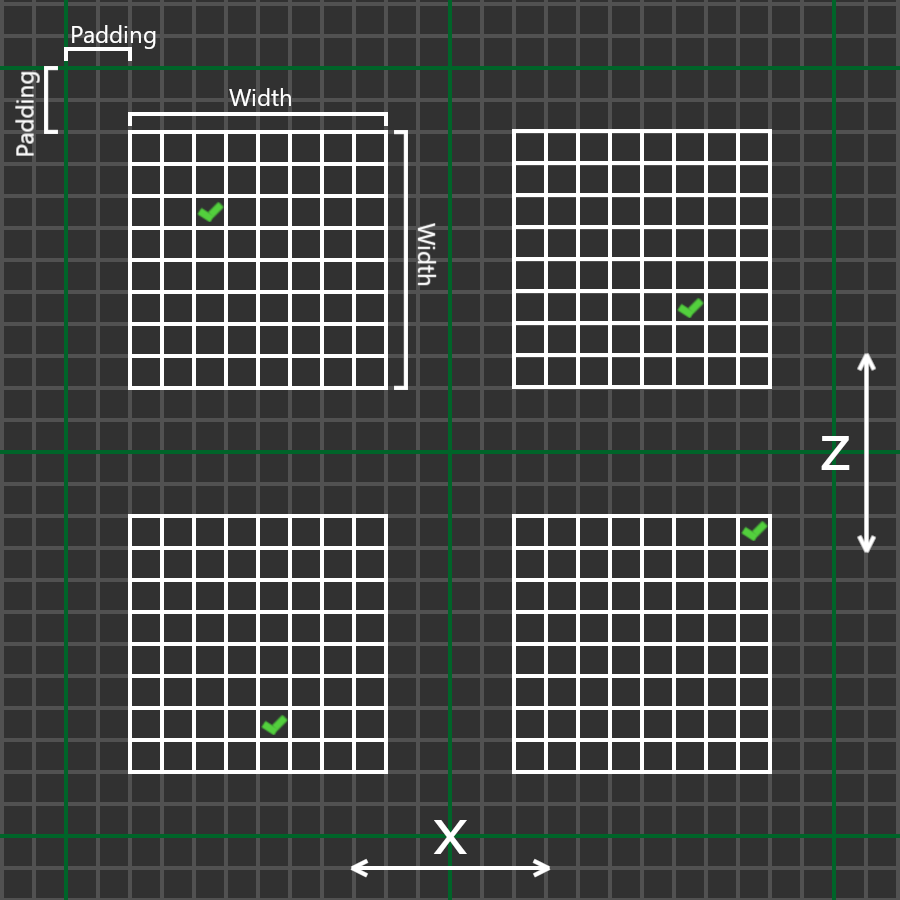
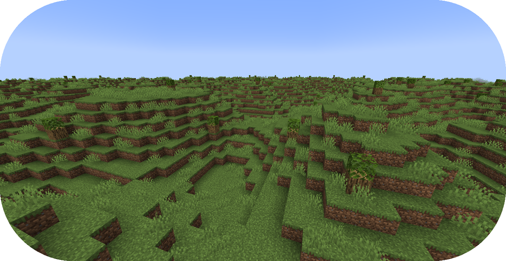
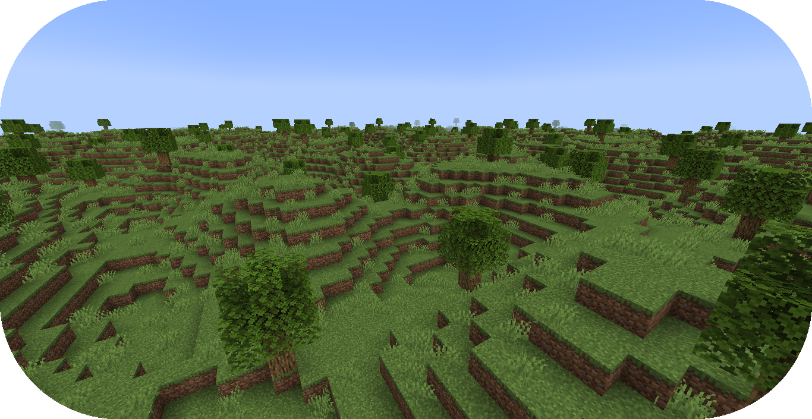

# 从零创建地物结构

本教程将会讲述地形包中，以树木为例创建地物结构的步骤。

如果你还没有准备好，请在开始阅读前浏览“[配置开发介绍](config-packs.config-development.config-development-introduction.md)”章节。

更多创建地物的深入教程，请参阅这个非官方开发教程，[地物配置](https://terra.atr.sh/#/page/feature%20config)。

如果你遇到问题或需要示例，你可以在 [Github 仓库](https://github.com/PolyhedralDev/TerraPackFromScratch/)中找到本教程的参考用配置包。

## 设置新结构
`步骤`

### 1. 创建结构文件

[结构](config-packs.config-documentation.config-objects.structure.md)文件可以为动态的 TerraScript，即 `.tesf` 文件，也可以为静态的 `.schem` 结构文件。

:::: tabs

::: tab TerraScript

TerraScript 文件以 [TerraScript 语言](config-packs.config-documentation.terra-script.md)写就。TerraScript 允许程序化结构生成，并能更精确地设置结构细节。

1. 将 `structure-terrascript-loader` 导入包验证文件，版本为 `1.+`。

``` YAML title="pack.yml" {6}
id: YOUR_PACK_ID
version: 0.5.0

addons:
  ...
  structure-terrascript-loader: "1.+"
```

2. 创建一个空白的 `.tesf` 文件。
3. 在 `.tesf` 文件内编写 TerraScript 以生成结构。

本教程中将会以 `oak_tree.tesf` 为示例文件名称。

如下为较为简洁直观的 `oak_tree.tesf` 文件示例。

``` JavaScript title="oak_tree.tesf"
block(0, 0, 0, "minecraft:oak_log", true);
block(0, 1, 0, "minecraft:oak_leaves", false);
```

:::

::: tab Schematic

结构文件包含了一系列可通过 [WorldEdit](../WorldEdit/usage.clipboard.md) 保存与读取的方块结构。

1. 将 `structure-sponge-loader` 导入包验证文件，版本为 `1.+`。

``` YAML tilte="pack.yml" {6}
id: YOUR_PACK_ID
version: 0.5.0

addons:
  ...
  structure-sponge-loader: "1.+"
```

2. 找到一个 `.schem` 文件，如果你需要自行创建的话，你可以使用 [WorldEdit](../WorldEdit/usage.clipboard.md)。
3. 将 `.schem` 文件加入你的包中。

本教程中将会以 `oak_tree.schem` 为示例文件名称。

如果需要，[Github](https://github.com/PolyhedralDev/TerraPackFromScratch/tree/master/4-adding-trees) 上有示例的 `oak_tree.schem` 文件。  

:::

::::

::: danger

如果你决定同时使用两种类型的结构文件，在命名时两个结构文件的名称不可以相同。

:::

### 2. 创建新生成阶段

最好将地物分类至不同的生成阶段，这样不仅可以让文件结构保持整洁，也可以更好地安排其他地物的生成。

例如，你可能需要让树木先于草丛生成，这样树木就不会因草的生成而被阻止。

我们将会利用“[设置地物](config-packs.config-development.creating-a-pack-from-scratch.creating-a-feature-from-scratch.md)”中引入的 `generation-stage-feature` 附属，创建一个新的生成阶段。

``` YAML title="pack.yml" {6-7}
id: YOUR_PACK_ID

...

stages:
  - id: trees
    type: FEATURE
  # 配置中的顺序为先树木后植被, 即树木将会先于植被生成.
  - id: flora
    type: FEATURE
```

::: warning

生成阶段 ID 可自行编辑，地物的生成按配置中从上到下的顺序进行。

:::

### 3. 创建地物配置

我们将会利用“[设置地物](config-packs.config-development.creating-a-pack-from-scratch.creating-a-feature-from-scratch.md)”中引入的 `config-feature` 附属，创建一个新的地物配置文件。

[创建一个空配置文件](config-packs.config-development.config-files.md#创建配置文件)，名称为 `oak_tree_feature.yml`。

通过 `type` [参数](config-packs.config-development.the-config-system.md)设置[配置类型](config-packs.config-development.the-config-system.md#配置类型)，并按如下所示的内容配置 `id`。

``` YAML title="oak_tree_feature.yml"
id: OAK_TREE_FEATURE
type: FEATURE
```

### 4. 添加地物分布器

我们将会利用“[设置地物](config-packs.config-development.creating-a-pack-from-scratch.creating-a-feature-from-scratch.md)”中引入的 `config-distributors` 附属，创建一个地物分布器。

如下所示，在 `oak_tree_feature.yml` 中使用 `PADDED_GRID` 分布器。

``` YAML title="oak_tree_feature.yml" {4-8}
id: OAK_TREE_FEATURE
type: FEATURE

distributor:
  type: PADDED_GRID
  width: 12
  padding: 4
  salt: 5864
```

`PADDED_GRID` 分布器类型将一片区域划分为带间隔的网格，确保地物生成时不会挨得太近。

`PADDED_GRID` 有三个[参数](config-packs.config-development.the-config-system.md#参数)，`width`、`padding` 与 `salt`。

* `width` - 决定了每个包含地物的网格区域边长。
* `padding` - 决定区域之间的间隔大小。
* `salt` - 通常是一个用于偏移分布器结果的随机数，防止同一分布器下地形重叠生成。盐值功能的详细讲述可以在[这里](config-packs.config-development.noise.how-noise-samplers-work.md)浏览。

<!--

注意：此段因对应章节尚未翻译完毕而缺乏与原文相同的进一步引导标签，请在翻译完毕后将其补全。

缺失章节标题：Salt

-->



::: info

`PADDED_GRID` 和其他分布器类型的相关文档可以在[这里](config-packs.config-documentation.config-objects.distributor.md
)找到。

:::

### 5. 添加地物定位器

现在，我们将利用“[设置地物](config-packs.config-development.creating-a-pack-from-scratch.creating-a-feature-from-scratch.md)”中引入的 `config-locators` 附属，创建一个定位器。

如下所示，在 `oak_tree_feature.yml` 中使用 `TOP` 定位器。

``` YAML title="oak_tree_feature.yml" {7-11}
id: OAK_TREE_FEATURE
type: FEATURE

distributor:
  ...

locator:
  type: TOP
  range:
    min: 0
    max: 319
```

`TOP` 定位器与 `SURFACE` 定位器搭配使用，将不止搜索上方有空间的方块，而是会选择其中 Y 轴最高的位置生成。

::: info

可用的各种定位器相关文档可以在[这里](config-packs.config-documentation.config-objects.locator.md)找到。

:::

### 6. 改进地物定位器

与 `SURFACE` 定位器在添加矮草丛的行为类似，`TOP` 适合将地物放置在方块最高点，但它不会检查地物所放置的方块。

利用 `AND` 定位器，我们可以结合多个[定位器](config-packs.config-documentation.config-objects.locator.md)，使得地物生成的条件更加精确。

通过 `type` 设置为 `MATCH_SET` 的 `PATTERN` 定位器，我们可以指定地物生成的位置附近的方块组合。

将如下高亮内容添加至配置，以应用这些定位器。

``` YAML title="feature.yml" {8-21}
id: OAK_TREE_FEATURE
type: FEATURE

distributor:
  ...

locator:
  type: AND
  locators:
    - type: TOP
      range: &range # 为其他定位器备用的锚点
        min: 0
        max: 319
    - type: PATTERN
      range: *range  # 引用先前锚定的值
      pattern:
        type: MATCH_SET
        blocks:
          - minecraft:grass_block
          - minecraft:dirt
        offset: -1
```

### 7. 添加结构

如下高亮部分所示，现在可以将[结构](config-packs.config-documentation.config-objects.structure.md)添加至 `oak_trss_feature` 配置中。

``` YAML title="oak_tree_feature.yml" {10-13}
id: OAK_TREE_FEATURE
type: FEATURE

distributor:
  ...

locator:
  ...

structures:
  distribution:
    type: CONSTANT
  structures: oak_tree
```

::: tip

地物配置可以通过噪声采样器，从权重列表中选择结构，如下所示。

``` YAML title="feature.yml"
structures:
  distribution:
    type: WHITE_NOISE
    salt: 4357
  structures:
    - oak_tree_1: 1
    - oak_tree_2: 1
    - oak_tree_3: 1
```

权重列表的详细讲述可以在[这里](config-packs.config-documentation.config-objects.weightedlist.md)找到。

:::

### 8. 将地物应用于群系

现在，我们就要将树木地物添加至 `FIRST_BIOME`。

将如下高亮配置加入 `FIRST_BIOME` 配置中。

``` YAML title="first_biome.yml" {11-12}
id: FIRST_BIOME
type: BIOME

vanilla: minecraft:plains

...

features:
  trees:
    - OAK_TREE_FEATURE
  flora:
    - GRASS_FEATURE
```

`OAK_TREE_FEATURE` 地物将会在 `FIRST_BIOME` 生物群系中生成。

### 9. 载入地形包

到了这一步，你的包就可以正常在世界中生成树木了！你可以通过开发客户端/服务器载入你刚刚编写的包。你可以通过 `/packs` 命令确认插件是否显示了（验证文件中指定的）包 ID，或者在服务器/客户端启动时从日志中确认。

如果你的包出于某种原因没有载入，控制台中会出现其无法载入的报错，请仔细解读并尝试自行排除问题所在，并重新尝试之前的步骤。

如果你还是没有办法载入地形包，随时欢迎带着相关报错[联系我们](contact-and-support.md)。


## 总结

在你的包成功载入之后，你就可以使用你的新地形包生成一片带着草和树木的世界了！

本章节的参考配置可以在 Github 的[这个地方](https://github.com/PolyhedralDev/TerraPackFromScratch/tree/master/5-adding-trees)找到。



