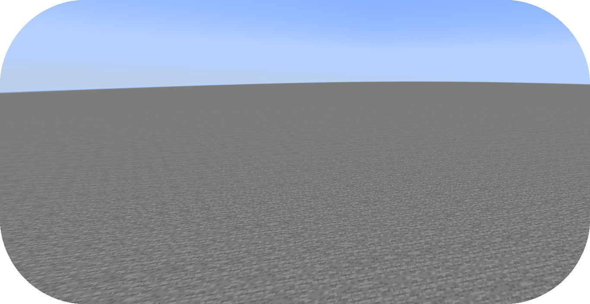

# 从零编写地形包

本教程将会大致讲述新建 Terra 地形包的步骤，包括创建验证文件及首个生物群系。

如果你还没有准备好，请在开始阅读前浏览“[配置开发介绍](config-packs.config-development.config-development-introduction.md)”章节。

如果你遇到问题或需要示例，你可以在 [Github 仓库](https://github.com/PolyhedralDev/TerraPackFromScratch/)中找到本教程的参考用配置包。

::: info

如果你希望**修改已有地形包**而不是自行创建，请参考“[修改已有地形包](config-packs.config-development.modifying-an-existing-pack.md)”章节。

:::

## 创建新地形包

`步骤`

### 1. 创建配置包目录

前往[包目录](config-packs.config-development.config-development-introduction.md#子文件夹)，在里面创建一个新的文件夹，名称随意。这个包目录将会包含你的所有[配置文件](config-packs.config-development.config-files.md)。


### 2. 创建包验证文件

在你的包目录文件中[创建新的配置文件](config-packs.config-development.config-files.md#创建配置文件)，名称为 `pack.yml`。

包验证文件将会为插件提供包相关的信息，使得其能够正常载入——比如包的作者，包的版本，依赖附属或 Minecraft 的版本等。

### 3. 设置包 ID 及版本

通过你[选择的编辑器](config-packs.config-development.config-development-introduction.md#选择编辑器)打开包验证文件。

在编辑器内，将如下**参数**加入其中：

``` YAML title="pack.yml"
id: YOUR_PACK_ID

version: 0.1.0
```

参数可以视作“配置选项”——有关这部分的详细解释，你可以浏览“[配置系统](config-packs.config-development.the-config-system.md)”章节。

你随时可以将这些参数按需要改变，但有如下限制：

* 包的 `id` 只能包含英文字母、数字、横杠及下划线（不包括空格）。

* 包的 `id` 通常使用全小写字符，但并不是强制要求。

* 包的 `version` 需按 [SemVer](https://semver.org/) 格式标注为 `X.Y.Z`。

*另外*，你还可以通过 `author` 参数在验证文件内将自己设置为作者。

``` YAML title="pack.yml"
id: YOUR_PACK_ID

version: 0.1.0

author: YOUR_USERNAME # 可选
```

:::

::::: tip

[之前](config-packs.config-development.defining-data-in-configs.md#顺序)提到，参数的顺序其实并不重要，因此你可以将它们任意排列。除此之外，插件会自动忽略配置之间的空行，因此如下配置可以达到同样的效果：

:::: tabs

::: tab 示例一

``` YAML title="pack.yml"
id: YOUR_PACK_ID

version: 0.1.0
```

:::

::: tab 示例二

``` YAML title="pack.yml"
id: YOUR_PACK_ID
version: 0.1.0
```

:::

::: tab 示例三

``` YAML title="pack.yml"
version: 0.1.0
id: YOUR_PACK_ID
```

:::

::::

:::::

### 4. 指定配置文件格式

Terra 需要你指定配置文件的格式，这点在“[配置文件](config-packs.config-development.config-files.md)”章节有所提及。

在本教程中，我们使用 `language-yaml` 提供支持的 YAML 格式。YAML 是用于编写 Terra 配置文件的标准格式。我们可以通过 `addons` 参数引用，如下所示：

``` YAML title="pack.yml"
id: YOUR_PACK_ID
version: 0.1.0
addons:
  language-yaml: "1.+"
```

在 `addons` 参数下填入的键值对分别代表着拓展的名称，以及拓展指定的版本。

字符串 `1.+` 表示这个包使用的拓展主版本为 1，而子版本（第二个数字）为 0 或更高。

::: info

配置包内的所有配置文件都必须使用语言拓展支持的格式，可以在包验证文件内设置。包验证文件本身使用的格式需要能被任意*安装的*语言拓展识别，尽管它应该用自己指定的格式编写。

:::

### 5. 选择区块生成器

区块生成器会告诉 Terra 如何（在为其生成装饰前）生成区块内的基础方块，这都是通过附属实现的。

在本教程中，我们会使用 `NOISE_3D` 生成器，由 `chunk-generator-noise-3d` 核心附属提供。我们可以将 `chunk-generator-noise-3d` 加入 `addons` 列表，如下所示：

``` YAML title="pack.yml"
addons:
  language-yaml: "1.+"
  chunk-generator-noise-3d: "1.+"
```

::: info

这只是你想要加入某个附属的假想流程！

:::

在设置生成器之后，我们可以通过 `generator` 参数让包使用它，如下所示：

``` YAML title="pack.yml"
id: YOUR_PACK_ID
version: 0.1.0
addons:
  language-yaml: "1.+"
  chunk-generator-noise-3d: "1.+"
generator: NOISE_3D
```

`NOISE_3D` 生成器需要两个叫做*采样器*与*调色板*的东西。若要定义这些，我们要在包文件内加入如下内容：

``` YAML title="pack.yml"
addons:
  language-yaml: "1.+"
  chunk-generator-noise-3d: "1.+"
  config-noise-function: "1.+"
  palette-block-shortcut: "1.+"
```

### 6. 创建你的第一个生物群系

1. 将 `config-biome` 作为依赖导入，版本需求为 `1.+`。这可以让你通过 `BIOME` [配置类型](config-packs.config-development.the-config-system.md#配置类型) 增加新的生物群系。

``` YAML title="pack.yml"
addons:
  language-yaml: "1.+"
  chunk-generator-noise-3d: "1.+"
  config-noise-function: "1.+"
  palette-block-shortcut: "1.+"
  config-biome: "1.+"
```

2. [创建新的配置文件](config-packs.config-development.config-files.md#创建配置文件)，名称可以是任何内容，本示例使用的名称为 `first_biome.yml`。

3. 在 `first_biome.yml` 内，打开你的编辑器，通过 `type` 为文件设置[配置类型](config-packs.config-development.the-config-system.md#配置类型)，然后填入 `id`，如下所示：

``` YAML title="first_biome.yml"
id: FIRST_BIOME

type: BIOME
```

4. 设置 `vanilla` 参数为原版生物群系 ID。本示例中我们使用 `minecraft:plains`，但你可以任意填写原版的生物群系。

``` YAML title="first_biome.yml"
id: FIRST_BIOME
type: BIOME

vanilla: minecraft:plains
```

Terra 使用 `vanilla` 参数决定生物生成与草方块草皮的颜色，但处理逻辑可能会因你使用的平台而略有不同。

### 7. 向新群系添加生成器参数

这些参数会决定 `NOISE_3D` 在生物群系内的地形：

::: info `terrain.sampler` - 决定群系内的地形形状。

现在，我们会为 `terrain.sampler` 使用如下配置：

``` YAML title="first_biome.yml"
id: FIRST_BIOME
type: BIOME
vanilla: minecraft:plains

terrain:
  sampler:
    type: LINEAR_HEIGHTMAP
    base: 64
```

我们稍后会讲解它的具体运作逻辑，现在只需要知道这只会生成一片平地，高度由 `base` 指定（示例中即为 y=64）。

:::

::: `palette` - 决定群系内的方块构成。

`palette` 参数接受的是后接列表的单个键值对，键代表 `palette` 配置，值则决定了 Y 轴对应位置使用的方块。

例如，如下的配置表示，Y = 10 之下的位置使用 `Palette C`， Y = 11 到 Y = 30 的位置使用 `Palette B`，而 Y = 31 之上的位置则使用 `Palette A`。

``` YAML
palette:
  - Palette A: 319 # 从 y319 到下一个调色板定义的位置 (即 y30)
  - Palette B: 30  # 从 y30 到下一个调色板定义的位置 (即 y10)
  - Palette C: 10  # 从 y10 到世界最低点
```

`palette-block-shortcut` 附属允许通过 `BLOCK:<方块 ID>` 定义简单的单方块调色板。在我们的生物群系中，我们会以 `minecraft:stone` 为例，并通过 `319` 指定从 Y = 319 往下的位置均由 `minecraft:stone` 组成。

``` YAML title="first_biome.yml"
id: FIRST_BIOME
type: BIOME
vanilla: minecraft:plains

terrain:
  sampler:
    type: LINEAR_HEIGHTMAP
    base: 64

palette:
  - BLOCK:minecraft:stone: 319
```

### 8. 设置群系提供器

为了让我们的地形包能够被顺利载入，也为了让 `FIRST_BIOME` 能正常生成，我们需要定义一个**群系提供器**。它能告诉 Terra 如何在世界内布置生物群系。

我们可以在 `biomes` 参数下设置提供器，但首先我们需要导入一个提供器备用。在本教程中，我们使用的是 `SINGLE` 提供器，通过 `biome-provider-single` 核心附属（版本 `1.+`）添加。

在你添加 `biome-provider-single` 之后，你可以在包验证文件中添加 `biomes` 文件，如下所示：

``` YAML title="pack.yml" {14-16}
id: YOUR_PACK_ID
version: 0.1.0

addons:
  language-yaml: "1.+"
  chunk-generator-noise-3d: "1.+"
  config-noise-function: "1.+"
  palette-block-shortcut: "1.+"
  config-biome: "1.+"
  biome-provider-single: "1.+"

generator: NOISE_3D

biomes:
  type: SINGLE
  biome: FIRST_BIOME
```

可以看见 `SINGLE` 提供器的 `biome` 参数是先前自定义的生物群系 `id`。这会让整个世界生成 `FIRST_BIOME`。

### 9. 载入地形包

到了这一步，你的包就可以正常生成世界了！你可以通过开发客户端/服务器载入你刚刚编写的包。你可以通过 `/packs` 命令确认插件是否显示了（验证文件中指定的）包 ID，或者在服务器/客户端启动时从日志中确认。

如果你的包出于某种原因没有载入，控制台中会出现其无法载入的报错，请仔细解读并尝试自行排除问题所在，并重新尝试之前的步骤。

如果你还是没有办法载入地形包，随时欢迎带着相关报错[联系我们](contact-and-support.md)。

## 总结

在你的包成功载入之后，你就可以使用你的新地形包生成世界了！

本章节的参考配置可以在 Github 的[这个地方](https://github.com/PolyhedralDev/TerraPackFromScratch/tree/master/1-setting-up)找到。

