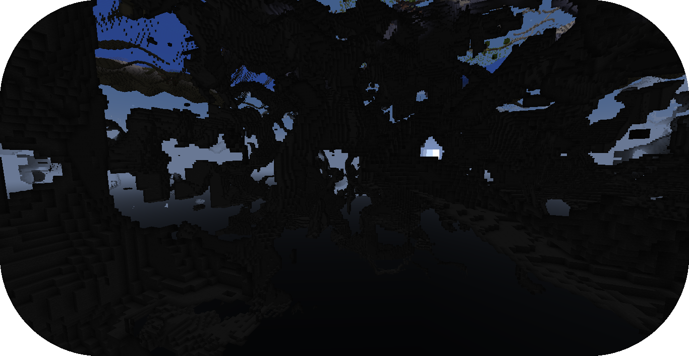
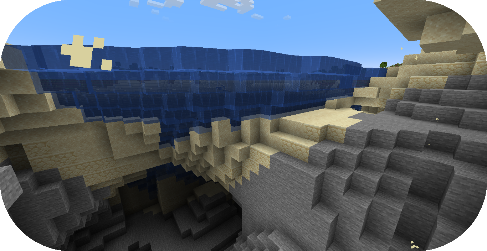
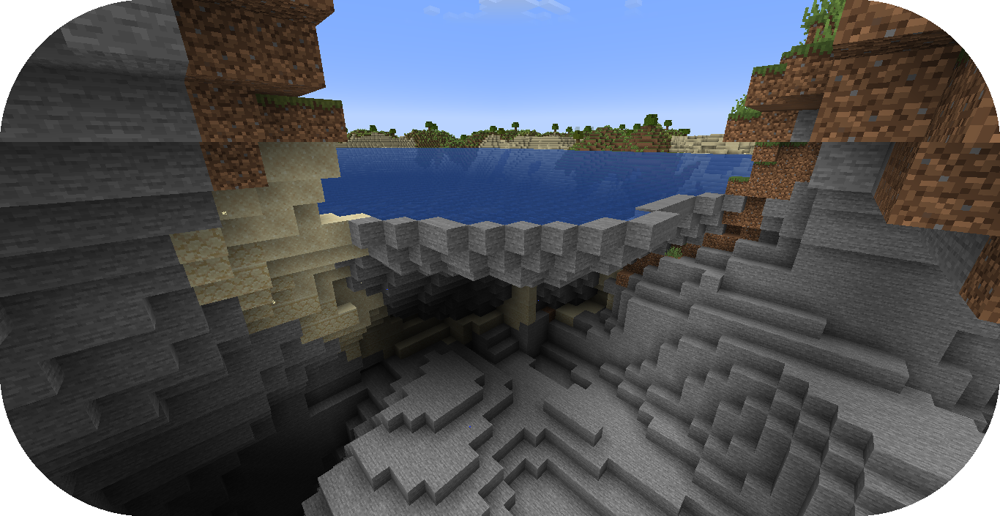

# 从零编写洞穴

本教程将会讲述地形包有关通过沟壑功能创建洞穴的步骤。


如果你还没有准备好，请在开始阅读前浏览“[配置开发介绍](config-packs.config-development.config-development-introduction.md)”和“[从零创建地形包](config-packs.config-development.creating-a-pack-from-scratch.creating-a-pack-from-scratch.md)”章节。

如果你遇到问题或需要示例，你可以在 [Github 仓库](https://github.com/PolyhedralDev/TerraPackFromScratch/)中找到本教程的参考用配置包。

## 设置沟壑

`步骤`

### 1. 添加缓存采样器

使用缓存采样器可以在配置开发时简化[噪声采样器](config-packs.config-documentation.config-objects.noisesampler.md)的表达式。

缓存采样器允许[噪声采样器](config-packs.config-documentation.config-objects.noisesampler.md)表达式和 [TerraScript 的采样器函数](config-packs.config-documentation.terra-script.terrascript-functions.md)在包中随意使用。

缓存采样器在你使用同一个[噪声采样器](config-packs.config-documentation.config-objects.noisesampler.md)制作多个表达式时很方便。

<!--

注意：
此段尚未翻译完毕，对应章节因缺失标题而无法添加进一步索引。

缺失标题：
sampler

-->

通过你[选择的编辑器](config-packs.config-development.config-development-introduction.md#选择编辑器)打开包验证文件。

将如下高亮内容加入配置，以启用采样器缓存。

``` YAML title="pack.yml" {9-23}
id: YOUR_PACK_ID

addons:
  ...

stages:
  ...

samplers:
  simplex:
    dimensions: 2
    type: FBM
    octaves: 4
    sampler:
      type: OPEN_SIMPLEX_2
      frequency: 0.0075
  simplex3:
    dimensions: 3
    type: FBM
    octaves: 4
    sampler:
      type: OPEN_SIMPLEX_2
      frequency: 0.0075
```

这些采样器因使用了[分形化](config-packs.config-development.noise.configuring-noise-samplers.md)，与先前的有略微差异。

<!--

注意：
此段尚未翻译完毕，对应章节因缺失标题而无法添加进一步索引。

缺失标题：
Fractalization

-->

`FBM` 分形类型结合了多层（或称“多倍频程”）[噪声采样器](config-packs.config-documentation.config-objects.noisesampler.md)，赋予地形更多细节。

新缓存的 `simplex` 采样器通常用于地形采样，它们通常用到了两个轴。

新缓存的 `simplex3` 采样器用于本章节提及的沟壑，它们用到了三个轴。

### 2. 添加沟壑抽象配置

沟壑的抽象配置可以用于群系，以便于更简单的拓展和继承沟壑生成。

[创建一个空白配置文件](config-packs.config-development.config-files.md#创建配置文件)，名为 `carving_land.yml`。

通过 `type` [参数](config-packs.config-development.the-config-system.md#参数)设置[配置类型](config-packs.config-development.the-config-system.md#配置类型)，并按如下所示配置 `id`。

``` YAML title="carving_land.yml"
id: CARVING_LAND
type: BIOME
abstract: true
```

将如下内容添加至沟壑采样器。

``` YAML title="carving_land.yml" {5-29}
id: CARVING_LAND
type: BIOME
abstract: true

carving:
  sampler:
    dimensions: 3
    type: EXPRESSION
    variables:

      carvingThreshold: 0.55 # 值越大, 沟壑越少
      carvingMinHeight: -63
      carvingMaxHeight: 140
      carvingCap: 1 # 基础沟壑数量上限

      spaghettiStrengthLarge: 0.59
      spaghettiStrengthSmall: 0.57

    expression: |
      -carvingThreshold
      + if(y<carvingMinHeight||y>carvingMaxHeight,0, // 跳过无用计算
        min(carvingCap,
          // 意面洞穴
          max(
            spaghettiStrengthLarge * ((-(|simplex3(x,y+0000,z)|+|simplex3(x,y+1000,z)|)/2)+1),
            spaghettiStrengthSmall * ((-(|simplex3(x,y+2000,z)|+|simplex3(x,y+3000,z)|)/2)+1)
          )
        )
      )
```

::: tip

推荐阅读[“从零创建地形”](config-packs.config-development.creating-a-pack-from-scratch.creating-terrain-from-scratch.md)和“[TerraScript 格式](config-packs.config-documentation.terra-script.md)”更好了解这些配置的格式。

:::

这个沟壑采样器会在指定高度的非空气方块中挖掘洞穴，配置中最高 Y 轴为 `140`，最低 Y 轴为 `-63`。

采样器表达式产生的结果是生成意面洞穴。

本章节教程不会详细讲述这个沟壑采样器的工作方式，只会粗略地进行介绍。

表达式开头是 `carvingThreshold` 值取负，会加在表达式的剩余部分。

之后，如果 `y` 不在 `carvingMinHeight` 或 `carvingMaxHeight` 的范围内，则输出 `0`。

也即超出范围的位置不会放置方块。

`0` 之后的参数可被视作代码的 else 入口。它包含了 `min()` 函数，会在 `carvingCap` 之间取最小值，而 `max()` 则表示在两个 simplex3 采样器集合间取最大值，两个采样器与另一个略有偏移，最后会相加。

::: info 

这个沟壑只包含了默认世界配置沟壑的意面洞穴，可以在 Github 的[这里](https://github.com/PolyhedralDev/TerraOverworldConfig/)找到。

:::

### 3. 引入抽象沟壑配置

陆地生物群系配置需要引入 `CARVING_LAND` 才可以继承沟壑。

通过你[选择的编辑器](config-packs.config-development.config-development-introduction.md#选择编辑器)打开 `FIRST_BIOME` 和 `SECOND_BIOME` 文件。

在 `FIRST_BIOME` 和 `SECOND_BIOME` 文件的 `extends` 中，加入 `CARVING_LAND`。

``` YAML title="first_biome.yml" {3-5}
id: FIRST_BIOME
type: BIOME
extends:
  - BASE
  - CARVING_LAND

...
```

``` YAML title="second_biome.yml" {3-5}
id: SECOND_BIOME
type: BIOME
extends:
  - BASE
  - CARVING_LAND

...
```

::: danger

不推荐将 `CARVING_LAND` 加入 `OCEAN_BIOME`，这会让洞穴在海洋的水方块中生成洞穴。

可使用降低了最大生成高度的抽象沟壑配置解决这个问题。

:::



### 4. 载入地形包

到了这一步，你的包就可以正常生成洞穴了。你可以通过开发客户端/服务器载入你刚刚编写的包。你可以通过 `/packs` 命令确认插件是否显示了（验证文件中指定的）包 ID，或者在服务器/客户端启动时从日志中确认。

如果你的包出于某种原因没有载入，控制台中会出现其无法载入的报错，请仔细解读并尝试自行排除问题所在，并重新尝试之前的步骤。

如果你还是没有办法载入地形包，随时欢迎带着相关报错[联系我们](contact-and-support.md)。

::: warning

如果你在载入包的同时还完成了先前一步的[海洋生成](config-packs.config-development.creating-a-pack-from-scratch.creating-oceans-from-scratch.md)，你就会见到下图所示的浮空水，这是因为 `CARVING_LAND` 把这些固体方块给剔除了。

下一步我们就会讲到它的解决办法。

:::



### 5. 浮空水问题

解决沟壑导致的浮空水有多种方法。

本章节所用最简单的方法就是以地物的方式，用石头将空气方块围住。

[创建一个空白配置文件](config-packs.config-development.config-files.md#创建配置文件)，名为 `contain_floating_water.yml`。

通过 `type` [参数](config-packs.config-development.the-config-system.md#参数)设置[配置类型](config-packs.config-development.the-config-system.md#配置类型)，并按如下所示配置 `id`。

``` YAML title="contain_floating_water.yml"
id: CONTAIN_FLOATING_WATER
type: FEATURE
```

将高亮部分添加进配置，创建这个指定的地物。

``` YAML title="contain_floating_water.yml" {4-35}
id: CONTAIN_FLOATING_WATER
type: FEATURE

distributor:
  type: "YES"

locator:
  type: AND
  locators:
    - type: PATTERN
      range: &range
        min: 0
        max: 63
      pattern:
        type: MATCH_AIR
        offset: 0
    - type: OR
      locators:
        - type: PATTERN
          range: *range
          pattern:
            type: MATCH
            block: minecraft:water
            offset: 1
        - type: ADJACENT_PATTERN
          range: *range
          pattern:
            type: MATCH
            block: minecraft:water
            offset: 0

structures:
  distribution:
    type: CONSTANT
  structures: BLOCK:minecraft:stone
```

`CONTAIN_FLOATING_WATER` 搜寻相邻于水的空气方块，并在那个位置放置石头。

通过你[选择的编辑器](config-packs.config-development.config-development-introduction.md#选择编辑器)打开包验证文件。

在包验证文件内加入一个生成阶段，允许这个地物独立于其他地物生成。

本教程将这个生成阶段称为 `preprocessors`。

``` YAML title="pack.yml" {5-7}
id: YOUR_PACK_ID

...

stages:
  - id: preprocessors
    type: FEATURE

  - id: trees
    type: FEATURE

  - id: flora
    type: FEATURE
```

`CONTAIN_FLOATING_WATER` 可以被单独添加至每个群系的配置，但那样的话工程太过繁杂。

与“[创建海洋](config-packs.config-development.creating-a-pack-from-scratch.creating-oceans-from-scratch.md)”中通过海洋调色板的方法类似，我们可以让群系继承并生成抽象配置中的内容。

通过你[选择的编辑器](config-packs.config-development.config-development-introduction.md#选择编辑器)打开 `BASE` 配置文件。

将如下引入了 `BASE` 以继承 `preprocessors` 中 `BASE` 的地物生成。

``` YAML title="base.yml" {9-11}
id: BASE
type: BIOME
abstract: true

ocean:
  palette: BLOCK:minecraft:water
  level: 62

features:
  preprocessors:
    - CONTAIN_FLOATING_WATER
```

这不是最好的方法，但它以相对简单的方式解决了问题。

## 总结

在你的包成功载入并解决浮空水问题之后，你就可以生成正常的带洞穴世界了！

本章节的参考配置可以在 Github 的[这个地方](https://github.com/PolyhedralDev/TerraPackFromScratch/tree/master/8-adding-carving)找到。

