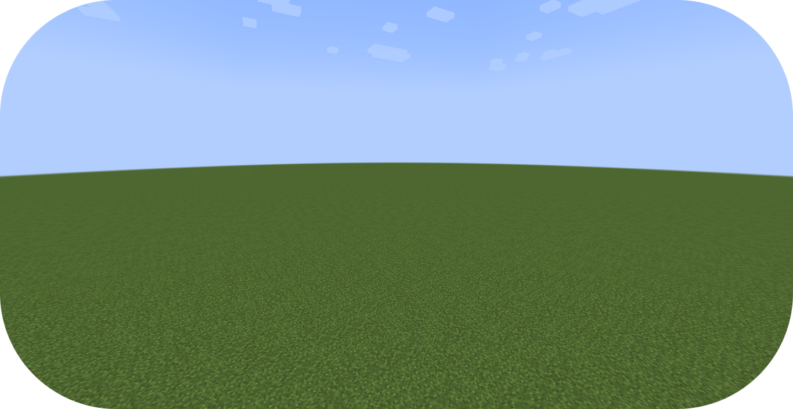
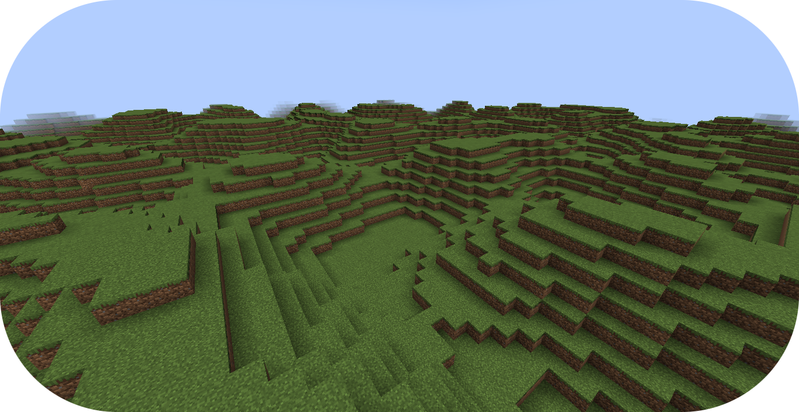

# 从零编写地形

本教程将会继续讲述地形包有关创建地形的步骤。

如果你还没有准备好，请在开始阅读前浏览“[配置开发介绍](config-packs.config-development.config-development-introduction.md)”章节。

如果你遇到问题或需要示例，你可以在 [Github 仓库](https://github.com/PolyhedralDev/TerraPackFromScratch/)中找到本教程的参考用配置包。

## 设置新地形

`步骤`

::: tip

在本章节中，`/packs reload` 命令可以用于重载配置包，便于玩家观察世界内的变化。

如果 Terra 在输入命令后重载失败，请检查控制台排除问题。

:::

### 1. 添加表达式采样器

`EXPRESSION` [噪声采样器](config-packs.config-documentation.config-objects.noisesampler.md)允许通过配置表达式输出采样器，同时还允许在采样器内调用其他采样器的内建或自定义函数。

通过你[选择的编辑器](config-packs.config-development.config-development-introduction.md#选择编辑器)打开你的 `FIRST_BIOME` [群系](config-packs.config-documentation.config-files.biome.md)配置。

将如下所示的高亮部分添加至配置，以将当前的地形采样器替换为 `EXPRESSION`。

``` YAML title="first_biome.yml" {8-10}
id: FIRST_BIOME
type: BIOME

vanilla: minecraft:plains

terrain:
  sampler:
    type: EXPRESSION
    dimensions: 3
    expression: -y + 64

...
```

`terrain.sampler` 包含了三个[参数](config-packs.config-development.the-config-system.md#参数)，即 `type`、`dimensions` 和 `expression`。

* `type` - 决定了生成地形的[噪音采样器](config-packs.config-documentation.config-objects.noisesampler.md)类型。
* `dimensions` - 决定了输入采样的空间轴数量（X、Y 与 Z）。
* `expression` - 由用户决定生成地形的表达式。

地形生成由[表达式](config-packs.config-documentation.config-objects.expression.md)输出的正负影响。

正值输出表示此处生成实心方块，反之则不生成方块。

采样器[表达式](config-packs.config-documentation.config-objects.expression.md)中，`-y + 64` 表示临时考虑了 Y 轴影响。

表达式的结果将会返回正值，生成的地形持续到世界 Y 轴的 `64` 附近时，因 `-64 + 64` 返回 `0`，而不会生成方块。即没有方块可以生成在 y = 64 之上。

Y 坐标大于 `64` 的位置因表达式返回负值，如 `-90 + 64` 输出 `-26`，同样不会生成方块。

`-y + 64` 表达式生成的是接近于超平坦模式的地形。



::: info

有关于 `EXPRESSION` 与其他噪声取样器的文档可以在[这里](config-packs.config-documentation.config-objects.noisesampler.md)找到。

有关于数学表达式的相关文档可以在[这里](config-packs.config-documentation.config-objects.expression.md)找到。

:::

::: tip

你可以在[表达式](config-packs.config-documentation.config-objects.expression.md)中添加变量，降低配置难度。

``` YAML title="first_biome.yml" {5-7}
terrain:
  sampler:
    type: EXPRESSION
    dimensions: 3
    variables:
      base: 64
    expression: -y + base
```

你也可以引用采样器外的锚点变量。

``` YAML title="first_biome.yml" {1-2,8}
vars: &variables # 给采样器用的变量锚点
  base: 64

terrain:
  sampler:
    type: EXPRESSION
    dimensions: 3
    variables: *variables #引用先前的锚点
    expression: -y + base
```

:::

### 2. 添加平面取样器

[表达式](config-packs.config-documentation.config-objects.expression.md) `-y + 64` 返回了类似超平坦的地形，这将会是我们进一步操作的基础，我们要在其上应用 `terrain.sampler-2d` [噪声](config-packs.config-development.noise.md)。

`terrain.sampler-2d` 推荐与 `terrain.sampler` 一同使用，因为它允许平面状态下添加或提取基础地形，而无需顾及 Y 坐标。

`terrain.sampler-2d` 性能占用可能略高，但会让地形的细节更加丰富。

将高亮内容添加至配置，以加入 `terrain.sampler-2d` 采样器。

``` YAML title="first_biome.yml" {12-15}
id: FIRST_BIOME
type: BIOME

vanilla: minecraft:plains

terrain:
  sampler:
    type: EXPRESSION
    dimensions: 3
    expression: -y + 64
  sampler-2d:
    type: EXPRESSION
    dimensions: 2
    expression:

...
```

`terrain.sampler-2d` 包含相同的 `type`、`dimensions` 和 `expression` 三个参数。

考虑到 `terrain.sampler-2d` 是平面的，因此它只需要两个坐标轴。

### 3. 添加使用的采样器

`terrain.sampler-2d` 现在需要一个[表达式](config-packs.config-documentation.config-objects.expression.md)进一步修改 `terrain.sampler` 的表达式创建的地形。

为了在 `terrain.sampler-2d` 表达式中使用采样器，我们需要通过包验证文件引用的缓存噪声采样器，或是 `sampler-2d.samplers` 内置的采样器。

将如下高亮部分添加至配置，以将 `OPEN_SIMPLEX_2` 噪声采样器添加至表达式中。

``` YAML title="first_biome.yml" {16-20}
id: FIRST_BIOME
type: BIOME

vanilla: minecraft:plains

terrain:
  sampler:
    type: EXPRESSION
    dimensions: 3
    expression: -y + 64

  sampler-2d:
    type: EXPRESSION
    dimensions: 2
    expression:
    samplers:
      simplex:
        type: OPEN_SIMPLEX_2
        dimensions: 2
        frequency: 0.04

...
```

`sampler-2d.samplers` 包含了用于表达式参数的噪声采样器。

采样器的函数名称可由用户定义，在本示例中是 `simplex`。

`simplex` 需要包含[噪声采样器](config-packs.config-documentation.config-objects.noisesampler.md)所要求的[参数](config-packs.config-development.the-config-system.md#参数)，即 `dimensions` 与 `frequency`。

`frequency` 的详细介绍可以在[这里](config-packs.config-development.noise.configuring-noise-samplers.md)找到。

### 4. 将采样器应用至表达式

现在 `simplex` 采样器可以在 `terrain.sampler-2d` 中使用。

将如下高亮内容加入配置，以将 `simplex` 添加至地形中。

``` YAML title="first_biome.yml" {15}
id: FIRST_BIOME
type: BIOME

vanilla: minecraft:plains

terrain:
  sampler:
    type: EXPRESSION
    dimensions: 3
    expression: -y + 64

  sampler-2d:
    type: EXPRESSION
    dimensions: 2
    expression: simplex(x, z)
    samplers:
      simplex:
        type: OPEN_SIMPLEX_2
        dimensions: 2
        frequency: 0.04

...
```

地形按照 `simplex` 的输出有了 1 格高的起伏。

### 5. 修改 sampler-2d 表达式

`sampler-2d` 表达式可以通过多种方式修改，达到你想要的效果。

`OPEN_SIMPLEX_2` 的值域为 `[-1, 1]`，因此将 `simplex` 的输出在表达式内加 `1`，使其总能输出正值。这样，地形就只会在基础地面之上生成，而不会删除任何方块，因为表达式永远不会输出负值。

如果你想要让地形只在某一个 Y 层数以上生成，这会很有用。

``` YAML title="first_biome.yml" {10}
terrain:
  sampler:
    type: EXPRESSION
    dimensions: 3
    expression: -y + 64

  sampler-2d:
    type: EXPRESSION
    dimensions: 2
    expression: simplex(x, z)+1
    samplers:
      simplex:
        type: OPEN_SIMPLEX_2
        dimensions: 2
        frequency: 0.04
```

为 `simplex` 表达式增加值会让地形更加崎岖，因为 `simplex` 的大小范围会随其值的增加而发生变化。

``` YAML title="first_biome.yml" {10}
terrain:
  sampler:
    type: EXPRESSION
    dimensions: 3
    expression: -y + 64

  sampler-2d:
    type: EXPRESSION
    dimensions: 2
    expression: (simplex(x, z)+1) * 4
    samplers:
      simplex:
        type: OPEN_SIMPLEX_2
        dimensions: 2
        frequency: 0.04
```

::: warning

确保你在加入其他值之前将其用小括号标记以保证优先运算。

:::

现在地形终于有些样子了。你可以通过调整地形的值让其变得更加起伏，或者更加平坦。



## 总结

本教程只大致讲述了地形表达式的皮毛。

你可以通过更多复杂的[表达式](config-packs.config-documentation.config-objects.expression.md)实现无限可能。表达式还可以有更多功能，例如内置函数、自定义函数以及多层[噪声采样器](config-packs.config-documentation.config-objects.noisesampler.md)，使得地形不再只是简单的陆地，而是炫酷的浮岛。

本章节的参考配置可以在 Github 的[这个地方](https://github.com/PolyhedralDev/TerraPackFromScratch/tree/master/3-adding-terrain)找到。

::: info

Noise Tool 是一款可视化预览采样配置的工具，更多细节可以在[这里](config-packs.config-development.noise.configuring-noise-samplers.md)浏览。

:::