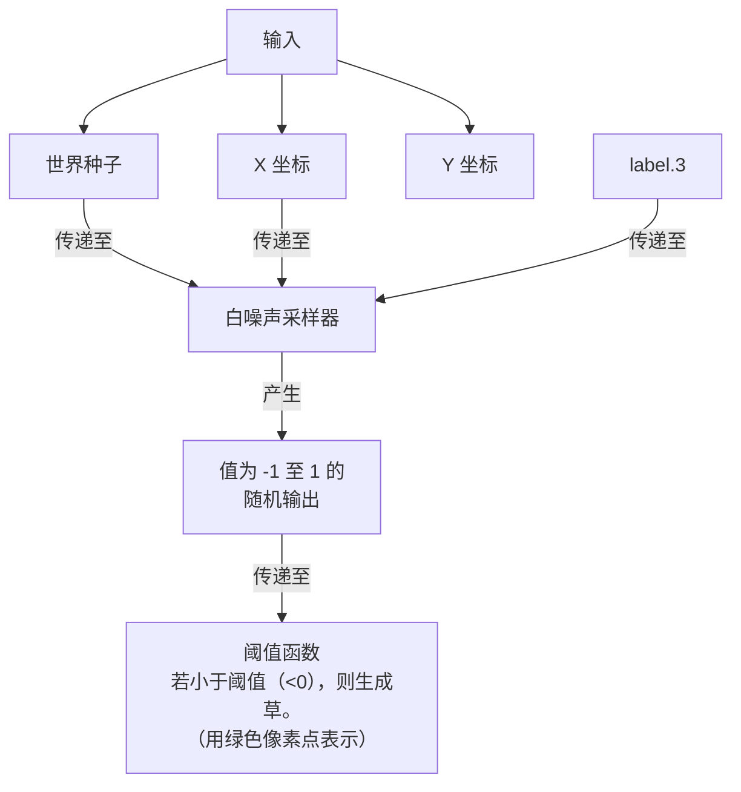
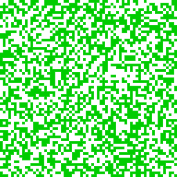
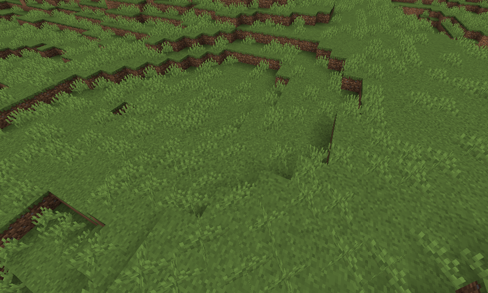
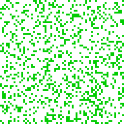
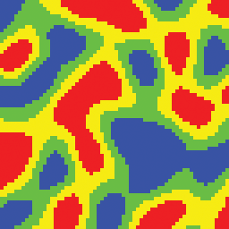
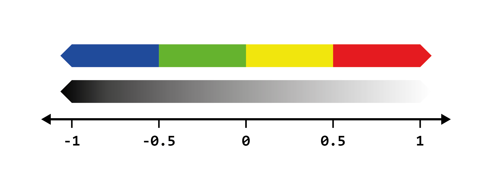

# 噪声地物散布原理

噪声，当其位置通过采样器传入时，可以决定某物的生成。例如，基于采样器在方块位置的输出决定方块的生成。

## 阈值

基于噪声分布地物的最简单方式就是增加**阈值**，它通过当前位置采样器的值高于或低于某个数字，决定某物在两个状态中的选择。这个数字就被称作“阈值”。

### 植被生成

假设我们想要在每个草方块上生成一些高草。在每个草方块上都生成一株高草可能不那么美观，相反，我们需要让生成器随机决定哪些草方块上可以生成高草。通过对平面白噪声采样器施加阈值，可以完美解决这个问题。

对于每个草方块，我们会将其位置和世界种子置入平面白噪声采样器。这会为每个方块生成一份样本（假设为从 -1 至 1）。之后我们会在采样上应用阈值，从而影响草的分布方式；如果采样的值低于草的生成阈值（在这里我们使用 `0`），那么草就会生成在这个方块上。

<center>

**草放置模型**



**结果**
</center>



如你所见，我们现在有了一个随机生成草的方法。



<center>

**阈值 = -0.25**

</center>



将阈值从 `0` 降低为 `-0.25` 会让草生成的数量减少，因为我们让 `-0.25` 和 `0` 之间的值高于了阈值。因此，*增加*阈值会让草生成得更多，因为更多的值低于了阈值。

## 分布列表

噪声可以分割为列表。例如，我们想要将如下列表中的内容通过简单噪声得到如下内容：

``` YAML
colors:
  - Blue
  - Green
  - Yellow
  - Red
```

|原噪声图像|分段后噪声图像|
|:---:|:---:|
|||

颜色只是便于描述，它们可以表示任何东西，例如群系、方块调色板等。

这个过程可以通过多个阈值应用于噪声实现：



从这里我们可以看出，采样中低于 `-0.5` 的值会被分配为 `Blue`，在 `[-0.5, 0]` 区间内的分配为 `Green`，以此类推。

### 权重列表

重复列表中的元素会增加它的占比。例如，如下配置会让 `Blue` 相较于其他颜色占据两倍的空间：

``` YAML
colors:
  - Blue
  - Blue
  - Green
  - Yellow
  - Red
```

除了重复元素，我们还可以为它们赋值，以此表示它们重复的次数，如下所示：

``` YAML
colors:
  - Blue: 2
  - Green: 1
  - Yellow: 1
  - Red: 1
```

这就是我们所说的**权重列表**。权重列表被广泛应用于噪声采样器的配置中，用于分布地物。

数字可以被看成在噪声采样器的输出中每个元素的比例。以上述配置为例，红：绿：蓝：黄的占比为 2：1：1：1。

*Terra 会自动决定阈值，并为噪声分段*，使得权重列表更易于配置。