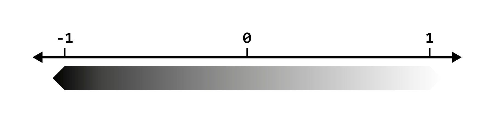
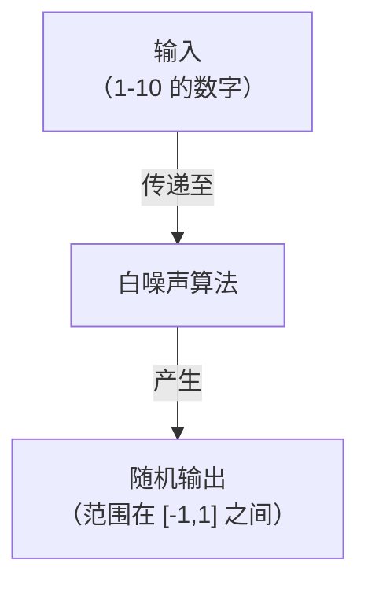
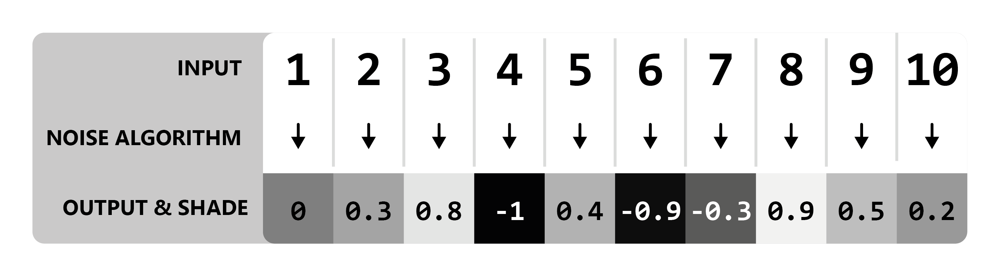
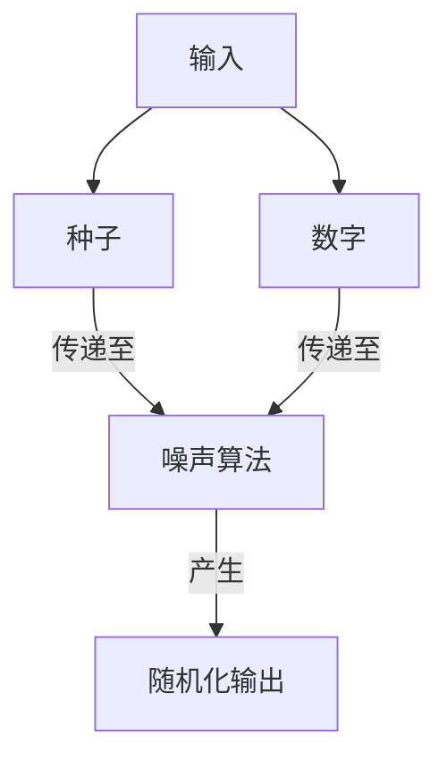
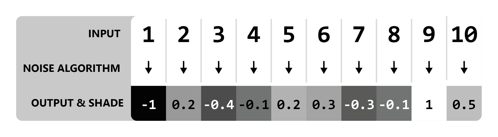
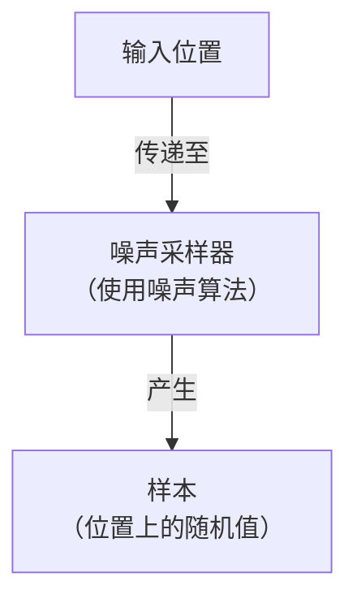
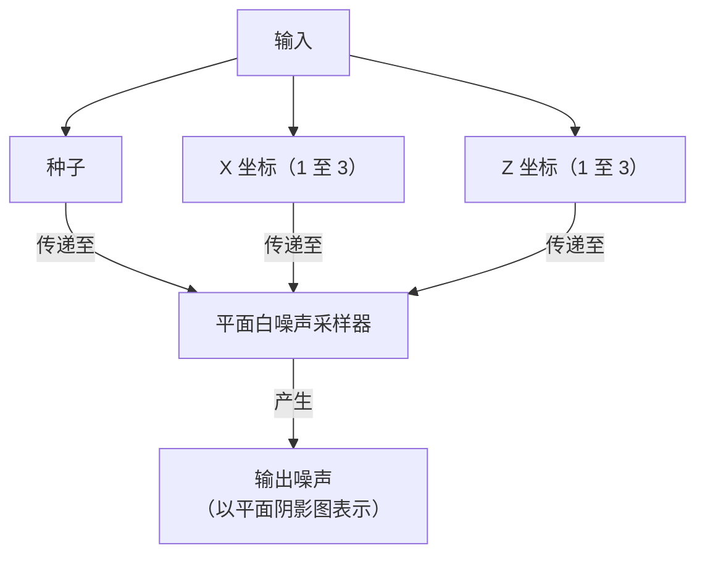
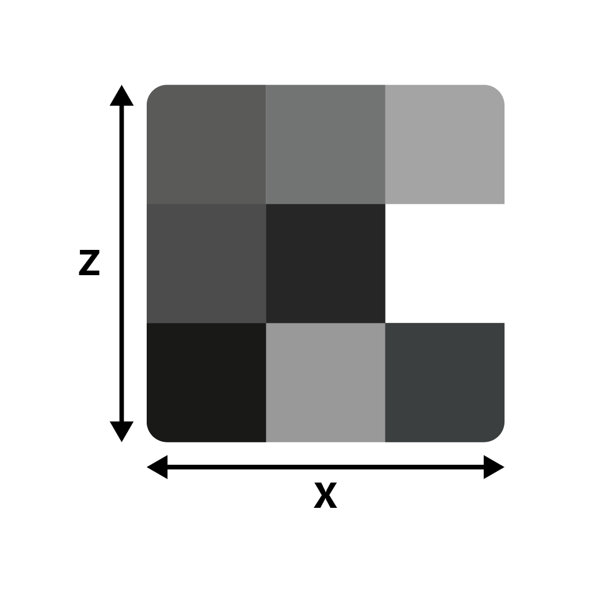
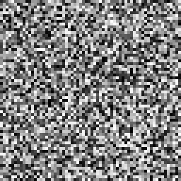
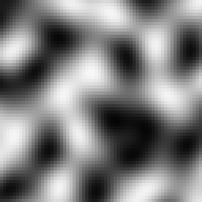

# 噪声采样器的工作原理

## 噪声基础

首先我们讲讲“创建”噪声的基础部分吧。以产生[白噪声](https://zh.wikipedia.org/wiki/%E7%99%BD%E9%9B%9C%E8%A8%8A)的噪声算法为基础，我们向其传递 1-10 的数字。（无需理解算法产生指定值的确切原理，它们对理解大体思路没有帮助）

正常情况下，Terra 使用的算法输出值范围处于 -1 到 1 之间，如下图所示：

**模型**

很简单，对吧？所有算法都会像这样将一个数字转化成另一个随机数字。

::: info

为简便起见，所有输出都默认为一位小数，但实际情况中位数更多。

整数输入仅作示例，当传入诸如 `1.5` 这样的数时，噪声算法仍然有效。

:::

### 种子

种子是输入噪声算法的额外参数：

种子可以让相同的输入有不同的输出。种子必须是整数，即 `5324` 有效，而 `231.23` 无效。

如下为两种不同种子的输出示例，使用了上文的输入。

你可能很熟悉它的其中一个用途 —— Minecraft 的世界生成。原版 Minecraft 的世界种子会插入许多负责地形生成的噪声算法，最终得到的是不同的世界。

::: tip 原版生成 - 你知道吗

在先前版本的 Minecraft 中，不同世界中部分噪声算法的种子完全相同（这表示它们不会随种子变化而变化），这导致世界的某些部分有相同特征。比如 —— 控制基岩层生成的算法不会随着种子变化，导致每个世界的基岩层实际上相同。

:::

### 噪声采样器

输入噪声算法的值通常是世界的位置。例如，1 至 10 的值可能代表着世界的 `x` 轴坐标。在这样使用时，噪声算法可以通过坐标为每个位置提供一个随机值。这样使用的噪声算法被我们称为**噪声采样器** 。

将位置信息传入噪声采样器同样称为位置“采样”。一个“样本”是给定位置的单个输出值，而一组样本则为*噪声*。

#### 多维度

上述示例只传入了一个坐标轴，但是噪声采样器需要使用多个空间坐标才可以确定输入位置。

两个空间坐标表示平面采样。平面噪声采样器使用了 `x` 和 `z` 坐标。

在新的示例中，假设 `x` 和 `z` 的范围均为 1-3，共九个样本（3x3）。出于简便描述省略实际坐标值。

**双维度模型**

添加额外维度可以让输出噪声以平面显示，而非先前的值列表。

让实验更进一步，让我们以这个 64 x 64 的采样范围为基础：

我们做的不过是用白噪声采样器生成了一张随机图片而已。

默认情况下，我们假设上述生成可视化的平面噪声为一张图片，每个输出值都代表着其上的一个灰度像素点。

#### 更高维度

许多噪声算法支持（除种子外）多于两个的输入，可以算作维度数量，但在 Terra 中，噪声算法只支持 2 或 3 个维度。3D 噪声采样器使用的是 `x`、`y` 和 `z` 坐标轴。

### 盐值

噪声采样器的种子可以影响世界，**盐值**同样能够做到。盐值是一个可以在定义噪声采样器配置时设置的值，允许噪声采样器使用相同的算法产生不同的数据。

为噪声采样器设置不同的盐值可以有效防止同一位置的生成物相同。

### 确定性

给定任意输入，噪声采样器的输出必须*总是*相同。因此，我们可以通过相同的输入，在噪声采样器中得到相同的“随机”输出。更专业地讲，这意味着噪声采样器必须具有[确定性](https://zh.wikipedia.org/wiki/%E7%A1%AE%E5%AE%9A%E6%80%A7%E6%A8%A1%E5%9E%8B)。

### 相干噪声

至此，我们只讲述了类似雪花屏的噪声，大多数应用至此已足够。但我们如何得到适合生成绵延山丘、广袤山地和其他地形的噪声呢？这时，我们就要介绍一种全新的噪声采样器，称为“**相干噪声**”。

为了更直观地了解这两种噪声的差别，如下为两种平面采样的噪声的可视化图片（输入相同）：

|随机|相干|
|:---:|:---:|
|||

如你所见，示例中的相干噪声图像更为平滑，随机噪声则没有明显的结构。上文中相干噪声算法使用的样本为**简单噪声**，类似的噪声在 Terra 的列表中还有很多。

### 噪声类型

噪声采样器有很多种类与实现，例如白噪声和简单噪声采样器。它们都有自己的特点、行为与用途，但总体而言，它们仍遵循为每个位置提供相同值的规则。

如下为 Terra 中的常见噪声采样器：

* 简单噪声
* 蜂窝/泰森多边形/沃雷噪声
* 白噪声
* 值噪声
* 域扭曲
* 分形布朗运动
* 表达式

[噪声采样器](config-packs.config-documentation.config-objects.noisesampler.md)文档中可以浏览所有可用的噪声采样器。