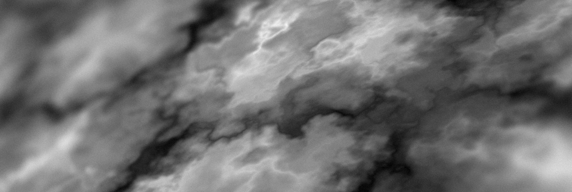

# 噪声

## 什么是噪声？

从程序角度说，噪声指代一系列随机[^1]生成的值。这些值通过多种噪声算法或数学函数产生，提供了不同方式的数字值。

噪声将生成物随机放置在世界中。例如群系的生成、地形的起伏，以及诸如植被与树木的分布方式等均使用了噪声，这是一种基础的使用方式。

在 Terra 中，从某种角度上说，世界生成中的随机部分都受到了噪声的影响，因此配置与修改生成器时最好对它们有一些基础的理解。

## 内容

* 配置噪声采样器
  * 参数
    * 普通噪声采样器参数
      * 盐值
    * 噪声工具
      * 频率
  * 上下文中的采样器
  * 其他噪声取样器方法
    * 分形化
    * 域翘曲
  * 采样器组成
* 噪声如何随机放置生成物
  * 阈值
    * 植被生成
  * 分布列表
    * 权重列表
* 噪声采样器的工作原理
  * 噪声基础
    * 种子
    * 噪声采样器
      * 多维度
      * 高维度
    * 盐值
    * 决定论
    * 相干噪声
      * 区别在哪？
    * 噪音种类

[^1]: 见此：https://zh.wikipedia.org/wiki/%E4%BC%AA%E9%9A%8F%E6%9C%BA%E6%95%B0%E7%94%9F%E6%88%90%E5%99%A8