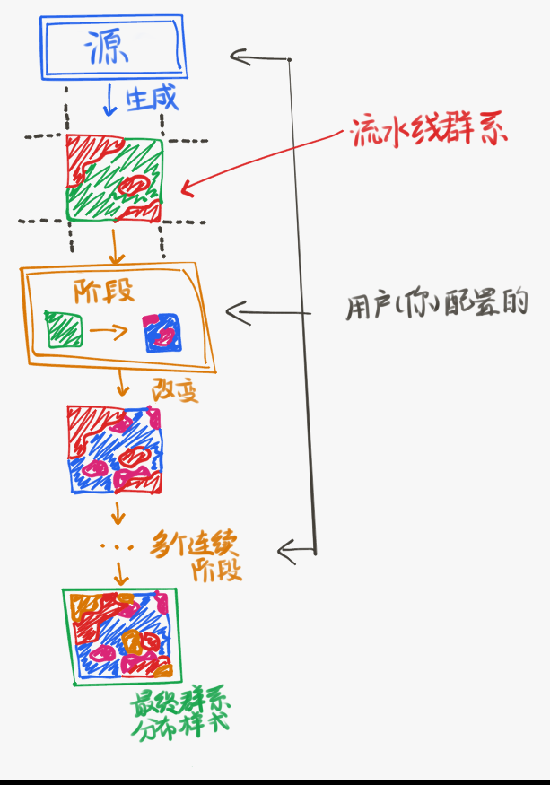

# 群系提供器（BiomeProvider）

群系提供器会在世界内的任意给定位置生成一个[群系](config-packs.config-documentation.config-files.biome.md)。群系提供器是决定和配置群系分布方式及*位置*的主要途径。

你可以使用群系工具（<https://github.com/PolyhedralDev/BiomeTool>）预览地形包的群系提供器生成的群系。另外建议以 `Terra` 文件夹为基础运行程序，以便载入所有你开发的包与附属。

## 类型

不同类型的 `BiomeProvider` 有着不同的行为，有时还有额外的配置参数可以控制它们。

类型通过配置参数 <badge type="info" text="type" /> 决定。如果两个附属使用了同一种类型名称，你可以在类型前加上 `附属名称:` 区分。

可用的 `BiomeProvider` 如下所示：

- - -

### EXTRUSION

\* 配置类型需要 `biome-provider-extrusion` 附属才可使用

<badge type="info" text="extrusions" /> [列表](config-packs.config-documentation.config-objects.list.md)<[挤压](config-packs.config-documentation.config-objects.extrusion.md)>

<badge type="info" text="provider" /> [群系提供器](config-packs.config-documentation.config-objects.biomeprovider.md)

<badge type="tip" text="resolution" /> [整数](config-packs.config-documentation.config-objects.intenger.md)

默认值：`4`

### IMAGE

\* 配置类型需要 `biome-provider-image-v2` 附属才可使用

<badge type="info" text="color-conversion" /> [群系颜色转化器](config-packs.config-documentation.config-objects.biomecolorconverter.md)

<badge type="info" text="color-sampler" /> [颜色采样器](config-packs.config-documentation.config-objects.colorsampler.md)

<badge type="tip" text="resolution" /> [整数](config-packs.config-documentation.config-objects.intenger.md)

默认值：`1`

### SINGLE

\* 配置类型需要 `biome-provider-single` 附属才可使用

<badge type="info" text="biome" /> [群系](config-packs.config-documentation.config-files.biome.md)

### PIPELINE

\* 配置类型需要 `biome-provider-pipeline-v2` 附属才可使用

`pipeline` 提供器可以将群系逐步进行平面分布。

它的名称来源于生成过程，`源` 先生成初始排版，之后经过几个连续的阶段，分别修改它的不同部分。群系最终的分布样式由生成阶段全部完成后的结果决定。

群系排版可以看做一张每个像素填入群系而非颜色的图片。各个阶段可以看做对图片施加的效果与滤镜。

<badge type="info" text="pipeline.source" /> [源](config-packs.config-documentation.config-objects.source.md) - 初始的群系排版。

<badge type="info" text="pipeline.stage" /> [列表](config-packs.config-documentation.config-objects.list.md)<[阶段](config-packs.config-documentation.config-objects.stage.md)> - 按次序应用的生成阶段。

<badge type="info" text="blend.amplitude" /> [浮点数](config-packs.config-documentation.config-objects.float.md) - 地形混合强度。

默认值：`0.0`

<badge type="info" text="blend.sampler" /> [噪声采样器](config-packs.config-documentation.config-objects.noisesampler.md) - 将高分辨率产生的像素化效果与地形相结合的采样器。

默认值：`Constant 0`

混合通过[域扭曲](config-packs.config-development.noise.configuring-noise-samplers.md#域扭曲)完成。

<badge type="tip" text="resolution" /> [整数](config-packs.config-documentation.config-objects.intenger.md) - 性能参数，用于决定每个群系“像素”包含多少方块。

默认值：`1`

增加此值可提升流水线性能，但也会让群系分布看起来更像素化。分辨率为 1 时效果最佳，2 至 4 的值与地形混合器使用时不会有太过明显的像素化外观。

## 用途

有 2 个参数用到：

* BiomeProvider 中的 EXTRUSION：

  <badge type="info" text="provider" /> [群系提供器](config-packs.config-documentation.config-objects.biomeprovider.md)

* pack.yml 中的 base：

  <badge type="info" text="biomes" /> [群系提供器](config-packs.config-documentation.config-objects.biomeprovider.md) - 决定世界中生成的群系类型。