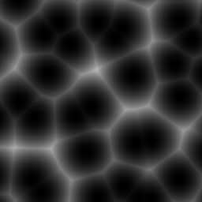
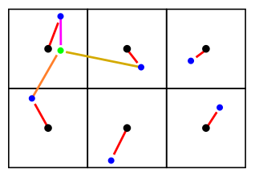
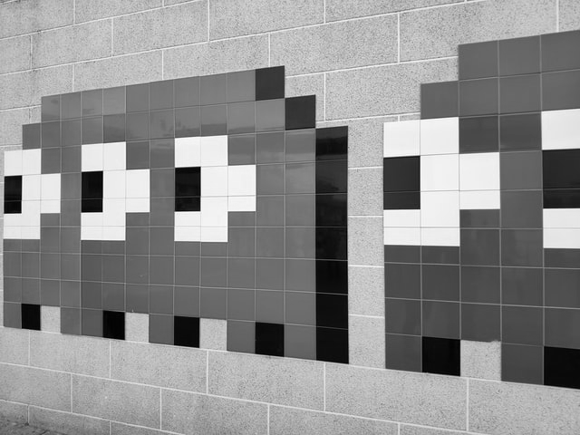
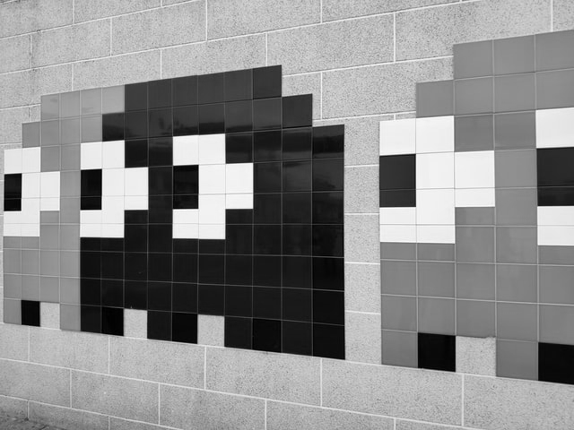
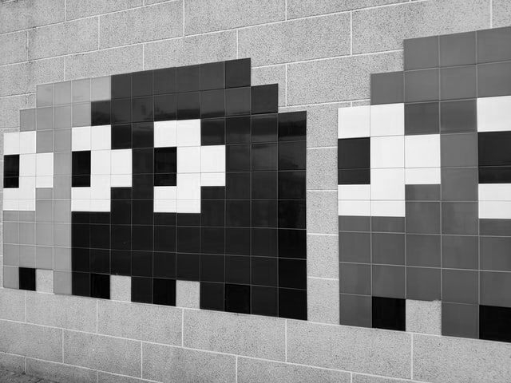
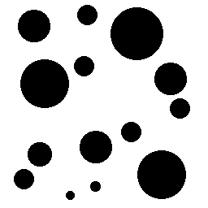
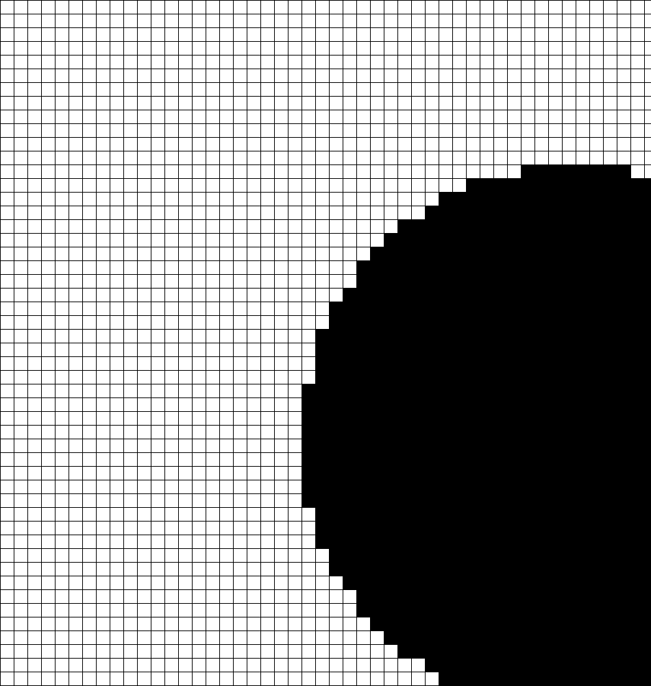
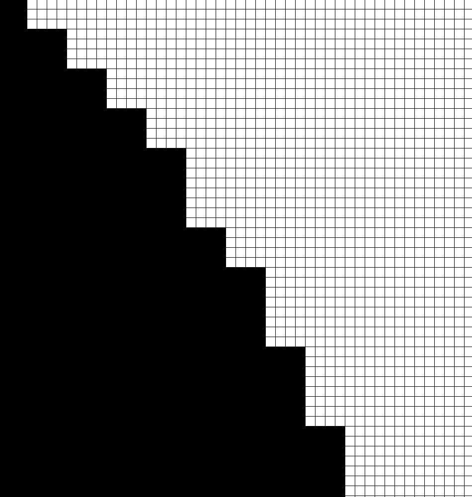
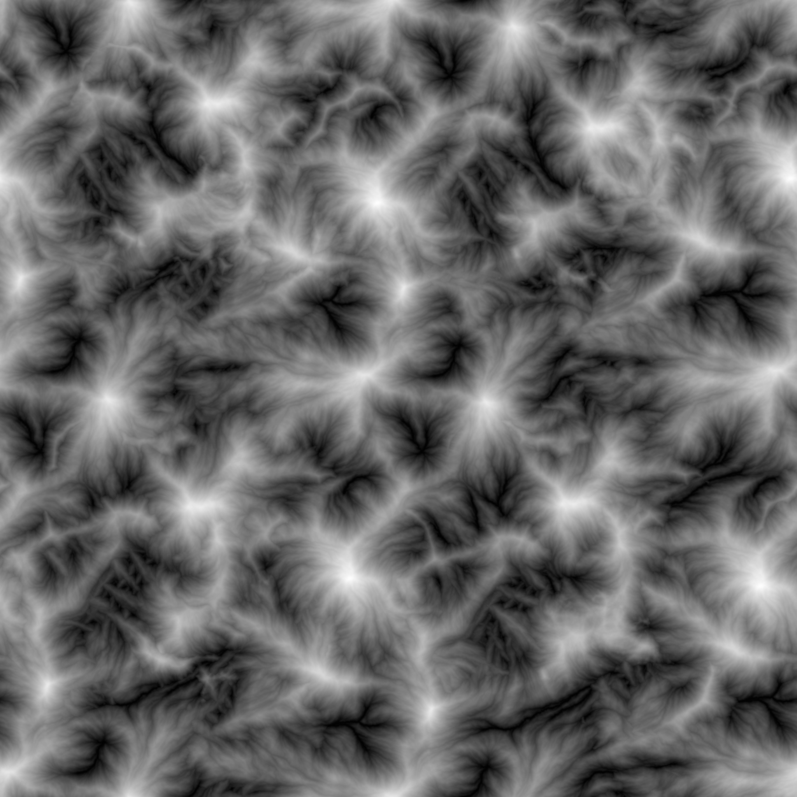
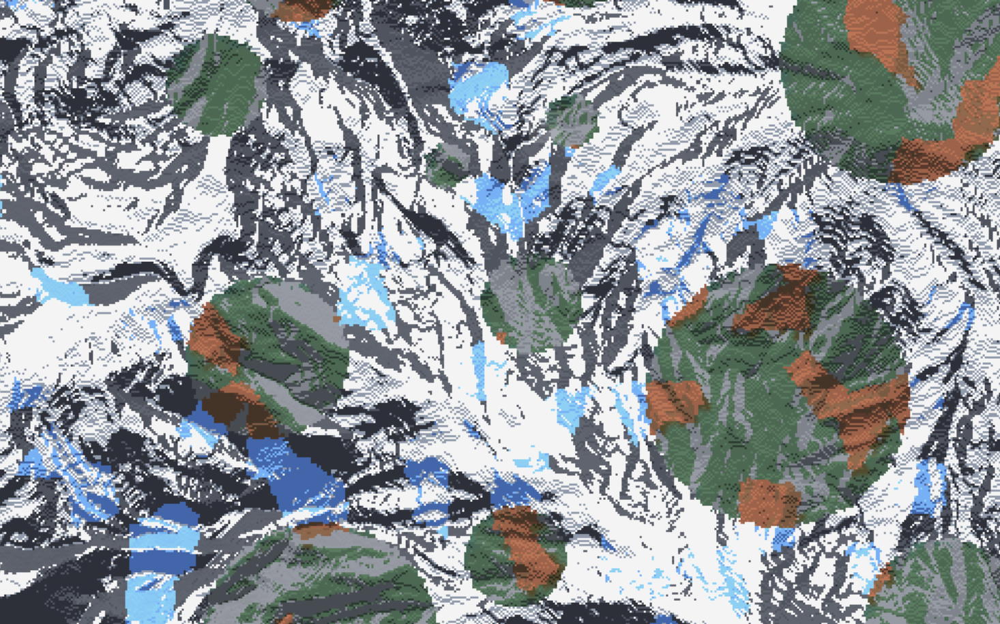

# 噪声采样器（NoiseSampler）

::: info 另见

[噪声](config-packs.config-development.noise.md)

:::

采样器在配置中定义，可经由给定位置与种子生成一个指定的值。

“采样”的定义为通过采样器的简单计算方法得出的值。采样的集合即称作“噪声”。

噪声采样器生成的噪声决定了每个方块或列的[部分行为](config-packs.config-development.noise.how-noise-distributes-things.md)。

## 类型

不同类型的 `NoiseSampler` 的行为略有不同，也可能因此要求额外的参数。

类型通过 <badge type="info" text="type" /> 参数设置。如果两个附属使用了相同的名称，你可以添加 `拓展名称:` 前缀指定使用的类型。

可用的 `NoiseSampler` 类型如下：

### CHANNEL

\* 该类型需 `library-image` 拓展才可使用

从颜色采样中输出通道值。

<badge type="info" text="color-sampler" /> [颜色采样器](config-packs.config-documentation.config-objects.colorsampler.md) - 提取通道值的颜色采样器。

<badge type="tip" text="normalize" /> [布尔值](config-packs.config-documentation.config-objects.boolean.md) - 是否将通道约束在 [-1, 1] 的范围中。

默认值：`true`

<badge type="tip" text="premultiply" /> [布尔值](config-packs.config-documentation.config-objects.boolean.md) - 是否将通道与 alpha 通道值相乘。

默认值：`false`

如果你希望像素透明度可以降低输出值，那么这个参数应当设置为 true。

### DISTANCE_TRANSFORM

\* 该类型需 `library-image` 拓展才可使用

返回图形的[距离变形](https://homepages.inf.ed.ac.uk/rbf/HIPR2/distance.htm)结果。

<badge type="info" text="image" /> [图像](config-packs.config-documentation.config-objects.image.md)

<badge type="tip" text="channel" /> 通道

默认值：`GRAYSCALE`（灰度）

<badge type="tip" text="clamp-to-max-edge" /> [布尔值](config-packs.config-documentation.config-objects.boolean.md)

默认值：`false`

<badge type="tip" text="cost-function" /> [字符串](config-packs.config-documentation.config-objects.string.md)

默认值：`Channel`

可填入：

* `Channel`
* `Threshold`
* `ThresholdEdge`
* `ThresholdEdgeSigned`

<badge type="tip" text="invert-threshold" /> [布尔值](config-packs.config-documentation.config-objects.boolean.md)

默认值：`false`

<badge type="tip" text="normalization" /> [布尔值](config-packs.config-documentation.config-objects.boolean.md)

默认值：`None`

可填入：

* `None`
* `Linear`
* `SmoothPreserveZero`

<badge type="tip" text="threshold" /> [整数](config-packs.config-documentation.config-objects.intenger.md)

默认值：`127`

### DISTANCE

\* 该类型需 `config-noise-function` 拓展才可使用

<badge type="tip" text="distance-function" /> [字符串](config-packs.config-documentation.config-objects.string.md) - 采样点位与指定位置之间的距离测算方法。

默认值：`Euclidean`（欧氏距离，即两点间直线距离）

可填入：

* `Euclidean` - 按勾股定理计算的距离。见[维基百科对应条目](https://zh.wikipedia.org/wiki/%E6%AC%A7%E5%87%A0%E9%87%8C%E5%BE%97%E8%B7%9D%E7%A6%BB)了解详情。
* `EuclideanSq` - 与上述大致相似，区别是其总是返回平方数。（包括实际距离不需要的情况，且省略了滞后的开根运算，因此比上一个方法速度略快。）
* `Manhattan` - 曼哈顿距离，见[维基百科对应条目](https://zh.wikipedia.org/wiki/%E6%9B%BC%E5%93%88%E9%A0%93%E8%B7%9D%E9%9B%A2)了解详情。

<badge type="tip" text="normalize" /> [布尔值](config-packs.config-documentation.config-objects.boolean.md) - 若设置为 true，则返回距离将会约束在 [-1, 1] 的范围中，否则返回原本的距离。

默认值：`false`

`-1` 表示距离为 `0`，`1` 则对应 `radius` 设置的值。任意大于 `radius` 的值都会返回 `1`。

<badge type="tip" text="point.x" /> [浮点数](config-packs.config-documentation.config-objects.float.md)

默认值：`0`

<badge type="tip" text="point.y" /> [浮点数](config-packs.config-documentation.config-objects.float.md)

默认值：`0`

<badge type="tip" text="point.z" /> [浮点数](config-packs.config-documentation.config-objects.float.md)

默认值：`0`

只在采样器以空间为基础时有效。

<badge type="tip" text="radius" /> [浮点数](config-packs.config-documentation.config-objects.float.md)

决定输出 `1` 到小于 `1` 数值的点位与原点的距离。

默认值：`100`

只在 `normalize` 设置为 `true` 时有效。

### WHITE_NOISE

\* 该类型需 `config-noise-function` 拓展才可使用

产生[白噪声](https://zh.wikipedia.org/wiki/%E7%99%BD%E9%9B%9C%E8%A8%8A)。


<badge type="tip" text="frequency" /> [浮点数](config-packs.config-documentation.config-objects.float.md)- 决定噪声的[频率](config-packs.config-development.noise.configuring-noise-samplers.md#频率)。

默认值：`0.02`

<badge type="tip" text="salt" /> [整数](config-packs.config-documentation.config-objects.intenger.md) - 决定采样器的[种子](config-packs.config-development.noise.configuring-noise-samplers.md#盐值)。

默认值：`0`

### POSITIVE_WHITE_NOISE

\* 该类型需 `config-noise-function` 拓展才可使用

与[白噪音](#white_noise)相似，但只产生正值，更加便捷。

<badge type="tip" text="frequency" /> [浮点数](config-packs.config-documentation.config-objects.float.md)- 决定噪声的[频率](config-packs.config-development.noise.configuring-noise-samplers.md#频率)。

默认值：`0.02`

<badge type="tip" text="salt" /> [整数](config-packs.config-documentation.config-objects.intenger.md) - 决定采样器的[种子](config-packs.config-development.noise.configuring-noise-samplers.md#盐值)。

默认值：`0`

### GAUSSIAN

\* 该类型需 `config-noise-function` 拓展才可使用

与白噪声相似，但遵循[正态分布](https://zh.wikipedia.org/wiki/%E6%AD%A3%E6%80%81%E5%88%86%E5%B8%83)。

<badge type="tip" text="frequency" /> [浮点数](config-packs.config-documentation.config-objects.float.md)- 决定噪声的[频率](config-packs.config-development.noise.configuring-noise-samplers.md#频率)。

默认值：`0.02`

<badge type="tip" text="salt" /> [整数](config-packs.config-documentation.config-objects.intenger.md) - 决定采样器的[种子](config-packs.config-development.noise.configuring-noise-samplers.md#盐值)。

默认值：`0`

### PERLIN

\* 该类型需 `config-noise-function` 拓展才可使用

产生[柏林噪声](https://zh.wikipedia.org/wiki/Perlin%E5%99%AA%E5%A3%B0)。

<badge type="tip" text="frequency" /> [浮点数](config-packs.config-documentation.config-objects.float.md)- 决定噪声的[频率](config-packs.config-development.noise.configuring-noise-samplers.md#频率)。

默认值：`0.02`

<badge type="tip" text="salt" /> [整数](config-packs.config-documentation.config-objects.intenger.md) - 决定采样器的[种子](config-packs.config-development.noise.configuring-noise-samplers.md#盐值)。

默认值：`0`

::: tip

推荐使用其他简单噪声，因为柏林噪声可能会产生不必要的定向性伪影。

:::

### SIMPLEX

\* 该类型需 `config-noise-function` 拓展才可使用

产生[简单噪声](https://en.wikipedia.org/wiki/Simplex_noise)。

<badge type="tip" text="frequency" /> [浮点数](config-packs.config-documentation.config-objects.float.md)- 决定噪声的[频率](config-packs.config-development.noise.configuring-noise-samplers.md#频率)。

默认值：`0.02`

<badge type="tip" text="salt" /> [整数](config-packs.config-documentation.config-objects.intenger.md) - 决定采样器的[种子](config-packs.config-development.noise.configuring-noise-samplers.md#盐值)。

默认值：`0`

### OPEN_SIMPLEX_2

\* 该类型需 `config-noise-function` 拓展才可使用

（使用 [OpenSimplex2](https://github.com/KdotJPG/OpenSimplex2) 的算法）产生[简单噪声](https://en.wikipedia.org/wiki/Simplex_noise)。


<badge type="tip" text="frequency" /> [浮点数](config-packs.config-documentation.config-objects.float.md)- 决定噪声的[频率](config-packs.config-development.noise.configuring-noise-samplers.md#频率)。

默认值：`0.02`

<badge type="tip" text="salt" /> [整数](config-packs.config-documentation.config-objects.intenger.md) - 决定采样器的[种子](config-packs.config-development.noise.configuring-noise-samplers.md#盐值)。

默认值：`0`

### OPEN_SIMPLEX_2

\* 该类型需 `config-noise-function` 拓展才可使用

（使用 [OpenSimplex2](https://github.com/KdotJPG/OpenSimplex2) 的算法）产生更平滑的[简单噪声](https://en.wikipedia.org/wiki/Simplex_noise)。

<badge type="tip" text="frequency" /> [浮点数](config-packs.config-documentation.config-objects.float.md)- 决定噪声的[频率](config-packs.config-development.noise.configuring-noise-samplers.md#频率)。

默认值：`0.02`

<badge type="tip" text="salt" /> [整数](config-packs.config-documentation.config-objects.intenger.md) - 决定采样器的[种子](config-packs.config-development.noise.configuring-noise-samplers.md#盐值)。

默认值：`0`

### VALUE

\* 该类型需 `config-noise-function` 拓展才可使用

以[线性插值](https://zh.wikipedia.org/wiki/%E7%BA%BF%E6%80%A7%E6%8F%92%E5%80%BC)方法生成[值噪声](https://en.wikipedia.org/wiki/Value_noise)（平面使用[双线性插值](https://zh.wikipedia.org/wiki/%E5%8F%8C%E7%BA%BF%E6%80%A7%E6%8F%92%E5%80%BC)，立体使用[三线性插值](https://zh.wikipedia.org/wiki/%E4%B8%89%E7%BA%BF%E6%80%A7%E6%8F%92%E5%80%BC)）。

<badge type="tip" text="frequency" /> [浮点数](config-packs.config-documentation.config-objects.float.md)- 决定噪声的[频率](config-packs.config-development.noise.configuring-noise-samplers.md#频率)。

默认值：`0.02`

<badge type="tip" text="salt" /> [整数](config-packs.config-documentation.config-objects.intenger.md) - 决定采样器的[种子](config-packs.config-development.noise.configuring-noise-samplers.md#盐值)。

默认值：`0`

### GABOR

\* 该类型需 `config-noise-function` 拓展才可使用

::: warning

GABOR 采样器相较其他噪声采样器的产生速度明显偏慢。

:::

<badge type="tip" text="deviation" /> [浮点数](config-packs.config-documentation.config-objects.float.md)

默认值：`1.0`

<badge type="tip" text="frequency" /> [浮点数](config-packs.config-documentation.config-objects.float.md)- 决定噪声的[频率](config-packs.config-development.noise.configuring-noise-samplers.md#频率)。

默认值：`0.02`

<badge type="tip" text="frequency_0" /> [浮点数](config-packs.config-documentation.config-objects.float.md)

默认值：`0.0625`

<badge type="tip" text="impulses" /> [浮点数](config-packs.config-documentation.config-objects.float.md)

默认值：`64.0`

<badge type="tip" text="isotropic" /> [布尔值](config-packs.config-documentation.config-objects.boolean.md)

默认值：`true`

<badge type="tip" text="salt" /> [整数](config-packs.config-documentation.config-objects.intenger.md) - 决定采样器的[盐值](config-packs.config-development.noise.how-noise-samplers-work.md#盐值)。

默认值：`0`

### CELLULAR

\* 该类型需 `config-noise-function` 拓展才可使用

产生细胞状噪声/[沃雷噪声](https://en.wikipedia.org/wiki/Worley_noise)。



#### 图表



* 黑点 - 细胞中心。
* 红线 - 距细胞中心的随机方向随机长度，称作 `jitter`（跳动）。
* 蓝点 - 细胞中心，由细胞中心的跳动决定。
* 绿点 - 被采样的坐标。
* 紫线 - 距最近细胞中心的距离。
* 橙线 - 距第二近细胞中心的距离。
* 黄线 - 距第三近细胞中心的距离。

<badge type="tip" text="distance" /> [字符串](config-packs.config-documentation.config-objects.string.md) - 计算细胞中心距离的方法。

默认值：`EuclideanSq`

##### 可用距离类型

* `Euclidean`
* `EuclideanSq`
* `Manhattan`
* `Hybrid`

<badge type="tip" text="frequency" /> [浮点数](config-packs.config-documentation.config-objects.float.md)- 决定噪声的[频率](config-packs.config-development.noise.configuring-noise-samplers.md#频率)。

默认值：`0.02`

<badge type="tip" text="jitter" /> [浮点数](config-packs.config-documentation.config-objects.float.md) 决定细胞边缘与细胞中心的最大距离。

默认值：`1`

若设置为 `0`，则表示细胞边缘与其中心重合，得到的图像表现为标准网格状花纹。推荐填入 `-1` 到 `1` 之间的值，超出这些范围的值可能带来意料外的效果。

<badge type="tip" text="lookup" /> [噪声采样器](config-packs.config-documentation.config-objects.noisesampler.md) - 当 `distance` 设置为 `NoiseLookup` 时使用的采样器。

默认值：`OPEN_SIMPLEX_2`

<badge type="tip" text="return" /> [字符串](config-packs.config-documentation.config-objects.string.md) - 采样器用于计算噪声的函数。

默认值：`Distance`

##### 返回类型

定义：

* `s` - 采样坐标。
* `c` - 最邻近细胞边缘的坐标。
* `d1` - 最邻近细胞边缘的距离。
* `d2` - 第二邻近细胞边缘的距离。
* `d3` - 第三邻近细胞边缘的距离。

类型：

* `NoiseLookup` - 将 `c` 传入采样器，返回输出。
* `CellValue` - 返回基于 `c` 的随机值（与带有[白噪声](#white_noise) 的 `NoiseLookup` 等价）。
* `LocalNoiseLookup` - 将 `s - c` 传入采样器，返回输出。
* `Angle` - 返回 `s` 至 `c` 的角度。
* `Distance` - 返回 `d1`。
* `Distance2` - 返回 `d2`。
* `Distance2Add` - 返回 `(d1 + d2) / 2`。
* `Distance2Sub` - 返回 `d2 - d1`。
* `Distance2Mul` - 返回 `(d1 * d2) / 2`。
* `Distance2Div` - 返回 `d1 / d2`。
* `Distance3` - 返回 `d3`。
* `Distance3Add` - 返回 `(d1 + d3) / 2`。
* `Distance3Sub` - 返回 `d3 - d1`。
* `Distance3Mul` - 返回 `d3 * d1`。
* `Distance3Div` - 返回 `d1 / d3`。

<badge type="tip" text="salt" /> [整数](config-packs.config-documentation.config-objects.intenger.md) - 决定采样器的[盐值](config-packs.config-development.noise.how-noise-samplers-work.md#盐值)。

默认值：`0`

### IMAGE

\* 该类型需 `config-noise-function` 拓展才可使用

输出平铺图像的通道，将通道范围 [0-255] 重排为 [-1, 1] 的范围。

<badge type="info" text="channel" /> [字符串](config-packs.config-documentation.config-objects.string.md) - 输出图像的通道。

有效通道：

* `GRAYSCALE`
* `ALPHA`
* `RED`
* `GREEN`
* `BLUE`

#### 通道示例

|原图|灰度（Grayscale）|Alpha 通道*|
|---|---|---|
||||
|红通道|绿通道|蓝通道|
||||

\* Alpha 通道因原图不存在透明部分而表现为全白。

<badge type="info" text="frequency" /> [浮点数](config-packs.config-documentation.config-objects.float.md) 图片的频率。决定图片压缩的方式。

频率为 `1.0` 表示 1 像素 = 1 方块，`2.0` 则表示 2 像素 = 1 方块。

::: important

不推荐将频率设置为低于 `1.0` 的值，因为像素在拉伸时不会边长；根据使用方法，返回的图像可能会更像素化。

|grayscale_circles.png|频率 1.0|频率 2.0|
|---|---|---|
||||

频率为 `0.25` 时，`0.25 像素 = 1 格方块` 或 `1 像素 = 4 格方块`（如上网格例子所述）。

:::

<badge type="info" text="image" /> [字符串](config-packs.config-documentation.config-objects.string.md) - 相对于配置包文件夹的图片路径。（Windows 用户请以 `/` 代替 `\`）。

示例路径：`path/to/the/image.png`

::: details 示例图像采样器

|grayscale_circles.png|mountain_heightmap.png|
|---|---|
|||

以山地高度图为基础生成地形，以左图的圆形为基础决定群系温度，则得到的世界鸟瞰图如下：



**地形采样器**（地形采样器类型为[线性高度图](#line-heightmap)）

``` YAML
type: LINEAR_HEIGHTMAP
base: 128
scale: 64
sampler:
  type: IMAGE
  image: mountain_heightmap.png
  channel: GRAYSCALE
  frequency: 1
```

**温度采样器**

``` YAML
type: IMAGE
image: grayscale_circles.png
channel: GRAYSCALE
frequency: 1
```

:::

### CONSTANT

\* 该类型需 `config-noise-function` 拓展才可使用

输出常量值，与输入无关。通常用于不使用采样器功能的配置。

<badge type="tip" text="value" /> [浮点数](config-packs.config-documentation.config-objects.float.md) - 输出的值。

默认值：`0.0`

### DOMAIN_WARP

\* 该类型需 `config-noise-function` 拓展才可使用

用采样器扭曲另一个采样器。见[域扭曲](config-packs.config-development.noise.configuring-noise-samplers.md#域扭曲)了解更多。

<badge type="info" text="sampler" /> [噪声采样器](config-packs.config-documentation.config-objects.noisesampler.md) - 被扭曲的采样器。

<badge type="info" text="warp" /> [噪声采样器](config-packs.config-documentation.config-objects.noisesampler.md) - 参与扭曲的采样器。

<badge type="tip" text="amplitude" /> [浮点数](config-packs.config-documentation.config-objects.float.md) - 应用扭曲的强度。

默认值：`1.0`

### KERNEL

\* 该类型需 `config-noise-function` 拓展才可使用

<badge type="info" text="kernel" /> [列表](config-packs.config-documentation.config-objects.list.md)<[列表](config-packs.config-documentation.config-objects.list.md)<[浮点数](config-packs.config-documentation.config-objects.float.md)>>

<badge type="info" text="sampler" /> [噪声采样器](config-packs.config-documentation.config-objects.noisesampler.md)

<badge type="tip" text="factor" /> [浮点数](config-packs.config-documentation.config-objects.float.md)

默认值：`1.0`

<badge type="tip" text="frequency" /> [浮点数](config-packs.config-documentation.config-objects.float.md)

默认值：`1.0`

### LINEAR_HEIGHTMAP

\* 该类型需 `config-noise-function` 拓展才可使用

将平面采样器用作高度图，将其转化为立体的有符号距离函数，用于地形采样器。

<badge type="info" text="base" /> [浮点数](config-packs.config-documentation.config-objects.float.md) - 地形的基础 Y 值。

<badge type="tip" text="sampler" /> [噪声采样器](config-packs.config-documentation.config-objects.noisesampler.md) - 用作高度图的采样器。

默认值：`CONSTANT`

<badge type="tip" text="scale" /> [浮点数](config-packs.config-documentation.config-objects.float.md) - 调整高度图的比例。

默认值：`1.0`

### FBM

\* 该类型需 `config-noise-function` 拓展才可使用

<badge type="info" text="sampler" /> [噪声采样器](config-packs.config-documentation.config-objects.noisesampler.md)

<badge type="tip" text="gain" /> [浮点数](config-packs.config-documentation.config-objects.float.md)

默认值：`0.5`

<badge type="tip" text="lacunarity" /> [浮点数](config-packs.config-documentation.config-objects.float.md)

默认值：`2.0`

<badge type="tip" text="octaves" /> [整数](config-packs.config-documentation.config-objects.intenger.md)

默认值：`3`

<badge type="tip" text="weighted-strength" /> [浮点数](config-packs.config-documentation.config-objects.float.md)

默认值：`0.0`

### PING_PONG

\* 该类型需 `config-noise-function` 拓展才可使用

<badge type="info" text="sampler" /> [噪声采样器](config-packs.config-documentation.config-objects.noisesampler.md)

<badge type="tip" text="gain" /> [浮点数](config-packs.config-documentation.config-objects.float.md)

默认值：`0.5`

<badge type="tip" text="lacunarity" /> [浮点数](config-packs.config-documentation.config-objects.float.md)

默认值：`2.0`

<badge type="tip" text="octaves" /> [整数](config-packs.config-documentation.config-objects.intenger.md)

默认值：`3`

<badge type="tip" text="ping-pong" /> [浮点数](config-packs.config-documentation.config-objects.float.md)

默认值：`2.0`

<badge type="tip" text="weighted-strength" /> [浮点数](config-packs.config-documentation.config-objects.float.md)

默认值：`0.0`

### RIDGED

\* 该类型需 `config-noise-function` 拓展才可使用

<badge type="info" text="sampler" /> [噪声采样器](config-packs.config-documentation.config-objects.noisesampler.md)

<badge type="tip" text="gain" /> [浮点数](config-packs.config-documentation.config-objects.float.md)

默认值：`0.5`

<badge type="tip" text="lacunarity" /> [浮点数](config-packs.config-documentation.config-objects.float.md)

默认值：`2.0`

<badge type="tip" text="octaves" /> [整数](config-packs.config-documentation.config-objects.intenger.md)

默认值：`3`

<badge type="tip" text="weighted-strength" /> [浮点数](config-packs.config-documentation.config-objects.float.md)

### LINEAR

\* 该类型需 `config-noise-function` 拓展才可使用

将 `[最小值, 最大值]` 重分布为 `[-1, 1]`，通常用于权重池。

<badge type="info" text="max" /> [浮点数](config-packs.config-documentation.config-objects.float.md)

<badge type="info" text="min" /> [浮点数](config-packs.config-documentation.config-objects.float.md)

<badge type="info" text="sampler" /> [噪声采样器](config-packs.config-documentation.config-objects.noisesampler.md)

### CUBIC_SPLINE

\* 该类型需 `config-noise-function` 拓展才可使用

根据点与渐变集合，通过立体样条点重映射某些值。

<badge type="info" text="points" /> [列表](config-packs.config-documentation.config-objects.list.md<[立体样条点位](config-packs.config-documentation.config-objects.cubicsplinepoint.md)>

<badge type="info" text="sampler" /> [噪声采样器](config-packs.config-documentation.config-objects.noisesampler.md)

### EXPRESSION_NORMALIZER

\* 该类型需 `config-noise-function` 拓展才可使用

由输入采样器提供采样，并返回计算表达式的结果

<badge type="info" text="expression" /> [表达式](config-packs.config-documentation.config-objects.expression.md) - 使用 `in`（`input` 的缩写）中变量的表达式。

<badge type="info" text="sampler" /> [噪声采样器](config-packs.config-documentation.config-objects.noisesampler.md)

<badge type="tip" text="functions" /> [映射表](config-packs.config-documentation.config-objects.map.md)<[字符串](config-packs.config-documentation.config-objects.string.md)，[数学函数](config-packs.config-documentation.config-objects.mathfunction.md)> - 额外的命名数学函数，可用在 `expression` 中。

默认值：`{}`

<badge type="tip" text="samplers" /> [映射表](config-packs.config-documentation.config-objects.map.md)<[字符串](config-packs.config-documentation.config-objects.string.md)，[维度适用采样器](config-packs.config-documentation.config-objects.dimensionapplicablesampler.md)> - 额外的命名噪声采样器，可用在 `expression` 中。

默认值：`{}`

这个参数可能不会很有用，因为 `expression` 不支持引用 `x`、`y` 和 `z` 变量。这些行为有可能会在未来改变。

<badge type="tip" text="variables" /> [映射表](config-packs.config-development.noise.how-noise-samplers-work.md)<[字符串](config-packs.config-documentation.config-objects.string.md)，[浮点数](config-packs.config-documentation.config-objects.float.md)> - 额外的命名常量变量，可用在 `expression` 中。

默认值：`{}`

这实际上是一个简化版的[表达式](#expression)采样器，你可以翻到对应部分了解更多。

例如，如下的采样器：

``` YAML
type: EXPRESSION
expression: (noise(x, z) + 3) / 2
samplers:
  noise:
    dimensions: 2
    type: WHITE_NOISE
```

可以被简化为：

``` YAML
type: EXPRESSION_NORMALIZER
expression: (in + 3) / 2
sampler:
  type: WHITE_NOISE
```

### CLAMP

\* 该类型需 `config-noise-function` 拓展才可使用

当采样器输出大于 `max` 的值，则返回 `max` 的值，当输出小于 `min` 的值，则返回 `min` 的值，用于将采样器输出值限制在某个范围里。

<badge type="info" text="max" /> [浮点数](config-packs.config-documentation.config-objects.float.md)

<badge type="info" text="min" /> [浮点数](config-packs.config-documentation.config-objects.float.md)

<badge type="info" text="sampler" /> [噪声采样器](config-packs.config-documentation.config-objects.noisesampler.md)

### NORMAL

\* 该类型需 `config-noise-function` 拓展才可使用

将正态分布的输出重新分配为均匀分布。

<badge type="info" text="mean" /> [浮点数](config-packs.config-documentation.config-objects.float.md)

<badge type="info" text="sampler" /> [噪声采样器](config-packs.config-documentation.config-objects.noisesampler.md)

<badge type="info" text="standard-deviation" /> [浮点数](config-packs.config-documentation.config-objects.float.md)

<badge type="tip" text="groups" /> [整数](config-packs.config-documentation.config-objects.intenger.md)

默认值：`16384`

### PROBABLITY

\* 该类型需 `config-noise-function` 拓展才可使用

将范围 `[-1, 1]` 重分布为 `[0, 1]`，通常用在需要将输出限定在 `0` 至 `1` 范围的情况中，例如为噪声采样器定义百分比阈值。

<badge type="info" text="sampler" /> [噪声采样器](config-packs.config-documentation.config-objects.noisesampler.md)

### SCALE

\* 该类型需 `config-noise-function` 拓展才可使用

相当于 `sampler() * amplitude`。

<badge type="info" text="amplitude" /> [浮点数](config-packs.config-documentation.config-objects.float.md)

<badge type="info" text="sampler" /> [噪声采样器](config-packs.config-documentation.config-objects.noisesampler.md)

### POSTERIZATION

\* 该类型需 `config-noise-function` 拓展才可使用

向采样器施加步进函数，`steps` 参数决定了 `[-1, 1]` 范围内的步数。

<badge type="info" text="sampler" /> [噪声采样器](config-packs.config-documentation.config-objects.noisesampler.md)

<badge type="info" text="steps" /> [整数](config-packs.config-documentation.config-objects.intenger.md)

### ADD

\* 该类型需 `config-noise-function` 拓展才可使用

相当于 `left() + right()`。

<badge type="info" text="left" /> [噪声采样器](config-packs.config-documentation.config-objects.noisesampler.md)

<badge type="info" text="right" /> [噪声采样器](config-packs.config-documentation.config-objects.noisesampler.md)


### SUB

\* 该类型需 `config-noise-function` 拓展才可使用

相当于 `left() - right()`。

<badge type="info" text="left" /> [噪声采样器](config-packs.config-documentation.config-objects.noisesampler.md)

<badge type="info" text="right" /> [噪声采样器](config-packs.config-documentation.config-objects.noisesampler.md)

### MUL

\* 该类型需 `config-noise-function` 拓展才可使用

相当于 `left() * right()`。

<badge type="info" text="left" /> [噪声采样器](config-packs.config-documentation.config-objects.noisesampler.md)

<badge type="info" text="right" /> [噪声采样器](config-packs.config-documentation.config-objects.noisesampler.md)

### DIV

\* 该类型需 `config-noise-function` 拓展才可使用

相当于 `left() / right()`。

<badge type="info" text="left" /> [噪声采样器](config-packs.config-documentation.config-objects.noisesampler.md)

<badge type="info" text="right" /> [噪声采样器](config-packs.config-documentation.config-objects.noisesampler.md)

### MAX

\* 该类型需 `config-noise-function` 拓展才可使用

相当于 `max(left(), right())`。

<badge type="info" text="left" /> [噪声采样器](config-packs.config-documentation.config-objects.noisesampler.md)

<badge type="info" text="right" /> [噪声采样器](config-packs.config-documentation.config-objects.noisesampler.md)

### MIN

\* 该类型需 `config-noise-function` 拓展才可使用

相当于 `min(left(), right())`。

<badge type="info" text="left" /> [噪声采样器](config-packs.config-documentation.config-objects.noisesampler.md)

<badge type="info" text="right" /> [噪声采样器](config-packs.config-documentation.config-objects.noisesampler.md)

### EXPRESSION

\* 该类型需 `config-noise-function` 拓展才可使用

返回用户定义的二元表达式，作为采样器的输出。表达式采样器额外允许使用用户定义的函数，包括其他采样器，以及采样器内定义的常量。

<badge type="info" text="expression" /> [表达式](config-packs.config-documentation.config-objects.expression.md)

每个采样计算的表达式。使用 `x`、`y`（仅立体）和 `z` 表示采样器坐标输入。

#### 示例表达式

``` YAML
expression: (x * 3) / z
```

<badge type="tip" text="functions" /> [映射表](config-packs.config-documentation.config-objects.map.md)<[字符串](config-packs.config-documentation.config-objects.string.md)，[数学函数](config-packs.config-documentation.config-objects.mathfunction.md)>

默认值：`{}`

填入用户定义的数学函数映射表。函数可以以 `<名称>(<参数 1>, <参数 2>, ...)` 的方式在表达式内调用，`<name>` 为声明的函数名称，每个输入代表着函数内要求的参数。

#### 示例定义函数

``` YAML
functions:
  addThenDivide:
    arguments:
        - a
        - b
        - c
    expression: (a + b) / c
```

<badge type="tip" text="samplers" /> [映射表](config-packs.config-documentation.config-objects.map.md)<[字符串](config-packs.config-documentation.config-objects.string.md)，[维度适用采样器](config-packs.config-documentation.config-objects.dimensionapplicablesampler.md)> - 为采样器分配函数名称的映射表。

默认值：`{}`

每个采样器都可以像这样用在表达式中：`<名称>(<x>,<z>)`（平面），或 `<名称>(<x>, <y>, <z>)`（立体），`<名称>` 是先前声明的函数名称，后面的则是传入采样器的对应坐标。

::: info

在 EXPRESSION 中定义的采样器必须属于 `DimensionApplicableSamplers`，具体请见“[维度适用采样器](config-packs.config-documentation.config-objects.dimensionapplicablesampler.md)”部分。

:::

#### 示例定义采样器

``` YAML 
samplers:
  whiteNoise:
    dimensions: 2
    type: WHITE_NOISE
```

<badge type="tip" text="variables" /> [映射表](config-packs.config-documentation.config-objects.map.md)<[字符串](config-packs.config-documentation.config-objects.string.md)，[浮点数](config-packs.config-documentation.config-objects.float.md)>

默认值：`{}`

设置表达式内使用的变量名称及对应的值。可以向表达式中添加便于修改的命名常量。

#### 示例定义变量

``` YAML
variables:
  a: 1
  b: 2
```

:::: details 示例表达式采样器

::: info 简单加法

``` YAML
type: EXPRESSION

expression: 1 + 1
```

上述表达式返回的结果是 `1` 加 `1`，即总是返回 `2`。

:::

::: info 使用变量

``` YAML
type: EXPRESSION

variables:
  a: 1
  b: 2

expression: a - b
```

上述的采样器返回 `a` 减去 `b` 的值，即 `1` 减 `2`，总是返回 `-1`。

:::

::: info 使用函数

``` YAML
type: EXPRESSION

functions:
  addThenDivide:
    arguments:
      - a
      - b
      - c
    expression: (a + b) / c

expression: addThenDivide(3, 2, 10)
```

上述的采样器会将 `3`、`2` 与 `10` 传入函数 `addThenDivide()`。这个函数会计算 `(3 + 2) / 10`，而 `3 + 2 = 5`，之后 `5 / 10 = 0.5`，即总是返回 `0.5`。

:::

::: info 使用坐标

``` YAML
type: EXPRESSION

expression: x + z
```

上述的采样器总会输出 `x` 轴与 `z` 轴之和。假设 Terra 采样了 `x = 4`、`z = 2` 处的方块，则它会对这个方块返回 `4 + 2`，即 `6` 的值。

:::

::: info 使用采样器

``` YAML
type: EXPRESSION

samplers:
  whiteNoise:
    dimensions: 2
    type: WHITE_NOISE

expression: whiteNoise(2, 5)
```

上述白噪声会在传入坐标 `x = 2`、`y = 5` 时返回平面[白噪声](#white_noise)。

:::

::: info 采样器盐值

``` YAML
type: EXPRESSION

samplers:
  whiteNoise:
    dimensions: 2
    type: WHITE_NOISE
    salt: 2

expression: whiteNoiseSalted(2, 5, 1)
```

上述白噪声会在传入坐标 `x = 2`、`y = 5`、`salt = 3`（指定的盐值会与已配置的盐值叠加，此例子中最后结果为 `2 + 1 = 3`）时返回平面[白噪声](#white_noise)。

`加盐<采样器名称>` 函数会在采样器最后一个传入参数为盐值时生成。同样适用于嵌套的采样器，例如联结的 [EXPRESSION](#expression) 与 [DOMAIN_WARP](#domain_warp) 采样器。

:::

::: info 全部结合

``` YAML
type: EXPRESSION

variables:
  someConstant: 3
  anotherConstant: 2.5

functions:
  add:
    arguments:
      - a
      - b
    expression: a + b

samplers:
  exampleSampler:
    dimensions: 2
    type: WHITE_NOISE

expression: |
  exampleSampler(x * 2, z * 2) +
  add(someConstant, anotherConstant)
```

上述的采样器定义了：

* 两个名为 `someConstant` 与 `anotherConstant` 的变量，各自的值为 `3` 与 `2.5`。
* 一个要求两个参数的函数 `exampleFunction()`，作用是将传入的参数相加。
* 一个平面采样器 `exampleSampler()`。
* 一条表达式：
  * 计算 `exampleSampler()`：
    * `x` 坐标乘以 `2` 作为 X 轴坐标，且
    * `z` 坐标乘以 `2` 作为 Z 轴坐标。
  * 计算 `add()`：
    * `3`（`someConstant` 的值）作为参数 `a`，且
    * `2`（`anotherConstant` 的值）作为参数 `b`。
  * 将 `add()` 的结果，即 `5.5`，与 `exampleSampler()` 函数的值相加。
  * 返回最终结果。

:::

::::

## 用途

有 47 个参数用到：

* Stage 中的 BORDER_LIST：

  <badge type="info" text="sampler" /> [噪声采样器](config-packs.config-documentation.config-objects.noisesampler.md) - 用于分布流水线群系的噪声采样器。

* NoiseSampler 中的 PING_PONG：

  <badge type="info" text="sampler" /> [噪声采样器](config-packs.config-documentation.config-objects.noisesampler.md)

* Stage 中的 FRACTAL_EXPAND：

  <badge type="info" text="sampler" /> [噪声采样器](config-packs.config-documentation.config-objects.noisesampler.md) - 用于随机选择流水线群系。

* NoiseSampler 中的 ADD：

  <badge type="info" text="left" /> [噪声采样器](config-packs.config-documentation.config-objects.noisesampler.md)

* Stage 中的 REPLACE：

  <badge type="info" text="sampler" /> [噪声采样器](config-packs.config-documentation.config-objects.noisesampler.md) - 用于分布流水线群系的噪声采样器。

* NoiseSampler 中的 CLAMP：

  <badge type="info" text="sampler" /> [噪声采样器](config-packs.config-documentation.config-objects.noisesampler.md)

* NoiseSampler 中的 CELLULAR：

  <badge type="tip" text="lookup" /> [噪声采样器](config-packs.config-documentation.config-objects.noisesampler.md) - 距离参数被设置为 `NoiseLookup` 时使用的采样器。

* FEATURE 中的 base：

  <badge type="info" text="structures.distribution" /> [噪声采样器](config-packs.config-documentation.config-objects.noisesampler.md)

* NoiseSampler 中的 DIV：

  <badge type="info" text="right" /> [噪声采样器](config-packs.config-documentation.config-objects.noisesampler.md)

* PALETTE 中的 base：

  <badge type="tip" text="sampler"/> [噪声采样器](config-packs.config-documentation.config-objects.noisesampler.md)

* NoiseSampler 中的 MUL：

  <badge type="info" text="left" /> [噪声采样器](config-packs.config-documentation.config-objects.noisesampler.md)

* Locator 中的 SAMPLER：

  <badge type="info" text="samplers" /> [列表](config-packs.config-documentation.config-objects.list.md) <[噪声采样器](config-packs.config-documentation.config-objects.noisesampler.md)>

* NoiseSampler 中的 SUB：

  <badge type="info" text="right" /> [噪声采样器](config-packs.config-documentation.config-objects.noisesampler.md)

* BIOME 中的 base：

  <badge type="tip" text="terrain.sampler-2d"/> [噪声采样器](config-packs.config-documentation.config-objects.noisesampler.md)

* Extrusion 中的 SET：

  <badge type="info" text="sampler" /> [噪声采样器](config-packs.config-documentation.config-objects.noisesampler.md)

* NoiseSampler 中的 RIDGED：

  <badge type="info" text="sampler" /> [噪声采样器](config-packs.config-documentation.config-objects.noisesampler.md)

* NoiseSampler 中的 DIV：

  <badge type="info" text="left" /> [噪声采样器](config-packs.config-documentation.config-objects.noisesampler.md)

* BiomeProvider 中的 PIPELINE：

  <badge type="tip" text="blend.sampler" /> [噪声采样器](config-packs.config-documentation.config-objects.noisesampler.md) - 模糊高分辨率产生的锯齿效果。

* NoiseSampler 中的 DOMAIN_WARP：

  <badge type="info" text="sampler" /> [噪声采样器](config-packs.config-documentation.config-objects.noisesampler.md) - 被扭曲的采样器。

* Extrusion 中的 REPLACE：

  <badge type="info" text="sampler" /> [噪声采样器](config-packs.config-documentation.config-objects.noisesampler.md)

* NoiseSampler 中的 NORMAL：

  <badge type="info" text="sampler" /> [噪声采样器](config-packs.config-documentation.config-objects.noisesampler.md)

* NoiseSampler 中的 MIN：

  <badge type="info" text="right" /> [噪声采样器](config-packs.config-documentation.config-objects.noisesampler.md)

* Source 中的 SAMPLER：

  <badge type="info" text="sampler" /> [噪声采样器](config-packs.config-documentation.config-objects.noisesampler.md)

* NoiseSampler 中的 DOMAIN_WARP：

  <badge type="info" text="warp" /> [噪声采样器](config-packs.config-documentation.config-objects.noisesampler.md) - 参与扭曲的采样器。

* NoiseSampler 中的 MAX：

  <badge type="info" text="right" /> [噪声采样器](config-packs.config-documentation.config-objects.noisesampler.md)

* NoiseSampler 中的 KERNEL：

  <badge type="info" text="sampler" /> [噪声采样器](config-packs.config-documentation.config-objects.noisesampler.md)

* Distributor 中的 SAMPLER：

  <badge type="info" text="sampler" /> [噪声采样器](config-packs.config-documentation.config-objects.noisesampler.md)

* DimensionApplicableSampler 中的 map：

  <badge type="info" text="." /> [噪声采样器](config-packs.config-documentation.config-objects.noisesampler.md)

* NoiseSampler 中的 LINEAR：

  <badge type="info" text="sampler" /> [噪声采样器](config-packs.config-documentation.config-objects.noisesampler.md)

* NoiseSampler 中的 PROBABILITY：

  <badge type="info" text="sampler" /> [噪声采样器](config-packs.config-documentation.config-objects.noisesampler.md)

* NoiseSampler 中的 MAX：

  <badge type="info" text="left" /> [噪声采样器](config-packs.config-documentation.config-objects.noisesampler.md)

* NoiseSampler 中的 SCALE：

  <badge type="info" text="sampler" /> [噪声采样器](config-packs.config-documentation.config-objects.noisesampler.md)

* Stage 中的 BORDER：

  <badge type="info" text="sampler" /> [噪声采样器](config-packs.config-documentation.config-objects.noisesampler.md) - 用于分布流水线群系的噪声采样器。

* base 中的 BIOME：

  <badge type="info" text="terrain.sampler" /> [噪声采样器](config-packs.config-documentation.config-objects.noisesampler.md)

* PaletteLayer 中的 map：

  <badge type="tip" text="sampler" /> [噪声采样器](config-packs.config-documentation.config-objects.noisesampler.md)

* Locator 中的 SAMPLER_3D：

  <badge type="info" text="sampler" /> [噪声采样器](config-packs.config-documentation.config-objects.noisesampler.md)

* NoiseSampler 中的 MUL：

  <badge type="info" text="right" /> [噪声采样器](config-packs.config-documentation.config-objects.noisesampler.md)

* NoiseSampler 中的 SUB：

  <badge type="info" text="left" /> [噪声采样器](config-packs.config-documentation.config-objects.noisesampler.md)

* NoiseSampler 中的 LINEAR_HEIGHTMAP：

  <badge type="tip" text="sampler" /> [噪声采样器](config-packs.config-documentation.config-objects.noisesampler.md) - 用作高度图的采样器。

* NoiseSampler 中的 EXPRESSION_NORMALIZER：

  <badge type="info" text="sampler" /> [噪声采样器](config-packs.config-documentation.config-objects.noisesampler.md)

* Stage 中的 SMOOTH：

  <badge type="info" text="sampler" /> [噪声采样器](config-packs.config-documentation.config-objects.noisesampler.md) - 用于随机选择流水线群系。

* NoiseSampler 中的 MIN：

  <badge type="info" text="left" /> [噪声采样器](config-packs.config-documentation.config-objects.noisesampler.md)

* Stage 中的 REPLACE_LIST：

  <badge type="info" text="sampler" /> [噪声采样器](config-packs.config-documentation.config-objects.noisesampler.md) - 用于分布流水线群系的噪声采样器。

* NoiseSampler 中的 POSTERIZATION：

  <badge type="info" text="sampler" /> [噪声采样器](config-packs.config-documentation.config-objects.noisesampler.md)

* NoiseSampler 中的 CUBIC_SPLINE：

  <badge type="info" text="sampler" /> [噪声采样器](config-packs.config-documentation.config-objects.noisesampler.md)

* NoiseSampler 中的 FBM：

  <badge type="info" text="sampler" /> [噪声采样器](config-packs.config-documentation.config-objects.noisesampler.md)

* NoiseSampler 中的 ADD：

  <badge type="info" text="right" /> [噪声采样器](config-packs.config-documentation.config-objects.noisesampler.md)