# FCL直装包制作——手机端教程

::: danger

请注意，FCL 直装包为非官方团队修改

:::

## 1. 准备基础

1. 下载[直装包模板](https://github.com/root-S7/FoldCraftLauncher/ "点击前往下载") ，将其放置在合适的位置。
   
::: tip

建议下载图中所示 `FCL-release-X.X.X.X-arm64-v8a.apk`，版本保持最新即可。

:::

::: danger

请注意，直装包部分目录下有一个名为 `version` 的文件，该文件不能删去，不然游戏无法启动，注意，**不能删去！不能删去！不能删去！**

:::

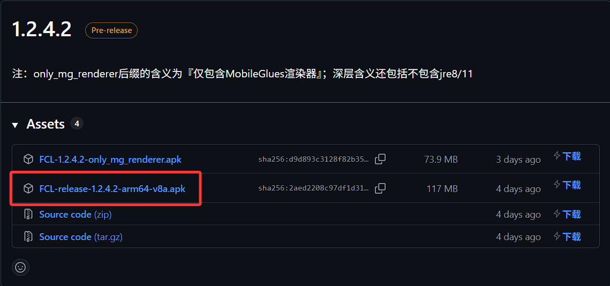

2. 下载 [MT 修改器](https://mt2.cn/ "点击跳转官方网站")。
3. 下载 [APKTool M](https://maximoff.su/apktool/?lang=zh "点击跳转官方网站")（用于修改包名，无该需求可以不下）。

## 2. 对客户端进行处理

1. 打开客户端的 `.minecraft` 文件夹。
2. 删除 `logs`（运行日志）、`crash-reports`（崩溃日志）文件夹。如果对大小有较高要求，还可删除 `assets` 和 `libraries` 文件夹（游戏会自行补全这两个文件夹的内容，但如果客户端包含*反作弊*，则不建议删）。

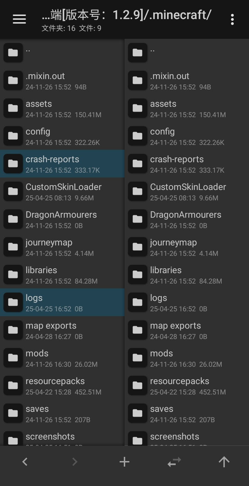{width="40%"}

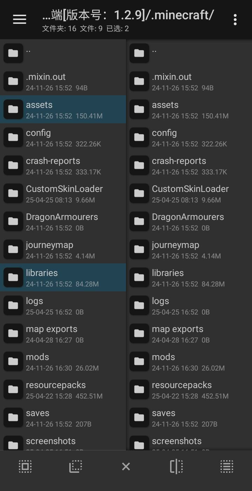{width="40%"}

3. 打开客户端，在设置界面关闭“版本隔离”。之后确保游戏能够正常启动。

::: info 手动关闭版本隔离的方法

打开 versions 文件夹，将其下除 `版本名称.jar`、`版本名称.json`、`options.txt`（原版设置选项，其中包含默认启用资源包的选项）、`optionsof.txt`（Optifine 的设置文件）之外的文件移动到 `.minecraft` 中即可。

:::

::: tip 如何为游戏内置启用的资源包及服务器列表？

如果需要预安装资源包：
* 在“设置->资源包...”界面，将对应资源包勾选并移动至右侧。
如果需要预设服务器列表：
* 在“多人游戏->添加服务器”界面，填入服务器名称以及服务器地址（服务器地址会保存在 `servers.dat` 中）。

:::

4. 完成后，将整个 `.minecraft` 文件夹替换项目内的 `.minecraft` 文件夹。
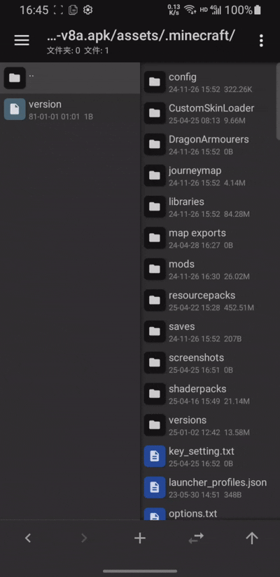{width="40%"}
5. 在文件夹内加入 `version` **文件**，将内容修改为数字。

::: info 为什么要创建 `version` **文件**？

如果启动器没有在目录里检测到这个文件，会导致游戏无法启动。

:::

::: tip `version` 的妙用

更新客户端打包内容时可将 `version` 的内容修改为更大的值，这样可以更新客户端内容而无需重装启动器。

:::

## 3. 软件名称修改

### 方案一

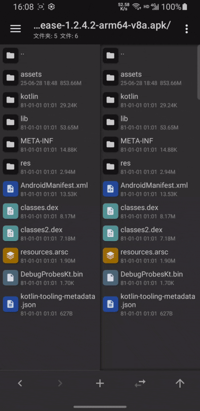{width="40%"}

### 方案二

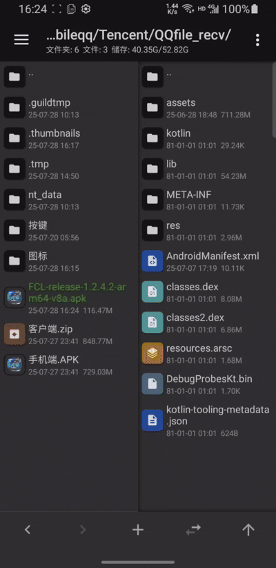{width="40%"}

## 4. 软件图标修改

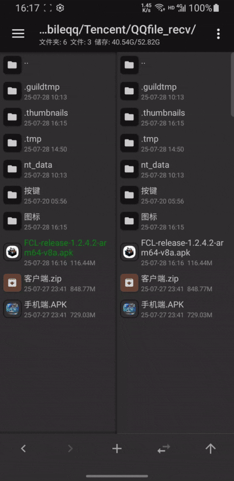{width="40%"}

|屏幕像素密度|DPI|适用范围|
|---|---|---|
|mdpi（320x480或更低）|160|是Android应用程序的基准密度|
|hdpi（480x800或更低）|240|通常用于较大的高分辨率屏幕|
|xhdpi（720x1280或更低）|320|用于更高分辨率的屏幕|
|xxhdpi（1080x1920或更低）|480|适用于非常高分辨率的屏幕|
|xxxhdpi（1440x2560或更低）|640|用于极高分辨率的屏幕|

::: tip 可用于修改图片参数的网站

**提供几个修改图片参数的网站：**
1. [PNG 转 WEBP](https://cdkm.com/cn/png-to-webp)
2. [PNG *DPI* 转换](https://www.dpi-converter.com/zh-cn/)
3. [PNG24 转 PNG32](https://omnifile.co/zh-cn/to-png32/)
4. [WEBP 调整](https://products.aspose.app/imaging/zh-hans/image-resize/webp)
5. [AConvert](https://www.aconvert.com/)（支持 PNG 和 WEBP 互转，支持修改导出格式大小）

:::

## 5. 修改包名（可做到多端共存）。

1. 打开 APKTool M 并找到你下载的模板。
   
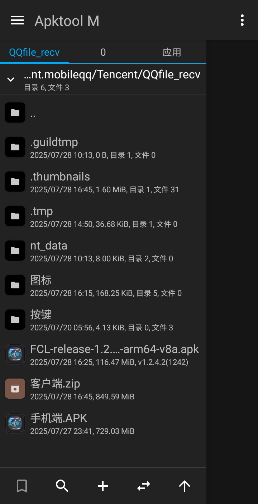{width="40%"}

2. 单击该文件，并点击 `快速编辑`。

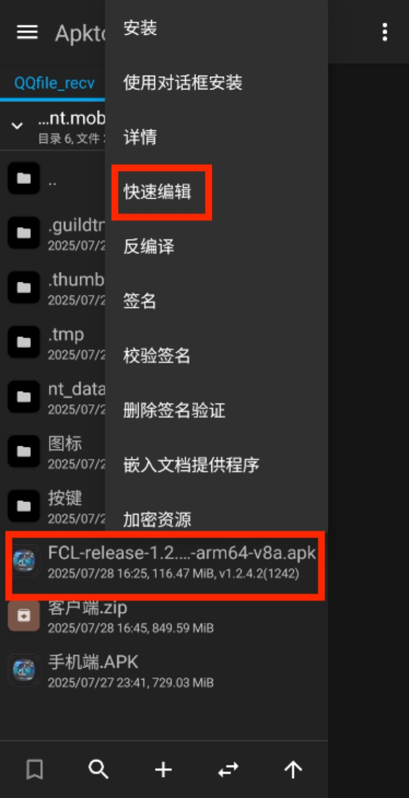{width="40%"}

3. 修改包名为你想要的，然后保存（据说改成大型游戏的包名，手机会分配更多性能）。

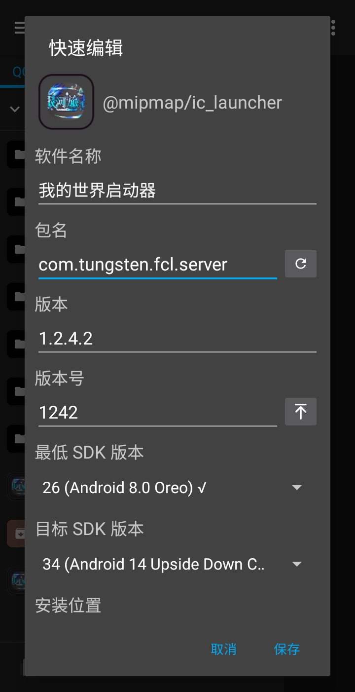{width="40%"}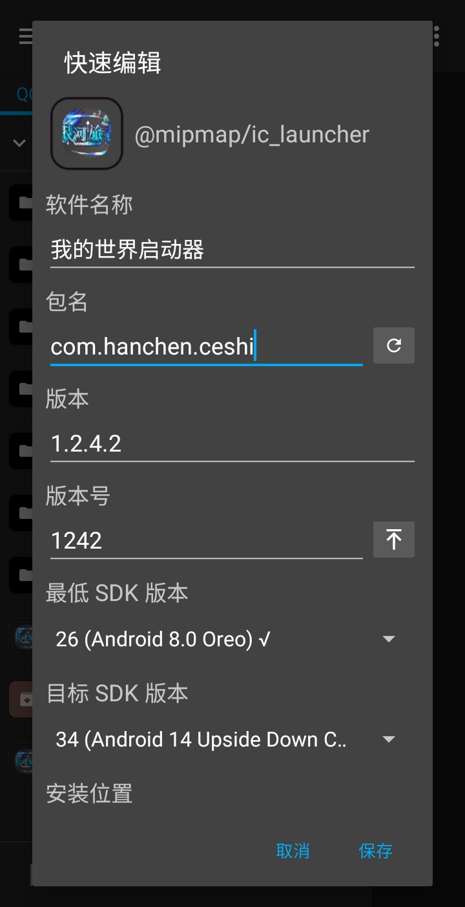{width="40%"}

4. 重新回到 `MT管理器` 中，在模板文件夹下会生成一个 `XX_mod.APK` 文件，打开 `AndroidManifest.xml`。

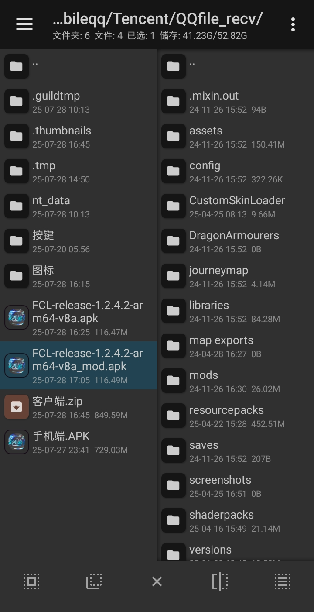{width="45%"}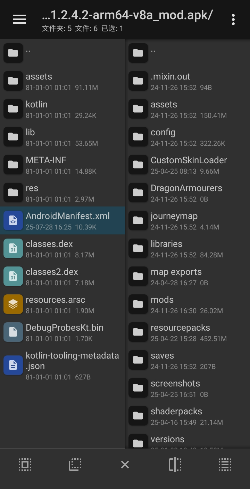{width="45%"}

5. 点右上角三个点，点击搜索 `FileProvider` ，修改 `android:authorities` 的值为 `com.tungsten.fcl.server.provider` ，然后保存。

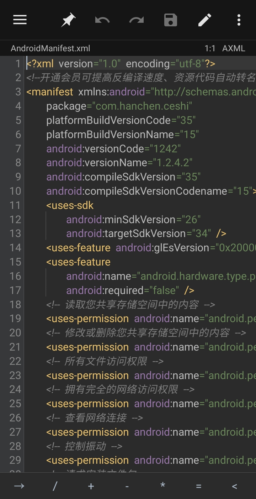{width="45%"}

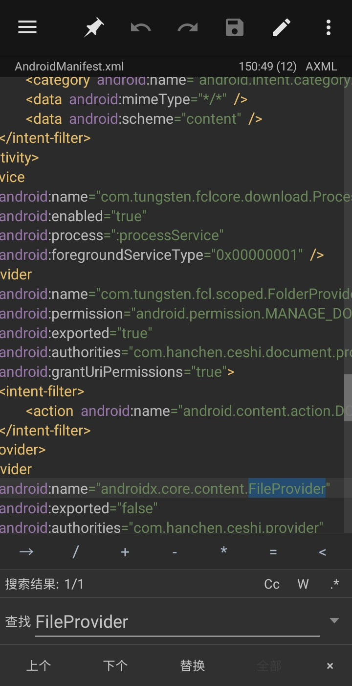{width="45%"}

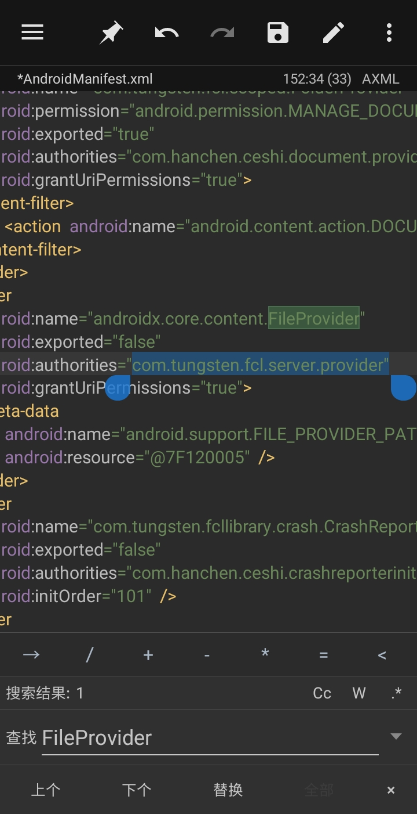{width="45%"}

6. 安装即可。

## 6. 修改版本号

修改 `android:versionCode` 和 `android:versionName` 即可。

{width="45%"}

## 7. 配置项修改

::: info

自定义各个参数是直装包的一大优势，下文将简述 `assets` 中各配置项的修改。

:::

|文件名|路径|
|---|---|
|`eula.txt`|`/assets/`|
|`authlib_injector_server.json`|`/assets/app_config`|
|`config.json`|`/assets/app_config`|
|`general_setting.properties`|`/assets/app_config`|
|`launcher_rules.json`|`/assets/app_config`|
|`menu_setting.json`|`/assets/app_config`|

### eula.txt（最终用户许可协议）

想必开过服务器的对此并不陌生，此文件中的内容为用户第一次安装打开时显示的内容。

#### 使用示例：

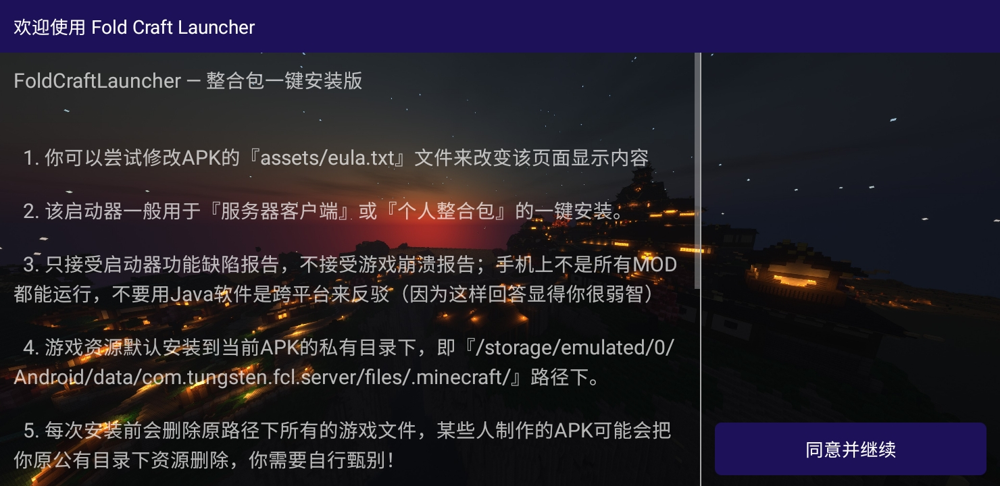

#### 默认配置：
``` txt
FoldCraftLauncher — 整合包一键安装版


  1. 你可以尝试修改APK的『assets/eula.txt』文件来改变该页面显示内容

  2. 该启动器一般用于『服务器客户端』或『个人整合包』的一键安装。

  3. 只接受启动器功能缺陷报告，不接受游戏崩溃报告；手机上不是所有MOD都能运行，不要用Java软件是跨平台来反驳（因为这样回答显得你很弱智）

  4. 游戏资源默认安装到当前APK的私有目录下，即『/storage/emulated/0/Android/data/com.tungsten.fcl.server/files/.minecraft/』路径下。

  5. 每次安装前会删除原路径下所有的游戏文件，某些人制作的APK可能会把你原公有目录下资源删除，你需要自行甄别！

  6. 该启动器的所有设置选项可以在APK的『assets/app_config』目录下进行修改；修改前请确保对应文件格式正确，且尽量使用英文值。

  7. APK的默认包名是『com.tungsten.fcl.server』，如果你需要修改包名请根据群文件要求来；千万不要使用『NP/MT』管理器自带的『APK共存』功能！！！

  8. 在APK的『assets』目录下，有些目录内自带的『version』文件请不要删除，否则会造成应用崩溃或卡加载！

  9. 禁止直接反编译APK的dex文件；请使用Git克隆该项目源码，并使用IDE集成开发环境进行修改
```

### 2. settings_launcher_pictures `文件夹` （启动器主页和鼠标贴图）

::: tip

请仔细阅读该文件夹下的 `格式说明.pdf`。

:::

该目录下只能上传下表中的文件：

|文件名|功能|文件大小|分辨率|
|---|---|---|---|
|`lt.png`|亮色模式背景图片|≤2MB|≤2560x1440|
|`dk.png`|暗色模式背景图片|≤2MB|≤2560x1440|
|`cursor.png`|鼠标指针图片|≤48KB|≤128x128|
|`menu_icon.png`|菜单键图片|≤32KB|≤64x64|

### 3. authlib_injector_server.json（皮肤站地址）

#### 默认配置：
``` json title="authlib_injector_server.json"
{
  "注意事项": {
    "配置文件说明1": "只能在“server-address”数组内写内容，其余地方禁止改动",
    "配置文件说明2": "请确保配置文件编码是UTF-8！！！",
    "格式说明1": "请严格按照JSON文件格式编辑，若格式出现问题启动器将不会解析任何地址",
    "格式说明2": "server-address数组内只能只能为字符串格式，数组的最后一个元素后面不需要加英文逗号",
    "格式说明3": "若皮肤站链接是http协议的不能省开头，必须写完整的；如：http://makeblock.net.cn",
    "格式说明4": "若数组内只有一个元素也不允许加英文逗号",
    "server-address对象值说明": "一行一个服务器地址，接受格式如下：",
    "正确的服务器格式1": "littleskin.cn",
    "正确的服务器格式2": "https://littleskin.cn/api/yggdrasil",
    "正确的服务器格式3": "littleskin.cn/api/yggdrasil",
    "正确的服务器格式补充": "其他格式也可以，只要你在FCL启动器内能添加的认证地址都可以写进来"
  },
  "server-address": [
    "littleskin.cn"
  ]
}
```

### 4. config.json

修改可参考 [MinecraftArgs](https://zhuanlan.zhihu.com/p/12840515737)。

#### 默认配置：
``` json title="config.json"
{
  # 自动选择下载方式（官方源/镜像源）
  "autoChooseDownloadType": true,
  # 自动选择下载线程
  "autoDownloadThreads": true,
  "_version": 0,
  "configurations": {
    "公有目录": {
      "global": {
        # 是否启用全局配置
        "usesGlobal": true,
        # java 参数（不懂的别乱改）
        "javaArgs": "",
        # Minecraft 参数（不懂的别乱改）
        "minecraftArgs": "",
        # 最大内存（-1为无上限，该处值必须为正整数）
        "maxMemory": -1,
        # 自动分配内存
        "autoMemory": true,
        "permSize": "",
        # 服务器IP
        "serverIp": "",
        # java 版本自动选择
        "java": "Auto",
        "scaleFactor": 1.0,
        # 不检查游戏数据
        "notCheckGame": false,
        # 不检查 JVM
        "notCheckJVM": false,
        "beGesture": true,
        "vulkanDriverSystem": false,
        "controller": "00000000",
        # 渲染器
        "renderer": "",
        "driver": "",
        "isolateGameDir": false,
        "pojavBigCore": false
      },
      # 储存目录
      "gameDir": "/storage/emulated/0/FCL-Server/.minecraft",
      "selectedMinecraftVersion": ""
    },
    "私有目录": {
      "global": {
        "usesGlobal": true,
        "javaArgs": "",
        "minecraftArgs": "",
        "maxMemory": -1,
        "autoMemory": true,
        "permSize": "",
        "serverIp": "",
        "java": "Auto",
        "scaleFactor": 1.0,
        "notCheckGame": false,
        "notCheckJVM": false,
        "beGesture": true,
        "vulkanDriverSystem": false,
        "controller": "00000000",
        "renderer": "",
        "driver": "",
        "isolateGameDir": false,
        "pojavBigCore": false
      },
      "gameDir": "/storage/emulated/0/Android/data/com.tungsten.fcl.server/files/.minecraft",
      "selectedMinecraftVersion": ""
    }
  },
  "downloadThreads": 64,
  "downloadType": "bmclapi",
  "last": "私有目录",
  "versionListSource": "balanced"
```

### general_setting.properties（常规设置）

该文件注释非常清晰，这里会只提一两笔。

::: info 解决无法使用中文的问题

中文可能导致显示内容乱码，所以可将 `中文` 转化成 `Unicode`

:::

### launcher_rules.json（启动器规则）

#### 默认配置：

``` json title="launcher_rules.json"
{
  "formatSpecification": {
    "重要说明1": "所有游戏设置规则只能在『launcherRules』里面写，不能在其他任何地方写",
    "重要说明2": "请严格按照Json文件格式编写，若出现错误则任何规则都不会识别",
    "重要说明3": "请注意，只要是数组数据结构的一律有使用优先级；也就是谁在前谁就会优先使用",
    "重要说明4": "如果某个版本有多个适用规则则只会读取第一个有效的，其余均无效",
    "内存项说明": {
      "说明1": "『minMemory』项的值不能低于“1024”，否则该项检测会自动失效"
    },
    "渲染器项说明": {
      "说明1": "截至2025年7月9日，启动器内置的渲染器共包含以下6类：",
      "说明1-1": "f7e985d8-6d4c-f63c-d9f1-06074dab823a『Holy-GL4ES』，6『Custom』",
      "说明1-2": "417a7a93-d9b4-98b9-ec6e-1ea400259c1f『VirGLRenderer』",
      "说明1-3": "0fb718e4-64e3-83d4-a974-8204ea1d9f9f『VGPU』",
      "说明1-5": "18d93f17-ff53-a319-fa61-58709a77bf87『Vulkan Zink』",
      "说明1-6": "8d427e6c-9d22-2d19-db0c-3b9ac2c1543f『Freedreno』",
      "说明1-7": "1a46495a-5503-eaf5-9e3d-1ba08626b95b『GL4ES+』",
      "说明2": "在『useRenderer』字段中，需填写上述渲染器对应的UUID，而非渲染器名称",
      "说明3": "若是自定义渲染器，则需要在『useRenderer』字段中填写对象型数据，详细格式如下：",
      "说明3-1": {"packageName": "ren.test.com", "name": "Renderer name"},
      "说明3-2": "『packageName』是app的包名，『name』是该渲染器别名",
      "说明3-3": "且这两个key的值必须有合法的，不合法的将不被解析；获取包名方式请百度，这里不会介绍如何获取"
    },
    "Java项说明": {
      "说明1": "该功能暂未启用，预计下周正式启用！"
    }
  },
  "launcherRules": {
    "1.17": {
      "memory": {
        "minMemory": 3072,
        "tip": "内存最低要求为“${minMemory}MB”\n由于你的设备总运行内存只有“${totalMemory}GB”，不满足最低配置要求！"
      },
      "renderer": {
        "useRenderer": [{"packageName": "com.fcl.plugin.mobileglues", "name": "MobileGlues"}],
        "downloadURL": "https://icraft.ren:90",
        "tip": "当前所使用的渲染器为『${setRenderer}』，要求的渲染器必须为『${requiredRenderer}』\n\n检测到您未安装该渲染器，请点击右下角按钮安装额外渲染器，否则游戏将不能启动！！！"
      },
      "java": {
        "useJava": ["jre8"],
        "downloadURL": "https://icraft.ren:90",
        "tip": "当前所使用的Java为“${useJava}”，要求必须是使用如下Java才可以启动游戏：\n${requiredJava}"
      }
    }
  }
}
```

### menu_setting.json（菜单设置）

|配置项|默认值|功能|
|---|---|---|
|autoFit|true|自动吸附|
|autoFitDist|0|自动吸附间距（单位：dp）|
|lockMenuView|false|锁定菜单键|
|hideMenuView|false|隐藏菜单键|
|disableSoftKeyAdjust|false|禁用软键盘自适应|
|showLog|false|显示日志|
|disableGesture|false|禁用手势|
|disableBEGesture|false|禁用仿基岩版手势|
|gestureMode|0|触摸模式（0 为建筑模式，1 为战斗模式）|
|disableLeftTouch|false|禁用左半屏触控|
|enableGyroscope|false|启用陀螺仪|
|gyroscopeSensitivity|10|陀螺仪灵敏度|
|mouseMoveMode|0|鼠标控制模式（0 为点击，1 为拖动）|
|mouseSensitivity|1.0|鼠标灵敏度|
|mouseSensitivityCursor|2.0|鼠标灵敏度（当指针可见时）|
|mouseSize|15|鼠标尺寸|
|itemBarScale|0|物品栏缩放|
|windowScale|1.0|窗口分辨率|
|cursorOffset|0.0|鼠标指针偏移量|
|gamepadDeadzone|1.0|手柄死区|

## 按键配置

::: tip 按键配置

按键配置存放在 `/assets/controllers` 目录中。

:::

按键制作只能在启动器内进行。

## 包体压缩

::: tip

对客户端处理时已经提出了一种减少包体大小的方法（即删去.minecraft文件夹下的 `assets` 和 `libraries` 文件夹）。

:::

第二种方法为删去 `assets\app_runtime` 下的部分文件。

接下来，我将介绍该文件夹下各文件的作用：

|文件夹名|作用|
|---|---|
|caciocavallo|如果用到 `Java 8` 的 `AWT/Swing` 图形组件库会用到该运行库|
|caciocavallo11|如果用到 `Java 11` 的 `AWT/Swing` 图形组件库会用到该运行库|
|caciocavallo17|如果用到 `Java 17` 的 `AWT/Swing` 图形组件库会用到该运行库|
|java|各种Java运行环境|
|jna|允许Java程序调用系统本地库（不可删除）|
|lwjgl|游戏运行时需要用到的库，`Pojav` 启动端会用到（谨慎删除）|
|lwjgl-boat|游戏运行时需要用到的库，`Boat` 启动端会用到（谨慎删除）|

#### 使用说明

一般情况下，只需对 `caciocavallo` 或 `java` 资源进行修改即可，其他文件**不推荐改动**！

比如，我删除了 `Java 11` 和 `Java 17` 运行环境（由于我删除了 `Java 17` 和 `Java 11`，所以 `caciocavallo11` 和 `caciocavallo17` 不会保留）。
