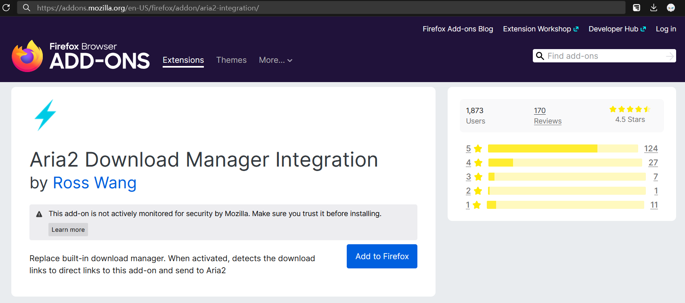
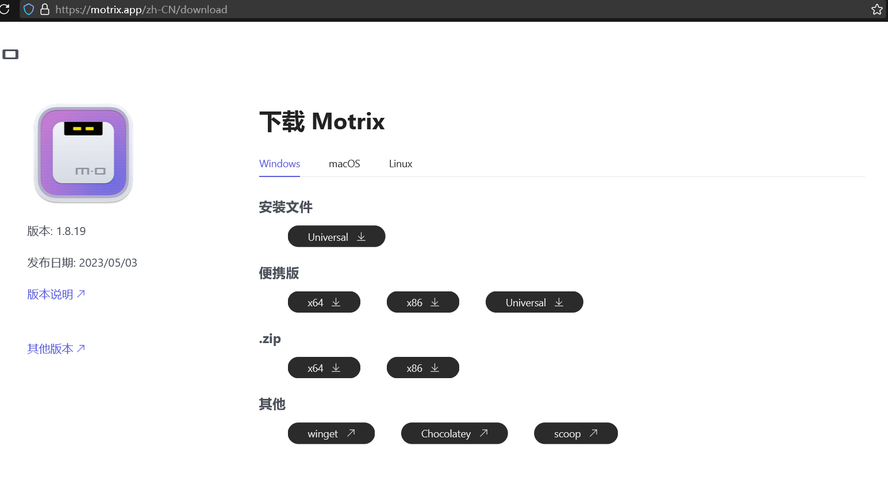
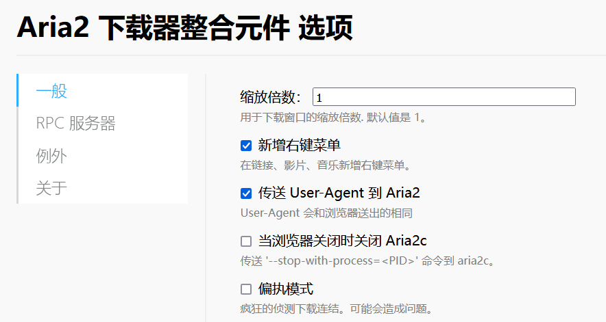
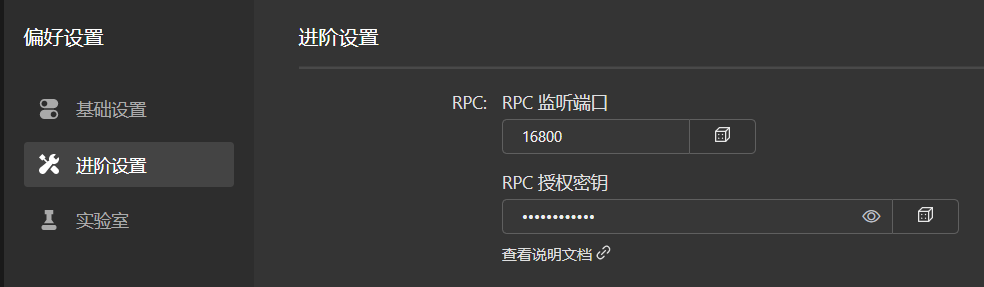
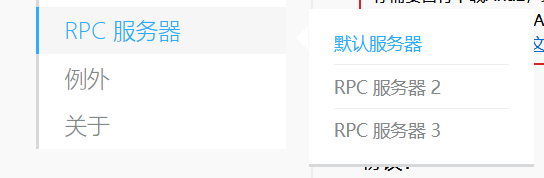
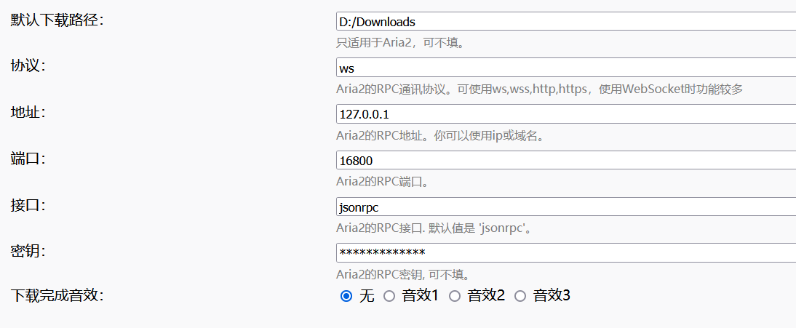
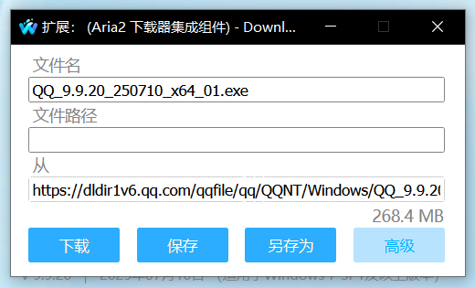
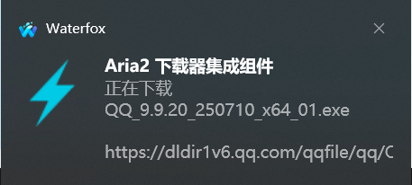
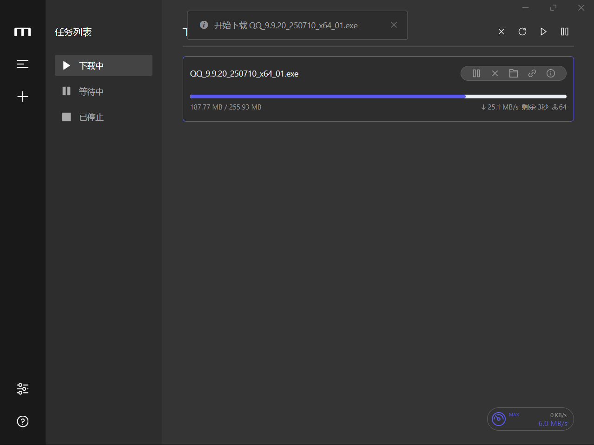
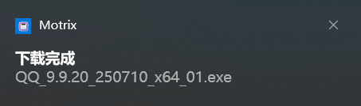

# 为 Motrix 在 Firefox/Waterfox 上设置下载

::: tip

本章节的教程仅适用于使用 Firefox/Waterfox 等分支的浏览器用户。

:::

[Motrix](https://motrix.app/) 是一款基于 [aria2](https://github.com/aria2/aria2) 的下载器，其轻量化的界面和相对较好的性能博得了世界范围内许多网友的赞赏与青睐。目前，Motrix 仍然只对谷歌浏览器有[浏览器拓展支持](https://github.com/gautamkrishnar/motrix-chrome-extension)，而对于火狐浏览器及其分支缺乏公开的支持（唯一在火狐商店声称可用的兼容模块经个人测试同样无效）。

## 1. 安装 Aria2DMI 与 Motrix

* 前往 [https://addons.mozilla.org/en-US/firefox/addon/aria2-integration/](https://addons.mozilla.org/en-US/firefox/addon/aria2-integration/)，为你的浏览器安装这个拓展。

* 前往 [Motrix 官网](https://motrix.app/zh-CN/download)，根据你的平台选择对应的安装包（也可选择通用版本的安装器，不过体积会稍大）。

::: tip

其实 Motrix 也可以通过 `winget`、Chocolately、及 `scoop` 等命令行方式安装，这里不多作赘述。

:::

## 2. 打开 Aria2DMI 的设置界面

* 通过右上角扩展 - 扩展列表，找到 Aria2 Download Manager Intergration（中文显示为“Aria2 下载器集成组件”）
* 在扩展右上角的三个点处，找到“选项”，点击进入该拓展的设置界面。
* 在“一般”一栏中，个人建议点选“新增右键菜单”、“传送 User-Agent 到 Aria2”这两个选项，可以提升使用体验。

## 3. 进行进阶设置

* 回到 Motrix 界面，点击左下角第二个按钮，打开设置界面。
* 在“进阶设置”中找到 RPC 选项 - RPC 授权密钥，点击右侧的随机按钮产生一个。
* 接着 Motrix 会自动为你显示，将其复制。上方的端口号也请一并记忆。

* 回到 Aria2DMI 的设置界面，点击“RPC 服务器”，再点击展开栏中的“默认服务器”。

* 将先前的端口号和密钥一一填入此处，其他选项保持默认。

* 点击右下角的蓝色按钮保存，关闭设置界面。

## 4. 测试下载

* 随便找到一个可以下载的内容，既可以在右键菜单中手动唤起 Motrix，也可以直接点击下载链接。
* 以 QQ 官网为例，点击下载按钮后出现了如图所示的窗口。

* 这里的下载路径留空则跟随 Motrix 的默认设置，若有需要可手动填写，也可在先前的浏览器设置中进行调整。
* 点击下载，即可静默拉起 Motrix，并在右下角弹出下载开始和完毕的提示。

## 5. 大功告成！

现在 Motrix 会接管所有下载请求，除非你点击取消。如果取消，浏览器将会使用自带的下载器进行下载。