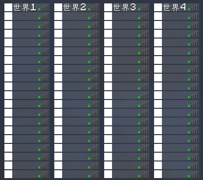
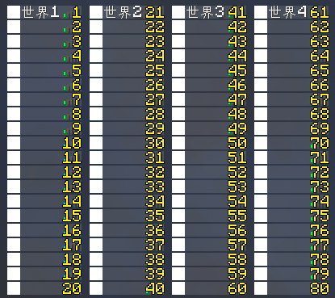

# 基于 TAB Reborn 实现按世界分列的玩家列表

有些时候，你可能看到某个服务器使用了一些如下图的 TAB 排版，可以让不同世界的玩家占据一列显示在 TAB 里：


这个效果其实可以通过 TAB 自带的[玩家分组](https://github.com/NEZNAMY/TAB/wiki/Feature-guide:-Layout#player-groups)设置实现。

## 1. 启用排版

按如下高亮部分所示，将 `layout.enabled` 修改为 `true`：

``` YAML title="plugins/TAB/config.yml" {3}
# https://github.com/NEZNAMY/TAB/wiki/Feature-guide:-Layout
layout:
  enabled: true
  direction: COLUMNS
  default-skin: mineskin:383747683
  enable-remaining-players-text: true
  remaining-players-text: '... 及 %s 名玩家'
  empty-slot-ping-value: 1000
  layouts:
    default:
      ...
```

这样就成功启用了排版模式，现在，你的 TAB 界面应该会有一大堆空白名称的玩家将列表“撑”了起来。


## 2. 修改排版

按如下高亮部分所示，将 `layouts.default.fixed-slots` 下的内容修改为分世界列表：

``` YAML title="plugins/TAB/config.yml" {6-9}
layout:
  ...
  layouts:
    default:
      fixed-slots:
        - '1|主城' # 可将其改为你想要的世界名称，不影响玩家所处位置，如下同理
        - '21|生存世界'
        - '41|资源世界'
        - '61|末地世界'
      groups:
        world1group:
        ...
```

其中，数字为其所处位置，后面则是显示的内容。



## 3. 设置分组

要想让玩家能够在这些列表里显示，首先需要为每列定义一个组。

按如下高亮部分所示，在 `layout.layouts.default.groups` 下加入玩家分组设置。

``` YAML title="plugins/TAB/config.yml" {7-23}
layout:
  ...
  layouts:
    default:
      ...
      groups:
        world1group:
          condition: "%world%=world1" # 把 "world1" 改为你想要的世界名称，即可让对应玩家出现在第一列，如下同理
          slots:
            - 2-20
        world2group:
          condition: "%world%=world2"
          slots:
            - 22-40
        world3group:
          condition: "%world%=world3"
          slots:
            - 42-60
        world4group:
          condition: "%world%=world4"
          slots:
            - 62-80
```

* 其中，`world1group` 到 `world4group` 是组别名称，可自定义；
* `condition` 是决定了玩家被分入这组的条件，可以填入 TAB 自带的[变量判断](https://github.com/NEZNAMY/TAB/wiki/Feature-guide:-Conditional-placeholders#text-operations)；
  * 在本章节教程中，我们填入的是 `%world%=世界名称`，这是一个用于判断玩家所处世界的表达式。
  * `世界名称` 可填入任何有效的世界名称。
* `slots` 则决定了被分入这些组的玩家在列表中的位置，位置与数字对应的图表见下。



需要注意的是，TAB 能且仅能最多显示 80 名玩家，超出的数量会以 `... (数量) 位更多玩家` 显示在对应列表的末端。

## 4. 大功告成！

在设置了分组条件以后，处于对应世界的玩家就可以出现在对应的列表上。