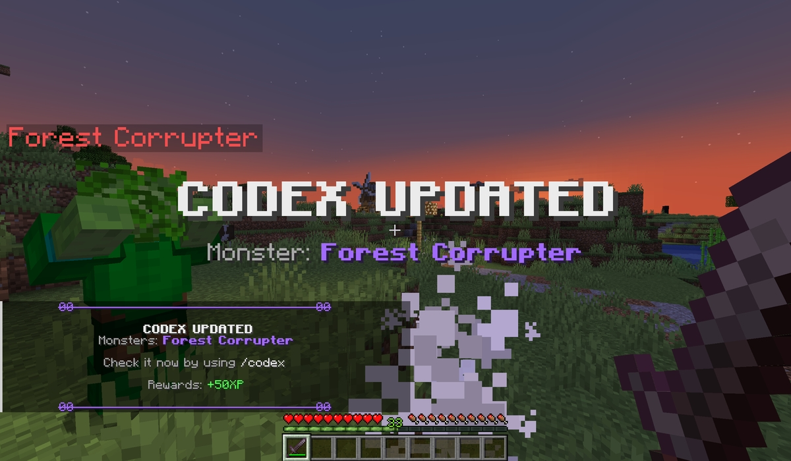

# 如何开始
使本插件在服务器上正常运作的必要信息。

## 要求

### Spigot

::: tip
你需要至少 Spigot 或 Paper 或其分支服务端核心才能使插件运作。不要使用 CraftBukkit。
:::

## 可选依赖

### PlaceholderAPI

::: info

这个插件是完全可选安装的。    
若你想要玩家在GUI中使用变量，那你就会用到这个插件。    
插件地址：https://www.spigotmc.org/resources/placeholderapi.6245/

:::

### 解锁图鉴的插件

::: info

WorldGuard（进入区域时解锁图鉴）：https://dev.bukkit.org/projects/worldguard

MythicMobs（击杀特定怪物时解锁图鉴）：https://www.spigotmc.org/resources/5702/

:::

## 插件安装

若要安装此插件，你只需要将插件 jar 文件放入服务器的 plugins 文件夹下，然后启动服务器即可。第一次载入后插件将会在 `categories` 文件夹下创建示例配置，你可以将它们用作参考，或者删除它们。

## 创建第一个图鉴条目

首先前往插件的 `categories` 文件夹，打开一个分类文件。你可以创建自己的分类文件，但在本示例中我会打开 **monsters.yml** 文件。

复制其中一个条目的途径，例如 `shadow_warrior`，并将它粘贴在下方，修改它的名称。

``` YAML
discoveries:
  shadow_warrior:
    name: "#a36bfe&l影之战士"
    description:
      - "#eeeeee阴影沼泽中所发现的异象."
      - "#eeeeee难以战胜."
      - ""
      - "&7掉落物:"
      - "&8❱ #eeeeee阴影魔药 &8(25%)"
      - "&8❱ #eeeeee铁锭 &8(90%)"
    discovered_on:
      type: MOB_KILL
      value:
        mob_type: ZOMBIE
        mob_name: Shadow Warrior
```

修改新图鉴条目的名称与描述。

你还需要设置玩家解锁图鉴条目的时机。我想要将其与 MythicMobs 的一个实体关联，所以在 `discovered_on` 部分我需要填入 **MYTHIC_MOB_KILL**，在 `value` 下的 `mob_type` 填入对应的 MythicMobs 实体名称。

::: info

当你想要某个条目只能通过控制台命令解锁时，你可以删除整个 `discovered_on` 部分配置。

:::

``` YAML
forest_corrupter:
    name: "#a36bfe&l森林腐化者"
    description:
      - "#eeeeee肯格尔森林就是被这种不知名的实体腐化的。"
      - ""
      - "&7掉落物:"
      - "&8❱ #eeeeee腐化树干 &8(60%)"
      - "&8❱ #eeeeee腐化树脂 &8(15%)"
    discovered_on:
      type: MYTHIC_MOB_KILL
      value:
        mob_type: forest_corrupter
```

