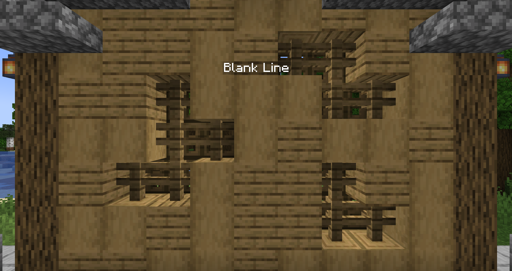

# 初次使用
该页面大致介绍了悬浮字的用法与编辑，以及如何创建、修改或管理悬浮字的操作。

## 权限
DecentHolograms 是一个面向管理员用户开放的插件，它将管理插件的权限简化为一个，即 `dh.admin`，拥有此节点即可使用本插件的全部命令与功能。

## 命令
本插件有着大量的命令，在开始使用之前了解一些基本规则是很有必要的。这将会提升你使用命令的效率。

### 参数
括号只是用于标注参数的必要性，它们不应出现在你最终输入的命令中。

|括号种类|参数意义|
|---|---|
|尖角括号“<>”|必须填入的参数。|
|方括号“[]”|可选填入的参数。|
|花括号“{}”|可能填入的值的列举。|

### TAB 补全
大部分命令与子命令均以 TAB 补全为特色，这能提升输入命令的效率，有时候也能帮助你找到可以作为有效参数的内容。

## 编辑悬浮字

该教程提供了编辑悬浮字的一些基本规则，包括创建和修改它们。若要参照完整的命令列表，请参考下文的章节。

* [格式与颜色](general.formats-colors.md)
* [命令](general.commands.md)

### 创建悬浮字示例

创建一个悬浮字是非常简单的，输入下列命令即可开始。

### 创建悬浮字

::: info 
若要在控制台执行命令，你需要在命令中加入 `-l:<世界名称>:<x>:<y>:<z>` 参数。
:::

> /dh create example

### 编辑悬浮字行

> /dh line set example 1 1 &3&lDECENT HOLOGRAMS    
> /dh line add example 1 &fHologram plugin

### 添加悬浮字页
你可以根据你的需要添加任意数量的悬浮字页。

> /dh page add example    
> /dh page switch example 2

### 设置执行操作

若要玩家可在悬浮字上翻页，你可以输入下面这两个命令：

> /dh page addaction example 1 RIGHT NEXT_PAGE    
> /dh page addaction example 2 LEFT PREV_PAGE

在设置正确的点击操作后，玩家可以在第一页右键切换到下一页，在第二页点击切换到上一页。    
更多可用的操作可以在[这里](general.actions.md)找到。

### 总结

该章节概括了 DecentHolograms 的基本使用方法。插件提供了许多高级功能和特色，它们都可在命令参考章节被找到。若你需要任何帮助，请赶快加入我们的 Discord 聊天群组。