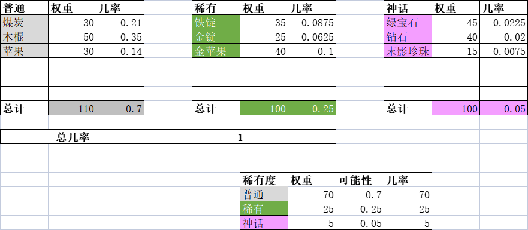
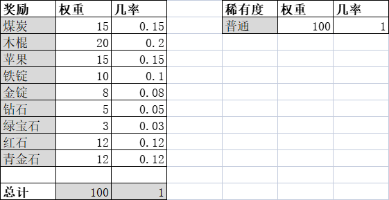

# 稀有度、权重

ExcellentCrates 使用了权重系统决定宝箱奖励的可能性（即随机几率）。

你可以通过[编辑器](editor-gui.md)编辑奖励的权重与稀有度。

## 稀有度

使用稀有度创建一个更复杂的系统，使得某个奖励更加稀有或普通！

你可以在 `config.yml` -> `Rewards` -> `Rarities` 随意编辑或删除稀有度。

::: warning

你必须在插件配置中至少留下一个可用的稀有度！否则插件会试图载入默认配置。

:::

## 权重

::: info

建议将稀有度的总权重保持在 100 使得计算更简单。

更推荐使用 Office Excel（或 WPS 表格、LibreOffice 的计算）计算权重，这会很有用。

:::

看看如下的表格：

这张图代表了宝箱奖励。这里有**三种不同稀有度**的 **9 个奖励物品**。

::: info 太过复杂？

试试看更简单的方式！

:::

选择奖励时，插件会先选择稀有度。然后才会选择对应稀有度的奖励。

稀有度几率计算公式：$\frac{权重}{总权重}$

稀有度总权重为 100，则几率为：

* 普通：$\frac{70}{100} = 0.7$（70%）
* 稀有：$\frac{25}{100} = 0.25$（25%）
* 神话：$/frac{5}{100} = 0.05$（5%）

因为奖励的选择是基于稀有度的，若要计算奖励几率，我们需要**同稀有度**所有奖励的总权重。

那么，**奖励几率**的计算公式为：$\frac{权重}{总权重 \times 稀有度几率}$

普通奖励的总权重为 **100**，则普通稀有度的几率为 **0.7**，因此每个奖励的几率是这样计算的：

* **煤炭**：$\frac{30}{100 \times 0.7} = 0.21$（21%）
* **木棍**：$\frac{50}{100 \times 0.7} = 0.35$（35%）
* **苹果**：$\frac{20}{100 \times 0.7} = 0.14$（14%）

对稀有奖励的计算相同：

* **铁锭**：$\frac{35}{100 \times 0.25} = 0.0875$（8.75%）
* **金锭**：$\frac{25}{100 \times 0.25} = 0.0625$（6.25%）
* **金苹果**：$\frac{40}{100 \times 0.25} = 0.1$（10%）

神话奖励同样如此：

* **绿宝石**：$\frac{45}{100 \times 0.05} = 0.0225$（25%）
* **钻石**：$\frac{40}{100 \times 0.05} = 0.02$（2%）
* **末影珍珠**：$\frac{15}{100 \times 0.05} = 0.075$（0.75%）

如上表所示，所有指定稀有度的奖励几率与稀有度几率大致相似，这表示权重系统能正常工作！

### 简化权重

如果上述示例还是难以理解，那么我们再将它简化一下！

这个表格代表着宝箱奖励，这里有**一个稀有度**下的**九个奖励**。

因为所有奖励都使用同一稀有度，则稀有度的几率总为 **1**（100%）。这表示稀有度不会影响奖励的几率。

那么，奖励几率的计算公式此时为：$\frac{权重}{总权重 \times 1} = \frac{权重}{总权重 \times 1}$

因为奖励的**总权重**为 **100**，它们的几率与权重相同：

* 煤炭：$\frac{15}{100} = 0.15$（15%）
* 木棍：$\frac{20}{100} = 0.2$（20%）
* 苹果：$\frac{15}{100} = 0.15$（15%）
* 铁锭：$\frac{10}{100} = 0.1$（10%）
* 金锭：$\frac{8}{100} = 0.08$（8%）
* 钻石：$\frac{5}{100} = 0.05$（5%）
* 绿宝石：$\frac{3}{100} = 0.03$（3%）
* 红石：$\frac{12}{100} = 0.12$（12%）
* 青金石：$\frac{12}{100} = 0.12$（12%）

够简单了吧？:P