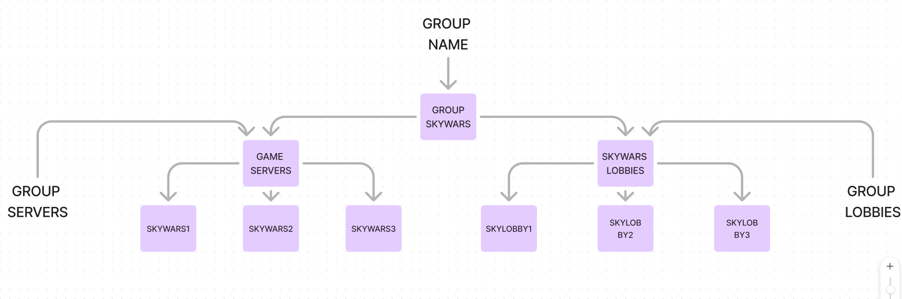

# 🌐 初次使用

::: warning
配置文件会随更新而发生变化，这些改动都是迎合用户且必要的改动。若你发现差异，可以加入我们的 Discord 聊天群组。
:::

## 1) 正确选择对应插件版本

* 首先，关闭群组服；
* 下载 [.zip](https://www.spigotmc.org/resources/86398/) 文件并解压，其中内容大致为：
```
FallbackServer.zip
L Fallback-Server-Addon-版本号.jar
L FallBackServer-版本号.jar
L FallBackServerVelocity-版本号.jar
```
* 选择你使用的核心对应版本的插件文件（例如，你正在使用 Velocity，则将 `FallBackServerVelocity` 放入服务器插件文件夹。同理，使用 BungeeCord 则将 `FallBackServer` 放入，依此类推），你可以在[这里](overview.version-type.md)找到相关描述；
将插件放入文件夹后重启服务器即可。

::: tip 注意
该步骤会影响插件运转，请正确按照上方步骤进行安装操作。
:::

## 2) 默认模式下的基础安装

* 启动后，插件会释放配置文件，类型会因使用核心不同而略有差别，你会找到如下的对应文件夹：

  - BungeeCord：
  ```
  plugins\
    L FallBackServer\
    L FallBackServer-版本号.jar
  ```
  - Velocity:
  ```
  plugins\
    L fallbackservervelocity\
    L FallBackServerVelocity-版本号.jar
  ```

* 打开文件夹，使用任意一个文本编辑器，并打开 `config.yml`。
* 搜索 **fallback**，你将会见到一系列预先配置好的大厅列表。
* 返回服务器根目录文件夹，现在看起来应该是这样的：
  - BungeeCord(WaterFall)：
  ```
  logs\
  modules\
  pluigns\
  config.yml
  locations.yml
  start.sh
  waterfall.jar
  waterfall.yml
  ```
  - Velocity：
  ```
  lang\
  logs\
  plugins\
  forwading.secret
  messages.yml
  start.sh
  velocity.jar
  velocity.toml
  ```
* 根据你使的核心种类打开对应的 config.yml（`BungeeCord`）或 velocity.toml（`Velocity`）。
* 复制大厅服的名称，如下文所示：
  - BungeeCord(Waterfall)：
  ```YAML
  servers:
    lobby1:
      motd: '&1Just another Waterfall - Forced Host'
      address: localhost:25566
      restricted: false
    lobby2:
      motd: '&1Just another Waterfall - Forced Host'
      address: localhost:25567
      restricted: false
    testsv:
      motd: '&1Just another Waterfall - Forced Host'
      address: localhost:25568
      restricted: false
  ```
  - Velocity：
  ``` toml
  [servers]
    testsv = "127.0.0.1:25568"
    testsv2 = "127.0.0.1:25569"
    lobby2 = "127.0.0.1:25567"
    # In what order we should try when a player logs in or is kicked from a server.
    try = ["lobby1"]
    # Configure your servers here. Each key represents the server's name, and the value
    # represents the IP address of the server to connect to.
    lobby1 = "127.0.0.1:25566"
  ```
* 回到你的文本编辑器并在“fallback”下的“default”组中加入你的服务器名称，需要**注意大小写**。下文是一个示例：
``` YAML
  # Add here your groups with their servers and lobbies.
  fallback:
    bedwars:
      servers:
        - bwgame1
        - bwgame2
        - bwgame3
      lobbies:
        - bwlobby1
        - bwlobby2
        - bwlobby3
      mode: FALLBACK
    survival:
      servers:
        - survival
      lobbies:
        - lobby1
        - lobby2
        - lobby3
      mode: RECONNECT
    default: # DON'T delete this default group.
      servers:
      - lobby1
      - lobby2
      - lobby3
    mode: DEFAULT
```
* 将配置保持在“mode: DEFAULT”，保存所有改动，你的大厅服就配置完成了。
* 如上所述，“fallback”部分可以设置每个服在崩溃情况下的行为。它非常易于理解。为了进一步讲述，我会在这里放置一个示例。



* 在浏览上述配置之后，你就可以开始编写自己的配置了。需要注意的是，这只是一个用于理解配置的简单示例，完整示例如下。

!

* 在完成必要的修改之后，只需重启群组或执行命令 `/fs reload` 即可应用改动。
* 你现在可能会思考“mode: FALLBACK”的意义。其实它相当简单。在玩家还连接到服务器却遇到服务器崩溃的情况时，插件会自动识别并将你的玩家引流回你预先设计好的大厅服。如果这些大厅服满员或不可用，则插件会将你的玩家重分配至“default”组中的服务器内，也就是你稍早前配置的那些内容，如果这些服务器仍然无法容纳足够的玩家，则这些玩家就会直接断开连接。

::: tip 注意
插件现在可使用默认方法（在崩服时自动整理玩家），若你想要启用 RECONNECT（重连）模式，请转至步骤 2.5。
:::

## 2.5) 重连模式

* 找到核心的 `plugins/` 文件夹，再找到 `FallBackServer`（BungeeCord/WaterFall）或 `FallbackServerVelocity`[^1] 文件夹。打开并通过文本编辑器打开其中的 `config.yml` 文件。
* 找到 `fallback` 部分，你可以看见你先前修改的组。自行决定哪个组会使用重连模式，并为其设置正确的服务器。例如，若你需要所有生存服（如 survival1、survival2）使用重连模式，请将其列在“servers”部分下，需要注意大小写匹配。
* 之后，在“lobbies”部分下，添加玩家重连失败后进入的大厅服。请再次注意大小写匹配。这一步非常重要，因为它决定了玩家在重连模式失败情况下的重定向方向。
* 你可以参考提供的示例。
* 在完成这些步骤之后，只需将 `mode: FALLBACK` 修改为 `mode: RECONNECT`， 然后在游戏或控制台内输入命令 `/fs reload` 应用所有改动即可。
* 这样，你的群组搭建就大功告成了！

## 3) Spiogt 重连附属

* 如果你读到了这里，恭喜！你已经抵达了本章的结尾。
* 首先，打开你的 Spigot 服务器所在的 `plugins/` 文件夹，并找到“FallbackServerAddom”文件夹（首次启动后出现）。进入文件夹并使用文本编辑器打开其中的 **config.yml**。
* 接下来，你需要为服务器设置正确的模式。**FallbackServer** 提供了两种选项：**STANDALONE** 即独立模式，有一台物理服务器专门用于重连。另外则是 **ADDON** 即附属模式，服务器会在插件启动后与插件本体联动。
* 打开 **config.yml** 之后，你可以在[模式](https://github.com/sasi2006166/Fallback-Server/blob/44f319a2d7897fddb3c3426b04fb4f4bc8f023c8/src/main/resources/config.yml#L19)部分下通过修改 **"NONE"** 进入指定模式。之后输入命令 **/fsa reload** 即可重启插件并将其部署在指定模式。
* 之后，你的 Spigot 子服就算配置成功了。

::: warning
请确保配置格式正确；否则会导致重连模式不按预期工作，影响玩家游玩体验甚至导致玩家被踢出服务器。
:::

[^1]:
    事实上，这里应该是小写名称。
    上文的安装步骤中已经体现了这点。