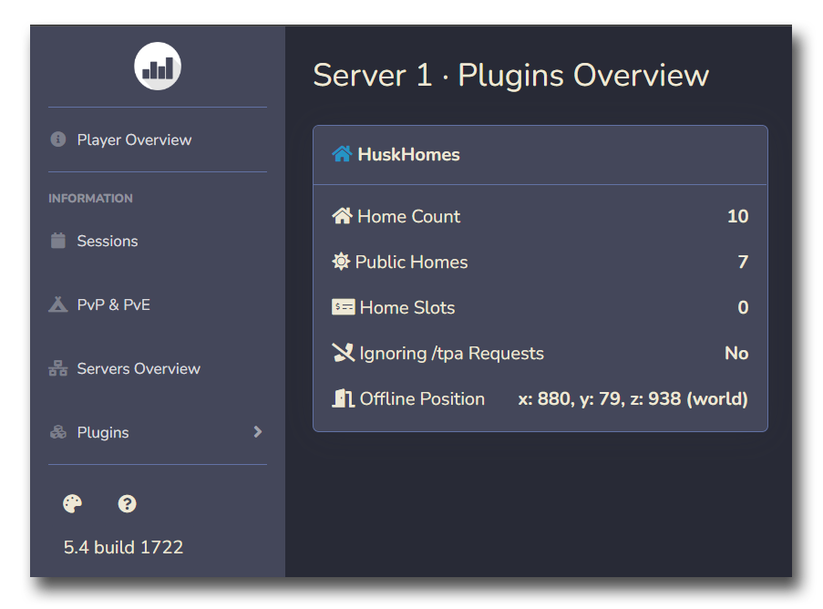

# Plan 插件联动
HuskHomes 支持在[玩家统计](https://github.com/plan-player-analytics/Plan)（Plan）面板上显示关于玩家设置家传送点的信息。

## 安装需求

* HuskHomes 2.0 或更高；
* Plan 5.4.1690 或更高。

## 安装教程

1. 将 Plan 插件安装至你的 Spigot 服务器，并安装 HuskHoms 插件；
2. 修改 Plan 的配置文件并重启你的服务器；
3. 配置完毕后，数据将会开始出现在你的玩家面板下，在“插件”面板中的“HuskHomes”一栏中可以见到这些数据。