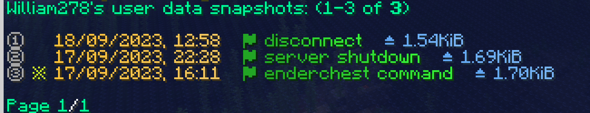
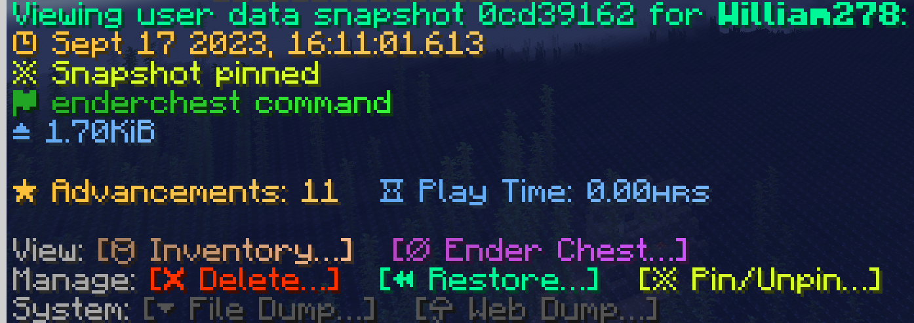

# 数据切换
HuskSync 提供了备份和自动切换玩家数据的功能。这样的话，如果玩家数据出现任何问题，插件立即会将玩家的数据还原到上一个保存的快照。
 
## 数据快照
HuskSync 能够将玩家的数据保存为“快照”的形式。

每个用户数据的快照都包含下列数据：

* 玩家的 UUID；
* 时间戳（创建快照的时间）；
* 创建原因（该快照为何被创建）；
* 用于显示是否被标记的快照标志（防止被数据切换覆盖）；
* 保存数据的映射表。

默认情况下，HuskSync 将会为每个用户创建五个快照（最晚创建的快照包括在内）。在那之后，每当一个新的快照被生成，最早生成的一个快照就会被删除。你可以在 `config.yml` 下 `synchronization` 的 `max_user_data_snapshots` 处修改保存的快照数量（最小值为 1）。将该设置调整为“0”会使得每次数据保存时保存一个新的快照。

HuskSync 将会为每个玩家保存 16 份最近的数据快照（包括当前数据）。在此之后，新快照会默认覆盖旧快照。你可以通过修改 `max_user_data_snapshots` 来决定保留的快照数量（最小值为 1）。

被标记的快照数据不会被切换，仅能从游戏内通过命令删除。

## 浏览玩家数据

若要浏览玩家的数据快照，在游戏内使用命令 `/userdata list [玩家名称]`。玩家最近保存的快照将会从数据库中读取，并按照从新到旧的顺序排列。在快照上点击可浏览详细信息。

被星标标注的快照表示它已被标记。鼠标移动到其上可显示详细信息。

你可以点击列表中的内容，浏览其中的每个快照。相似地，若要浏览一个用户最近的数据，请使用 `/userdata view [玩家名称]`。

## 管理玩家数据

你可以使用“管理”按钮来管理玩家数据。这些数据只会在你有用户命令管理权限时出现。（见“命令列表”章节）

* 点击“删除”来删除数据；
* 点击“恢复”按钮来恢复玩家数据。若玩家在线，他们的物品与相关属性将会被更新，否则数据更新将会在他们下次上线时触发；
* 点击“标记”按钮来标记玩家数据。被标记的数据将会出现星标，以表示它被标记。

## 保存原因
被🚩标志标记的数据保存原因，表明快照为何存在。

* **disconnect（连接断开）：**表示玩家断开连接时保存的数据（切换服务器或登出）；
* **world save（世界保存）：**表示玩家在世界保存期间保存的数据。该项可在 `config.yml` 下的 `synchronization` 将 `save_on_world_save` 项设置为 false 来禁用；
* **server shutdown（服务器关闭）：**表示服务器关闭时保存的玩家数据；
* **inventory command（背包命令）：**表示通过 `/inventory` 命令修改背包后保存的数据；
* **enderchest command（末影箱命令）：**表示通过 `/enderchest` 命令修改末影箱后保存的数据；
* **backup restore（背包保存）：**表示数据从前一个版本还原后保存的数据；
* **api（api 调用）：**表示通过 api 调用事件后保存的数据；
* **mpdb migration（MPDB 数据库迁移）：**表示从插件 MySQLPlayerDataBridge 迁移数据后保存的数据（见“MPDB 迁移”章节）；
* **legacy migration（旧版数据迁移）：**表示从本插件的旧版本（1.x 版本 - 见“从旧版迁移”章节）迁移而来
* **converted from v2（v2 旧版数据迁移）：**表示从本插件的 2.0 数据格式自动转化而来的数据。
* **unknown（未知）：**表示未知原因保存的数据。
