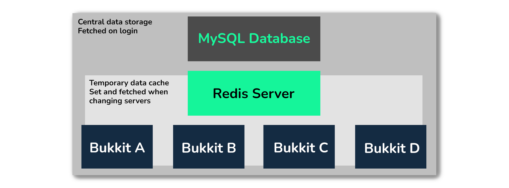

# 同步模式

HuskSync 提供了两种分别使用 Redis 和 MySQL 的数据同步模式使得玩家可以跨服读取数据（见下）。这些同步模式会改变数据在服务器间的同步方法，可以在 `config.yml` 下修改。



## 可用模式

* `LOCKSTEP` 同步模式为默认模式。它会使用一个检查系统，来确保所有服务器不会因网络拥堵或环境波动而无法同步数据。该模式是 HuskSync 3.1 引入的，并在 3.2 及之后的版本成为了默认设置。
* `DELAY` 同步模式使用了 `network_latency_miliseconds` 设置值来在监听 Redis 数据前添加延时。
你可以在 `config.yml` 下 `synchronization` 的 `sync_mode` 修改你所使用的同步模式。

::: warning
群组下的所有服务器应当使用相同的同步模式（至少是在一个集群中）。
:::

### 在配置文本中修改同步模式

```YAML
synchronization:
  # 所使用的数据同步模式 (LOCKSTEP 或 DELAY). 推荐大多数服务器核心使用 LOCKSTEP. 相关文件: https://william278.net/docs/husksync/sync-modes
  mode: LOCKSTEP
```

## 步进同步模式

`LOCKSTEP` 同步模式工作方式如下：

* 当一个玩家进入服务器后，服务器将会持续检查是否存在 `DATA_CHECKOUT` 密钥。
  * 在该密钥不存在的情况下，插件会为玩家设置一个新的 `DATA_CHECKOUT` 密钥。
* 在此之后，插件将会检查 Redis 数据库中是否存在相同的 `DATA_UPDATE` 密钥。
  * 若 `DATA_UPDATE` 存在，则该玩家对应该密钥的数据会从 Redis 数据库中的反序列化快照读取。
  * 否则就会从数据库中读取数据。
* 当玩家离开服务器，数据会带着 `DATA_UPDATE` 密钥序列化后存入 Redis 服务器。在设置完该密钥后，玩家当前的 `DATA_CHECKOUT` 密钥就会从 Redis 服务器中去除。

需要注意的是，`DATA_CHECKOUT` 表示数据是否“被检查”，且会附上服务器 ID（取自 `server.yml` 配置文件）。在服务器关闭或重启时，插件将会清除当前服务器 ID 下对应的所有 `DATA_CHECKOUT` 密钥（来防止因服务器崩溃等事件导致的密钥过期）

`LOCKSTEP` 自 HuskSync 3.2 以来成为本插件的默认设置，大多数服务器推荐使用该模式。

## 延时同步模式

`DELAY` 同步模式的原理如下：

* 当玩家离开服务器时，一个 `SERVER_SWITCH` 密匙会立即在 Redis 服务器上生成，缀有 `DATA_UPDATE` 密钥，其中包含了玩家序列化后的打包数据快照。
* 当玩家连接至服务器的时候，他们会被标记为锁定（禁止破坏方块、使用容器等）
* 服务器会自动等待配置文件中设置的 `network_latency_milliseconds` 时间长度（默认为 500 毫秒）使得源服务器器能序列化并设置他们的密钥。
* 在等待时间结束后，服务器会检查 `SERVER_SWITCH` 密钥。
  * 若存在，插件将会继续读取 `DATA_UPDATE` 密钥；在读取之后，他们的数据会从 Redis 数据库中的反序列化快照中读取。
  * 若不存在，他们的数据会从数据库读取（如同他们加入了群组服一般）

若你的群组服出现了环境搏动或显著的网络延迟（尤其是在不同硬件/位置运行的服务器），你可能更需要使用 `LOCKSTEP`，而不是费劲寻找一个更可靠的同步系统。