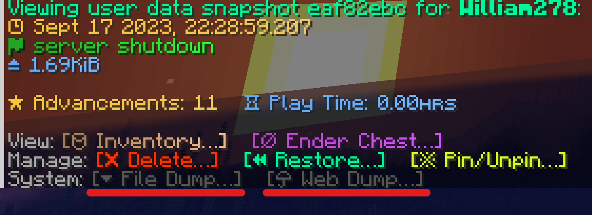

# 缓存玩家数据

自 HuskSync v2.1 起，便可缓存玩家数据快照为 `json` 文件，可保存在文件或在线剪贴板服务（`mc.lo.gs`）。本功能可通过命令 `/userdata dump` 命令使用。

该功能可用于调试同步问题或手动检查数据。

## 教程

1. 确保你拥有 `husksync.command.userdata.dump` 权限节点。该权限不默认拥有，即便是管理员。
2. 使用命令 `/userdata list <玩家名称>` 命令来浏览用户数据条目列表。
3. 点击选定用户的指定用户数据条目。此时会出现数据快照预览界面，下方会出现会两个新的按钮。



## 输出至文件

点击“保存文件...”（等同于输入命令 `/userdata dump <玩家名称> <快照 ID> file`），该用户关于此条目的缓存便会输出在 `~/plugins/HuskSync/dump/`。

生成的 .json 文件一般会按照如下格式：`<用户名称>_<时间戳>_<保存-保存原因>_<短 UUID>.json`

::: details 示例输出文件：William278_2022-10-12_21-46-37_disconnect_f7719f5c.json

``` YAML
{
  "id": "209a56fd-efd0-4354-8f7c-e09f6d0673d8",
  "pinned": false,
  "timestamp": "2023-09-15T17:27:08.6768038+01:00",
  "save_cause": "DISCONNECT",
  "server": "alpha",
  "minecraft_version": "1.20.2",
  "platform_type": "bukkit",
  "format_version": 4,
  "data": {
    "husksync:statistics": "{\"generic\":{\"minecraft:fly_one_cm\":26261,\"minecraft:jump\":23,\"minecraft:leave_game\":3,\"minecraft:play_one_minute\":1904,\"minecraft:sneak_time\":7,\"minecraft:sprint_one_cm\":1849,\"minecraft:time_since_death\":1904,\"minecraft:time_since_rest\":1904,\"minecraft:total_world_time\":1904,\"minecraft:walk_one_cm\":414},\"blocks\":{},\"items\":{},\"entities\":{}}",
    "husksync:experience": "{\"total_experience\":0,\"exp_level\":0,\"exp_progress\":0.0}",
    "husksync:game_mode": "{\"game_mode\":\"CREATIVE\",\"allow_flight\":true,\"is_flying\":true}",
    "husksync:advancements": "[{\"key\":\"minecraft:recipes/decorations/crafting_table\",\"completed_criteria\":{\"unlock_right_away\":1694795225426}},{\"key\":\"minecraft:adventure/adventuring_time\",\"completed_criteria\":{\"minecraft:old_growth_birch_forest\":1694795225478}}]",
    "husksync:inventory": "{held_item_slot:0,items:{size:41}}",
    "husksync:ender_chest": "{size:27}",
    "husksync:potion_effects": "[]",
    "husksync:hunger": "{\"food_level\":20,\"saturation\":5.0,\"exhaustion\":0.449}",
    "husksync:health": "{\"health\":20.0,\"max_health\":20.0,\"health_scale\":20.0}"
  }
}
```
:::

## 保存至网络

[上传至网络...]按钮（等价于命令 `/userdata dump <用户名称> <快照 ID> web`）将会把玩家 json 格式的数据快照保存至 https://mclo.gs 在线剪贴板服务，并将上传的文件链接返回给你。需要注意的是如果你的玩家数据快照大小达到 10 MB，则剪贴板服务可能会失效。