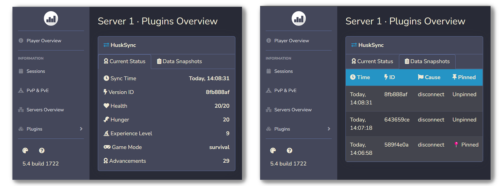

# Plan 插件联动
HuskSync 支持在玩家的[统计界面](https://github.com/plan-player-analytics/Plan)（Plan）显示信息。

## 需求

* HuskSync 2.0 或更高版本
* Plan 5.4.1690 或更高版本

## 安装教程

1. 将 Plan 和 HuskSync 一并安装；
2. 按需求配置 Plan 后重启服务器；
3. 在“插件”一栏将会显示玩家的数据；
4. 点击可浏览玩家的当前数据，以及他们的备份快照。