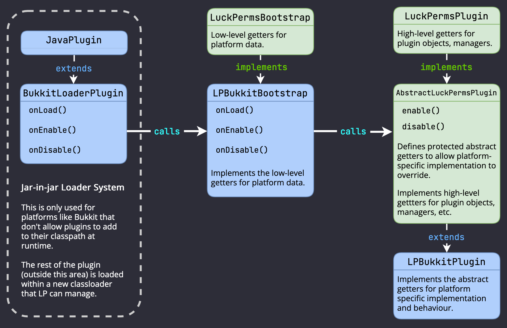

# 贡献

你好！

本章节的目的是引导开发者建立并处理 LuckPerms 的代码。

与下文所述的那样，我们也有一个 Discord 平台用于交流 LuckPerms 的开发与拉取请求。你可随意[加入并选择 #contributors 频道](https://discord.gg/luckperms)。若你遇到问题，我们也很乐意伸出援手。

## 开始

LuckPerms 使用 **Gradle** 来管理依赖与构建。

浏览 [README.md](https://github.com/LuckPerms/LuckPerms/blob/master/README.md) 文件获得如何将代码克隆到本地的更多信息

我们推荐在开发 LuckPerms 时使用 Intellij IDEA Java IDE。它有着对 Gradle 的强大支持与优秀的自动补全功能。安装 Intellij 后只需静待 LuckPerms 代码从 Git 仓库克隆到本地即可（希望是这样的！）。

## 项目结构
项目被分为几个不同的模块。

* **API**（`/api`）- 其他插件使用的公共 API，用于 LuckPerms 的数据交互及返回。该模块（大部分情况来讲）不包含任何实现，由插件本身提供。
* **Common**（`/common`）- 包含由所有 LuckPerms 实现（插件）共享的抽象代码。这个想法是为了降低在所有支持平台之间的重复逻辑。该模块具体取决于 API。
* **Plugin**（如 `/bukkit`）- 对指定服务器平台实现“LuckPerms 插件”简便的通用模块。插件会因平台而略有不同。
* **Plugin Loaders**（如 `/bukkit/loader`）- 在插件载入前启用并表现得像 bootstrap loader 的额外模块。这个模块的目的是为了实现 jar 中 jar（原文如此）与无运行时插件依赖注入本地支持的平台加载。

## 抽象概念

LuckPerms 有着许多抽象概念，用于化解重复代码并将其与逻辑组件分隔。若你还不熟悉代码库，解释起来会非常麻烦，但它对项目保持可维护性至关重要。

下文为解释了该抽象概念的图表。

在这里我以 Bukkit 为例子，其他平台的类大致相似。

### 底层 loader

`class BukkitLoaderPlugin extends JavaPlugin`

bootstrap loader 插件负责在平台载入插件并将一切初始化。它体积非常小，大部分时间你都不需要管它。

但一般来讲它什么都不算，因为这只是插件的入口（为 Bukkit 部分的 `extend JavaPlugin` 类）

不是所有平台都有各自的 loader，它只在插件不允许控制自己的类载入器时才会用到。在本例子中，LuckPerms 使用了一个“jar 中 jar”系统，在主插件中载入了一个子 classloader 和 bootstraps。

例如，请参阅 [`BukkitLoaderPlugin`](https://github.com/LuckPerms/LuckPerms/blob/master/bukkit/loader/src/main/java/me/lucko/luckperms/bukkit/loader/BukkitLoaderPlugin.java) 类。

这个类做的事情就是建立一个特殊的 classloader，然后将 onEnable/onDisable/等方法委托给 bootstrap。我们下一部分会讲到。

### 底层 bootstrap

`class LPBukkitBootstrap implements LuckPermsBootstrap`

[`LuckPermsBootstrap`](https://github.com/LuckPerms/LuckPerms/blob/master/common/src/main/java/me/lucko/luckperms/common/plugin/bootstrap/LuckPermsBootstrap.java) 为用于与服务器平台交互的底层实例。它一般处理诸如记录、定时、对平台提供底层对象（在线玩家等）的信息等内容。

例如，见 [`LPBukkitBootstrap`](https://github.com/LuckPerms/LuckPerms/blob/master/bukkit/src/main/java/me/lucko/luckperms/bukkit/LPBukkitBootstrap.java) 类。

这个类不包含任何逻辑，它只为 LuckPerms 插件提供内容。

### 顶层插件

`class LPBukkitPlugin extends AbstractLuckPermsPlugin implements LuckPermsPlugin`

[`LuckPermsPlugin`](https://github.com/LuckPerms/LuckPerms/blob/master/common/src/main/java/me/lucko/luckperms/common/plugin/LuckPermsPlugin.java) 为 LuckPerms 中的主实例。抽象实现则是由 [`AbstractLuckPermsPlugin`](https://github.com/LuckPerms/LuckPerms/blob/master/common/src/main/java/me/lucko/luckperms/common/plugin/AbstractLuckPermsPlugin.java) 提供的，它在每个平台上进行扩展，用于特定平台的集成。

[`LuckPermsPlugin`](https://github.com/LuckPerms/LuckPerms/blob/master/common/src/main/java/me/lucko/luckperms/common/plugin/LuckPermsPlugin.java) 只是一个实例。它由一堆决定了“LuckPerms 插件”成分的方法组成。这个实例会在项目内的其他类之间传递（作为构建依赖注入）来允许不同的组件能获取各自的数据。如果你想要获取诸如记录器或计划表的底层组件，你也可以从它这里获得 [`LuckPermsBootstrap`](https://github.com/LuckPerms/LuckPerms/blob/master/common/src/main/java/me/lucko/luckperms/common/plugin/bootstrap/LuckPermsBootstrap.java)。

[`AbstractLuckPermsPlugin`](https://github.com/LuckPerms/LuckPerms/blob/master/common/src/main/java/me/lucko/luckperms/common/plugin/AbstractLuckPermsPlugin.java) 为插件主类。它决定了许多在 LuckPerms 内共享的逻辑。例如，在任意 LuckPerms 插件启用时，它们都需要进行相似的步骤，如建立存储并注册监听器与命令。尽可能多的抽象内容对减少重复有一定的意义。

[`AbstractLuckPermsPlugin`](https://github.com/LuckPerms/LuckPerms/blob/master/common/src/main/java/me/lucko/luckperms/common/plugin/AbstractLuckPermsPlugin.java) 提供了启用/禁用插件的顶层逻辑，但也有一些受保护的抽象方法允许插件提供并使用自己的逻辑或类。

抽象插件类会在不同平台上被覆盖，例如 [`LPBukkitPlugin`](https://github.com/LuckPerms/LuckPerms/blob/master/bukkit/src/main/java/me/lucko/luckperms/bukkit/LPBukkitPlugin.java) 类的示例。子类定义了自定义行为，并提供了插件在指定平台上使用的自定义对象（如 `BukkitContextManager` 为 `LPBukkitPlugin` 提供的 `ContextManager` 在平台上的实现）。

## 代码库剩余部分

上文提及，[`LuckPermsPlugin`](https://github.com/LuckPerms/LuckPerms/blob/master/common/src/main/java/me/lucko/luckperms/common/plugin/LuckPermsPlugin.java) 为插件的“根”，延伸至其他包与类中。

例如：

* `UserManager` 处理 LuckPerms 玩家在内存中的存储
* `GroupManager` 处理 LuckPerms 权限组在内存中的存储
* `TrackManager` 处理 LuckPerms 路线在内存中的存储
* `LuckPermsConfiguration` 处理配置文件
* `Storage` 为所有与插件的存储容器进行操作的根实例
* `CommandManager` 处理所有 LuckPerms 的命令及其调用
* `DependencyManager` 处理运行时的依赖载入等相关决定
* `ContextManager` 处理玩家的上下文查找与缓存
* .. 还有很多，但愿名称/JavaDocs 能够解释这些的模块的功能。

## 代码风格

编写代码非常有必要保持一致与执行*合理*，因为它对插件源码的可读性与可维护性至关重要。

有人可能会说，偶尔出现问题没什么大不了，挑三拣四只是项目维护者有强迫症罢了 —— 有时候还真是这样 —— 但话说回来，如果放任不管，这些问题只会随着时间的推移而增加，从长远来看，这样的高标准有益于项目的维护。

总的来说：

1. **尽可能模仿现存代码的风格**。这*通常*是有效的，除了编写项目本身的要求以外，遵照别人的“风格”进行代码编写也更简单。
2. **最小化空白的改变**，在提交审查合并请求前先**检查你的差异对比**。大部分编辑器既有显示修改/增加/移除内容显示的功能，也提供了回滚某些修改内容的按钮。

我们很乐意帮你整洁提交内容，但如果你自己来的话，会快上很多！