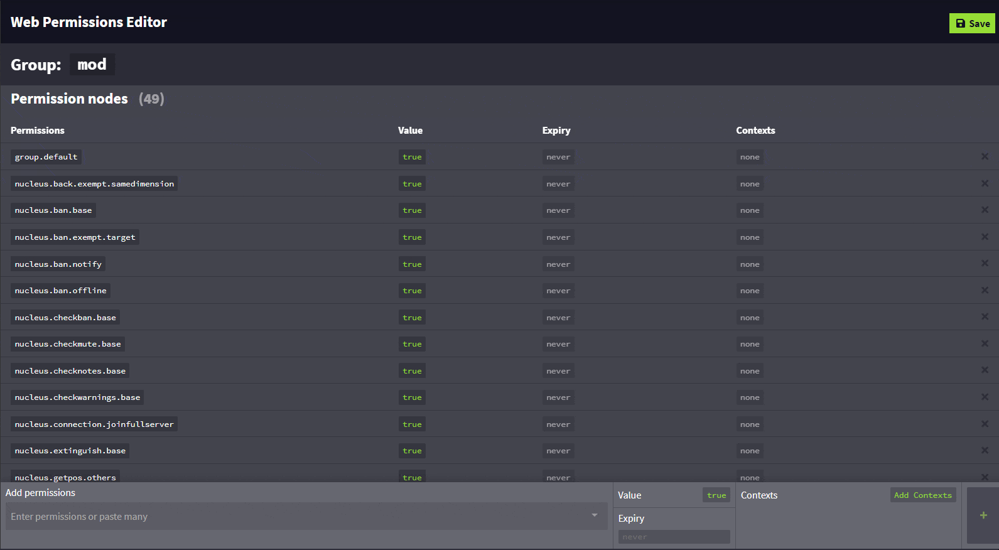

# 上下文
上下文[^1]是 LuckPerms 运作的一个基本方式。它们可能是整个插件里最重要的概念，在正确使用时会相当有用。

* * *

**上下文**，基本来说就是**某条权限生效的要求**。    
一个简单的“上下文”包含了一个 `key`（键）和 `value`（值），以 `key=value` 的形式连缀。（希望）这会用一个例子表述得更加清楚。

## 示例

如上所述，上下文是某条权限生效的要求。在这个例子中，假设我要分配一个权限，但我**只想要这个权限在“world_nether”世界中生效**。若要实现这个功能，我会在分配权限的时候指定上下文，以此限制权限生效的条件。

在这个示例中，**键**的关键词是 `"world"`，**值**则是 `"world_nether"`。在 LuckPerms 中表示为 `world=world_nether`。

若要实现这个限制，我会输入这样一条命令：`/lp user Luck permission set test.permission world=world_nether` —— 在指令末尾为权限指定上下文。

## 设置上下文

这里有两种方式对权限设置上下文：命令，或网页编辑器。

* 使用命令时，你只需像上述示例的命令那样加入上下文，在命令的末尾，你可以加入 `<键>=<值>`，如 `world=nether`、`server=lobby`，或其他允许使用的键与值。最终的命令会看起来像这样：    
`lp user Luck permission set minecraft.command.gamemode true server=lobby world=nether`。
* 在使用网络编辑器时，你可以点击 `Add Context`（添加上下文/增设情境），并填入键与值。与命令相同，`key`（键）为上下文的类型，而 `value` 则为它的值。示例如下：



上下文可以被组合使用，称作“上下文组” —— 即一组上下文的键值对。

上下文组可以通过如下两种方式设置：

* LuckPerms 一般会自动计算被判定为**玩家**的“当前上下文组” —— 换句话说，则是玩家当前满足的上下文。若玩家正处于 `world_nether` 世界中，则他们当前的上下文组会包含 `world=world_nether`。
* **每个权限、继承组/权限组、前后缀/元数据设置**也都带有自己的上下文 —— 表示玩家需要满足对应的上下文之后才可让这些权限/继承组/元数据生效。

最重要的是，玩家只需满足上下文中**同类型的任意一个**要求的值就可让权限/继承组/元数据生效。若你设置了三个世界上下文（world、world_nether 和 world_the_end）以及一个服务器上下文（survival），那么玩家可以在该服务器的这三个世界中获得这个权限。若你设置了三个服务器上下文，那么处于任意一个服务器的玩家都可获得该权限。这会在你想要让权限在一部分地方生效，另一部分地方不生效时非常有效，这意味着你无需重复设置节点并单独设置上下文。

## 由 LuckPerms 提供的上下文

上下文系统设计之初便以自由拓展为目的 —— 这个系统不应（也不该！）只提供几种固定类型的上下文。

如标题所说，LuckPerms 默认提供了五种上下文。其他插件可以通过 API 内的 `ContextCalculator` 提供自行注册的上下文。

|上下文键名|描述|示例|
|---|---|---|
|`server`|玩家所处服务器。值默认由 LuckPerms 配置文件顶部的服务器设置提供。|`server=survival`|
|`world`|玩家当前世界 —— 这个值是从服务器传回的。在 LuckPerms 运行在 BungeeCord/Velocity 群组服时，世界上下文的值只会匹配玩家当前所在服务器的世界名称。|`world=world_nether`|
|`gamemode`|玩家当前游戏模式。|`gamemode=creative`|
|`dimension-type`|玩家所处维度类型。|`dimension-type=the_nether`|
|`proxy`|这条上下文仅在安装了 RedisBungee 的 BungeeCord 群组上时有效。表示当前连接至的 BungeeCord 群组。|`proxy=redisbungee1`|

## 自定义上下文

除了 LuckPerms 提供的上下文以外，你还可以自行设置额外的上下文。

上下文可以**静态**或**动态**提供。

* **静态上下文**会给予所有玩家 —— 所有玩家获取的值都相同的上下文。（例如，“server”上下文 —— 所有玩家获取的键值对都是同一个）    
静态上下文可以通过特殊配置文件或 API 定义。
* **动态上下文**会基于某个条件选择性地给予，并需要插件通过 API 进行注册。

## 定义静态上下文

静态上下文可以在 `/LuckPerms/` 文件夹的 `contexts.json` 玩家中修改（与主配置文件同级）。

文件包含两个属性，但我们只需要着眼于 `static-contexts` 部分。

例如，如果我们想要添加自己的上下文 `"server-type"`，来表示服务器名称（已经由 LuckPerms 提供）之外的服务器类型，只需这样设置：

```JSON
{
  "static-contexts": {
    "server-type": "skyblock"
  },
}
```

在添加后，我们就可以在权限/继承组/元数据中使用这条上下文来指定服务器类型。例如 `/lp user Luck parent add donor server-type=skyblock`。

你可以在这个文件中加入数量不限的上下文。

## 默认上下文

默认上下文允许你指定某些上下文的缺省值 —— 例如 `/lp user Luck permission set example.permission` 命令中某些上下文的默认值。你可以在 `contexts.json` 文件中自行设置，这个文件所在目录与主配置文件同级。

例如，若要在文件中加入默认上下文，找到 static-contexts 部分：

```JSON
{
 "default-contexts": {
    "world": "world_nether",
    "server": "survival"
  }
}
```

这表示，在添加了默认上下文的服务器上，任何可以带有上下文执行的 `/lp` 命令都会带上 `world=world_nether`、`server=survival` 的默认值，除非你在命令中明确指定了它们。

## 额外上下文（ExtraContexts）

ExtraContexts 插件加入了原本 LuckPerms 中不存在的额外上下文，例如 WorldGuard 上下文，PlaceholderAPI 上下文，以及更多！

[见此](https://github.com/LuckPerms/ExtraContexts)浏览详细信息。

[^1]: “上下文”译文取自 PCD 对该维基的旧版翻译，在 LuckPerms 的本地化语言文件中则译作“情境”，为保持维基迭代一致性，此取前者，下文同。