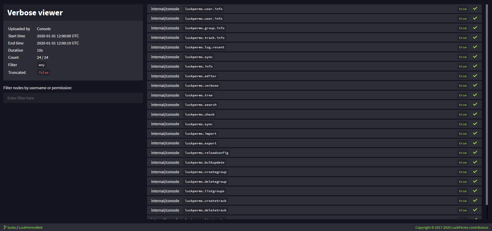
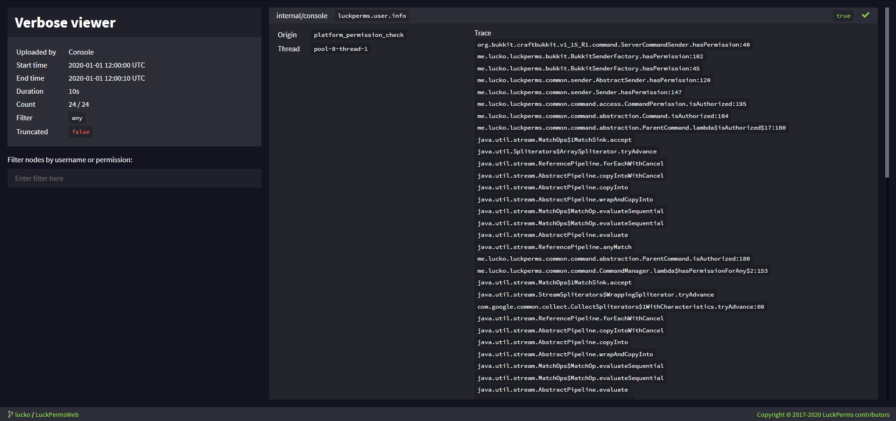

# 权限检查系统

是否遇到过想要给予一个插件的命令对应权限，却找不到而焦头烂额的情况？

也许文档已经过时了，或者没有你想要的信息。可能你想要调试与玩家权限相关的问题，或者只是对插件所检查的权限感兴趣。

权限检查系统就能允许你实时监控权限检查！

## 使用方法

命令用法如下文所述：

### `/lp verbose <on/record|off/upload> [筛选]`

第一个参数负责启用/禁用系统，而第二个则帮你设置过滤。

|选项|描述|
|---|---|
|`on`|启用系统，并会在筛选内容符合所给参数时显示在聊天栏中。|
|`record`|与“on”模式相似，但你不会在聊天栏中见到消息。|
|`off`|禁用系统，并从内存中清理任意匹配的内容。|
|`upload`|与“off”相同，但会上传结果至网页浏览器以便进一步分析，完成上传后会显示一条链接供你访问。|

### `/lp verbose command <名称> <命令>` 的功能：

`/lp verbose command` 命令允许你在游戏内静默检查指定命令的权限。若要使用，只需输入命令 `/lp verbose command <名称> <命令>`，之后 LuckPerms 便会按如下步骤快速检查一次。

1. 它会为玩家启用权限判断系统，并使用参数所给的过滤条件进行筛选。
2. 它会让玩家强制执行参数中给定的命令。
3. 它会自动关闭。

完成这些事情后，聊天栏中会显示被检查到的权限，且不会造成刷屏。若你需要找到某条没有文档详细记录的命令权限时，这个功能将会很有用。

命令将会强制玩家以他们自己的身份高效地执行参数给定的命令。作为结果，使用这个功能需要额外的权限。你可以在[权限列表](command-usage.permission.md)章节找到它们。当拥有 `luckperm.*` 通配符权限时，该权限不会包含该功能的正常权限。

#### 启用功能时客户端卡顿？

若你的客户端在输入命令 `/lp verbose on` 时卡顿，很有可能是同时检查的权限数量太多，而客户端难以处理大量的聊天栏消息导致的。一般推荐你执行 `/lp verbose record`。`record` 命令将会将权限检查发送至网页编辑器的检查浏览器，而不是以聊天栏消息的方式发送至客户端。若要结束记录并打开网页浏览器，只需输入命令 `/lp verbose upload`。

相似地，或者说，在使用在线浏览器时，你也可以设置筛选，下文会详细解释。

### 筛选

筛选是一串用于匹配结果内容的表达式，它可以隐藏你不需要的条目。它可以只是一个玩家名称，或更高级的内容。

一条筛选表达式将会匹配任意以它开头的权限节点，或完整的玩家名称。你可以使用 `&`（和）、`|`（英文竖杠，或）和 `!`（非/取反）来编写表达式。表达式中也可以放入 `( )` 括号。

#### 示例

* `Luck & (essentials | worldedit)` - 匹配玩家“Luck”以“essentials”或“worldedit”开头的任何内容
* `Luck & !anticheat` - 匹配玩家“Luck”不以“anticheat”开头的任何内容
* `anticheat & !anticheat.check` 匹配所有玩家以“anticheat”但不以“anticheat.check”开头的任何内容

## 网页浏览器

网页浏览器显示的内容与游戏内基本相同，但在处理大量检查时分析起来更简单。

你可以直接在条目上点击来查询检查的更多信息：

