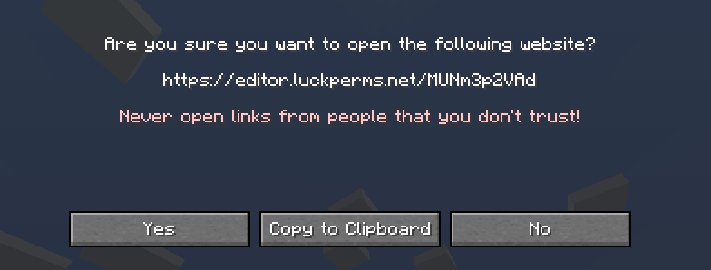
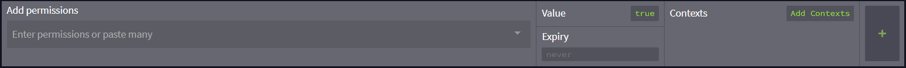
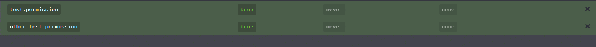
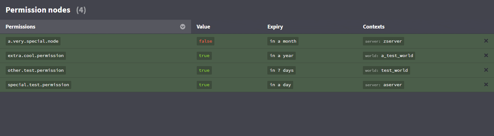
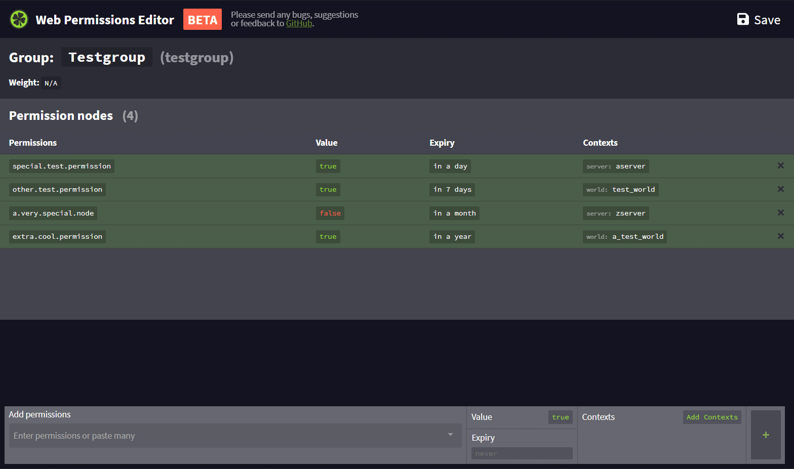
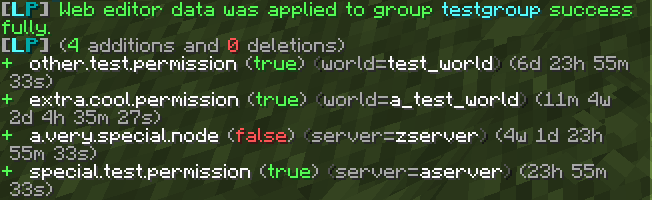

# 网页编辑器

LuckPerms 的一大特色就是网页编辑器，允许你通过简单易懂的浏览器界面对服务器内的权限数据进行编辑。它安全，高效且便于使用。你甚至不需要自己托管页面——并且不受数据库类型的影响！

若你想要了解这其中的技术性细节，请浏览[技术性细节]章节。

## 开始使用

编辑会话会在服务器中执行命令后创建。你可以使用不同的命令来打开不同的编辑会话：

|编辑内容|对应命令|
|---|---|
|**所有权限组与在线/非默认玩家**|`/lp editor` 或 `/lp editor all`|
|**所有权限组**|`/lp edit groups`|
|**所有在线和非默认玩家**|`/lp editor users`|
|**所有在线玩家**|`/lp editor online`|
|**指定权限组**|`/lp group <权限组> editor`|
|**指定玩家**|`/lp user <玩家> editor`|
|**带有特定权限的玩家**|`/lp editor users <筛选>` 或 `/lp editor <筛选>`|
|****|`/lp editor`|

::: info 提示
如果你要在诸如 BungeeCord 或 Velocity 等群组上使用 LP，请记得将命令改成 `/lpb` 或 `/lpv` 而非 `/lp`。
:::

::: info 提示
玩家权限过滤命令只会将那些直接拥有对应权限的玩家载入编辑器。
:::

在命令执行以后，服务器会创建一个新的会话。这个过程应当只持续几秒（视连接速度而定）。

在绘画就绪后，你会收到一条链接。

若要继续，点击连接，并点击“是”。

这时，你设置的默认浏览器就会打开你刚刚创建的编辑会话界面。

### 使用编辑器

在创建并打开会话后，你可以通过操作面板来对玩家/权限组的数据进行修改。

### 编辑上下文

除了在游戏内添加上下文以外，本章节所提及的网页编辑器也可以添加上下文。若要照做，请在添加权限前点击“添加上下文/增加情境”，或在对应权限节点后的 `key` 与 `value` 部分填入合适的键值对，如 `world` 与 `nether`，`server` 与 `hub`。

### 添加权限

若要添加权限，在“添加权限”输入框中输入你想要的权限并按下回车。所有你想要添加的权限都可以如此照做。

在输入时，编辑器会显示一些你可能要输入的预选项。你可以通过鼠标点击或箭头键来选择这些预选项，并可使用回车或直接点击将其加入输入框。输入所有的权限之后，点击右侧的“+”即可将其加入。

你可以一次添加多个权限！只需将它们复制进输入框里，剩下的操作与添加单个权限无异。

### 编辑现存数据

若要编辑表格中的任意值，只需点击对应内容即可。

### 数据排序

若要修改排序设置，在列标题上点击即可按对应条目进行排序。

### LuckPerms 节点

编辑器允许你修改权限组和玩家的设置，例如权重与通过节点控制的继承关系。

|功能|权限节点|
|---|---|
|**定义玩家或权限组的父权限组***|`group.<父权限组>`|
|**设置权限组的显示名称**|`displayname.<显示名称>`|
|**设置权限组的权重**|`weight.<权重数值>`|
|**设置前缀**|`prefix.<优先级>.<内容>`|
|**设置后缀**|`suffix.<优先级>.<内容>`|
|**增加元数据**|`meta.<键>.<值>`|

### 保存你的修改

在完成编辑之后，你需要将改动保存至服务器，

点击右上角的“保存”按钮，或使用快捷键 `CTRL+S`，编辑器会生成一条命令，这条命令需要你复制到服务器内或控制台执行来应用更改。直接点击命令可将其复制到剪贴板。

在输入命令后，聊天栏会显示本次改动内容的概括。

