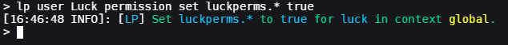
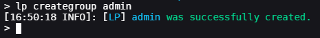
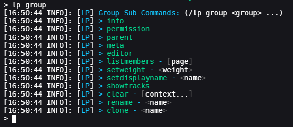
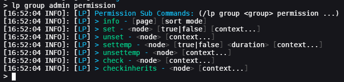
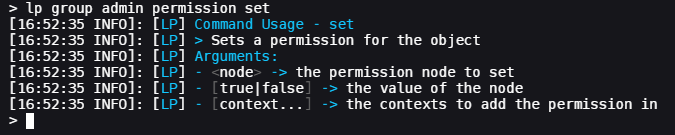
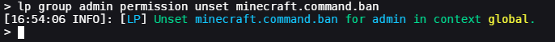
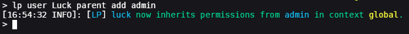
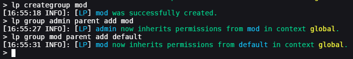
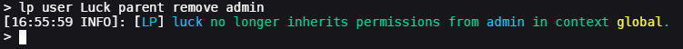

# 用法

本章节教程是为那些从未了解过权限插件的人准备的。若你已熟悉了相关概念，且只需要读读命令列表就能做到自己想要的功能，我们推荐你直接阅读[命令与权限](command-usage.md)章节，它会为你提供更“一步到位”的插件机制详解。

若你在理解这些东西方面有问题，那么本章节的教程就非常适合你看。😃

## 核心定义

### 权限（Permissions）

在你的服务器上，会有各种各样的**特色、命令与功能**。有些特色是服务器自带的，而其他的则是由“插件”添加的。大部分操作都会有**与之相关的权限**，所以你可以借此控制其他玩家是否能使用特定的功能或命令。

一条**权限是一个字符串**（一串字符与数字），并由“.”分隔成段。例如，“minecraft.command.ban”就是 Minecraft 的 /ban 命令所需权限。

代表着一段权限的字符串有时候也会叫做“权限节点”，或者叫它的简称，即“权限”。

权限节点可以有**三个值**：`true`、`false` 和 `undefined`。
* `true` 表示玩家*拥有这个权限*，且对应该权限的条件也会被给予玩家。
* `false` 表示玩家*没有这个权限*，对应该权限的条件*不会*被给予玩家。
* `undefined` 表示这条权限没有在 LuckPerms 明确设置。这**通常**表示它的状态会跟随插件的默认设置，如 `false`。非常稀有的情况下，插件可以将 `undefined` 的权限默认状态设置为 `true`，这就需要你**手动将其设置为 `false`**。

### 权限组（Groups）

区别于将权限直接分配至玩家，我们有**权限组**，可以将其中包含的权限**分配给单独的玩家**

比如，在我的“管理员”权限组中，我可以向其添加使用 /ban 和 /unban 命令对应的权限，并将指定的玩家分配到这个组中。这表示他们会获得“管理员”组中预先设置的所有权限，就像他们被直接分配了这些权限一样。

### 继承（Inheritance）

玩家与权限组可以**相互继承权限**。例如，默认情况下，所有用户都继承了“默认（default）”权限组包含的权限。当然你也可以为自己的服务器设置自己的权限组及其继承关系，并以此构建独特的权限系统。

例如，我有三个权限组，“默认”，“管理”与“超级管理”，其中“管理”继承“默认”组的权限，而“超级管理”又继承“管理”组的权限。

### 上下文（Context）

使用 LuckPerms 过程中经常会碰到的专有名词，它就是“上下文（Context）”。
**上下文**简单来讲就是**特定内容会生效的环境（条件）**。
上下文是本插件极其重要的一部分，甚至有[专门的章节](features.context.md)来详细阐述它们的用途。

## 开始使用

若你还没有安装 LuckPerms，那么请先转到“[安装教程](install-on-a-single-server.md)”章节。

之后，请确认你在进入下一步操作之前仔细阅读了[选择存储类型](how-to.switch-storage-types.md)章节。虽然之后可以快速修改这些选项，但还是你推荐第一次就把它们搞定。

### 获取编辑权限的完全权限

你要做的第一件事就是让你自己获得插件的完全控制权。在 LuckPerms 第一次安装后，没有人可以使用 LP 的任何命令。

若要这么做，登入你的服务器，然后打开服务器控制台。

之后，输入命令 `lp user <你的名称> permission luckperms.* true`（别担心，这条命令的意思会在之后讲到）

返回的结果应该会像这样：

这条命令的意思就是，给予你自己 `luckperms.*` 权限（或理解为将该权限的状态在你身上设置为 true）。你会注意到这条权限的末尾有一个 `*` 子服。这表示通配符，表示它会将以“luckperms”开头的**所有**权限都给予玩家。

现在你已经完成这件事了，你可以继续在游戏中完成剩下的安装步骤，或继续在控制台中输入命令。

### 创建第一个权限组

你可以使用“creategroup”命令创建一个组。让我们先创建一个叫“admin”的组，然后再为它分配一个权限吧。

首先，输入命令 `lp creategroup admin`。这会创建一个新的空权限组“admin”。

接下来，我们需要将一个指定的权限加入“admin”组。修改一个组的命令是 `lp group <权限组名称>`。如果你直接输入这条命令，它会显示一串可用的子命令。

既然我们想添加一个权限，那么我们所需要的子命令就是“permission”。这可以允许你修改这个权限组所持有的权限。再次输入命令 `lp group admin permission` 可以列出这条命令下的子命令。

之后，我们找到了我们可以使用的更多调命令。首条就是另一个“info”命令。因为它是“permission”的一个子命令，信息查询命令会返回权限组所拥有的权限。接下来的子命令就是“set”。

记住，我们之前用过这条命令来给予玩家“luckperms.*”权限。在这里它也有效。

只需输入命令而不带其它参数便可显示命令教程。例如：

例如，我想给予我的“admin”组“minecraft.command.ban”权限，我可以直接输入命令 `lp group admin permission set minecraft.command.ban true`。

该命令会让 `admin` 组拥有 `minecraft.command.ban` 权限。末尾的 true 则是我们此次指定分配权限所设置的状态。你可以将分配权限的状态设置为 `true` 或者 `false`。将一个权限设置为 true 表示对应组或用户拥有该权限，而将其设置为 false 则意思相反（也就是将该权限从他们身上夺去）。

如果之后我不想要让“admin”组拥有这个权限了，我就可以通过取消设置来去除这个权限，输入命令 `lp group admin permission unset minecraft.command.ban` 即可。

### 将用户添加至权限组

将用户添加至权限组可通过“parent”命令完成。（我们只需将上一部分所属的“permission”换成“parent”即可）。

例如，若要将我自己加入“admin”组，我可以执行命令 `lp user luck parent add admin`

这条命令会将玩家 `luck` 加至 `admin` 组中。这意味着任何“admin”组拥有的权限，我“luck”也会继承其拥有状态。

### 用户组继承其他组

和玩家相同，权限组也可以继承其他权限组。

例如，假设我预设了下面这些权限（部分权限是生造的）

|超级管理员|管理员|默认组|
|---|---|---|
|minecraft.command.ban|minecraft.command.mute|minecraft.command.say|
|minecraft.command.pardon|minecraft.command.unmute|minecraft.command.me|
|some.cool.admin.perm|some.cool.mod.perm||
|someplugin.vanish|chatcolor.bold||

我想要超级管理员组中的成员也拥有管理员和默认组的权限，我也想要管理员组中的成员也拥有默认组的权限。

若要实现，我可以让组之间相互继承。

命令 `lp group admin parent add mod` 将会让“超级管理员”组继承所有“管理员”组的权限。之后我也可以对“管理员”组做出相同的改变，即命令 `lp group mod parent add default`。

继承是连续的，所以即便“超级管理员”只声明继承了“管理员”组的权限，但因“管理员”组继承了“默认”组的权限，这意味着“超级管理员”组也会因此拥有“默认”组的权限，也就是**同时拥有**“管理员”组和“默认”组的权限。

在“管理员”组的玩家有 `minecraft.command.ban`、`minecraft.command.mute` *和* `minecraft.command.say` 权限。

### 解除权限组继承

解除权限组继承使用的命令与声明继承权限组的命令非常相似。

若要将我自己移出“admin”组，我只需输入命令 `lp user Luck parent remove admin`。

