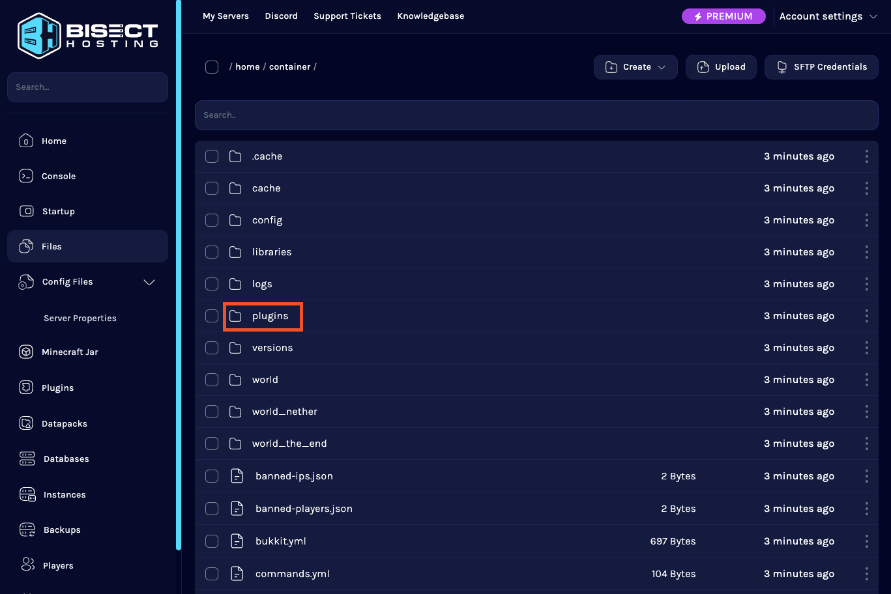
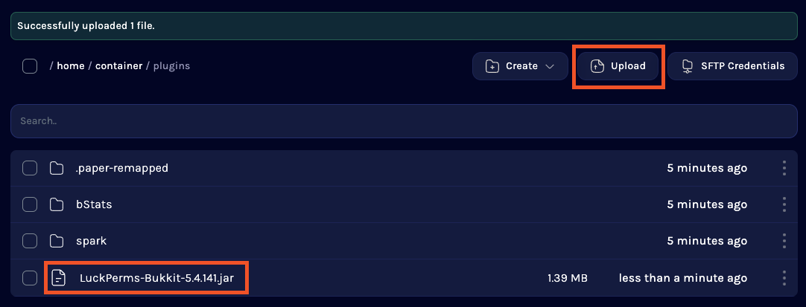
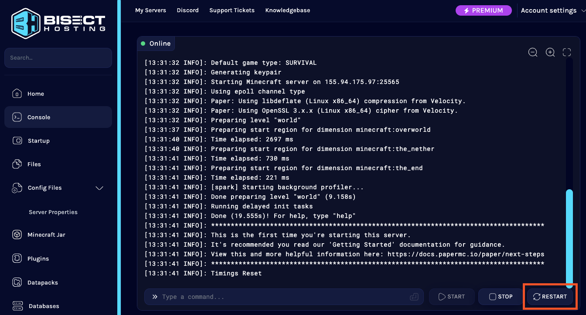
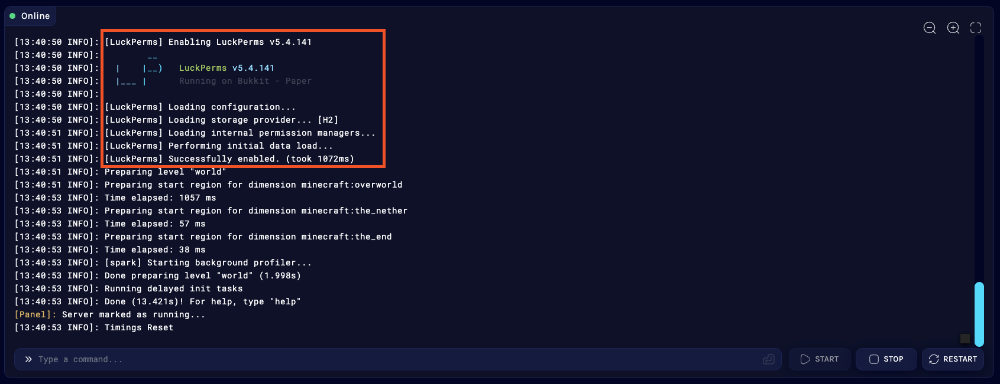
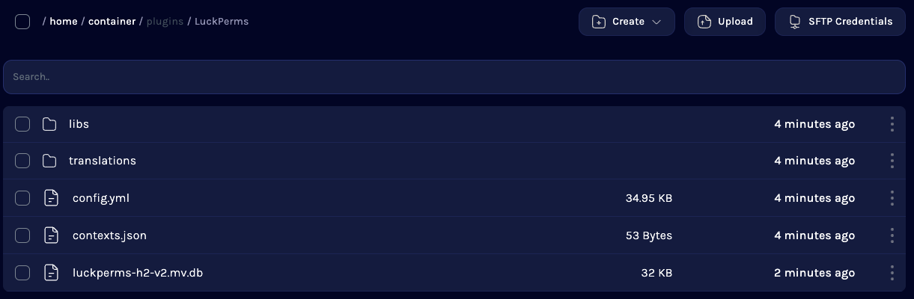
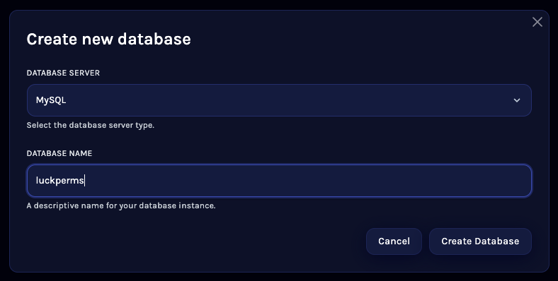
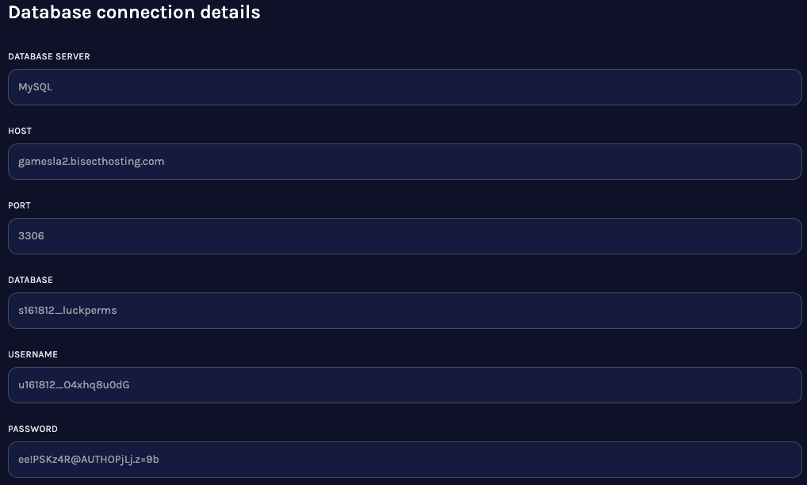
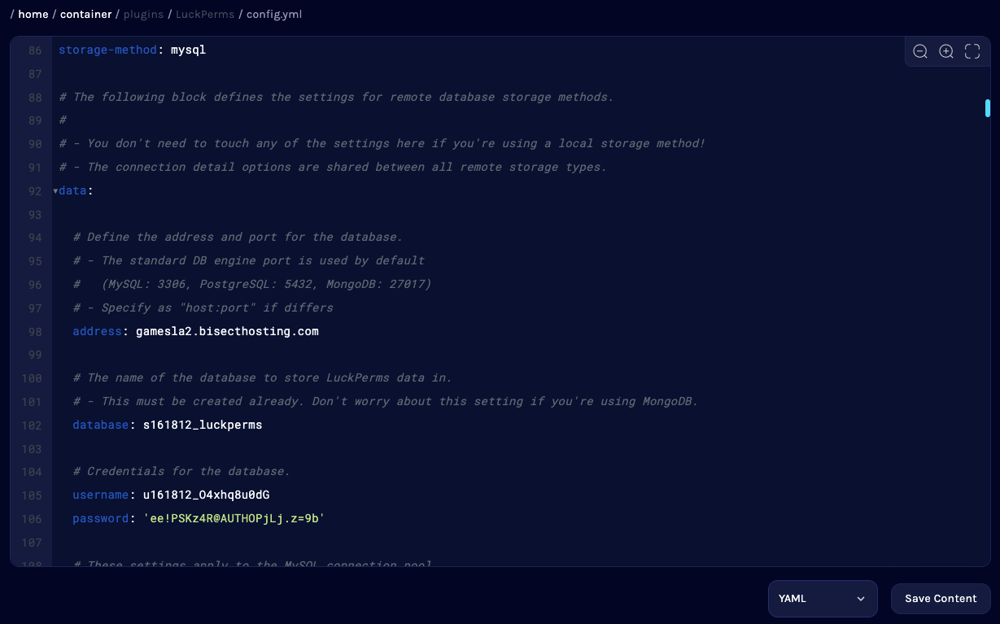

# 安装

## 首次安装

### 第一步：下载 LuckPerms 的 jar 文件

你需要做的第一件事就是下载 LuckPerms。你可以在我们的[下载页](https://luckperms.net/download)找到为各种平台准备的最新版 LuckPerms。

只需点击下载按钮，将文件保存在适当的位置即可。

* 若你正在运行的是 Minecraft JE 版的*非模组*服，我们推荐你使用 [Paper](https://papermc.io/) 核心。
* 若你正在运行的是 Minecraft JE 版的*模组*服，我们推荐你使用 [Fabric](https://fabricmc.net/) 或 [NeoForge](https://neoforged.net/) 核心。
* 若你正在运行的是 Minecraft BE 版的服务器，我们推荐你使用 [Nukkit](https://cloudburstmc.org/) 核心。
* 若你正在运行的是群组服，我们推荐你使用 [Velocity](https://velocitypowered.com/) 或 [Waterfall](https://papermc.io/downloads#Waterfall)（BungeeCord）或 Velocity 核心。

如果你还没有地方托管你的服务器，来看看我们的合作伙伴 [BisectHosting](https://bisecthosting.com/luck) 吧，这家提供商会为 LuckPerms 的用户在托管 Minecraft 服务器的套餐中提供 25% 的折扣。

## 第二步：将 LuckPerms 的 jar 文件放入服务器的 `plugins` 或 `mods` 文件夹下

接下来，我们需要将 LuckPerms 安装至服务器。在此之前请先确认你安装了对应的服务器核心，且已至少成功启动过一次（这是为了确保对应的文件夹能正确出现）。

找到控制面板的“文件管理器”，并打开 `plugins` 文件夹（Bukkit 和 Nukkit 系服务端等）或 `mods` 文件夹（Sponge 或 Fabric 服务端等）

需要注意的是，虽然在第一步中提到 Sponge 可以使用“插件”，但它们与 bukkit 插件不相同。Sponge 版与 Bukkit 版 LuckPerms 的 jar 文件不同，因为这两个插件加载平台互不兼容。请确保你安装了正确的版本！

  
在你进入 plugins 或 mods 文件夹后，点击“上传”按钮，等待界面出现后选择你在第一步下载的 LuckPerms jar 文件。最后点击“上传”。

  
若你先前已经安装了旧版本的 LuckPerms，请先删除旧版本的 jar 文件。

## 第三步：完全重启你的服务器

返回你的服务器控制台并通过点击“重启”按钮或输入 `stop` 等方式重新启动服务器。

 

在服务器开始备份的时候，LuckPerms 会启用并创建默认的配置文件。你可以通过检查控制台来确保 LuckPerms 正常启用。

现在，LuckPerms 已被安装并在你的服务器上启用了！你可以接着阅读本维基的“用法”部分来获悉下一步该做的事！

## 第四步：配置 LuckPerms

若要个性化 LuckPerms 的配置，你需要对其的配置文件进行修改。

返回“文件管理器”，打开 `plugins` 文件夹（对于 Bukkit 和 Nukkit 等服务端而言）或 `config` 文件夹（对于 Sponge、Fabric 或 Forge 服务端而言）。之后，打开其中的 `LuckPerms` 文件夹。

    
在这里你会找到一些文件。其中比较重要的是：
* `config.yml` - 此为 Bukkit、Spigot、Nukkit 服务端的配置文件
* `luckperms.conf` - 此为 Fabric 和 Sponge 服务端的配置文件
* `luckprems-h2-v2.mv.db` - 此为 LuckPerms 用于存储权限数据的数据库文件（勿删！）
你可点击 `config.yml` 或 `luckperms.conf` 对其进行浏览或编辑。

## 第五步（可选）：配置 LuckPerms 的 MySQL 数据库或存储数据的 .yml 文件

默认情况下，LuckPerms 会将数据存储在名为“H2”的文件数据库。这可以在保持效率的同时还能让用户无需额外配置即可开始使用本插件。

如果你想要 LuckPerms 的数据存储在**可读、可编辑的 .yml 文件中**的话，打开 `config.yml` 或 `luckperms.conf`，下拉并找到“存储设置（Storage Settings）”部分并将 `storage-method` 项设置为 `yaml`，之后保存并重启服务器。

若你在一台服务器中运行多个服务端（或是计划在未来这么做），你就需要设置一个诸如 **MySQL** 的远程数据库来存储数据。

大多数服务器托管商都会免费提供这些！[^1]找到“数据库”菜单，再点击“创建数据库”。若弹出输入窗口，只需选择“MySQL”为数据库类型并输入名称即可。

创建数据库后，弹出的窗口会显示数据库域名、名称、用户名及密码。

获取这些内容后，记住这些内容（或复制你的表格）并返回文件管理器 LuckPerms 的 `config.yml`/`luckperms.conf` 下并将其打开。

下拉至“存储设定（Storage Settings）” 并将 `storage-method` 设置为 `mysql`，然后再在 `data:` 下将刚才设置的内容填入此处。

    
点击保存之后，重启你的服务器。

你可以观察控制台日志来确认 MySQL 数据库是否正确安装。若你在（载入数据提供者... [MYSQL]）`Loading storage provider... [MYSQL]` 之后没有看见报错信息，说明你已经正确搭建了 MySQL 数据库！

    
记住，群组服下的每一个子服都需要如此配置连接至同一个数据库（但无需重复安装 MySQL）。

## 常见问题

### 我应该把 LuckPerms 装在哪？

* 若你正在运行的是群组服，你需要把 LuckPerms 安装至每个子服。
* 若你也想要在 Velocity/BungeeCord 群组上使用 LuckPerms，你应该将 LuckPerms-Velocity.jar 或 LuckPerms-Bungee.jar 放入你的 Velocity/BungeeCord 的插件文件夹。
* 若你选择只在群组服核心上安装 LuckPerms，不会对后端的其他子服造成任何影响。若你想要使用这些功能，你应当也在这些子服上安装 LuckPerms。

### 我可以只把 LuckPerms 装在 BungeeCord 上吗？

* 在 Velocity/Bungeecord 上使用的权限系统完全独立于后端子服。
* 你**可以**只将插件装在群组服上，但这会导致由 Bukkit/Sponge 插件或 Fabric/Forge 模组处理的权限检查不会被 LuckPerms 处理。

## 要求

LuckPerms 对安装环境有一些要求。不过*大多数*服务器都可以达到这些条件。

* Java 8 或更高版本
* 首次载入 LuckPerms 时需要联网

### Java 8

你的服务器使用的 Java 版本必须不小于 8。LuckPerms 不能在更旧版本的 Java 环境中运行。

### 网络连接

LuckPerms 使用了一系列[外部库](project-info.external-connections.md)，其中部分内容会在[运行时自动下载](project-info.external-connections.md#下载外部库)。

若你的服务器网络不佳或尚未联网，你可以（在有网的地方先）本地安装 LP，然后将 `/LuckPerms/libs/` 下的文件复制到服务器中。

## 兼容性

一些已知问题会在下面列出。大部分情况都超出了我们的控制——所以我们不能光靠 LuckPerms 本身解决这些问题。

一些问题已在最新版的插件中解决——但旧版本仍存在这些问题。

### 其他权限插件

若要 LuckPerms 完全运行且处理所有的权限检查，你的服务器中应该只留下它一个权限插件（除非你需要用插件进行数据迁移）！

我们经常注意到用户们在安装 LuckPerms 之后忘记删除下列权限管理类的插件：

* PowerRanks
* PermissionsEX
* UltraPermissions

### CraftBukkit 和在线模式

若你的服务器正在运行 CraftBukkit 且为离线模式，LuckPerms（以及其他一部分插件）不会正常工作。这是一个[与  AsyncPlayerPreLoginEvent 有关的 CraftBuikkit 漏洞](https://hub.spigotmc.org/jira/browse/SPIGOT-3541)。

截至原文写就日期（18 年 1 月 11 日），我们尚不能对此给出有效解决方案。

你可以这么做：
1. 使用 Spigot 或 [Paper](https://papermc.io/) 而不是原版的 CraftBukkit
2. 启用在线模式

### 低版本 Minecraft

目前 LuckPerms 的发布版与低于 1.8.8 的版本不兼容。

支持 1.7.10 且面向 Bukkit 的 LuckPerms 可以在我们的[下载页](https://luckperms.net/download/)找到。

### Cauldron、Thermos 等

若你在使用 Cauldron 或 Thermos 等 Bukkit 分支，你可能会在试图载入 LuckPerms 遇到问题。这**不是** LuckPerms 的问题 - 更像是服务器本身的一个漏洞。

这些问题已经被提交至对应的分支项目，但是这些分支均已年久失修，所以这些问题（很可能）永远不会被修复。与此同时，你可以使用下列方法深入探究其中的原因。

（我们绝对**不会**对此类修复**提供任何支持**。）

1. 找到 `libraries/net/md-5/SpecialSource/1.7-SNAPSHOT` 文件夹；
2. 删除 ` SpecialSource-1.7-SNAPSHOT.jar` 文件；
3. 从 `https://repo1.maven.org/maven2/net/md-5/SpecialSource/1.7.4/SpecialSource-1.7.4.jar` 下载 ；SpecialSources v1.7.4
4. 将 jar 文件复制到 `libraries/net/md-5/SpecialSource/1.7-SNAPSHOT` 文件夹；
5. 将文件重命名为 `SpecialSource-1.7-SNAPSHOT.jar`；
6. 重启服务器。若服务器立即关闭，则请检查你的重命名文件是否正确。

### Essentials

若你正在服务器上使用 Bukkit 插件“Essentials”，你可能需要做一些额外的事情才能使其与 LuckPerms 友好相处。

#### 若你想要让 Essentials 从 LuckPerms读取前后缀、权限组数据...

你需要将插件更新为 **EssentialsX** - 原本 Essentials 的继承升级版。原插件的维护者在 2014 年就停止维护且推荐用户使用 EssentialsX 作为替代。

EssentialsX 可以在[这里](https://essentialsx.net/)找到。

若你想要与 Essentials 共用 LuckPerms 的前/后缀，你还需要安装 [Vault](https://www.spigotmc.org/resources/vault.34315/)。

#### 若你不想要 Essentials 从 LuckPerms 读取前/后缀及组数据...

你需要更新为 EssentialsX（如上文所述），或者...

将 Essentials 配置文件的 `player-commands` 部分删掉。

Essentials 的固有问题是无法检测“已知”的权限系统（它不认识 LuckPerms！）——它会在自己的命令上转而使用[自带的基于配置的权限系统](https://github.com/essentials/Essentials/blob/2.x/Essentials/src/config.yml#L137-L142)。

[^1]: 可惜的是，国内服务商并不会主动提供这些。若你需要相似的教程，请访问[Runoob：MySQL安装及搭建教程](https://www.runoob.com/mysql/mysql-install.html)。