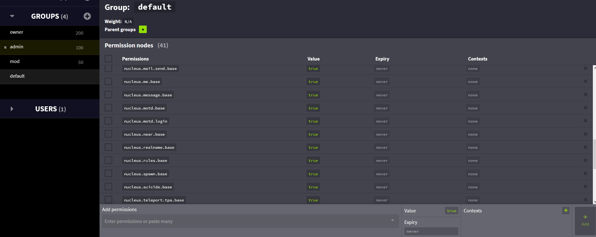
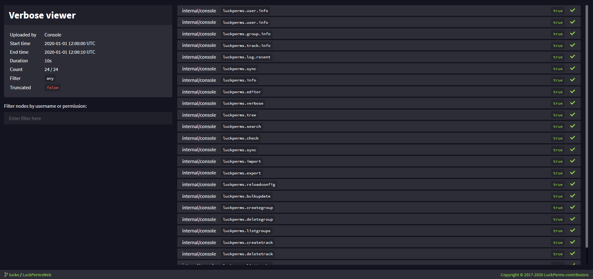

# 为什么选择 LuckPerms

**你好！**👋

欢迎来到 LuckPerms 项目 —— 有你真好！

本页的目的是回答一些问题/人们第一次见到这个项目会有的反应，并解释为什么你得来试试 LuckPerms！

让我们以一些常见问题开始吧。

### 又是一个权限插件？

当然。我们觉得现在的权限插件还有一些能够改进的地方！

LuckPerms 是这样的：

* **高效** - 高性能的写入与内在的压缩性。
* **可信** - 超千名服务器管理员与大型服务群组正在使用。
* **简便** - 通过命令设置权限，或通过配置文件，甚至是网页编辑器。
* **灵活** - 支持许多存储选项，并能在不同类型的服务器上使用。
* **拓展** - 配置文件包含许多个性化选项与设置，用于适配你的服务器。
* **免费** - 允许免费下载与使用，并使用自由授权来使其永久免费。

### 我用了 [x] 插件很久！为什么得换？

许多权限插件历年已久，也有可能弃坑、停止更新并不再接收支持或漏洞修复。    
LuckPerms 仍然是活跃资源，我们会定时回复所有漏洞报告、议题与新功能报告。

### LuckPerms 看起来庞大/复杂，我只想要一些简单和轻量的功能。

尽管插件有许多个性化选项，默认设置仍旧适合大多数用户。游戏内和在线编辑器都能快速上手，并且我们的维基中也有许多信息和安装教程供你参考！🎉

### 我正在运营一个大型群组，我很重视性能。LuckPerms 性能表现如何？

插件的代码随时间更新，它也一直为面对大型服务器而在改进。它已经证明了自己快而可信。LuckPerms 现在正在社区中的几个大型服务器上运行。

LuckPerms 设计之初就让它的大多数操作利用了多线程。权限检查的寻找与元数据都会缓存，内部数据结构针对更快/更高效的查询进行了优化。

这个章节的剩余部分，我们聚焦在一些 LuckPerms 的超酷功能上，有些你甚至可能从没见过！

### 网页编辑

除了游戏内/控制台界面，LuckPerms 还有一个网页编辑器，允许你通过浏览器修改权限数据。

任何人都能使用编辑器，开箱即用而无需额外设置！

用起来超级简单。你可以试试[示例会话](https://luckperms.net/editor/demo)或参阅[本维基](https://luckperms.net/wiki/Web-Editor)关于网页编辑器的章节。

### 权限检查系统

LuckPerms 有一个[权限检查](https://luckperms.net/wiki/Verbose)系统，允许你实时监控其他插件的权限检查。

你可以追踪某条权限检查的源头 —— 向下拉就能找到触发本次权限检查的原因！

权限检查系统记录可以通过特殊的网页应用来变得更加易于分析与阅读。你可以在[这个示例记录](https://luckperms.net/verbose/demo)中进行浏览。

### 权限树

LuckPerms 会允许你[构建“权限树”](command-usage.general.md#lp-tree-范围-玩家)来展开服务器上已知的全部权限。数据全部来源于插件向服务器注册的权限。

权限树会随时间将插件向玩家检查的权限加入而不断增长。

权限树也可以根据玩家拥有的不同权限进行染色。这允许你更清楚地区分玩家拥有那些权限。

权限树还可以在特殊的网页应用来变得更加易于分析与阅读。你可以在[这个示例权限树](https://luckperms.net/treeview)中进行浏览。