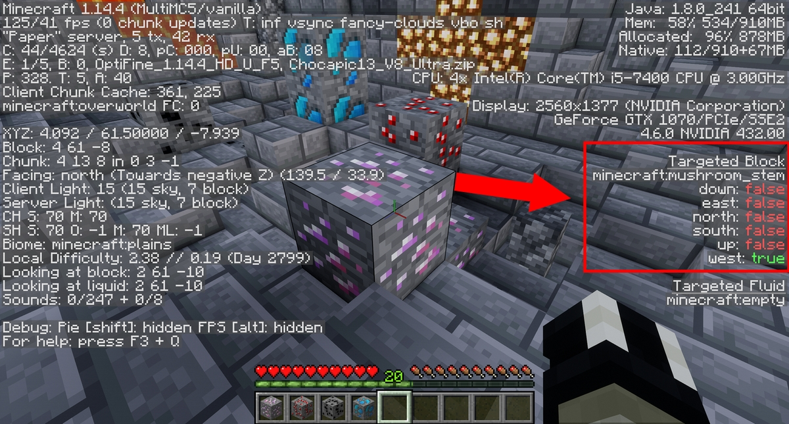

# RealisticWorldGenerator
RWG 是一个付费的世界生成器

RealisticWorldGenerator 允许你生成外观炫酷的世界。目前这个插件并不支持 Oraxen（这意味着插件并没有针对本插件的联动，也就不能在其结构如地牢、村庄等中简便地插入 Oraxen 物品），但支持自定义方块数据，所以你可以向世界中添加 Oraxen 的方块，并让其像钻石一般生成。

SpigotMC 链接：https://www.spigotmc.org/resources/realisticworldgenerator.15905/

## 如何创建自定义矿物/方块

在本示例中，我们假设你已经按照[这个教程](mechanics.noteblock-mechanic.md#矿物)在 Oraxen 的配置中创建了一个方块（紫水晶）。

### 定位待编辑的文件

首先，你需要决定向哪个世界添加自定义方块（或者直接生成）。在你准备好之后，重启你的服务器。你可以在 `/plugins/RealisticWorldGenerator/worlds` 找到新生成的世界。打开它，你能发现一些诸如**“ores.yml”、“biomes.yml”**以及**“replacement.yml”**的文件。

受到你所使用的 RWG 版本影响，向 RWG 添加方块的方式有很多。如果你使用的版本不高于 4.26.5，则你需要[按照本段落后的教程进行操作](#添加方块rwg--4265)。如果你使用的版本高于这个，则你需要[参考下方的教程](#添加方块rwg--4266)。

### 添加方块（RWG <= 4.26.5）

首先你需要找到你的自定义方块数据。你可以在任何安装 Oraxen 的服务器上在客户端中找到。只需放置你的方块（你可以通过命令或者 Oraxen 的展示界面获取）然后对着它按下 F3，即可获取你需要的信息。



现在你就可以将你的新矿物添加至生成配置中。在本示例中，配置如下：

```YAML
  amethyst:
    min: 0
    chance: 2.0
    spawn:
      min: 1
      max: 8
    material: minecraft:mushroom_stem[up=false, down=false, north=false, south=false,
      west=true, east=false]
    max: 16
```

### 添加方块（RWG >= 4.26.6）

你需要选择你想做的事。在本示例中我会选择**“ores.yml”**文件，但[上述提及的几个文件](#定位待编辑的文件)操作步骤都是一样的。

在打开文件后，你需要以**“oraxen:”**而非**“minecraft:”**命名空间开头将自定义方块添加至配置中。

配置大致如下：

```YAML
  amethyst:
    min: 0
    chance: 2.0
    spawn: 
      min: 1
      max: 8
    material: oraxen:amethyst_ore
    max: 18
```

完成后，保存文件并关闭服务器，删除旧区域数据再重新开启服务器即可应用改动。