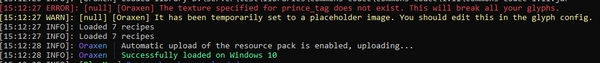

# 自定义字符
如何向游戏内添加自定义字符？

## 什么是自定义字符？
自定义字符就是被覆盖了贴图的 Unicode 符号。它可以用在任何地方（聊天栏、物品名称及其描述等）。它们可以用来做很多有趣的东西（自定义界面、额外属性栏）。但它们最简单的用法就是制作 emoji。

## 如何添加自定义字符？

首先，你要先创建一个 png 贴图。例如，在 `default/chat` 文件夹下的 `heart.png` 文件。


然后你就可以在 glyphs 文件夹下的任何 yaml 文件中添加自己的配置。每个自定义字符的配置文件不应相同。数字则对应 Unicode 字符表中会使用的字符位置。height 参数允许你修改字符的比例，而 ascent 决定了字符显示的纵向偏移程度。

```YAML
heart:
  texture: default/chat/heart
  ascent: 8
  height: 8
```

## 我的自定义字符无效？

这有可能是这样的文字配置不正确导致的。

请检查控制台是否出现了报错，因为它会告诉你究竟是哪个自定义字符配置出错，并且告诉你它为何会出错。



## 多位图自定义字符

若你有一个包含了多个表情的 png 图片，你可以将其做成多位图字符。

这意味着你可以将多个自定义字符放在一张贴图中。但是要想让它正常生效需要一些额外步骤。

在 fonts.yml 中，这里有一部分为 `bitmaps` 准备的设置。

在其中你需要指定一个 `id`，这会在你的自定义字符配置中用到。

你也需要指定贴图的路径，以及位图拥有几行几列。

下文即为 `fonts.yml` 中一个条目的示例：

```YAML
bitmaps:
  example_bitmap:
    texture: example/example_bitmap
    rows: 4
    columns: 9
    ascent: 8
    height: 8
```


如你所见，这个图片有四行九列。

ascent 与 height 属性会对位图中所有的自定义字符生效。

在配置好位图之后，你就可以为其绑定自定义字符。

在你的自定义字符配置中，你需要指定位图 id，以及你想要使用的自定义字符的行列位置。

下文即为使用上述位图的自定义字符配置。

```YAML
example_glyph:
  texture: default/chat/example_glyph
  bitmap:
    id: example_bitmap
    row: 1
    column: 1
  #ascent: 8 # 位图自动指定，无需添加
  #height: 8 # 位图自动指定，无需添加
```

这会将自定义字符与上述图片的第一行第一个 emoji 匹配。

## Emoji 列表

若要让自定义字符能在 `/oraxen emojis` 的列表中出现，你需要像下文一样对其设置。

若未指定，则它们会为默认的 `false`。

```YAML
heart:
  texture: default/chat/heart
  is_emoji: true
```

默认情况下，这也只会显示玩家有权限使用的 emoji。

在 `settings.yml` 中，你可以切换 `only_show_emojis_with_permissions` 设置。

这会向玩家显示所有 emoji，他们可以将鼠标悬浮其上来查看是否有权限使用它们。

## 如何在聊天栏中使用？

你需要向你的自定义字符部分添加一个 `chat` 子设置：

```YAML
chat:
  placeholders:
    - "<3"
  permission: "oraxen.emoji.heart"
```

这样变量就可以在玩家拥有权限的情况下在聊天栏中使用（如果指定了权限就会要求，若未设置也不会强求玩家拥有权限）。

## 如何让自定义字符能被 tab 键自动补全？

只需将 chat 部分下设置 `tabcomplete: true` 即可。

若未指定，则默认为 `false`。

自动补全设置目前只对 1.19.3 及以上的服务器有效。

```YAML
chat:
  tabcomplete: true
  placeholders:
    - "<3"
  permission: "oraxen.emoji.heart"
```

## 不要删除 shifts.yml

这个文件会在默认纹理包中使用，如果将其强行移除可能会导致插件载入失败。

另外也没有合适的理由删除这个文件。插件在启动时会自动生成这个文件。

如果愿意承担后果，在这些文件中做出的修改不会被覆盖，除非文件被删除。

`interface.yml` 也是如此。它们被用在示例语言文件中，所以删除它们会导致对应部分内容载入失败。

### 我的偏移自定义字符没有任何效果？

这一般是因为偏移的自定义字符使用了透明的图像。

例如，如果你将 `Oraxen/pack/textures/required` 下的 null.png 编辑为透明，就会触发这个问题。

偏移的图像不能是透明的，如果你的贴图用到了它们，则大小至少要为 1x1 像素。

## PlaceholderAPI

### 我的自定义字符变量是什么？

这部分的名称就是它的 id。在本章节的示例中，它就是 `heart`，变量为 `%oraxen_glyphid%`，即 `%oraxen_heart%`

其中，ID 为任何自定义字符配置中的第一行，它不是变量或者贴图的名称。

### 如何在前缀/LuckPerms 中使用这些

向 LuckPerms 的前缀中添加自定义字符，一般用于展示等级。只需将 `%oraxen_glyphid%` 加入前缀中即可。

例如，如果使用的是 LuckPerms，你可以使用命令：`/lp group default meta setprefix %oraxen_glyphid%`，变量会自动解析为对应的文字。

因为大多数插件只会判断一次变量，因此 %luckperms_prefix% 不会被再次判断。

你可能需要获取 PlaceholderAPI 的 Utils-Expansion 变量拓展。

若要获取这个，点击[这个链接](https://api.extendedclip.com/media/Utils-Expansion-1.0.1.jar)，然后将其放在 `plugins/PlaceholderAPI/expansions` 文件夹下。

然后在插件中，你可以选择使用 %utils_parse:2_luckperms_prefix% 来再次判断前缀。

需要注意的是，若要让这个功能正常工作，你的聊天插件必须支持 PlaceholderAPI。

若出于某些原因这个功能不能正常工作，你可以使用自定义字符配置中 `char` 部分设置的 Unicode 原字符。

### 如何在物品的名称/描述中使用自定义字符？

任何自定义字符都可以在物品配置的名称与描述中使用。

```
<glyph:heart>
```

其中，`heart` 需要替换为你的自定义字符的 ID。