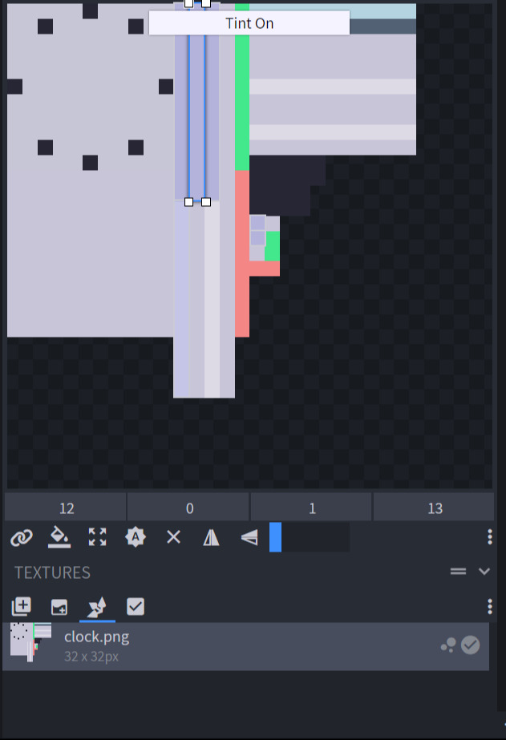

# 可染色物品

## 介绍

Oraxen 允许你创建基于药水（`POTION`）和皮革马铠（`LEATHER_HORSE_ARMOR`）可染色的物品与家具，让我们看看在 BlockBench 中如何做到这些吧！

## 怎么做？

### 第一步，打开你的 BlockBench 模型

### 第二步，选择需要被染色的模型面

### 第三步，打开 `tint` 选项

::: info 提示
最好使用白色。
:::

### 然后在该模式下选中所有需要被染色的材质面即可！



```YAML

clock:
  displayname: "<white>钟"
  material: LEATHER_HORSE_ARMOR
  color: 255, 255, 255 #rgb
  Mechanics:
    furniture:
      barrier: false
      drop: # 不使用屏障作为方块则无效
        silktouch: false
        loots:
          - { oraxen_item: clock, probability: 1.0 }
  Pack:
    generate_model: false
    model: custom/furniture/clock
```