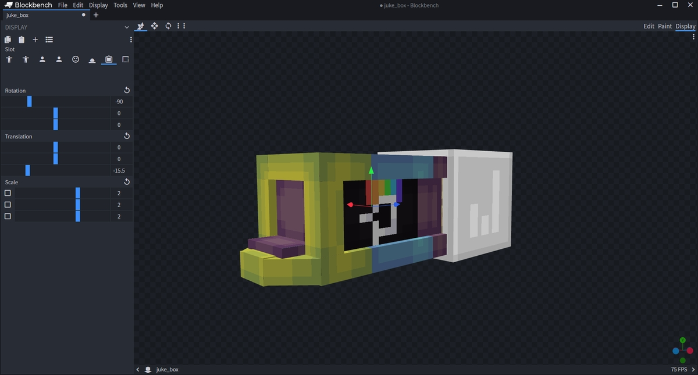

# 家具位置

若你的服务器为 1.19.4 以上，你可以使用一种新的实体，即“展示实体”。

这些实体有一些你必须设置的与 `furniture-position` 相关的额外属性。

其中一个就是 `display_transform`，决定了它为物品显示所使用的变形。

你可以在[这个章节](mechanics.furniture-mechanic.display-entity-furniture.md#展示实体属性)中找到更详细的解释。

下文为一个 `type` 设置为 `ITEM_FRAME` 或 `DISPLAY_ENTITY`，且 `display_transform` 设置为 `FIXED` 的家具。

若要让家具看起来正常，你需要在软件中调整它的位置。以 BlockBench 为例，你可以在如下界面调整家具在物品展示框中的显示样式。

大多数情况下，家具通过隐形物品展示框显示。因此，你需要在这部分内容中修改位置设置。

然后，就大功告成了！