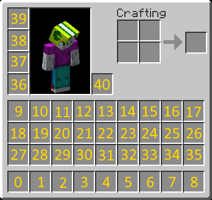

# 变量列表

此为可用变量的列表。

拓展下方的提示框会包含下载的命令。  
如果带有`内置`字样，则你无需手动下载变量拓展。  
如果带有链接，则你需要自行从链接处下载变量拓展并将其放入插件的 `expansions` 文件夹。

::: tip
变量列表未经过任何改动，且不保证其准确性和/或时效性。

本页只会在请求时更新。我们建议通过[提交推送请求](https://github.com/PlaceholderAPI/PlaceholderAPI/pulls)对本列表进行更新。  
如何对本维基进行贡献的有关细节可以在[本维基的自述页面](https://github.com/PlaceholderAPI/PlaceholderAPI/blob/wiki/README.md)中找到。
:::

[[toc]]

## 独立拓展

在这里列出的拓展无需安装其他插件或外部库，除非其额外声明。  
这里的大部分变量都由本插件团队维护，可视作*官方*变量。

### Advancements

::: tip papi ecloud download Advancements
:::

更多信息可以在其 [Github 仓库](https://github.com/matahombres/Advancements)中找到。

``` txt
%advancements_<成就名称>%
%advancements_player_<玩家名称>;<成就名称>%
%advancements_list%
%advancements_list_<命令>%
%advancements_playerList_<玩家名称>%
%advancements_playerList_<玩家名称>,<命令>%
%advancements_listFormat%
%advancements_playerListFormat_<玩家名称>%
%advancements_completedAmount%
%advancements_completedAmount_<类别>%
%advancements_playerCompletedAmount_<玩家名称>%
%advancements_playerCompletedAmount_<玩家名称>,<类别>%
%advancements_remainingAmount%
%advancements_remainingAmount_<类别>%
%advancements_playerRemainingAmount_<玩家名称>%
%advancements_playerRemainingAmount_<玩家名称>,<类别>%
```

### Animations

::: tip papi ecloud download Animations
:::

``` txt
%animations_<标签>文本</标签>%
%animations_<标签设置>文本</标签>%
%animations_<标签选项=:值>文本</标签>%
```

请注意：在动态文本中使用变量时，你必须使用其花括号变种。  
例如，在 `<标签> </标签>` 内使用 `%player_name%` 变量时，你应将其替换为 `{player_name}`。

完整标签列表可在[对应维基页面](https://github.com/Niall7459/KiteBoard-Documentation/wiki/Animations-and-Modifiers)找到。

### Armor

::: tip papi ecloud download Armor
:::

获取身上装备的有关信息。

``` txt
括号“（）” 内的值择一填入（注意不需要填入括号），“槽位”可填入如下值：helmet（头盔）、chestplate（胸甲）、leggings（护腿）、boots（鞋子）。

%armor_amount_槽位%
%armor_color_(red/green/blue/hex)_槽位%
%armor_durability_(left/max)_槽位%
%armor_has_槽位%
%armor_material_槽位%
%armor_maxamount_槽位%
```

### ASCII

::: tip papi ecloud download ASCII
:::

将输入的值替换为对应的 [ASCII 字符](http://www.asciitable.com/)

``` txt
%ascii_<值>%
```

如：`%ascii_37%` 会返回 `%`

### Attribute

::: tip papi ecloud download Attribute
:::

添加用于获取[属性（Attribute）](https://hub.spigotmc.org/javadocs/spigot/org/bukkit/attribute/Attribute.html)的变量。（[Minecraft 维基页面](https://zh.minecraft.wiki/w/%E5%B1%9E%E6%80%A7)）  
**该拓展只可在 1.9+ 的服务器上使用**

``` txt
// 无版本限制
%attribute_player_has_<属性>% - 检查玩家是否拥有某个属性
%attribute_player_baseValue_<属性>% - 返回某个属性的基值
%attribute_player_value_<属性>% - 返回某个属性经所有修饰符调整后的最终值

// 1.11+
%attribute_player_defaultValue_<属性>% - 返回某个属性的默认值
```

### BungeeCord

::: tip papi ecloud download Bungee
:::

允许你显示全服或指定子服上的玩家数量。

``` txt
%bungee_total%
%bungee_<服务器名称>%
```

### CalculateNumbers

::: tip https://github.com/broken1arrow/CalculateNumbers/releases
:::

这个变量拓展一般用于需要动态调整数值的地方，比如以 DeluxeMenus 为基础，并按物品耐久收费的修复商店。另外工具、武器和盔甲也有其额外选项，因此你可以将其搭配等级插件使用。

默认使用并返回两位小数。

``` txt
%number_numbervalue,tool:{来自等级插件的变量}%
%number_numbervalue,decimal,tool:{来自等级插件的变量}%
%number_numbervalue,armor:{来自等级插件的变量}%
%number_numbervalue,decimal,armor:{来自等级插件的变量}%
```

### ChangeOutput

::: tip papi ecloud download changeoutput
:::

允许你修改其他变量返回的内容。

更多信息可在其 [Github 仓库](https://github.com/Kqliber/Expansion-ChangeOutput)上找到。

``` txt
%changeoutput_<选项>_input:<输入内容>_matcher:<匹配内容>_ifmatch:<匹配输出的内容>_else:<不匹配输出的内容>%
```

* `<选项>`：
    * equals - 完全匹配内容
    * ignorecase - 忽略英文字符的大小写
    * ignorecolor - 忽略传入的彩色代码
    * contains - 包含匹配内容
    * \>= - 检查输入是否大等于匹配内容
    * \> - 检查输入是否等于匹配内容
    * \<= - 检查输入是否小等于匹配内容
    * `<输入内容>` - 待比较的文本
    * `<匹配内容>` - 参与比较的文本或关键词
    * `<匹配输出的内容>` - 符合比较条件时输出的内容
    * `<不匹配输出的内容>` - 不符合比较条件时输出的内容

*所有参数均可嵌入变量，需以 `{}` 替代百分号。*

### CheckItem

允许你检查玩家背包中的物品。

``` txt
%checkitem_<条件修饰符1>,<条件修饰符2>,<...>% - 返回玩家是否拥有该物品的状态
%checkitem_amount_<条件修饰符1>,<条件修饰符2>,<...>% - 返回玩家拥有该物品的数量
%checkitem_remove_<条件修饰符1>,<条件修饰符2>,<...>% - 从玩家背包中移除该物品 - 可移除指定数量, 添加在变量末尾即可。（如 %checkitem_amount_remove_<...>%）请小心使用该变量。
%checkitem_give_<条件修饰符1>,<条件修饰符2>,<...>% - 给予玩家物品。若成功给予则返回 true，反之显示未成功发送的物品数量（失败的情况下物品也会给予，但并非全部）
%checkitem_getinfo:<槽位>_<条件修饰符1>,<条件修饰符2>,<...>% - 返回指定格子内的物品信息。返回顺序与下文介绍相同。列表会以“&r”符号分隔（如：%checkitem_getinfo:0_mat:）
```

*注意：*
\- `mainhand` 和 `offhand` 在 `getinfo:<格子>` 中有效
\- `give` 和 `remove` 变量出于安全考虑而默认禁用。可在 PlaceholderAPI 的 `config.yml` 中启用。

**条件修饰符：**

你可以将多个条件修饰符结合以匹配更复杂的物品。  
可用的修饰符：

* `namecontains:<文本>`
    检查物品的显示名称是否包含指定的 `<文本>`。\* \*\* ~
* `namestartswith:<文本>`
    检查物品的显示名称是否以指定的 `<文本>` 开头。\* \*\* ~
* `nameequals:<文本>`
    检查物品的显示名称是否与指定的 `<文本>` 相同。\* \*\* ^ ~
* `mat:<物品>`
    检查物品是否为指定的 `<物品>`（如 `STONE`，即石头）。^ ~
* `amt:<数量>`
    检查玩家是否拥有指定 `<数量>` 的物品。^ ~
* `data:<数字>`
    检查物品的数据值是否为指定 `<数字>`（如，红色羊毛的数据值为 `14`（`WOOL:14`））。  
    仅对 1.12 以及更低版本有效！^ ~
* `custommodeldata:<数值>`
    检查物品的 CustomModelData（自定义模型数据）是否为指定的 `<数值>`。
    仅对 1.14 以及更高版本有效！^ ~
* `lorecontains:<文本>`
    检查物品的描述是否包含指定 `<文本>` ~  
    **与 `getinfo` 搭配使用，你可以为 `<文本>` 指定行号并返回其内容。**\*
* `loreqeuals:<文本>`
    检查物品的描述是否等于指定 `<文本>`  
    多行文本以 `|` 作换行符。^ ~
    **与 `getinfo` 搭配使用，你可以为 `<文本>` 指定行号并返回其内容。**\*
* `matcontains:<文本>`
    检查物品的 ID 是否包含指定 `<文本>` \*
* `enchantments:<附魔=等级>;<附魔>`
    检查物品是否包含指定 `<附魔>`，`=等级` 可指定附魔等级。  
    要求使用原版附魔名称。^ ~
* `enchanted`
    检查物品是否包含（任意）附魔。~
* `potiontype:<药水类型>`
    检查物品是否包含指定类型药水（[完整药水类型列表可点此浏览](https://hub.spigotmc.org/javadocs/spigot/org/bukkit/potion/PotionType.html)）。^ ~
* `potionextended:<true/false>`
    检查药水效果是否为长效型。^ ~
* `porionupgraded:<true/false>`
    检查药水效果是否为增强型。^ ~
* `strict`
    使用时需要条件中包含 `mats:` 修饰符。严格检查物品的名称与其描述（若背包中有一块叫`测试`的石头，变量 `%checkitem_mat:stone,strict%` 返回的值会是 false）
* `inhand`
    检查指定物品是否在玩家手中。`inhand` 会同时检查双手。你可以在其后添加 `:main` 或 `:off` 来指定主副手。（示例：`inhand:main` 表示主手）
* `inslot:<数字>`
    检查物品是否处于指定的格子中[^1]。
* `nbtstrings:<键>==<值>;<键>==<值>`
    检查物品的（字符串）NBT 是否包含值为指定 `<值>` 的 `<键>`。\* ^ ~
* `nbtints:<键>==<值>;<键>==<值>`
    检查物品的（整数）NBT 是否包含值为指定 `<值>` 的 `<键>`。\* ^ ~

对于 NBT 数据，你可以以 `..` 表示一个 compound（即 `{}`）。如：`%checkitem_nbtstrings:PublicBukkitValues..executableitems:ei-id=Free_Money%`。^

**注释：**

* \* 表示大小写敏感
* \*\* 表示只可使用一个
* ^ 表示该修饰符支持 `give` 变量
* ~ 表示该修饰符支持 `getinfo` 变量
* 若要在字符串中使用逗号，你需要使用 `\` 对其转义（如：`loreqeuals:Milk\, Eggs\, Bread`），使得逗号被识别为字符串的一部分
* **支持嵌入变量，但你需要使用花括号！（如 `%player_name%` 应当被替换为 `{player_name}`）**

### CooldownBar

::: tip papi ecloud download CooldownBar
:::

更多信息可在其 [Github 仓库](https://github.com/aBo0oDyy/CooldownBar-Expansion)上找到。

``` txt
%cooldownbar_{变量}%
%cooldownbar_{变量}_p:<已满进度符号>%
%cooldownbar_{变量}_i:<半满进度符号>%
%cooldownbar_{变量}_r:<未满进度符号>%
%cooldownbar_{变量}_l:<最大长度>%
%cooldownbar_{变量}_c:<冷却时间>%
%cooldownbar_{变量}_rdy:<冷却完毕文本>%
%cooldownbar_{essentials_kit_time_until_available_tools}_p:&a■_i:&e■_r:&7■_l:5_c:100_rdy:&a已准备领取!%
%cooldownbar_percentage_{变量}%
%cooldownbar_percentage_{变量}_c:<冷却时间>%
%cooldownbar_percentage_{变量}_d:<小数位数>%
%cooldownbar_percentage_{essentials_kit_time_until_available_tools}_c:120_d:0%
```

### Enchantment

::: tip https://github.com/TeamVK/PAPI-Enchantment/releases
:::

更多信息可在其 [Github 仓库](https://github.com/TeamVK/PAPI-Enchantment)上找到。

`<>` 为必填参数。

``` txt
%enchantment_list%  # 玩家手持物品中的所有附魔（以英文逗号“,”分隔）
%enchantment_listLF%  # 玩家手持物品中的所有附魔（以换行符号“\n”分隔）
%enchantment_roman_list%  # 玩家手持物品中的所有附魔，以罗马数字显示等级（以英文逗号“,”分隔）
%enchantment_roman_listLF%  # 玩家手持物品中的所有附魔，以罗马数字显示等级（以换行符号“\n”分隔）
%enchantment_<附魔名称>_level% # 玩家手持物品上指定附魔的等级
%enchantment_<附魔名称>_total% # 玩家手持与装备物品上所有指定附魔的等级之和
```

### Formatter

::: tip papi ecloud download Formatter
:::

更多信息可在其 [CodeBerg 仓库](https://codeberg.org/Andre601/Formatter-Expansion)上找到。

`[]` 为必填参数，`<>` 为可选参数。

`{{u}}` 会被替换为下划线符号“_”，`{{prc}}` 会被替换为百分符号“%”。

``` txt
%formatter_number_format_<数字>%
%formatter_number_format_[地区名]:[格式]_<数字>%
%formatter_number_from:<时间单位>_to:<时间单位>_<数字>%
%formatter_number_round_<数字>%
%formatter_number_round_[精确位数]:[舍入方式]_<数字>%
%formatter_number_shorten_<数字>%
%formatter_number_time_<数字>%
%formatter_number_time_<时间单位>_<数字>% # 将数字视作 <时间单位> 进行处理

%formatter_text_capitalize_<文本>%
%formatter_text_length_<文本>%
%formatter_text_lowercase_<文本>%
%formatter_text_replace_[目标]_[替换内容]_<原文本>%
%formatter_text_substring_[起始位置]:[终止位置]_<原文本>%
%formatter_text_uppercase_<文本>%
```

### [GraalJS](https://github.com/ruViolence/GraalJS-Expansion)

::: tip papi ecloud download GraalJS
:::

更多信息可在其 [Github 仓库](https://github.com/ruViolence/GraalJS-Expansion)上找到。

``` txt
%graaljs_<变量 ID>%
%graaljs_<变量 ID>_参数1%
%graaljs_<变量 ID>_参数1,参数2,参数3%
```

### [Javascript](https://api.extendedclip.com/expansions/javascript/)

::: warning 未经验证
鉴于某些潜在的安全性问题，这个变量拓展目前被标记为“未经验证”。使用风险需自行承担。
:::

使你能够通过 Javascript 根据条件输出不同内容。

``` txt
%javascript_<变量 ID>%
```

### ListPlayers

::: tip papi ecloud download ListPlayers
:::

列出拥有指定权限或处于指定世界的玩家。

``` txt
%listplayers_with_perm_<权限节点>%
%listplayers_in_world_<世界名称>%
```

### LocalTime

::: tip papi ecloud download LocalTime
:::

``` txt
%localtime_time%
%localtime_time_<简单日期格式>%
%localtime_timezone_<时区 ID>%
%localtime_timezone_<时区 ID>,<简单日期格式>%
```

对于[简单日期格式](https://docs.oracle.com/javase/8/docs/api/java/text/SimpleDateFormat.html)，请浏览其 Javadoc 页面获知详情，有关时区 ID 的内容，请[见此](https://garygregory.wordpress.com/2013/06/18/what-are-the-java-timezone-ids/)。

### Math

允许进行简单和高级的数学运算。  
支持任何返回数字值的表达式（若要嵌入变量，请使用 `{变量}` 而非 `%变量%`）。

支持所有 [EvalEx](https://ezylang.github.io/EvalEx/) 的运算符。需要注意的是 `%` 不能直接输入，你需要以 `[prc]` 代替之。

更多信息请前往 [CodeBerg](https://codeberg.org/Andre601/Math-Expansion) 页面了解。

``` txt
%math_<表达式>%
%math_[精确位数]:[舍入模式]_<表达式>%
```

### MVdW Placeholders

::: tip papi ecloud download MVdW
:::

允许你使用来自 [MVdWPlaceholderAPI](https://www.spigotmc.org/resources/11182/) 的变量。  
至少需要安装 MVdWPlaceholderAPI 及 [Maxims 开发并使用了它的插件](https://www.spigotmc.org/resources/2691/)！  
该插件的所有变量可在[这里](https://www.spigotmc.org/wiki/mvdw-placeholders/)找到。

``` txt
%mvdw_<不带花括号“{}”的变量>%
```

### MySQL

::: warning 未经验证
鉴于某些潜在的安全性问题，这个变量拓展目前被标记为“未经验证”。使用风险需自行承担。
:::

``` txt
%mysql_<键>%
```

`<键>` 为可在 `plugins/PlaceholderAPI/expansion/MySQL` 的 config.yml 下找到的集合查询（set query）。

### MySQLTokens

::: tip 内置于插件
:::

``` txt
%mysqltokens_tokens%
```

### NumberFormatter

::: tip https://github.com/TeamVK/PAPI-NumberFormatter/releases
:::

有关此拓展的更多信息可在 [PAPI-NumberFormatter](https://github.com/TeamVK/PAPI-NumberFormatter) 中找到。

如：

若 `%tokenenchant_token_long%` 返回 `43535709321`，
则 `%nf_4X_tokenenchant_token_long%` 会返回 `43B`，
`%nf_###E0X_tokenenchant_token_long%` 会返回 `43.5B`，
`%nf_#,##0.#tokenenchant_token_long%` 会返回 `43,535,709,321`，
`%nf#,##0.0#:IT_tokenenchant_token_long%` 会返回 `43.535.709.321.0`。

`[]` 为必填参数，`<>` 为可选参数.

``` txt
%nf_<格式>[:区域名]_<其他变量>% # 将 %other_placeholder% 按指定格式输出。
```

### OtherPlayer

::: tip papi ecloud download OtherPlayer
:::

允许你以其他玩家身份（而非只有命令发送者）获取变量。

``` txt
%otherplayer_displayname_<玩家名称>%
%otherplayer_gamemode_<玩家名称>%
%otherplayer_hasperm_<玩家名称>_perm_<权限节点>%
%otherplayer_haspotioneffect_<玩家名称>_effect_<效果名称>%
%otherplayer_health_<玩家名称>%
%otherplayer_hunger_<玩家名称>%
%otherplayer_iteminhand_<玩家名称>%
%otherplayer_ip_<玩家名称>%
%otherplayer_level_<玩家名称>%
%otherplayer_locx_<玩家名称>%
%otherplayer_locy_<玩家名称>%
%otherplayer_locz_<玩家名称>%
%otherplayer_oxygen_<玩家名称>%
%otherplayer_spells_<玩家名称>%
%otherplayer_uuid_<玩家名称>%
%otherplayer_world_<玩家名称>%
```

### ParseNear

::: tip papi ecloud download ParseNear
:::

允许你以距离最近玩家的身份判断变量。若附近无玩家则会返回空。

``` txt
%parsenear_<不带百分号的变量>%  # Parses placeholder for closest player
%parsenear_<判断半径>_<不带百分号的变量>% # Parses placeholder for closest player in a radius
```

### ParseOther

::: tip papi ecloud download ParseOther
:::

允许你以其他玩家的身份判断任何变量。  
你必须使用 `unsafe` 变量才可判断有关 `username` 与 `uuid` 的变量。  
确保嵌入的变量使用了花括号 `{}`，否则无效。

``` txt
%parseother_{玩家名称}_{不带百分号的变量}%
%parseother_unsafe_{玩家名称变量}_{不带百分号的变量}%
%parseother_{uuid}_{不带百分号的变量}%
%parseother_unsafe_{玩家 UUID 变量}_{不带百分号的变量}%
```

### Pinger

::: tip papi ecloud download Pinger
:::

允许你通过 IP 或域名（带端口号）对服务器进行 ping 操作，以检查对应服务器的在线情况，返回其他信息等。  
安装拓展后，对应变量有一到两分钟的“预热”时间。

**注意：** 插件在 PlaceholderAPI 的 config.yml 中有独立的更新间隔（update-delay）。

请将 `<服务器 IP>` 替换为你的服务器/IP。

``` txt
%pinger_gameversion_<服务器 IP>%
%pinger_version_<服务器 IP>%
%pinger_online_<服务器 IP>%
%pinger_isonline_<服务器 IP>%
%pinger_max_<服务器 IP>%
%pinger_players_<服务器 IP>%
%pinger_motd_<服务器 IP>%
%pinger_pingversion_<服务器 IP>%
```

变量 `%pinger_online_<服务器 IP>%` 和 `%pinger_isonline_<服务器 IP>% ` 实际上功能相同。

### Player

::: tip papi download Player
:::

返回对应玩家的相关信息。

``` txt
%player_allow_flight%
%player_armor_helmet_name%
%player_armor_helmet_data%
%player_armor_helmet_durability%
%player_armor_chestplate_name%
%player_armor_chestplate_data%
%player_armor_chestplate_durability%
%player_armor_leggings_name%
%player_armor_leggings_data%
%player_armor_leggings_durability%
%player_armor_boots_name%
%player_armor_boots_data%
%player_armor_boots_durability%
%player_bed_x%
%player_bed_y%
%player_bed_z%
%player_bed_world%
%player_biome%
%player_biome_capitalized%
%player_block_underneath%
%player_can_pickup_items%
%player_colored_ping%
%player_compass_world%
%player_compass_x%
%player_compass_y%
%player_compass_z%
%player_custom_name%
%player_current_exp%
%player_direction%
%player_direction_xz%
%player_displayname%
%player_list_name%
%player_exp%
%player_exp_to_level%
%player_first_join_date%
%player_first_played%
%player_first_join%
%player_first_played_formatted%
%player_fly_speed%
%player_food_level%
%player_gamemode%
%player_has_empty_slot%
%player_has_played_before%
%player_empty_slots%
%player_has_health_boost%
%player_has_potioneffect_<药水效果>%
%player_has_permission_<权限节点>%
%player_health%
%player_health_boost%
%player_health_rounded%
%player_health_scale%
%player_ip%
%player_online%
%player_is_whitelisted%
%player_is_banned%
%player_is_flying%
%player_is_sneaking%
%player_is_sprinting%
%player_is_sleeping%
%player_is_inside_vehicle%
%player_is_op%
%player_item_in_hand%
%player_item_in_hand_name%
%player_item_in_hand_data%
%player_item_in_hand_durability%
%player_item_in_hand_level_<附魔名称>%
%player_item_in_offhand%
%player_item_in_offhand_name%
%player_item_in_offhand_data%
%player_item_in_offhand_durability%
%player_item_in_offhand_level_<附魔名称>%
%player_locale%
%player_locale_display_name%
%player_locale_short%
%player_locale_country%
%player_locale_display_country%
%player_last_damage%
%player_last_played%
%player_last_join%
%player_last_played_formatted%
%player_last_join_date%
%player_level%
%player_light_level%
%player_max_air%
%player_max_health%
%player_max_health_rounded%
%player_max_no_damage_ticks%
%player_minutes_lived%
%player_name%
%player_no_damage_ticks%
%player_ping%
%player_ping_<玩家名称>%
%player_remaining_air%
%player_saturation%
%player_seconds_lived%
%player_sleep_ticks%
%player_thunder_duration%
%player_ticks_lived%
%player_time%
%player_time_offset%
%player_total_exp%
%player_uuid%
%player_walk_speed%
%player_weather_duration%
%player_world%
%player_world_type%
%player_world_time_12%
%player_world_time_24%
%player_x%
%player_y%
%player_z%
%player_yaw%
%player_pitch%
%player_absorption%
```

### PlayerList

::: tip papi ecloud download PlayerList
:::

有关此拓展的更多信息可在其 [Github 仓库](https://github.com/Tanguygab/PlayerList-PlaceholderAPI-Expansion/wiki)中找到。

会在 PAPI 的配置文件创建一个列表，并通过变量将其返回！

``` txt
%playerlist_<列表名称>_<列表|数量|#>%
```

### Plugin

::: tip papi ecloud download Plugin
:::

返回指定插件的相关信息。

``` txt
%plugin_isenabled_<插件名称>%
%plugin_isdisabled_<插件名称>%
%plugin_exists_<插件名称>%
```

### Progress

::: tip papi ecloud download Progress
:::

有关此拓展的更多信息可在其 [Github 仓库](https://github.com/aBo0oDyy/Progress-Expansion)中找到。

``` txt
%progress_bar_{变量}%
%progress_bar_{变量}_c:<满格符号>%
%progress_bar_{变量}_p:<半满符号>%
%progress_bar_{变量}_r:<未满符号>%
%progress_bar_{变量}_l:<最大长度>%
%progress_bar_{变量}_m:<最大值>%
%progress_bar_{变量}_fullbar:<进度完成时的文本>%

# Example
%progress_bar_{变量}_c:&a■_p:&e■_r:&7■_l:10_m:100_fullbar:&a已完成!%
```

### RainbowColor

::: tip papi ecloud download RainbowColor
:::

有关此拓展的更多信息可在其 [Github 仓库](https://github.com/aBo0oDyy/RainbowColor-Expansion)中找到。

``` txt
%RainbowColor_<文本>%
%RainbowColor_custom_<颜色 1>,<颜色 2>,<...>_<文本>%

如：%RainbowColor_custom_a,f,e,b_此为示例%
```

### RandomColor

::: tip papi ecloud download RandomColor
:::

有关此拓展的更多信息可在其 [Github 仓库](https://github.com/Andre601/RandomColor)中找到。

``` txt
%randomcolor_all%
%randomcolor_color%
%randomcolor_combined%
%randomcolor_format%
%randomcolor_selected_<选项 1, 选项 2, 选项 3,...>%
```

### RandomNumber

::: tip https://github.com/TeamVK/PAPI-RandomNumber/releases
:::

有关此拓展的更多信息可在其 [Github 仓库](https://github.com/TeamVK/PAPI-Random数字)中找到。

它会返回指定位数的随机数。若不指定比例，则会自动计算。若指定的最大最小值都是整数，则返回的整数也会是整数。

``` txt
%randomnumber_值%
%randomnumber_值_位数%
%randomnumber_值_最小值_最大值%
%randomnumber_值_最小值_最大值_位数%
```

### RedisBungee

::: tip papi ecloud download RedisBungee
:::

与 [BungeeCord 变量](#bungeecord)相同，但面向 RedisBungee。

``` txt
%redisbungee_total%
%redisbungee_<服务器名称>%
```

### RelCon

::: tip papi ecloud download RelCon
:::

有关此拓展的更多信息可在其 [Github 仓库](https://github.com/PlaceholderAPI/RelCon-Expansion)中找到。

``` txt
%rel_relcon_player_<权限>_<文本 1>_[文本 2]%
%rel_relcon_player_<权限>_<文本 1>%
%rel_relcon_viewer_<权限>_<文本 1>_[文本 2]%
%rel_relcon_viewer_<权限>_<文本 1>%
```

### RNG

::: tip papi ecloud download RNG
::: 

有关此拓展的更多信息可在其 [Github 仓库](https://github.com/Kqliber/Expansion-RNG)中找到。

``` txt
%rng_online_player%
%rng_random%
%rng_<最小值>,<最大值>%
```

### ScoreboardObjectives

::: tip papi ecloud download ScoreboardObjectives
:::

获取某个计分板目标的值。

更多信息可在 [Spigot 资源介绍页](https://www.spigotmc.org/resources/placeholderapi-scoreboard-objectives-placeholder.48236/)上浏览。

``` txt
%objective_displayname_{<目标名称>}%
%objective_score_{<目标名称>}%
%objective_score_{<目标名称>}_{[其他条目]}%
%objective_scorep_{<目标名称>}%
%objective_scorep_{<目标名称>}_{[其他玩家]}%
%objective_scoreposhigh_{<目标名称>}_{<数字>}%
%objective_scoreposlow_{<目标名称>}_{<数字>}%
%objective_entryposhigh_{<目标名称>}_{<数字>}%
%objective_entryposlow_{<目标名称>}_{<数字>}%
```

### Server

::: tip papi ecloud download Server
:::

获取有关服务器的信息。

``` txt
%server_name%
%server_online%
%server_version%
%server_max_players%
%server_unique_joins%
%server_uptime%
%server_ram_used%
%server_ram_free%
%server_ram_total%
%server_ram_max%
%server_tps%
%server_tps_1%
%server_tps_5%
%server_tps_15%
%server_tps_1_colored%
%server_tps_5_colored%
%server_tps_15_colored%
%server_online_<世界名称>%
%server_has_whitelist%
%server_total_chunks%
%server_total_living_entities%
%server_total_entities%
%server_time_<简单日期格式>%
%server_countdown_<简单日期格式>_<时间>%
示例：%server_countdown_dd.MM.yyyy_01.01.2020%
```

`<时间>` 为倒数的日期与时间。**需要匹配 `<简单日期格式>`。**

请参阅[简单日期格式](https://docs.oracle.com/javase/8/docs/api/java/text/SimpleDateFormat.html)的 Javadoc 获知有关格式。

### Shortcut

::: tip papi ecloud download Shortcut
:::

允许判断大量文本，包括 PlaceholderAPI 的变量。  
若要了解更多，请前往 [Github 仓库](https://github.com/Andre601/Shortcut-Expansion)。

``` txt
%shortcut_<文件名称>%
%shortcut_<文件名称>:<替代文件路径 1>:<替代文件路径 2>:...%
```

### Sound

::: tip papi ecloud download Sound
:::

在解析时播放声音。

``` txt
# 仅对触发者播放
%sound_<声音名称>-<音量>-<音调>%

# 对所有玩家播放
%sound_all_<声音名称>-<音量>-<音调>%
```

### SpeedPerSec

::: tip papi ecloud download SpeedPerSec
:::

注：点击目前仅支持左键。

``` txt
%speedpersec_blockbreak%
%speedpersec_blockplace%
%speedpersec_speed%
%speedpersec_expcollected%
%speedpersec_damaging%
%speedpersec_hurting%
%speedpersec_clicking%
```

### Statistic

::: tip papi ecloud download Statistic
:::

支持所有 SpigotAPI 提供的统计数据。`%statistic_<统计数据类型>%`

对于指定方块、物品或实体等...

``` txt
# 方块、物品、实体等...
%statistic_mine_block:<材料名>%
%statistic_use_item:<物品材料名>%
%statistic_break_item:<物品材料名>%
%statistic_craft_item:<物品材料名>%
%statistic_kill_entity:<实体类型>%
%statistic_entity_killed_by:<实体类型>%

# 其他统计数据
%statistic_mob_kills%
%statistic_mine_block%
%statistic_use_item%
%statistic_break_item%
%statistic_craft_item%
%statistic_ticks_played%
%statistic_seconds_played%
%statistic_minutes_played%
%statistic_hours_played%
%statistic_days_played%
%statistic_time_played%
%statistic_time_played:seconds%
%statistic_time_played:minutes%
%statistic_time_played:hours%
%statistic_time_played:days%
%statistic_animals_bred%
%statistic_armor_cleaned%
%statistic_banner_cleaned%
%statistic_beacon_interacted%
%statistic_boat_one_cm%
%statistic_brewingstand_interaction%
%statistic_cake_slices_eaten%
%statistic_cauldron_filled%
%statistic_cauldron_used%
%statistic_chest_opened%
%statistic_climb_one_cm%
%statistic_crafting_table_interaction%
%statistic_crouch_one_cm%
%statistic_damage_dealt%
%statistic_damage_taken%
%statistic_deaths%
%statistic_dispenser_inspected%
%statistic_dive_one_cm%
%statistic_drop%
%statistic_dropper_inspected%
%statistic_enderchest_opened%
%statistic_fall_one_cm%
%statistic_fish_caught%
%statistic_flower_potted%
%statistic_fly_one_cm%
%statistic_furnace_interaction%
%statistic_hopper_inspected%
%statistic_horse_one_cm%
%statistic_item_enchanted%
%statistic_jump%
%statistic_junk_fished%
%statistic_leave_game%
%statistic_minecart_one_cm%
%statistic_noteblock_played%
%statistic_noteblock_tuned%
%statistic_pig_one_cm%
%statistic_player_kills%
%statistic_record_played%
%statistic_sprint_one_cm%
%statistic_swim_one_cm%
%statistic_talked_to_villager%
%statistic_time_since_death%
%statistic_ticks_since_death%
%statistic_seconds_since_death%
%statistic_minutes_since_death%
%statistic_hours_since_death%
%statistic_days_since_death%
%statistic_traded_with_villager%
%statistic_trapped_chest_triggered%
%statistic_walk_one_cm%
%statistic_sleep_in_bed%
%statistic_sneak_time%
%statistic_aviate_one_cm%
```

### String

::: tip papi ecloud download String
:::

有关此拓展的更多信息可在其 [Github 仓库](https://github.com/BlitzOffline/StringExpansion)中找到。

``` txt
%string_equals_<文本>_<匹配文本>%
%string_equalsIgnoreCase_<文本>_<匹配文本>%
%string_contains_<文本>_<匹配文本>%
%string_containsIgnoreCase_<文本>_<匹配文本>%
%string_indexOf_<文本>_<匹配文本>%
%string_lastIndexOf_<文本>_<匹配文本>%
%string_substring_<起始索引>_<文本>%
%string_substring_<起始索引>,<终止索引>_<文本>%
%string_charAt_<索引>_<文本>%
%string_shuffle_<文本>%
%string_uppercase_<文本>%
%string_lowercase_<文本>%
%string_length_<文本>%
%string_random_<字符串 1>,<字符串 2>,<字符串 3>,<...>%
```

### [Team](https://www.spigotmc.org/resources/74959/)

::: tip https://www.spigotmc.org/resources/74959/
:::

``` txt
%team_color%
%team_prefix%
```

### Teams

::: tip papi ecloud download Teams
:::

``` txt
%team_color%
%team_prefix%
%team_suffix%
%team_name%
```

### Unicode

::: tip papi ecloud download Unicode
:::

``` txt
%unicode_<十六进制值>%
```

示例：`%unicode_1000` 会解析为 `က`

### World

::: tip papi ecloud download world
:::

对于 `totalbalance` 变量，你必须安装一个经济插件（如 ExxentialsX）才可使其正常显示。

``` txt
%world_biome%
%world_nearbyEntities_<半径>%
%world_total%
%world_name_<世界名称>%
%world_seed_<世界名称>%
%world_sealevel_<世界名称>%
%world_time_<世界名称>%
%world_timein12_<世界名称>%
%world_canpvp_<世界名称>%
%world_thunder_<世界名称>%
%world_animalallowed_<世界名称>%
%world_monsterallowed_<世界名称>%
%world_difficulty_<世界名称>%
%world_players_<世界名称>%
%world_players_<权限组>_<世界名称>%
%world_haspermission_<权限节点>_<世界名称>%
%world_playerexist_<玩家名称>_<世界名称>%
%world_isgamerule_<游戏规则>_<世界名称>%
%world_recentjoin_<世界名称>%
%world_recentquit_<世界名称>%
%world_totalbalance_<世界名称>%
```

## 插件变量

在这里列出的变量都需要对应插件才可正常显示。

大多数列出的变量并非 PlaceholderAPI 官方开发团队维护。  
请在 [Github 议题#510](https://github.com/PlaceholderAPI/PlaceholderAPI/discussions/510) 中获悉 PlaceholderAPI 官方开发团队维护的所有变量拓展。

### [AAC](https://www.spigotmc.org/resources/6442/)

::: tip 内置于插件
:::

``` txt
%aac_ping%
%aac_player%
%aac_tps%
%aac_world%
%aac_vl_<检查类型>%
```

`<检查类型>` 中可以填入：

* `criticals`
* `fastbow`
* `fastuse`
* `fightspeed`
* `hitbox`
* `killaura`
* `regen`
* `derp`
* `move`
* `nofall`
* `phase`
* `timer`
* `badpackets`
* `fastbreak`
* `fastplace`
* `interact`

### [AbstractMenus](https://www.spigotmc.org/resources/75107/)

::: tip 内置于插件
:::

``` txt
%hanim_:<动画名称>:<ID>%
%var_:<变量名称>[:<默认值>]%
%var_:<玩家名称>.<变量名称>[:<默认值>]%
%varp_:<变量名称>[:<默认值>]%
%vart_:<变量名称>%
%varpt_:<变量名称>%
```

这些变量的有关信息可以在[这里](https://gitlab.com/spigotplugindevs/abstractmenuscommon/-/wikis/Variables#getval)找到。

### [AcidIsland](https://www.spigotmc.org/resources/581/)

::: tip papi ecloud download AcidIsland
:::

``` txt
%acidisland_level%  
%acidisland_island_x%  
%acidisland_island_y%  
%acidisland_island_z%  
%acidisland_island_world%  
%acidisland_team_size%  
%acidisland_coop_islands%
```

### [AcidIslandRate](https://www.spigotmc.org/resources/54913/)

::: tip 内置于插件
:::

``` txt
%acidislandrate_top_rated_player%
%acidislandrate_top_rated_amount%
%acidislandrate_total_ratings_server%
%acidislandrate_total_ratings_player%
```

### [Advanced Abilities](https://www.spigotmc.org/resources/21983/)

::: tip 内置于插件
:::

``` txt
%advancedabilities_<技能名称>_level%  
%advancedabilities_<技能名称>_bar%
%advancedabilities_player_class%
%advancedabilities_mana%
%advancedabilities_max_mana%
%advancedabilities_max_abilities_limit%
%advancedabilities_selected_abilities%
```

### Advanced Achievements

::: tip 内置于插件
:::

全局成就变量：

``` txt
%aach_achievements% - 返回已解锁的成就数量（整数）
%aach_achievements_percentage% - 返回已解锁的成就数量（百分比）
%aach_total_achievements% - 返回总成就数量（整数）
```

玩家统计普通成就的单独数据：

``` txt
%aach_connections%
%aach_deaths%
%aach_arrows%
%aach_snowballs%
%aach_eggs%
%aach_fish%
%aach_treasures%
%aach_itembreaks%
%aach_eatenitems%
%aach_shear%
%aach_milk%
%aach_lavabuckets%
%aach_waterbuckets%
%aach_trades%
%aach_anvilsused%
%aach_enchantments%
%aach_beds%
%aach_maxlevel%
%aach_consumedpotions%
%aach_playedtime%
%aach_itemdrops%
%aach_itempickups%
%aach_hoeplowings%
%aach_fertilising%
%aach_taming%
%aach_brewing%
%aach_fireworks%
%aach_musicdiscs%
%aach_enderpearls%
%aach_smelting%
%aach_petmastergive%
%aach_petmasterreceive%
%aach_distancefoot%
%aach_distancepig%
%aach_distancehorse%
%aach_distanceminecart%
%aach_distanceboat%
%aach_distancegliding%
%aach_distancellama%
%aach_distancesneaking%
%aach_raidswon%
%aach_riptides%
%aach_advancementscompleted%
```

玩家统计普通成就的多项数据：

``` txt
%aach_places_[方块名称]% - 示例：%aach_places_dirt%
%aach_breaks_[方块名称]% - 示例：%aach_breaks_stone%
%aach_kills_[实体名称]% - 示例：%aach_kills_zombie%
%aach_targetsshot_[目标名称]% - 示例：%aach_targetsshot_zombie%
%aach_crafts_[物品名称]% - 示例：%aach_crafts_bread%
%aach_breeding_[实体名称]% - 示例：%aach_breeding_pig%
%aach_playercommands_[命令]% - 示例：%aach_playercommands_aach list%
%aach_custom_[自定义名称]% - 示例：%aach_custom_votes%
%aach_jobsreborn_[职业]% - 示例：%aach_jobsreborn_hunter%
```

总分类成就的相关变量：

``` txt
%aach_total_connections%
%aach_total_deaths%
%aach_total_arrows%
%aach_total_snowballs%
%aach_total_eggs%
%aach_total_fish%
%aach_total_treasures%
%aach_total_itembreaks%
%aach_total_eatenitems%
%aach_total_shear%
%aach_total_milk%
%aach_total_lavabuckets%
%aach_total_waterbuckets%
%aach_total_trades%
%aach_total_anvilsused%
%aach_total_enchantments%
%aach_total_beds%
%aach_total_maxlevel%
%aach_total_consumedpotions%
%aach_total_playedtime%
%aach_total_itemdrops%
%aach_total_itempickups%
%aach_total_hoeplowings%
%aach_total_fertilising%
%aach_total_taming%
%aach_total_brewing%
%aach_total_fireworks%
%aach_total_musicdiscs%
%aach_total_enderpearls%
%aach_total_smelting%
%aach_total_petmastergive%
%aach_total_petmasterreceive%
%aach_total_distancefoot%
%aach_total_distancepig%
%aach_total_distancehorse%
%aach_total_distanceminecart%
%aach_total_distanceboat%
%aach_total_distancegliding%
%aach_total_distancellama%
%aach_total_distancesneaking%
%aach_total_raidswon%
%aach_total_riptides%
%aach_total_advancementscompleted%
%aach_total_places%
%aach_total_breaks%
%aach_total_kills%
%aach_total_targetsshot%
%aach_total_crafts%
%aach_total_breeding%
%aach_total_playercommands%
%aach_total_custom%
%aach_total_commands%
%aach_total_jobsreborn%
```

### [AdvancedAFK](https://www.spigotmc.org/resources/60761/)

::: tip 内置于插件
:::

``` txt
%aafk_prefix_tablist%
%aafk_prefix_playertag%
```

### [AdvancedCustomMenu+](https://www.spigotmc.org/resources/47945/)

::: tip 内置于插件
:::

``` txt
%advancedcustommenu_total%  
%advancedcustommenu_name%  
%advancedcustommenu_items%
```

### [AdvancedLottery](https://www.spigotmc.org/resources/43668/)

::: tip 内置于插件
:::

``` txt
%advancedlottery_time%
%advancedlottery_tickets_bought%
%advancedlottery_money%
```

### [AdvancedModReq](https://www.spigotmc.org/resources/40528/)

::: tip 内置于插件
:::

``` txt
%advancedmodreq_flagged%
%advancedmodreq_flagged_closed%
%advancedmodreq_flagged_open%
%advancedmodreq_total%
%advancedmodreq_total_claimed%
%advancedmodreq_total_closed%
%advancedmodreq_total_open%
%advancedmodreq_total_player%
%advancedmodreq_total_player_closed%
%advancedmodreq_total_player_open%
%advancedmodreq_unflagged%
%advancedmodreq_unflagged_closed%
%advancedmodreq_unflagged_open%
```

### [AdvancedServerList](https://modrinth.com/plugin/advancedserverlist)

::: tip 内置于插件
:::

``` txt
%asl_favicon%
%asl_motd%
%asl_playercount_extraplayers%
%asl_playercount_hover%
%asl_playercount_maxplayers%
%asl_playercount_text%
%asl_server_playersmax%
```

### [ajLeaderboards](https://www.spigotmc.org/resources/85548/)

::: tip 内置于插件
:::

[变量描述](https://wiki.ajg0702.us/ajleaderboards/setup/placeholders)（[译文](/ajLeaderboards/setup.placeholders.md)）

``` txt
%ajlb_position_<排行榜名称>_<类型>%
%ajlb_value_<排行榜名称>_<类型>%
%ajlb_value_<排行榜名称>_<类型>_formatted%
%ajlb_value_<排行榜名称>_<类型>_time%
%ajlb_value_<排行榜名称>_<类型>_raw%
%ajlb_lb_<排行榜名称>_<排名>_<类型>_name%
%ajlb_lb_<排行榜名称>_<排名>_<类型>_value%
%ajlb_lb_<排行榜名称>_<排名>_<类型>_time%
%ajlb_lb_<排行榜名称>_<排名>_<类型>_rawvalue%
%ajlb_lb_<排行榜名称>_<排名>_<类型>_value_formatted%
%ajlb_lb_<排行榜名称>_<排名>_<类型>_prefix%
%ajlb_lb_<排行榜名称>_<排名>_<类型>_suffix%
%ajlb_lb_<排行榜名称>_<排名>_<类型>_color%
```

### ajParkour

::: tip 内置于插件
:::

[变量描述](https://wiki.ajg0702.us/ajparkour/setup/placeholders)

``` txt
%ajpk_stats_top_name_<排名>%
%ajpk_stats_top_name_<排名>_<跑酷区域>%
%ajpk_stats_top_score_<排名>%
%ajpk_stats_top_score_<排名>_<跑酷区域>%
%ajpk_stats_top_time_<排名>%
%ajpk_stats_highscore%
%ajpk_stats_highscore_<跑酷区域>%
%ajpk_current%
%ajpk_jumping%
```

### [AlonsoLevels](https://www.spigotmc.org/resources/83380/)

::: tip 内置于插件
:::

``` txt
%alonsolevels_developer%
%alonsolevels_empty_progress_bar%
%alonsolevels_experience%
%alonsolevels_experience_format%
%alonsolevels_experience_in_current_level%
%alonsolevels_experience_to_level_up%
%alonsolevels_experience_to_level_up_format%
%alonsolevels_level%
%alonsolevels_level_format%
%alonsolevels_progress%
%alonsolevels_progress_bar%
%alonsolevels_progress_bar_format%
%alonsolevels_progress_format%
%alonsolevels_progress_stripped%
%alonsolevels_progress_stripped_format%
%alonsolevels_progress_percent%
%alonsolevels_progress_percent_format%
%alonsolevels_reqiored_experience_in_current_level%
%alonsolevels_version%
```

### [AngelChest](https://www.spigotmc.org/resources/60383/)

::: tip 内置于插件
:::

``` txt
%angelchest_activechests% - 玩家当前激活的死亡宝箱数量
%angelchest_price% - 生成死亡宝箱所需的价格
%angelchest_price_teleport% - 传送至死亡宝箱位置所需的价格
%angelchest_price_fetch% - 将死亡宝箱传送至身边所需的价格
%angelchest_price_open% - 打开死亡宝箱所需的价格
%angelchest_enabled% - 返回 "true" 或 "false"，表示玩家是否启用了本功能
%angelchest_isactive_<ID>% - 在对应 ID 有激活的死亡宝箱时返回 "true"，否则返回 "false"
%angelchest_time_<ID>% - 当前死亡宝箱的剩余时间. 若对应 ID 不存在则返回空字符串。
%angelchest_x_<ID>% - 死亡宝箱的坐标 X。若对应 ID 不存在则返回空字符串。
%angelchest_y_<ID>% - 死亡宝箱的坐标 Y。若对应 ID 不存在则返回空字符串。
%angelchest_z_<ID>% - 死亡宝箱的坐标 Z。若对应 ID 不存在则返回空字符串。
%angelchest_world_<ID>% - 死亡宝箱所在世界的名称。若对应 ID 不存在则返回空字符串。
``` 

### [Animated Menu](https://www.spigotmc.org/resources/4690/)

::: tip 内置于插件
:::

``` txt
%animatedmenu_motd_<IP>[_端口号]%  
%animatedmenu_status_<IP>[_端口号]_<在线显示内容>_<离线显示内容>%
``` 

示例

``` txt
%animatedmenu_status_testplugins.com_&a在线_&c离线%  
%animatedmenu_status_testplugins.com_25565_&a在线_&c离线%
```

### [AntiCombatLogging](https://polymart.org/resource/165/)

::: tip 内置于插件
:::

``` txt

``` 

### [AParkour](https://www.spigotmc.org/resources/30923/)

::: tip papi ecloud download AParkour
:::

``` txt
%aparkour_ct% - 显示当前时间秒数
%aparkour_ctf% - 按格式显示当前时间
%aparkour_lt_<跑酷 ID>% - 显示指定跑酷的上次用时
%aparkour_ltf_<跑酷 ID>% - 按格式显示指定跑酷的上次用时
%aparkour_bt_<跑酷 ID>% - 显示指定跑酷的最佳用时
%aparkour_btf_<跑酷 ID>% - 按格式显示指定跑酷的最佳用时
``` 

### ASkyBlock

::: papi ecloud download ASkyBlock
:::

``` txt
%askyblock_level%
%askyblock_island_y%
%askyblock_island_z%
%askyblock_island_world%
%askyblock_team_size%
%askyblock_coop_islands%
%askyblock_has_island%
%askyblock_owner%
``` 

### [AsyncKeepAlive](https://www.spigotmc.org/resources/64676/)

::: tip 内置于插件
:::

``` txt
%asynckeepalive_ping%
``` 

### [Ath](https://www.spigotmc.org/resources/87124/)

::: tip 内置于插件
:::

``` txt
%ath_date%
%ath_count%
``` 

### AutoPickUp

::: tip 内置于插件
:::

``` txt
%autopickup_pickup%
%autopickup_autosell%
%autopickup_autoplanting%
%autopickup_autosmelt%
%autopickup_autoblock%
``` 

### [AutoRank](https://www.spigotmc.org/resources/3239/)

::: tip papi ecloud download AutoRank
:::

``` txt
%autorank_total_time_of_player%
%autorank_total_time_of_player_formatted%
%autorank_daily_time_of_player%
%autorank_daily_time_of_player_formatted%
%autorank_weekly_time_of_player%
%autorank_weekly_time_of_player_formatted%
%autorank_monthly_time_of_player%
%autorank_monthly_time_of_player_formatted%
%autorank_local_time%
%autorank_local_time_formatted%
%autorank_global_time%
%autorank_global_time_formatted%
%autorank_completed_paths%
%autorank_active_paths%
%autorank_eligible_paths%
```

### [AutoSell](https://www.spigotmc.org/resources/2157/)

::: tip papi ecloud download AutoSell
:::

``` txt
%autosell_in_autosell_mode%
%autosell_in_autoblocks_mode%
%autosell_in_automelt_mode%
%autosell_current_shop%
%autosell_total_multiplier%
%autosell_time_multiplier%
%autosell_perm_multiplier%
%autosell_perm_multiplier_name%
%autosell_time_multiplier_minsleft%
%autosell_time_multiplier_timeleft%
```

### [BankSystem](https://www.spigotmc.org/resources/61580/)

::: tip 内置于插件
:::

``` txt
%banksystem_name%
%banksystem_balance%
%banksystem_pocket%
%banksystem_total%
%banksystem_currency%
```

### [BasicQuests](https://www.spigotmc.org/resources/87972/)

可在对应页面找到用于[告示牌](https://www.spigotmc.org/resources/87972/)和[计分板](https://github.com/Tonnanto/BasicQuests/tree/v0.3.2#scoreboards)的变量示例。

::: tip 内置于插件
:::

``` txt
%bquests% -（格式化，支持多行）玩家当前的任务
%bquests_detail% -（格式化，支持多行）玩家当前任务与其奖励
%bquests_count% - 玩家进行的任务数量
%bquests_<序号>% - 指定序号的任务内容
%bquests_<序号>_title% - 指定序号的任务标题
%bquests_<序号>_progress% - 指定序号的任务进度
%bquests_<序号>_left% - 指定序号的任务剩余内容
%bquests_<序号>_<行号>% - 指定序号的任务，可用于显示在告示牌上。
%bquests_<序号>_reward_<行号>% - 指定序号的任务奖励，分为两行，可用于计分板。
```

### [BattleLevels](https://www.spigotmc.org/resources/2218/)

::: tip 内置于插件
:::

``` txt
%battlelevels_level%
%battlelevels_score%
%battlelevels_bar%
%battlelevels_topstreak%
%battlelevels_killstreak%
%battlelevels_kills%
%battlelevels_deaths%
%battlelevels_kdr%
%battlelevels_globalbooster%
%battlelevelseededfornext%
%battlelevels_neededfornextremaining%
```

### [BeautyQuests](https://www.spigotmc.org/resources/39255/)

::: tip 内置于插件
:::

``` txt
%beautyquests_player_inprogress_amount%
%beautyquests_player_finished_amount%
%beautyquests_total_amount%
%beautyquests_advancement_ID%
```

### [Bedwars1058](https://www.spigotmc.org/resources/50942/)

::: tip 内置于插件
:::

``` txt
# 玩家变量
%bw1058_player_level%
%bw1058_player_progress%
%bw1058_player_rerq_xp%
%bw1058_player_rerq_xp_formatted%
%bw1058_player_team%
%bw1058_player_xp%
%bw1058_player_xp_formatted%

# 统计数据
%bw1058_stats_bedsdestroyed%
%bw1058_stats_deaths%
%bw1058_stats_finalkills%
%bw1058_stats_finaldeaths%
%bw1058_stats_firstplay%
%bw1058_stats_gamesplayed%
%bw1058_stats_kills%
%bw1058_stats_lastplay%
%bw1058_stats_losses%
%bw1058_stats_wins%

# 其他变量
%bw1058_arena_status_[房间名称]%
%bw1058_arena_count_[房间名称]%
%bw1058_current_playing%
%bw1058_current_arenas%
```

### [BentoBox](https://github.com/BentoBoxWorld/BentoBox)

::: tip 内置于插件
:::

浏览 [BentoBox 变量文档](https://docs.bentobox.world/en/latest/BentoBox/Placeholders/)获取更多有关变量的信息。

可以将 `[游戏模式]` 替换为如下之一：

* `acidisland`
* `bskyblock`
* `caveblock`
* `skygrid`
* `aoneblock`

``` txt
%[游戏模式]_world_friendly_name%
%[游戏模式]_island_distance%
%[游戏模式]_island_protection_range%
%[游戏模式]_island_owner%
%[游戏模式]_island_creation_date%
%[游戏模式]_island_center%
%[游戏模式]_island_name%

# Level Add-on
%Level_[游戏模式]_island_level%
%Level_[游戏模式]_top_value_#RANK#%
%Level_[游戏模式]_top_name_#RANK#%
```

### [BetonQuest](https://www.spigotmc.org/resources/2117/)

::: tip 内置于插件
:::

请参阅[官方文档](https://docs.betonquest.org/RELEASE/User-Documentation/Compatibility/#placeholderapi)以获得详细信息。

``` txt
%betonquest_<变量>%
%betonquest_<包名>:<变量>%
```

### [BetterTeams](https://github.com/booksaw/BetterTeams/wiki/PlaceholderAPI)

::: tip 内置于插件
:::

请参阅[维基](https://github.com/booksaw/PlaceholderAPI)获得详细信息。

``` txt
%betterteams_<变量>%
%betterteams_position_<变量>_<等级>%
%betterteams_balanceposition_<变量>_<等级>%
%betterteams_membersposition_<变量>_<等级>%
%betterteams_static_<变量>_<团队名称>%
%betterteams_staticplayer_<变量>_<玩家名称>%
```
### [BlockParty](https://www.spigotmc.org/resources/7264/)

::: tip papi ecloud download BlockParty
:::

``` txt
%blockparty_wins%
%blockparty_points%
%blockparty_gamesplayed%
```

### [BlockQuest](https://www.spigotmc.org/resources/32729/)

::: tip
:::

``` txt
%blockquest_blocksfound%
%blockquest_blocksleft%
%blockquest_allblocks%
```

### [Boxing](https://www.spigotmc.org/resources/83879/)

::: tip 内置于插件
:::

``` txt
%boxing_losses%
%boxing_times_played%
%boxing_wins%
```

### [BuildBattlePro](https://www.spigotmc.org/resources/49587/)

::: tip papi ecloud download BuildBattlePro
:::

``` txt
%buildbattlepro_wins%
%buildbattlepro_played%
%buildbattlepro_most_points%
%buildbattlepro_particles_placed%
%buildbattlepro_blocks_placed%
%buildbattlepro_super_votes%
%buildbattlepro_status_<房间名>%
```

### [BungeePerms](https://www.spigotmc.org/resources/25/)

::: tip 内置于插件
:::

``` txt
%bungeeperms_groups%
%bungeeperms_primary_group_name%
%bungeeperms_prefix%
%bungeeperms_prefix_primary_group%
%bungeeperms_suffix%
%bungeeperms_suffix_primary_group%
%bungeeperms_in_group_<权限组>%
%bungeeperms_has_permission_<权限节点>%
```

### [BuyCraft](https://www.spigotmc.org/resources/82261/)

::: tip https://www.spigotmc.org/resources/82261/
:::

``` txt
%buycraftAPI_recent_currency_<数字>%
%buycraftAPI_recent_name_<数字>%
%buycraftAPI_recent_price_<数字>%
%buycraftapi_top_donator_currency%
%buycraftapi_top_donator_name%
%buycraftapi_top_donator_price%
```

### [CarlTheCreeper](https://www.spigotmc.org/resources/18008/)

::: tip 内置于插件
:::

``` txt
%carlthecreeper_cooldown_<奖励>%
%carlthecreeper_statistic_rewards_claimed%
```

### [ChatColor+](https://www.spigotmc.org/resources/1546/)

::: tip 内置于插件
:::

``` txt
%chatcolorplus_chatcolor%
%chatcolorplus_namecolor%
```

### [ChatColor+ Premium](https://www.spigotmc.org/resources/54093/)

::: tip 内置于插件
:::

``` txt
%chatcolorpluspremium_chat_color%
%chatcolorpluspremium_tab_color%
%chatcolorpluspremium_sign_color%
%chatcolorpluspremium_font%

%chatcolorpluspremium_chat_color_name%
%chatcolorpluspremium_sign_color_name%
%chatcolorpluspremium_name_color_name%
%chatcolorpluspremium_tab_color_name%
%chatcolorpluspremium_name_color%
```

### [ChatReaction](https://www.spigotmc.org/resources/3748/)

::: tip papi ecloud download ChatReaction
:::

``` txt
%chatreaction_wins% - 聊天比赛胜场（需要 MySQL）
%chatreaction_wins_<玩家名称>% - 指定玩家聊天比赛胜场（需要 MySQL）
%chatreaction_top_player_<名次>% - 返回指定位置前的玩家名称（需要 MySQL）
%chatreaction_top_wins_<名次>% - 返回指定位置前的胜利场次（需要 MySQL）
%chatreaction_type% - 聊天比赛类型（Reaction（反应）或 Scramble（字谜））
%chatreaction_active_round% - 比赛是否正在进行
%chatreaction_display_word% - 待猜的词
%chatreaction_reaction_word% - 反应回复的词
%chatreaction_start_time% - 下一回合开始的时间
%chatreaction_latest_winner% - 上回合胜者
%chatreaction_start_time_in_seconds% - 返回聊天比赛开始的时间（单位为秒）
%chatreaction_time_remaining% - 返回聊天比赛结束的时间（单位为秒）
```

### [CheckNameHistory](https://www.spigotmc.org/resources/3768/)

::: tip papi ecloud download CheckNameHistory
:::

``` txt
%checknamehistory_previous_name_<数字>%
%checknamehistory_previous_name_date_<数字>%
```

### [ClaimChunk](https://www.spigotmc.org/resources/44458/)

::: tip 内置于插件
:::

``` txt
%claimchunk_my_name%
%claimchunk_my_claims%
%claimchunk_my_max_claims%
%claimchunk_my_remaining_claims%
%claimchunk_am_trusted%
%claimchunk_current_owner%
%claimchunk_current_name%
```

### [Clans](https://www.spigotmc.org/resources/22304/)

::: tip 内置于插件
:::

``` txt
%clans_clan_tag%
%clans_colored_clan_tag%
```

### [ClansFree](https://www.spigotmc.org/resources/78415/)

::: tip 内置于插件
:::

``` txt
%clans_name%
%clans_raidshield%
%clans_rank%
```

### [Clans-API Spigot/Clan 聊天标签](https://www.spigotmc.org/resources/31547/)

::: tip 内置于插件
:::

``` txt
%clantagprovider_clantag_custom_design%
%clantagprovider_clantag%
```

### [ClansPro](https://www.spigotmc.org/resources/87515/)

::: tip 内置于插件
:::

``` txt
%clanspro_clan_name%
%clanspro_clan_description%
%clanspro_clan_color%
%clanspro_clan_pvp_mode%
%clanspro_clan_balance%
%clanspro_clan_power%
%clanspro_clan_top_slot_位置%
%clanspro_clan_top_slot_位置_power%
%clanspro_clan_top_slot_位置_color%
%clanspro_clan_war_active%
%clanspro_clan_war_score%
%clanspro_clan_war_hours%
%clanspro_clan_war_minutes%
%clanspro_clan_war_seconds%
%clanspro_clan_members_online%
%clanspro_member_rank%
%clanspro_member_rank_short%
%clanspro_member_bio%
%clanspro_raidshield_status%
```

### [ClanSystem](https://www.spigotmc.org/resources/34696/)

::: tip 内置于插件
:::

``` txt
%clansystem_clan%
%clansystem_clan_level%
%clansystem_clan_leader%
%clansystem_clan_balance%
%clansystem_clan_rank%
%clansystem_clan_deaths%
%clansystem_clan_kills%
%clansystem_clan_size%
```

### [CombatLogX](https://www.spigotmc.org/resources/31689/)

::: tip 内置于插件
:::

``` txt
%combatlogx_time_left%
%combatlogx_enemy_name%
%combatlogx_enemy_health%
%combatlogx_enemy_health_rounded%
%combatlogx_enemy_hearts%
%combatlogx_status%
%combatlogx_in_combat%
```

### [Compassance](https://www.spigotmc.org/resources/18327/)

::: tip 内置于插件
:::

``` txt
%compassance_p_string%
%compassance_p_selectedtheme%
%compassance_p_target%
%compassance_p_target_location%
%compassance_p_target_distance%
%compassance_p_string_theme_<theme-id>%
```

### [CoorinateTool](https://github.com/TeamVK/CoordinateTool)

::: tip 内置于插件
:::

``` txt
%coordinatetool_file% : 当前区块对应文件
%coordiantetool_chunk% : 当前区块坐标
%coordiantetool_min_chunk% : 最小区块
%coordiantetool_max_chunk% : 最大区块
%coordiantetool_min_block% : 最小方块
%coordiantetool_max_block% : 最大方块
```

### [Country on Join](https://www.spigotmc.org/resources/34275/)

::: tip 内置于插件
:::

``` txt
%countryonjoin_player_country_code%
%countryonjoin_player_country_name%
```

### [CraftConomy](https://www.spigotmc.org/resources/2395/)

::: tip papi ecloud download CraftConomy
:::

``` txt
%craftconomy_<货币名称>[选项]%
```

**可用选项：**

* `_@<数字>` 返回 `<货币>` 乘以 `<数字>` 的值。如：`%craftconomy_currency_@10%` 对于 `10 单位货币` 返回 `100`。
* `_@int` 返回整数而非双精度浮点数（即小数）。对于 DeluxeMenus 等需要整数的插件非常有用。

### [CraftingStore.net](https://www.spigotmc.org/resources/31331/)

::: tip 内置于插件
:::

``` txt
%craftingstore_donator%
%craftingstore_donator_1%
%craftingstore_donator_2%
%craftingstore_donator_3%
%craftingstore_donator_4%
%craftingstore_donator_5%

%craftingstore_payment%
%craftingstore_payment_1%
%craftingstore_payment_2%
%craftingstore_payment_3%
%craftingstore_payment_4%
%craftingstore_payment_5%
```

### [CursedVIP](https://www.spigotmc.org/resources/67068/)

::: tip 内置于插件
:::

``` txt
%cursedvip_is_vip%
%cursedvip_active_vip%
%cursedvip_days_left%
%cursedvip_initial_date%
```

### [Custom Advancements](https://www.spigotmc.org/resources/91167/)

::: tip 内置于插件
:::

``` txt
%customadvancements_available_advancements% - 显示指定玩家可获取的剩余成就数量。
%customadvancements_available_advancements_<分支>% - 显示指定成就分支的可获取成就数量。
%customadvancements_completed_advancements% - 显示已完成的成就数量。
%customadvancements_completed_advancements_<分支>% - 显示指定成就分支已经获得的成就数量。
%customadvancements_active_advancements% - 显示活跃成就的数量。
%customadvancements_active_advancements_<分支>% - 显示指定分支上活跃状态的成就数量。
%customadvancements_progress_percentage_<路径>% - 显示指定路径上的成就获取进度（如 example.advancement1）。
%customadvancements_progress_<路径>% - 显示指定成就路径的进度。
%customadvancements_max_progress_<路径>% - 显示指定成就路径的最大进度。
%customadvancements_meet_requirements_<路径>% - 显示玩家是否满足某个成就路径上要求的所有条件。
```

### [CustomItems](https://www.spigotmc.org/resources/63848/)

::: tip 内置于插件
:::

``` txt
%cui_version%
%customitems_version%
```

### [Daily Rewards](https://www.spigotmc.org/resources/16708)

::: tip 内置于插件
:::

``` txt
%dailyrewards_remaining_time%
%dailyrewards_remaining_hours%
%dailyrewards_remaining_minutes%
%dailyrewards_remaining_seconds%
%dailyrewards_player_reward_available%
%dailyrewards_player_no_rewards%
%dailyrewards_player_test_qualification%
```

### [DeliveryMan](https://www.spigotmc.org/resources/14131/)

::: tip 内置于插件
:::

``` txt
%deliveryman_prizes_all%
%deliveryman_prizes_from:<菜单 ID>%
%deliveryman_has_prize:<菜单 ID>:<奖励 ID>%
```

### [DeluxeChat](https://www.spigotmc.org/resources/1277/)

::: tip papi ecloud download DeluxeChat
:::

``` txt
%deluxechat_is_pm_toggled%
%deluxechat_pm_recipient%
%deluxechat_social_spy_enabled%
```

### [DeluxeCombat](https://www.spigotmc.org/resources/63970/)

::: tip 内置于插件
:::

``` txt
%deluxecombat_ranking_points%
%deluxecombat_ranking_kills%
%deluxecombat_ranking_deaths%
%deluxecombat_ranking_combatlogs%
%deluxecombat_ranking_kd%
%deluxecombat_ranking_rank%
%deluxecombat_ranking_streak%
%deluxecombat_ranking_maxstreak%
%deluxecombat_in_combat%
%deluxecombat_combat_time%
%deluxecombat_combat_opponent%
%deluxecombat_ranking_<属性类型>_<等级>%
%deluxecombat_ranking_<属性类型>_<等级>_<组别>%
```

### [DeluxeMenus](https://www.spigotmc.org/resources/11734/)

::: tip 内置于插件
:::

``` txt
%deluxemenus_meta_<键>_<数据类型>_<默认值>%
```

* 键：检查的元数据键名
* 数据类型：可以为 `STRING`（字符串）、`BOOLEAN`（布尔值，即 `true`/`false`）、`DOUBLE`（双精度浮点数，即小数）、`LONG`（长整数）或 `INTERGER`（整数）。
    *若给定键的数据类型与变量请求的不同，则会导致报错。*
* 默认值：未找到符合要求的内容时返回的内容。

### [DeluxePM](https://www.spigotmc.org/resources/52599/)

::: tip papi ecloud download DeluxePM
:::

``` txt
%deluxepm_status%
```

### [DeluxeTags](https://www.spigotmc.org/resources/4390/)

::: tip 内置于插件
:::

``` txt
%deluxetags_tag%
%deluxetags_identifier%
%deluxetags_description%
%deluxetags_amount%
%deluxetags_tag_<称号 ID>%
%deluxetags_description_<称号 ID>%
%deluxetags_has_tag_<称号 ID>%
```

### [Denizen](https://www.spigotmc.org/resources/21039/)

::: tip 内置于插件
:::

``` txt
%denizen_<denizen 标签>%（示例：%denizen_<player.flag[MyFlag]>%）
```

### [DimensionPlaceholders](https://www.spigotmc.org/resources/107769/)

::: tip 内置于插件
:::

变量信息可以在 [Github](https://github.com/BoBkiNN/DimensionPlaceholders) 上找到。

``` txt
%dimplc_color%
%dimplc_folder%
%dimplc_namespacedkey%
%dimplc_namespace%
%dimplc_key%
%dimplc_loadedchunks%
```

### [DiscordSRV](https://www.spigotmc.org/resources/18494/)

::: tip 内置于插件
:::

你可以在 [DiscordSRV 的维基](https://github.com/DiscordSRV/DiscordSRV/wiki/PAPI-Placeholders#placeholders)中找到完整的变量列表。

### [Disease](https://www.spigotmc.org/resources/3911/)

::: tip papi ecloud download Disease
:::

``` txt
%disease_disease%
%disease_sickness%
%disease_temperature%
```

### [Donations Holograms](https://www.spigotmc.org/resources/1956/)

::: tip 内置于插件
:::

``` txt
%donationsHolograms_percentage%
%donationsHolograms_progressBar%
%donationsHolograms_received%
%donationsHolograms_goal%
```

### [DragonSlayer](https://www.spigotmc.org/resources/36250/)

::: tip 内置于插件
:::

``` txt
%dragonslayer_prefix%
%dragonslayer_timer%
%dragonslayer_nexttime%
%dragonslayer_nexttimehms%
%dragonslayer_nextmap%
%dragonslayer_mykills%
%dragonslayer_place_<名次>%
%dragonslayer_place_<名次>_name%
%dragonslayer_place_<名次>_score%
%dragonslayer_slayer%
```

### [DungeonsXL](https://www.spigotmc.org/resources/9488/)

::: tip 内置于插件
:::

``` txt
%dxl_floor_player_count%
%dxl_dungeon_name%
%dxl_game_player_count%
%dxl_global_dungeon_count%
%dxl_global_floor_count%
%dxl_global_instance_count%
%dxl_group_members%
%dxl_group_name%
%dxl_group_name_raw%
%dxl_group_player_count%
```

### [Economy Bank](https://www.spigotmc.org/resources/7674/)

::: tip 内置于插件
:::

``` txt
%economybank_balance%
```

### [Enjin & DonationCraft 2.x](https://dev.bukkit.org/projects/emp)

::: tip papi ecloud download Enjin
:::

``` txt
%enjin_points%
```

### [EntityClearer](https://www.spigotmc.org/resources/90802/)

::: tip 内置于插件
:::

``` txt
%entityclearer_remaining_minutes_<世界名称>% | 指定世界清理任务运行的时间间隔（分钟）
%entityclearer_remaining_seconds_<世界名称>% | 指定世界清理任务运行的时间间隔（秒钟）
%entityclearer_remaining_seconds_left_<世界名称>% | 指定世界下次清理任务运行的剩余时间（秒钟）
```

### [EntityControl](https://polymart.org/resource/218)

::: tip 内置于插件
:::

``` txt
%envoys_time_until_refill%
```

### [EpicFriends](https://www.spigotmc.org/resources/11294/)

::: tip 内置于插件
:::

``` txt
%epicfriends_friendcount%
%epicfriends_friendcount_online%
```

### [EpicLevels](https://songoda.com/marketplace/product/44)

::: tip 内置于插件
:::

``` txt
%epiclevels_level%
%epiclevels_experience%
%epiclevels_kills%
%epiclevels_deaths%
%epiclevels_killstreak%
%epiclevels_bestkillstreak%
%epiclevels_kdr%
%epiclevels_nextlevel%
%epiclevels_neededfornextlevel%
%epiclevels_boosterenabled%
%epiclevels_booster%
%epiclevels_globalboosterenabled%
%epiclevels_globalbooster%
%epiclevels_progressbar%
%epiclevels_playerkills%
%epiclevels_mobkills%
```

### [essCore](https://www.spigotmc.org/resources/37766/)

::: tip 内置于插件
::: 

``` txt
%esscore_flight%
%esscore_is_nicked%
%esscore_nickname%
%esscore_is_vanished%
%esscore_is_muted%
%esscore_is_frozen%
```

### [Essentials](https://ci.ender.zone/job/EssentialsX/)

::: tip papi ecloud download Essentials
:::

这个变量拓展可与 Essentials 和 [EssentialsX](https://essentialsx.net/) 兼容（推荐后者）。

``` txt
%essentials_afk%
%essentials_afk_reason%
%essentials_fly%
%essentials_geolocation%
%essentials_godmode%
%essentials_has_kit_<礼包名称>%
%essentials_home_<数字>%
%essentials_home_<数字>_<w|x|y|z>%
%essentials_homes_set%
%essentials_homes_max%
%essentials_is_muted%
%essentials_is_pay_confirm%
%essentials_is_pay_enabled%
%essentials_is_teleport_enabled%
%essentials_jailed%
%essentials_jailed_time_remaining%
%essentials_kit_is_available_<礼包名称>%
%essentials_kit_last_use_<礼包名称>%
%essentials_kit_time_until_available_<礼包名称>%
%essentials_kit_time_until_available_raw_<礼包名称>%
%essentials_msg_ignore%
%essentials_muted_time_remaining%
%essentials_nickname%
%essentials_nickname_stripped%
%essentials_pm_recipient%
%essentials_safe_online%
%essentials_unique%
%essentials_vanished%
%essentials_world_date%
%essentials_world_time%
%essentials_world_time_24%
%essentials_worth%
%essentials_worth:<物品名称>%
%essentials_baltop_balance_fixed_<等级>%
%essentials_baltop_balance_formatted_<等级>%
%essentials_baltop_balance_commas_<等级>%
%essentials_baltop_balance_<等级>%
%essentials_baltop_player_<等级>%
%essentials_baltop_rank%
%essentials_baltop_player_stripped_<数量>%
```

### [EventCore](https://www.spigotmc.org/resources/113142/)

::: tip 内置于插件
:::

``` txt
%eventcore_alive%
%eventcore_dead%
%eventcore_status%
%eventcore_revive%
%eventcore_revives%
```

### [EZBlocks](https://www.spigotmc.org/resources/1499/)

::: tip papi ecloud download EZBlocks
:::

``` txt
%ezblocks_broken%
```

### [EZPrestige](https://www.spigotmc.org/resources/1794/)

::: tip papi ecloud download EZPrestige
:::

``` txt
%ezprestige_prestige%
%ezprestige_prestigetag%
%ezprestige_nextprestige%
%ezprestige_nextprestigetag%
```

### [EZRanksPro](https://www.spigotmc.org/resources/10731/)

::: tip papi ecloud download EZRanksPro
::: 

``` txt
%ezrankspro_player%
%ezrankspro_displayname%
%ezrankspro_world%
%ezrankspro_rank%
%ezrankspro_rankup%
%ezrankspro_cost%
%ezrankspro_cost_formatted%
%ezrankspro_balance%
%ezrankspro_balance_formatted%
%ezrankspro_difference%
%ezrankspro_difference_formatted%
%ezrankspro_progress%
%ezrankspro_progressexact%
%ezrankspro_progressbar%
%ezrankspro_rankprefix%
%ezrankspro_rankupprefix%
%ezrankspro_lastrank%
%ezrankspro_lastrankprefix%
%ezrankspro_rank_cost_<等级>%
%ezrankspro_rank_cost_formatted_<等级>%
%ezrankspro_rank_prefix_<等级>%
%ezrankspro_rankup_rank_prefix_<等级>%
%ezrankspro_rankup_rank_<等级>%
```

### [Factions MCore](https://www.spigotmc.org/resources/1900/)

::: tip papi ecloud download Factions
:::

``` txt
%factions_faction%
%factions_power%
%factions_powermax%
%factions_factionpower%
%factions_factionpowermax%
%factions_title%
%factions_role%
%factions_claims%
%factions_onlinemembers%
%factions_allmembers%
```

### [FactionsUUID](https://www.spigotmc.org/resources/1035/)

::: tip 内置于插件
:::

你可以在 [FactionsUUID 的维基](https://factions.support/placeholderapi/)中找到完整的变量列表。

### Factions 关系变量

::: tip 内置于插件
:::

``` txt
%rel_[factions/factionsuuid]_relation%
%rel_[factions/factionsuuid]_relation_color%
```

::: info

该变量拓展兼容 FactionsUUID 与 MCore，你只需要下载对应插件的变量拓展。如果你需要在 DeluxeChat 中使用这些变量，你需要在配置文本中设置“relation_placeholders_enabled: true”。

:::

### [FunnyGuilds](https://github.com/FunnyGuilds/FunnyGuilds)

::: tip 内置于插件
:::

``` txt
%funnyguilds_guilds%
%funnyguilds_users%
%funnyguilds_deaths%
%funnyguilds_kdr%
%funnyguilds_kills%
%funnyguilds_points-format%
%funnyguilds_points%
%funnyguilds_position%
%funnyguilds_g-allies%
%funnyguilds_g-deaths%
%funnyguilds_g-deputies%
%funnyguilds_g-deputy%
%funnyguilds_g-kdr%
%funnyguilds_g-kills%
%funnyguilds_g-lives%
%funnyguilds_g-members-all%
%funnyguilds_g-members-online%
%funnyguilds_g-name%
%funnyguilds_g-owner%
%funnyguilds_g-points-format%
%funnyguilds_g-points%
%funnyguilds_g-position%
%funnyguilds_g-region-size%
%funnyguilds_g-tag%
%funnyguilds_g-validity%
%funnyguilds_gtop-x%
%funnyguilds_ptop-x%
```

### GAListener

::: tip 内置于插件
:::

``` txt
%galistener_votes%
```

### [GangsPlus](https://www.spigotmc.org/resources/2604/)

::: tip 内置于插件
:::

``` txt
%gangsplus_in_gang%
%gangsplus_gang_name%
%gangsplus_gang_name_formatted%
%gangsplus_gang_rank%
%gangsplus_gang_rank_number%
%gangsplus_gang_friendly_fire%
%gangsplus_gang_online_members_list%
%gangsplus_gang_online_members_count%
%gangsplus_gang_members_list%
%gangsplus_gang_members_count%
%gangsplus_gang_leader%
%gangsplus_gang_level%
%gangsplus_gang_wins%
%gangsplus_gang_losses%
%gangsplus_gang_wlr%
%gangsplus_gang_kills%
%gangsplus_gang_deaths%
%gangsplus_gang_kdr%
```

### [GemsEconomy](https://www.spigotmc.org/resources/19655/)

::: tip papi ecloud download GemsEconomy
:::

``` txt
%gemseconomy_balance_default%
%gemseconomy_balance_default_formatted%
%gemseconomy_balance_<货币单数或复数名称>%
%gemseconomy_balance_<货币单数或复数名称>_formatted%
```

### [GriefDefender](https://www.spigotmc.org/resources/68900/)

::: tip 内置于插件
:::

``` txt
%griefdefender_blocks_left%
%griefdefender_blocks_total%
%griefdefender_claim_admin% 
%griefdefender_claim_basic% 
%griefdefender_claim_subdivision%   
%griefdefender_claim_town%  
%griefdefender_claims_admin%    
%griefdefender_claims_basic%    
%griefdefender_claims_subdivision%  
%griefdefender_claims_town% 
%griefdefender_claim_name%  
%griefdefender_claim_owner% 
%griefdefender_claim_trust% 
%griefdefender_claim_type%  
%griefdefender_claim_for_sale%  
%griefdefender_pvp%
```

### [GriefPrevention](https://www.spigotmc.org/resources/1884/)

::: tip papi ecloud download GriefPrevention
:::

``` txt
%griefprevention_claims%
%griefprevention_claims_formatted%
%griefprevention_bonusclaims%
%griefprevention_bonusclaims_formatted%
%griefprevention_accruedclaims%
%griefprevention_accruedclaims_formatted%
%griefprevention_remainingclaims%
%griefprevention_remainingclaims_formatted%
%griefprevention_currentclaim_ownername%
```

### [Guilds](https://www.spigotmc.org/resources/48920/)

::: tip 内置于插件
:::

``` txt
%guilds_name%
%guilds_master%
%guilds_member_count%
%guilds_prefix%
%guilds_members_online%
%guilds_status%
%guilds_role%
%guilds_tier%
%guilds_balance%
%guilds_tier_name%
%guilds_role_node%
%guilds_id%
%guilds_code_amount%
%guilds_max_members%
%guilds_max_balance%
%guilds_formatted%
%guilds_challenge_wins%
%guilds_challenge_loses%
%guilds_motd%
```

### [GuiRedeemMCMMO](https://www.spigotmc.org/resources/6784/)

::: tip 内置于插件
:::

``` txt
%guiredeemmcmmo_credits%
```

### [Head Database](https://www.spigotmc.org/resources/14280/)

::: tip 内置于插件
:::

``` txt
%hdb_amount%
%hdb_amount_formatted%
%hdb_amount_<分类>%
%hdb_tags%
```

### [Heroes](https://www.spigotmc.org/resources/305/)

::: tip papi ecloud download Heroes
:::

``` txt
%heroes_skill_level_<技能名称>%
%heroes_main_class_name%
%heroes_main_class_description%
%heroes_main_class_tier%
%heroes_second_class_name%
%heroes_second_class_description%
%heroes_second_class_tier%
%heroes_level%
%heroes_mana%
%heroes_mana_regen%
%heroes_max_mana%
%heroes_mastered_classes%
%heroes_mastered_classes_amount%
%heroes_party_is_no_pvp%
%heroes_party_size%
%heroes_party_leader%
```

### [HoloBlock](https://www.spigotmc.org/resources/43192/)

::: tip 内置于插件
:::

``` txt
%holoblock_maxowned%
%holoblock_maxline%
%holoblock_owned:<玩家名称>%
%holoblock_maxowned:<玩家名称>%
%holoblock_maxline:<玩家名称>%
%holoblock_isPlaceholder:<玩家名称>%
%holoblock_isColor:<玩家名称>%
%holoblock_isCustomSkin:<玩家名称>%
%holoblock_isItemLine:<玩家名称>%
```

### [HoloMobHealth](https://www.spigotmc.org/resources/75975/)

::: tip 内置于插件
:::

``` txt
%holomobhealth_displaytoggle%
```

### [Honeypot](https://www.spigotmc.org/resources/96665)

::: tip 内置于插件
:::

从 Honeypot 获取你的玩家信息。请参阅[维基](https://github.com/TerrorByteTW/Honeypot/wiki#placeholders)获得更多信息。

``` txt
%honeypot_current_count_broken%
%honeypot_breaks_before_action%
%honeypot_current_count_broken_<player>%
```

### [HPWizard](https://www.spigotmc.org/resources/26821/)

::: tip 内置于插件
:::

``` txt
%hpw_house%
%hpw_house_coloured%
%hpw_amount_of_spells%
%hpw_housepoints%
%hpw_{房屋名称}_housepoints%
%hpw_hogwarts_last_winner%
%hpw_hogwarts_last_winner_coloured%
%hpw_ministry_last_winner%
%hpw_ministry_last_winner_coloured%
```

### [Hugs](https://www.spigotmc.org/resources/39722/)

::: tip 内置于插件
:::

``` txt
%hugs_total%
%hugs_player_total_given%
%hugs_player_total_received%
```

### [HyacinthHello](https://www.spigotmc.org/resources/104434/)

::: tip 内置于插件
:::

你可以在 [HyacinthHello 的维基](https://github.com/livelaughlemon/hyacinthhello/wiki#placeholders)中找到完整的变量列表。

### [InteractionVisualizer](https://www.spigotmc.org/resources/77050/)

::: tip 内置于插件
:::

``` txt
%interactionvisualizer_all_<条目内容>%
%interactionvisualizer_itemstand_<条目内容>%
%interactionvisualizer_itemdrop_<条目内容>%
%interactionvisualizer_hologram_<条目内容>%
```

### [InteractiveChat](https://www.spigotmc.org/resources/75870/)

::: tip 内置于插件
:::

``` txt
%interactivechat_mentiontoggle%
%interactivechat_invdisplaylayout%
```

### [Island Border](https://www.spigotmc.org/resources/56320/)

::: tip 内置于插件
:::

支持 ASkyBlock、BentoBox、uSkyBlock 与 AcidIsland。

``` txt
%isborder_status%
%isborder_size%
%isborder_color%
```

### [IslandRate](https://www.spigotmc.org/resources/53519/)

::: tip 内置于插件
:::

只支持 ASkyBlock。

``` txt
%islandrate_top_rated_player%
%islandrate_top_rated_amount%
%islandrate_total_ratings_server%
%islandrate_total_ratings_player%
```

### IslandWorld

::: tip 内置于插件
:::

``` txt
%islandworld_points_with_party%
%islandworld_points_without_party%
%islandworld_island_members%
%islandworld_all_members%
%islandworld_can_build%
%islandworld_in_party%
```

### [Jobs Reborn](https://www.spigotmc.org/resources/4216/)

::: tip 内置于插件
:::

``` txt
%jobsr_user_id%
%jobsr_user_bstandcount%
%jobsr_user_maxbstandcount%
%jobsr_user_furncount%
%jobsr_user_maxfurncount%
%jobsr_user_doneq%
%jobsr_user_seen%
%jobsr_user_totallevels%
%jobsr_user_issaved%
%jobsr_user_displayhonorific%
%jobsr_user_joinedjobcount%
%jobsr_user_boost_(职业名称/数字)_(money/exp/points)%
%jobsr_user_isin_(职业名称/数字)%
%jobsr_user_canjoin_(职业名称/数字)%
%jobsr_user_jlevel_(职业名称/数字)%
%jobsr_user_jexp_(职业名称/数字)%
%jobsr_user_jmaxexp_(职业名称/数字)%
%jobsr_user_jmaxlvl_(职业名称/数字)%
%jobsr_user_points%
%jobsr_user_total_points%
%jobsr_user_archived_jobs%
%jobsr_maxjobs%
%jobsr_limit_(money/exp/points)%
%jobsr_plimit_(money/exp/points)%
%jobsr_plimit_tleft_(money/exp/points)%
%jobsr_total_workers%
%jobsr_totalplayers_(职业名称/数字)%
%jobsr_name_(职业名称/数字)%
%jobsr_shortname_(职业名称/数字)%
%jobsr_chatcolor_(职业名称/数字)%
%jobsr_description_(职业名称/数字)%
%jobsr_maxdailyq_(职业名称/数字)%
%jobsr_maxlvl_(职业名称/数字)%
%jobsr_maxviplvl_(职业名称/数字)%
%jobsr_maxslots_(职业名称/数字)%
%jobsr_bonus_(职业名称/数字)%
```

### [Karma](https://www.spigotmc.org/resources/71156/)

::: tip papi ecloud download Karma
:::

``` txt
%karma_alignment%
%karma_aligned_name%
%karma_score%
%karma_recent_points_gained%
%karma_last_source%
```

### [KillStats](http://dev.bukkit.org/bukkit-plugins/killstats-v1-0/)

::: tip papi ecloud download KillStats
:::

``` txt
%killstats_kills%
%killstats_killrank%
%killstats_deaths%
%killstats_deathrank%
%killstats_streak%
%killstats_streakrank%
%killstats_kdr%
%killstats_kdrrank%
```

### [KitPvP](https://www.spigotmc.org/resources/27107/)

::: tip 内置于插件
:::

``` txt
%kitpvp_stats_kills%
%kitpvp_stats_deaths%
%kitpvp_stats_kdr%
%kitpvp_stats_level%
%kitpvp_stats_experience%
%kitpvp_player_killstreak%
%kitpvp_player_kit%
```

### [KingdomsX](https://www.spigotmc.org/resources/77670/)

::: tip 内置于插件
:::

你可以在 [KingdomsX 的维基](https://github.com/CryptoMorin/KingdomsX/wiki/Placeholders)中找到完整的变量列表。

### [KP-PVP](https://www.spigotmc.org/resources/50969/)

::: tip 内置于插件
:::

``` txt
%kp-pvp_player_kills%
%kp-pvp_player_deaths%
%kp-pvp_player_coins%
%kp-pvp_player_streak%
%kp-pvp_player_is_on_kitpvp%
%kp-pvp_players_count_total%
%kp-pvp_player_kit%
%kp-pvp_player_level%
%kp-pvp_player_xp%
```

### [Lands](https://www.spigotmc.org/resources/53313/)

::: tip 内置于插件
:::


你可以在 [Lands 的维基](https://github.com/Angeschossen/Lands/wiki/PlaceholderAPI-Placeholders#placeholders)中找到完整的变量列表。

``` txt
# 全局
%lands_next_tax%
%lands_next_upkeep%
%lands_affiliation%

# 土地
%lands_land_name%
%lands_land_owner%
%lands_land_role%
%lands_land_members%
%lands_land_balance%
%lands_land_chunks%
%lands_land_chunks_max%
%lands_land_chunks_remaining%
%lands_land_tax%
%lands_land_upkeep%
%lands_land_balance%
%lands_land_chunk_cost_next%

# 国家
%lands_nation_name%

# 战争
%lands_war_enemy%
%lands_war_time%
%lands_war_state%

# 土地排行榜
%lands_top_balance_NUMBER_name%
%lands_top_balance_NUMBER_owner%
%lands_top_balance_NUMBER_balance%
%lands_top_balance_NUMBER_size%
%lands_top_balance_NUMBER_members%

%lands_top_chunks_NUMBER_name%
%lands_top_chunks_NUMBER_owner%
%lands_top_chunks_NUMBER_balance%
%lands_top_chunks_NUMBER_size%
%lands_top_chunks_NUMBER_members%

%lands_top_members_NUMBER_name%
%lands_top_members_NUMBER_owner%
%lands_top_members_NUMBER_balance%
%lands_top_members_NUMBER_size%
%lands_top_members_NUMBER_members%
```

### [LastLoginAPI](https://www.spigotmc.org/resources/66348/)

::: tip 内置于插件
:::

``` txt
%lastloginapi_name%
%lastloginapi_last_login_date%
%lastloginapi_last_login_elapsed%
%lastloginapi_last_logout_date%
%lastloginapi_last_logout_elapsed%
```

### [LeaderHeads](https://www.spigotmc.org/resources/2079/)

::: tip 内置于插件
:::

有关这些变量的更多信息可以在[这里](https://panoply.tech/leaderheads#placeholderapi-and-mvdwplaceholderapi-placeholders)找到。

### [LegendQuest](https://www.spigotmc.org/resources/2120/)

::: tip 内置于插件
:::

``` txt
%legendquest_race%
%legendquest_mastered%
%legendquest_class%
%legendquest_subclass%
%legendquest_level%
%legendquest_exp%
%legendquest_statline%
%legendquest_hpbar%
%legendquest_hp%
%legendquest_manabar%
%legendquest_mana%
%legendquest_karma%
%legendquest_party%
%legendquest_shortstatline%
%legendquest_statlineheaders%
%legendquest_statlinenumbers%
%legendquest_statlinemods%
%legendquest_str%
%legendquest_dex%
%legendquest_con%
%legendquest_int%
%legendquest_wis%
%legendquest_chr%
%legendquest_strmod%
%legendquest_dexmod%
%legendquest_conmod%
%legendquest_intmod%
%legendquest_wismod%
%legendquest_chrmod%
```

### [LemonMobCoins](https://www.spigotmc.org/resources/59402/)

::: tip papi ecloud download lemonmobcoins
:::

``` txt
%lemonmobcoins_balance%
%lemonmobcoins_balance_fixed%
%lemonmobcoins_balance_formatted%
```

### LevelledMobs

::: tip 内置于插件
:::

``` txt
%levelledmobs_level%
%levelledmobs_displayname%
```

### [LevelUp](https://polymart.org/resource/457/)

::: tip papi ecloud download LevelUp
:::

``` txt
%levelup_item_level%
%levelup_player_level%
%levelup_pickaxe_block_count%
%levelup_pickaxe_level%
%levelup_pickaxe_level_percentage%
%levelup_pickaxe_level_meter%
%levelup_pickaxe_xp%
%levelup_pickaxe_xp_percentage%
%levelup_pickaxe_xp_meter%
%levelup_pickaxe_xp_to_next%
%levelup_sword_kill_count%
%levelup_sword_level%
%levelup_sword_level_percentage%
%levelup_sword_level_meter%
%levelup_sword_xp%
%levelup_sword_xp_percentage%
%levelup_sword_xp_meter%
%levelup_sword_xp_to_next%
%levelup_bow_kill_count%
%levelup_bow_level%
%levelup_bow_level_percentage%
%levelup_bow_level_meter%
%levelup_bow_xp%
%levelup_bow_xp_percentage%
%levelup_bow_xp_meter%
%levelup_bow_xp_to_next%
```

### [LotterySix](https://www.spigotmc.org/resources/107573/)

::: tip 内置于插件
:::

``` txt
%lotterysix_currentgame_Now%
%lotterysix_currentgame_Now_<简单日期格式>%
%lotterysix_currentgame_GameNumber%
%lotterysix_currentgame_GameNumberRaw%
%lotterysix_currentgame_SpecialName%
%lotterysix_currentgame_Date%
%lotterysix_currentgame_Date_<简单日期格式>%
%lotterysix_currentgame_NumberOfChoices%
%lotterysix_currentgame_PricePerBet%
%lotterysix_currentgame_TotalBets%
%lotterysix_currentgame_PrizePool%
%lotterysix_currentgame_FIRSTOdds%
%lotterysix_currentgame_SECONDOdds%
%lotterysix_currentgame_THIRDOdds%
%lotterysix_currentgame_FOURTHOdds%
%lotterysix_currentgame_FIFTHOdds%
%lotterysix_currentgame_SIXTHOdds%
%lotterysix_currentgame_SEVENTHOdds%
%lotterysix_currentgame_BetPlayerNames%
%lotterysix_currentgame_<数字>LastDrawn%
%lotterysix_currentgame_<数字>TimesDrawn%
%lotterysix_lastgame_Now%
%lotterysix_lastgame_Now_<简单日期格式>%
%lotterysix_lastgame_GameNumber%
%lotterysix_lastgame_GameNumberRaw%
%lotterysix_lastgame_SpecialName%
%lotterysix_lastgame_Date%
%lotterysix_lastgame_Date_<简单日期格式>%
%lotterysix_lastgame_NumberOfChoices%
%lotterysix_lastgame_PricePerBet%
%lotterysix_lastgame_TotalBets%
%lotterysix_lastgame_TotalPrizes%
%lotterysix_lastgame_FirstToThirdPlaceWinnersCount%
%lotterysix_lastgame_FirstNumber%
%lotterysix_lastgame_SecondNumber%
%lotterysix_lastgame_ThirdNumber%
%lotterysix_lastgame_FourthNumber%
%lotterysix_lastgame_FifthNumber%
%lotterysix_lastgame_SixthNumber%
%lotterysix_lastgame_FirstNumberOrdered%
%lotterysix_lastgame_SecondNumberOrdered%
%lotterysix_lastgame_ThirdNumberOrdered%
%lotterysix_lastgame_FourthNumberOrdered%
%lotterysix_lastgame_FifthNumberOrdered%
%lotterysix_lastgame_SixthNumberOrdered%
%lotterysix_lastgame_SpecialNumber%
%lotterysix_lastgame_BetPlayerNames%
%lotterysix_lastgame_FIRSTPlayerNames%
%lotterysix_lastgame_SECONDPlayerNames%
%lotterysix_lastgame_THIRDPlayerNames%
%lotterysix_lastgame_FOURTHPlayerNames%
%lotterysix_lastgame_FIFTHPlayerNames%
%lotterysix_lastgame_SIXTHPlayerNames%
%lotterysix_lastgame_SEVENTHPlayerNames%
%lotterysix_lastgame_FIRSTOdds%
%lotterysix_lastgame_SECONDOdds%
%lotterysix_lastgame_THIRDOdds%
%lotterysix_lastgame_FOURTHOdds%
%lotterysix_lastgame_FIFTHOdds%
%lotterysix_lastgame_SIXTHOdds%
%lotterysix_lastgame_SEVENTHOdds%
%lotterysix_lastgame_FIRSTPrize%
%lotterysix_lastgame_SECONDPrize%
%lotterysix_lastgame_THIRDPrize%
%lotterysix_lastgame_FOURTHPrize%
%lotterysix_lastgame_FIFTHPrize%
%lotterysix_lastgame_SIXTHPrize%
%lotterysix_lastgame_SEVENTHPrize%
%lotterysix_lastgame_FIRSTPrizeCount%
%lotterysix_lastgame_SECONDPrizeCount%
%lotterysix_lastgame_THIRDPrizeCount%
%lotterysix_lastgame_FOURTHPrizeCount%
%lotterysix_lastgame_FIFTHPrizeCount%
%lotterysix_lastgame_SIXTHPrizeCount%
%lotterysix_lastgame_SEVENTHPrizeCount%
%lotterysix_lastgame_<数字>LastDrawn%
%lotterysix_lastgame_<数字>TimesDrawn%
%lotterysix_preference_hide_titles%
%lotterysix_preference_hide_periodic_announcements%
%lotterysix_preference_bet_limit_per_round%
%lotterysix_preference_reopen_menu_on_purchase%
%lotterysix_preference_suspend_account_until%
%lotterysix_stats_total_bets_placed%
%lotterysix_stats_total_rounds_participated%
%lotterysix_stats_total_winnings%
%lotterysix_stats_highest_won_tier%
%lotterysix_stats_notify_balance_change%
%lotterysix_stats_account_balance%
%lotterysix_scheduler_interval%
%lotterysix_scheduler_next%
```

### [LuckPerms](https://www.spigotmc.org/resources/28140/)

::: tip papi ecloud download LuckPerms
:::

你可以在 [LuckPerms 的维基](https://luckperms.net/wiki/Placeholders)中找到完整的变量列表。

本维基的译文请[点此浏览](/LuckPerms/project-info.placeholders.md)。

### LWC

::: tip 内置于插件
:::

``` txt
%lwc_locks%
```

### [Marcely's Bedwars](https://www.spigotmc.org/resources/13622/)

::: tip 内置于插件
:::

所有变量均支持异步访问。你也可以在 [MBedwars 维基](https://wiki.mbedwars.com/en/Extensions/Placeholders)中找到完整的变量列表。

每个房间均可使用这些变量，但需要将 `<房间名>` 替换为对应名称。

``` txt
%mbedwars_arena-<房间名>-displayname%
%mbedwars_arena-<房间名>-authors%
%mbedwars_arena-<房间名>-players%
%mbedwars_arena-<房间名>-maxplayers%
%mbedwars_arena-<房间名>-minplayers%
%mbedwars_arena-<房间名>-status%
%mbedwars_arena-<房间名>-teams%
%mbedwars_arena-<房间名>-teamsize%
```

这些变量则会根据玩家游玩的房间发生变化：

``` txt
%mbedwars_playerarena-name%
%mbedwars_playerarena-displayname%
%mbedwars_playerarena-authors%
%mbedwars_playerarena-players%
%mbedwars_playerarena-maxplayers%
%mbedwars_playerarena-status%
%mbedwars_playerarena-teams%
%mbedwars_playerarena-teamsize%
%mbedwars_playerarena-current-team%
%mbedwars_playerarena-current-team-color%
%mbedwars_playerarena-current-team-initials%
%mbedwars_playerarena-team-<team>-size%
%mbedwars_playerarena-team-<team>-status%
```

这些变量为玩家的统计数据。API 可自行添加，其通用格式为 `%mbedwars_stats-<ID>%`。MBedwards 默认添加的变量如下：

``` txt
%mbedwars_stats-rank%
%mbedwars_stats-wins%
%mbedwars_stats-loses%
%mbedwars_stats-win_streak%
%mbedwars_stats-top_win_streak%
%mbedwars_stats-rounds_played%
%mbedwars_stats-wl%
%mbedwars_stats-kills%
%mbedwars_stats-final_kills%
%mbedwars_stats-deaths%
%mbedwars_stats-final_deaths%
%mbedwars_stats-kd%
%mbedwars_stats-beds_destroyed%
%mbedwars_stats-beds_lost%
%mbedwars_stats-play_time%
```

这些变量会随着玩家当前参加的比赛而改变。API 可自行添加，其通用格式为 `%mbedwars_gamestats-<ID>%`。MBedwards 默认添加的变量如下：

``` txt
%mbedwars_gamestats-kills%
%mbedwars_gamestats-final_kills%
%mbedwars_gamestats-deaths%
%mbedwars_gamestats-kd%
%mbedwars_gamestats-beds_destroyed%
%mbedwars_gamestats-play_time%
```

这些显示了玩家每个模式的游玩次数。你可以通过 `players-in-mode-placeholders` 配置自行添加：

``` txt
%mbedwars_players-in-mode-all%
%mbedwars_players-in-mode-solos%
%mbedwars_players-in-mode-doubles%
%mbedwars_players-in-mode-trios%
%mbedwars_players-in-mode-quads%
```

杂项变量：

``` txt
%mbedwars_achievements-earned-count%
```

### [Marriage](https://www.spigotmc.org/resources/81807/)

::: tip 内置于插件
:::

``` txt
%marriage_gender%
%marriage_gender_color%
%marriage_gender_symbol%
%marriage_home%
%marriage_partner%
%marriage_partner_gender%
%marriage_partner_gender_color%
%marriage_partner_gender_symbol%
%marriage_partner_lastseen%
%marriage_partner_pvp%
%marriage_pitch%
%marriage_pvp%
%marriage_state%
%marriage_x%
%marriage_y%
%marriage_yaw%
%marriage_z%
```

### [Marriage（重制版）](https://www.spigotmc.org/resources/18998/)

::: tip papi ecloud download marriage
:::

``` txt
%marriage_is_married%
%marriage_is_priest%
%marriage_gender%
%marriage_gender_chat_prefix%
%marriage_last_name%
%marriage_has_pvp_enabled%
%marriage_has_home_set%
%marriage_home_x%
%marriage_home_y%
%marriage_home_z%
%marriage_partner%
```

### [MarriageMaster](http://dev.bukkit.org/bukkit-plugins/marriage-master/)

::: tip 内置于插件
:::

``` txt
%marriagemaster_StatusHeart%
%marriagemaster_MagicHeart%
%marriagemaster_Heart%
%marriagemaster_IsMarried%
%marriagemaster_IsPriest%
%marriagemaster_Partner%
%marriagemaster_PartnerDisplayName%
%marriagemaster_Surname%
%marriagemaster_HasHome%
%marriagemaster_HomeX%
%marriagemaster_HomeY%
%marriagemaster_HomeZ%
%marriagemaster_HomeWorld%

# 允许多配偶时启用
%marriagemaster_NearestPartnerName%
%marriagemaster_NearestPartnerDisplayName%
%marriagemaster_NearestSurname%
%marriagemaster_HasNearestHome%
%marriagemaster_NearestHomeX%
%marriagemaster_NearestHomeY%
%marriagemaster_NearestHomeZ%
%marriagemaster_NearestHomeWorld%
%marriagemaster_PartnerCount%
%marriagemaster_PartnerList%
%marriagemaster_PartnerDisplayNameList%
```

### [McInfected](https://www.spigotmc.org/resources/2133/)

::: tip 内置于插件
:::

``` txt
%mcinfected_lobby_name%
%mcinfected_lobby_time%
%mcinfected_lobby_arena_name%
%mcinfected_lobby_state%
%mcinfected_kit_human%
%mcinfected_kit_infected%
%mcinfected_team%
%mcinfected_killstreak%
```

### [McJobs](https://dev.bukkit.org/projects/mcjobs/)

::: tip 内置于插件
:::

``` txt
%mcjobs_jobslist%
%mcjobs_playerjobs%
%mcjobs_ranks%
%mcjobs_levels%
%mcjobs_(职业原称)_name%
%mcjobs_(职业原称)_has%
%mcjobs_(职业原称)_rank%
%mcjobs_(职业原称)_level%
%mcjobs_(职业原称)_exp%
%mcjobs_(职业原称)_exptolvlup%
%mcjobs_(职业原称)_nextlvlexp%
%mcjobs_(职业原称)_language%
%mcjobs_paycache%
```

### [McMMO](https://www.spigotmc.org/resources/2445/)

::: tip 内置于插件
:::

``` txt
%mcmmo_level_<技能名称>%
%mcmmo_rank_<技能名称>%
%mcmmo_xp_remaining_<技能名称>%
%mcmmo_xp_needed_<技能名称>%
%mcmmo_xp_<技能名称>%
%mcmmo_xprate_<技能名称>%
%mcmmo_power_level%
%mcmmo_power_level_cap%
%mcmmo_in_party%
%mcmmo_party_name%
%mcmmo_is_party_leader%
%mcmmo_party_leader%
%mcmmo_party_size%
%mcmmo_xprate%
%mcmmo_is_xp_event_active%
```

### [MineChess](https://www.spigotmc.org/resources/74178/)

::: tip 内置于插件
:::

``` txt
%minechess_wins%
%minechess_loses%
%minechess_ties%
%minechess_played_time%
%minechess_arenaplayers_count_<房间名>%
%minechess_arena_status_<房间名>%
```

### [Minecord](https://www.spigotmc.org/resources/44055/)

::: tip 内置于插件
:::

``` txt
%minecord_servers%
%minecord_view%
%minecord_name%
%minecord_nickname%
%minecord_uuid%
```

### [MineCrates](https://www.spigotmc.org/resources/4685/)

::: tip papi ecloud download MineCrates
:::

``` txt
%minecrates_area_handler_type%
%minecrates_area_name%
%minecrates_in_reward_area%
%minecrates_counter%
%minecrates_chance%
%minecrates_total_needed%
%minecrates_reward_list_name%
```

### [MineResetLite](https://polymart.org/resource/137/)

::: tip papi ecloud download MineResetLite
:::

``` txt
%mineresetlite_<矿场>_time%
%mineresetlite_<矿场>_time_remaining%
%mineresetlite_<矿场>_precentage%
%mineresetlite_<矿场>_blocks_mined%
%mineresetlite_<矿场>_percentage_mined%
%mineresetlite_<矿场>_percentage_remaining%
```

### [MonHunting](https://www.spigotmc.org/resources/3582/)

::: tip 内置于插件
:::

``` txt
%mobhunting_rank%（仅在排行榜更新时刷新）
%mobhunting_total_kills%（（对玩家）击杀的实体数量）
%mobhunting_total_cash%（掉落的金钱数量）
%mobhunting_dropped_rewards%（剩余奖励掉落数量）
%mobhunting_dropped_money%（剩余金钱掉落数量）
%mobhunting_balance%（玩家背包内剩余的金袋（同作者的另一个插件）的余额）
```

### [Multiverse-Core](https://www.spigotmc.org/resources/390/)

::: tip papi ecloud download multiverse
:::

``` txt
%multiverse_world_alias%
%multiverse_world_all_property_names%
%multiverse_world_generator%
%multiverse_world_name%
%multiverse_world_name_colored%
%multiverse_world_permissible_name%
%multiverse_world_time%
%multiverse_world_animals_spawn_enabled%
%multiverse_world_monsters_spawn_enabled%
%multiverse_world_access_permission%
%multiverse_world_adjust_spawn_enabled%
%multiverse_world_allow_flight_enabled%
%multiverse_world_auto_heal_enabled%
%multiverse_world_auto_load_enabled%
%multiverse_world_bed_respawn_enabled%
%multiverse_world_color%
%multiverse_world_currency%
%multiverse_world_difficulty%
%multiverse_world_environment%
%multiverse_world_gamemode%
%multiverse_world_hunger_enabled%
%multiverse_world_player_limit%
%multiverse_world_price%
%multiverse_world_seed%
%multiverse_world_style%
%multiverse_world_type%
```

### [MyCommand](http://dev.bukkit.org/bukkit-plugins/mycommand/)

::: tip 内置于插件
:::

``` txt
 %mycommand_playerdata_<变量名称>%
```

### [MyPet](https://www.spigotmc.org/resources/12725/)

::: tip 内置于插件
:::

``` txt
%mypet_name%
%mypet_level%
%mypet_exp%
%mypet_type%
%mypet_status%
%mypet_health%
%mypet_health_max%
%mypet_saturation%
%mypet_uuid%
%mypet_skilltree_display%
%mypet_skilltree_name%
%mypet_world_group%
%mypet_has_pet%
```

### [MyPrefixSystem](https://www.spigotmc.org/resources/46244/)

::: tip 内置于插件
:::

``` txt
%myprefixsystem_rank_name%
%myprefixsystem_rank_prefix%
%myprefixsystem_rank_suffix%
%myprefixsystem_rank_color%
```

### [Nameless Plugin](https://www.spigotmc.org/resources/59032/)

::: tip 内置于插件
:::

``` txt
%nameless_notifications%
%nameless_store_last_payment_received_username%
%nameless_store_last_payment_paid_username%
%nameless_store_last_payment_amount%
%nameless_store_last_payment_currency%
%nameless_store_last_payment_date%
%nameless_store_credits%
```

### [NameMC-API-ServersMC](https://www.spigotmc.org/resources/88871/)

::: tip 内置于插件
:::

``` txt
%namemcapi_prefix%
%namemcapi_namemcweb%
%namemcapi_ip%
%namemcapi_player%
```

你可以在[维基](https://github.com/HappyRogelio7/NameMC-API-ServersMC/wiki)中找到更多信息。

### [Nicknamer](https://www.spigotmc.org/resources/5341/)

::: tip papi ecloud download Nicknamer
:::

``` txt
%nicknamer_has_nickname%
%nicknamer_has_skin%
%nicknamer_nickname%
```

### [NickReloaded](https://www.spigotmc.org/resources/46335/)

::: tip 内置于插件
:::

``` txt
%nickreloaded_nick%
%nickreloaded_skin%
```

### [Nicky](https://www.spigotmc.org/resources/590/)

::: tip papi ecloud download Nicky
:::

``` txt
%nicky_nickname%
```

### [OneBlock](https://www.spigotmc.org/resources/83215/)

::: tip 内置于插件
:::

``` txt
%ob_lvl%
%ob_lvl_name%
%ob_next_lvl%
%ob_next_lvl_name%
%ob_break_on_this_lvl%
%ob_need_to_lvl_up%
%ob_owner_name%
%ob_top_(数字)_name%  (1 - 10)
%ob_top_(数字)_lvl%   (1 - 10)
%ob_number_of_invited%
%ob_player_count%
%ob_ver%
```

### [OnePlayerSleep](https://www.spigotmc.org/resources/76534/)

::: tip 内置于插件
:::

``` txt
%oneplayersleep_sleeping_player_count%
%oneplayersleep_total_player_count%
```

### [OnTime](http://dev.bukkit.org/bukkit-plugins/ontime/)

::: tip papi ecloud download OnTime
:::

``` txt
%ontime_last_login%
%ontime_last_vote%
%ontime_time_played_month%
%ontime_referrals_month%
%ontime_votes_month%
%ontime_time_played_today%
%ontime_referrals_today%
%ontime_votes_today%
%ontime_time_played_total%
%ontime_points_total%
%ontime_referrals_total%
%ontime_votes_total%
%ontime_time_played_week%
%ontime_referrals_week%
%ontime_votes_week%
```

### [OpEconomy](https://www.spigotmc.org/resources/95674)

::: tip 内置于插件
:::

[变量描述及其用法见此](https://github.com/ThisKarolGajda/OpEconomy/wiki/PlaceholderAPI)。

``` txt
%opeconomy_money_<玩家名称>% - 获取指定玩家的余额。
%opeconomy_money% - 获取余额
%opeconomy_baltop_number_<名次>% - 获取玩家名称
%opeconomy_baltop_player_position_<玩家名称>% - 获取玩家名次
%opeconomy_baltop_player_position% - 获取玩家名次
%opeconomy_currency% - 显示货币单位
%opeconomy_is_active_code_<兑换码>% - 显示兑换码是否有效
%opeconomy_max_uses_code_<兑换码>% - 显示兑换码使用次数
%opeconomy_uses_code_<兑换码>% - 显示兑换码已用次数
%opeconomy_reward_code_<兑换码>% - 显示兑换码奖励
```

### [OreAnnouncer](https://www.spigotmc.org/resources/33464/)

::: tip 内置于插件
:::

你可以在 [OreAnnouncer 的维基](https://alessiodp.com/docs/oreannouncer/placeholders#outside)中找到完整的变量列表。

### [OreMarket](https://www.spigotmc.org/resources/91015/)

::: tip 内置于插件
:::

``` txt
%oremarket_change_<槽位>%
%oremarket_cost_<槽位>%
%oremarket_name_<槽位>%
%oremarket_percent_<槽位>%
%oremarket_stock_<槽位>%
%oremarket_value_<槽位>%
```

### [Outpost](https://www.spigotmc.org/resources/38657/)

::: tip 内置于插件
:::

``` txt
%outpost_data_id_<前哨站名称>%
%outpost_data_name_<前哨站名称>%
%outpost_data_world_<前哨站名称>%
%outpost_data_region_<前哨站名称>%
%outpost_conqueror_owner_<前哨站名称>%
%outpost_conqueror_invader_<前哨站名称>%
%outpost_conqueror_percentage_<前哨站名称>%
%outpost_perks_money_<前哨站名称>%
%outpost_perks_exp_<前哨站名称>%
```

### [P-LifeSteal](https://www.spigotmc.org/resources/101967/)

::: tip 内置于插件
:::

``` txt
%ls_hearts%
%ls_health%
%ls_banned%
```

### [Paintball Battle](https://www.spigotmc.org/resources/76676/)

::: tip 内置于插件
:::

``` txt
%paintball_wins%
%paintball_loses%
%paintball_ties%
%paintball_kills%
%paintball_coins%
```

### [Parkour](https://www.spigotmc.org/resources/23685/)

::: tip 内置于插件
:::

``` txt
%parkour_course_completed_<跑酷名称>%
%parkour_course_completions_<跑酷名称>%
%parkour_course_record_<跑酷名称>_deaths%
%parkour_course_record_<跑酷名称>_milliseconds%
%parkour_course_record_<跑酷名称>_player%
%parkour_course_record_<跑酷名称>_time%
%parkour_course_views%
%parkour_current_checkpoint%
%parkour_current_course_checkpoints%
%parkour_current_course_completed%
%parkour_current_course_deaths%
%parkour_current_course_name%
%parkour_current_course_personal_best_deaths%
%parkour_current_course_personal_best_milliseconds%
%parkour_current_course_personal_best_player%
%parkour_current_course_personal_best_time%
%parkour_current_course_record_deaths%
%parkour_current_course_record_milliseconds%
%parkour_current_course_record_player%
%parkour_current_course_record_time%
%parkour_current_course_timer%
%parkour_global_course_count%
%parkour_global_player_count%
%parkour_global_version%
%parkour_leaderboard_<跑酷名称>_<点位>_deaths%
%parkour_leaderboard_<跑酷名称>_<点位>_milliseconds%
%parkour_leaderboard_<跑酷名称>_<点位>_player%
%parkour_leaderboard_<跑酷名称>_<点位>_time%
%parkour_player_courses_completed%
%parkour_player_courses_uncompleted%
%parkour_player_last_completed%
%parkour_player_last_joined%
%parkour_player_level%
%parkour_player_parkoins%
%parkour_player_personal_best_<跑酷名称>_deaths%
%parkour_player_personal_best_<跑酷名称>_milliseconds%
%parkour_player_personal_best_<跑酷名称>_player%
%parkour_player_personal_best_<跑酷名称>_time%
%parkour_player_prize_delay_<跑酷名称>%
%parkour_player_rank%
%parkour_topten_<跑酷名称>_<点位>%
```

### [Parkour Maker](https://www.spigotmc.org/resources/21424/)

::: tip 内置于插件
:::

``` txt
%parkourmaker_player_name%
%parkourmaker_parkour_name%
%parkourmaker_current_checkpoint%
%parkourmaker_current_checkpoint_position%
%parkourmaker_join_cooldown%
%parkourmaker_reward_cooldown%
%parkourmaker_start_message%
%parkourmaker_finish_message%
%parkourmaker_map_join_cooldown%
%parkourmaker_map_reward_cooldown%
%parkourmaker_best-time_<地图名称>.<玩家名称>%
%parkourmaker_leaderboard_<地图名称>.<点位名称>%
```

将 `<地图名称>` 替换为你需要获取时间的地图名称。
将 `<玩家名称>` 替换为你需要追踪时间的玩家名称。
将 `<点位名称>` 替换为你需要显示记录点的名称。

### [ParkPlusMC](https://polymart.org/resource/parkplusmc.2317)

::: tip 内置于插件
:::

``` txt
%pp_name:<景点 ID>%
%pp_status:<景点 ID>%
%pp_region:<景点 ID>%
%pp_ridecount%
%pp_ridecount:<景点 ID>%
%pp_ridecounttop_name:<景点 ID>:<位置>[:类型]%
%pp_ridecounttop_value:<景点 ID>:<位置>[:类型]%
```

将 `<景点 ID>` 替换为你的景点的 ID。将 `<位置>` 替换为游玩设施的位置。将 `[类型]` 替换为类型。支持的值：`DAILY`、`WEEKLY`、`MONTHLY`、`YEARLY`、`TOTAL`

### [Parties](https://www.spigotmc.org/resources/3709/)

::: tip 内置于插件
:::

``` txt
%parties_color_code%
%parties_color_command%
%parties_color_name%
%parties_desc%
%parties_kills%
%parties_motd%
%parties_party%
%parties_rank_chat%
%parties_rank_name%
```

### [Party and Friends](https://www.spigotmc.org/resources/11633/)

::: tip 内置于插件
:::

``` txt
%friendsapi_friendcount%
%friendsapi_friendrequestcount%
%friendsapi_onlinefriendcount%
```

### [PermissionTimer](https://www.mc-market.org/resources/14050/)

::: tip papi ecloud download PermissionTimer
:::

``` txt
%pt_all%
%pt_perm_#%
%pt_timeleft_#%
```

### [PixelVip](https://www.spigotmc.org/resources/30438/)

::: tip 内置于插件
:::

``` txt
%pixelvip_expiration_millis%
%pixelvip_expiration_desc%
%pixelvip_active_vip%
```

### [Plan](https://www.spigotmc.org/resources/plan-player-analytics.32536/)

::: tip 内置于插件
:::

插件提供了存储在插件中的玩家与服务器统计数据变量。

浏览 [Plan 维基](https://github.com/plan-player-analytics/Plan/wiki/PlaceholderAPI)查阅完整变量列表。

### [PlayerStats](https://www.spigotmc.org/resources/102347/)

::: tip papi ecloud download playerstats
:::

详细信息及使用示例，请访问 [PlayerStatsExpansion Github 代码仓库](https://github.com/Artemis-the-gr8/PlayerStatsExpansion/tree/main)。

``` txt
%playerstats_prefix% 
%playerstats_prefixtitle% 
%playerstats_rainbowprefix% 
%playerstats_rainbowprefixtitle% 
%playerstats_top:<名次>,<统计数据>% 
%playerstats_top:<名次>,<统计数据:物品/方块>% 
%playerstats_top:<名次>,<统计数据:实体>% 
%playerstats_top:<名次>,<统计数据>,only:number% 
%playerstats_top:<名次>,<统计数据>,only:number_raw%
%playerstats_top:<名次>,<统计数据>,only:player_name% 
%playerstats_player:<player-name>,<统计数据>% 
%playerstats_player:<player-name>,<统计数据:物品/方块>% 
%playerstats_player:<player-name>,<统计数据:实体>% 
%playerstats_player:<player-name>,<统计数据>,only:number% 
%playerstats_player:<player-name>,<统计数据>,only:number_raw% 
%playerstats_me,<统计数据>% 
%playerstats_me,<统计数据:物品/方块>% 
%playerstats_me,<统计数据:实体>% 
%playerstats_me,<统计数据>,only:number% 
%playerstats_me,<统计数据>,only:number_raw% 
%playerstats_server,<统计数据>% 
%playerstats_server,<统计数据:物品/方块>% 
%playerstats_server,<统计数据:实体>% 
%playerstats_server,<统计数据>,only:number% 
%playerstats_server,<统计数据>,only:number_raw% 
%playerstats_title,<统计数据>% 
%playerstats_title:[名次],<统计数据>% 
%playerstats_title:[名次],<统计数据:物品/方块>% 
%playerstats_title:[名次],<统计数据:实体>%
```

### [PlayTime](https://www.spigotmc.org/resources/26016/)

::: tip 内置于插件
:::

``` txt
%playtime_player%
%playtime_time%
%playtime_timesjoined%
%playtime_serveruptime%
```

### [PlaytimeRewards](https://www.spigotmc.org/resources/100231/)

::: tip 内置于插件
:::

``` txt
%ptr_playtime%
%ptr_playtime_days%
%ptr_playtime_days_trimmed%
%ptr_playtime_hours%
%ptr_playtime_hours_trimmed%
%ptr_playtime_minutes%
%ptr_playtime_minutes_trimmed%
%ptr_playtime_seconds%
%ptr_playtime_seconds_trimmed%
%ptr_sessiontime%
%ptr_sessiontime_days%
%ptr_sessiontime_days_trimmed%
%ptr_sessiontime_hours%
%ptr_sessiontime_hours_trimmed%
%ptr_sessiontime_minutes%
%ptr_sessiontime_minutes_trimmed%
%ptr_sessiontime_seconds%
%ptr_sessiontime_seconds_trimmed%
```

### [PlayerPoints](https://www.spigotmc.org/resources/80745/)

::: tip 内置于插件
:::

``` txt
%playerpoints_points%
%playerpoints_points_formatted%
%playerpoints_points_shorthand%
```

### [PlotSquared](https://www.spigotmc.org/resources/77506/)

::: tip 内置于插件
:::

``` txt
%plotsquared_currentplot_alias%
%plotsquared_currentplot_owner%
%plotsquared_currentplot_members%
%plotsquared_currentplot_members_added%
%plotsquared_currentplot_members_added_list%
%plotsquared_currentplot_members_trusted%
%plotsquared_currentplot_members_trusted_list%
%plotsquared_currentplot_members_denied%
%plotsquared_currentplot_members_denied_list%
%plotsquared_currentplot_world_name%
%plotsquared_currentplot_can_build%
%plotsquared_has_plot_<世界名称>%
%plotsquared_currentplot_x%
%plotsquared_currentplot_y%
%plotsquared_currentplot_xy%
%plotsquared_currentplot_rating%
%plotsquared_currentplot_biome%
%plotsquared_has_plot%
%plotsquared_has_build_rights%
%plotsquared_plot_count%
%plotsquared_plot_count_<世界名称>%
%plotsquared_allowed_plot_count%
%plotsquared_currentplot_localflag_<标志>%
%plotsquared_currentplot_flag_<标志>%
%plotsquared_currentplot_creationdate%
```

### [PocketHorse](https://www.spigotmc.org/resources/111158/)

::: tip 内置于插件
:::

``` txt
%pockethorses_<马匹名称>_id%
%pockethorses_<马匹名称>_displayName%
%pockethorses_<马匹名称>_color%
%pockethorses_<马匹名称>_style%
%pockethorses_<马匹名称>_speed%
%pockethorses_<马匹名称>_jumpStrength%
%pockethorses_<马匹名称>_maxHealth%
%pockethorses_<马匹名称>_buyable%
%pockethorses_<马匹名称>_price%
%pockethorses_<马匹名称>_permission%
%pockethorses_<马匹名称>_storage%
%pockethorses_<马匹名称>_recyclable%
%pockethorses_<马匹名称>_recyclePrice%
%pockethorses_<马匹名称>_model%
```

### [PointsAPI](https://www.spigotmc.org/resources/13957/)

::: tip 内置于插件
:::

``` txt
%pointsapi_points%
```

### [PowerBoard](https://www.spigotmc.org/resources/73854/)

::: tip 内置于插件
:::

``` txt
%powerboard_prefix%
%powerboard_suffix%
%powerboard_chat_prefix%
%powerboard_display_name%
%powerboard_tps%
```

### [PowerRanks](https://www.spigotmc.org/resources/64696/)

::: tip 内置于插件
:::

``` txt
%powerranks_rank%
%powerranks_prefix%
%powerranks_suffix%
%powerranks_subrankprefix%
%powerranks_subranksuffix%
%powerranks_chatcolor%
%powerranks_namecolor%
%powerranks_usertag%
%powerranks_world%
%powerranks_playtime%
```

### [PrefiX](https://www.spigotmc.org/resources/70359/)

::: tip 内置于插件
:::

``` txt
%prefix_prefix%
%prefix_startcolor%
%prefix_startchar%
%prefix_tagcolor%
%prefix_tag%
%prefix_endchar%
%prefix_namecolor%

%suffix_suffix%
%suffix_startcolor%
%suffix_startchar%
%suffix_tagcolor%
%suffix_tag%
%suffix_endchar%
%suffix_namecolor%
```

### [PremiumReports](https://www.spigotmc.org/resources/111482/)

::: tip 内置于插件
:::

``` txt
%premiumreports_points%
%premiumreports_blocked%
%premiumreports_reports%
%premiumreports_validReports%
%premiumreports_invalidReports%
```

### [PremiumVanish](https://www.spigotmc.org/resources/14404/)

::: tip 内置于插件
:::

``` txt
%premiumvanish_isvanished%
%premiumvanish_vanishedplayers%
%premiumvanish_playercount%
%premiumvanish_playercountwithoutshowintab%
%premiumvanish_bungeeplayercount%
%premiumvanish_bungeeplayercount@<服务器名称>%
%premiumvanish_target%
%premiumvanish_uselevel%
%premiumvanish_seelevel%
```

`<服务器>` 即为插件需要计数的服务器名称。

### [Prison](https://www.spigotmc.org/resources/1223/)

::: tip 内置于插件
:::

每个变量都有一个简写，可以加在下面的主变量名称后。

本插件使用 PlaceholderAPI 支持任何插件变量，可以在等级界面描述及矿坑界面描述上显示。

**监狱变量属性：**

本插件支持变量属性，这可以自定义大多数变量，如数字格式、HEX 彩色及折扣。可以自定义任何血条字符代码颜色及大小。

``` txt
%prison_mines_size_mine5::nFormat:#,##0%
654,321
%prison_mines_size_mine5::nFormat:#,##0.00:1:kmg%
654.32 k
%prison_mines_size_mine5::nFormat:'#af33ff'#,##0.00:1:binary:hex%
638.99 KB
%prison_mines_timeleft_bar_mine5::bar:40:&2:O:&d:x:debug%
OOOOOOOOOOOOOOOOOOOOOOOOOOOOOOOOxxxxxxxx
```

::: details 玩家变量（110，55 个为别称）
玩家变量用于获取玩家相关的内容，如玩家聊天消息前缀及计分板。

等级相关的变量对所有玩家可能拥有的等级生效，可能会返回多于一个的值。使用升级路径变量可以控制它们显示的顺序。基于等级的变量可能返回 0、1 或更多有关的值，取决于玩家处于几个升级路径上。

``` txt
%prison_rank%
%prison_r%
%prison_rank_number%
%prison_rn%
%prison_rank_tag%
%prison_rt%
%prison_rank_ladder_position%
%prison_rlp%
%prison_rankup_cost%
%prison_rc%
%prison_rankup_cost_formatted%
%prison_rcf%
%prison_rankup_cost_percent%
%prison_rcp%
%prison_rankup_cost_bar%
%prison_rcb%
%prison_rankup_cost_remaining%
%prison_rcr%
%prison_rankup_cost_remaining_formatted%
%prison_rcrf%
%prison_rankup_cost_remaining_percent%
%prison_rcrp%
%prison_rankup_cost_remaining_bar%
%prison_rcrb%
%prison_rankup_rank%
%prison_rr%
%prison_rankup_rank_tag%
%prison_rrt%
%prison_player_balance%
%prison_pb%
%prison_player_balance_formatted%
%prison_pbf%
%prison_player_balance_earnings_per_minute%
%prison_pb_epm%
%prison_player_balance_earnings_per_minute_formatted%
%prison_pb_epmf%
%prison_player_token_balance%
%prison_ptb%
%prison_player_token_balance_formatted%
%prison_ptbf%
%prison_player_token_balance_formatted_metric%
%prison_ptbfm%
%prison_player_token_balance_formatted_kmbt%
%prison_ptbfk%
%prison_player_token_balance_earnings_per_minute%
%prison_ptb_epm%
%prison_player_token_balance_earnings_per_minute_formatted%
%prison_ptb_epmf%
%prison_player_sellall_multiplier%
%prison_psm%
%prison_player_blocks_total%
%prison_pbt%
%prison_player_blocks_total_formatted%
%prison_pbtf%
%prison_player_tool_id%
%prison_ptid%
%prison_player_tool_name%
%prison_ptn%
%prison_player_tool_type%
%prison_ptt%
%prison_player_tool_material_type%
%prison_ptmt%
%prison_player_tool_data%
%prison_ptdata%
%prison_player_tool_lore%
%prison_ptlore%
%prison_player_tool_durability_used%
%prison_ptdu%
%prison_player_tool_durability_max%
%prison_ptdm%
%prison_player_tool_durability_remaining%
%prison_ptdr%
%prison_player_tool_durability_percent%
%prison_ptdp%
%prison_player_tool_durability_bar%
%prison_ptdb%
%prison_player_tool_enchantment_fortune%
%prison_ptef%
%prison_player_tool_enchantment_efficency%
%prison_ptee%
%prison_player_tool_enchantment_silktouch%
%prison_ptes%
%prison_player_tool_enchantment_unbreaking%
%prison_pteu%
%prison_player_tool_enchantment_mending%
%prison_ptem%
%prison_player_tool_enchantment_luck%
%prison_ptel%
%prison_player_health%
%prison_ph%
%prison_player_health_max%
%prison_phm%
%prison_player_air_max%
%prison_pam%
%prison_player_air_remaining%
%prison_par%
%prison_player_food_level%
%prison_pfl%
%prison_player_food_saturation%
%prison_pfs%
%prison_player_food_exhaustion%
%prison_pfe%
%prison_player_xp%
%prison_pxp%
%prison_player_xp_to_level%
%prison_pxptl%
%prison_player_level%
%prison_pl%
%prison_player_walk_speed%
%prison_pws%
```
:::

::: details 升级路径变量（32，16 个为别称）

必须直接对着玩家使用，会返回玩家的等级在升级路径上的信息。

在 `<升级路径名称>` 中填入全小写的升级路径名称，它会返回 0 或 1 个等级相关的值。

``` txt
%prison_rank_<升级路径名称>%
%prison_r_<升级路径名称>%
%prison_rank_number_<升级路径名称>%
%prison_rn_<升级路径名称>%
%prison_rank_tag_<升级路径名称>%
%prison_rt_<升级路径名称>%
%prison_rank_ladder_position_<升级路径名称>%
%prison_rlp_<升级路径名称>%
%prison_rankup_cost_<升级路径名称>%
%prison_rc_<升级路径名称>%
%prison_rankup_cost_formatted_<升级路径名称>%
%prison_rcf_<升级路径名称>%
%prison_rankup_cost_percent_<升级路径名称>%
%prison_rcp_<升级路径名称>%
%prison_rankup_cost_bar_<升级路径名称>%
%prison_rcb_<升级路径名称>%
%prison_rankup_cost_remaining_<升级路径名称>%
%prison_rcr_<升级路径名称>%
%prison_rankup_cost_remaining_formatted_<升级路径名称>%
%prison_rcrf_<升级路径名称>%
%prison_rankup_cost_remaining_percent_<升级路径名称>%
%prison_rcrp_<升级路径名称>%
%prison_rankup_cost_remaining_bar_<升级路径名称>%
%prison_rcrb_<升级路径名称>%
%prison_rankup_rank_<升级路径名称>%
%prison_rr_<升级路径名称>%
%prison_rankup_rank_tag_<升级路径名称>%
%prison_rrt_<升级路径名称>%
%prison_player_balance_<升级路径名称>%
%prison_pb_<升级路径名称>%
%prison_player_balance_formatted_<升级路径名称>%
%prison_pbf_<升级路径名称>%
```
:::

::: details 等级变量（22，11 个为别称）

等级变量用于处理指定等级的信息。

在 `<等级名称>` 处填入等级名称，可能会返回 0 或 1 个值。

``` txt
%prison_rank__name_<等级名称>%
%prison_r_n_<等级名称>%
%prison_rank__tag_<等级名称>%
%prison_r_t_<等级名称>%
%prison_rank__ladder_<等级名称>%
%prison_r_l_<等级名称>%
%prison_rank__ladder_position_<等级名称>%
%prison_r_lp_<等级名称>%
%prison_rank__cost_<等级名称>%
%prison_r_c_<等级名称>%
%prison_rank__cost_formatted_<等级名称>%
%prison_r_cf_<等级名称>%
%prison_rank__cost_multiplier_<等级名称>%
%prison_r_cm_<等级名称>%
%prison_rank__currency_<等级名称>%
%prison_r_cu_<等级名称>%
%prison_rank__id_<等级名称>%
%prison_r_id_<等级名称>%
%prison_rank__player_count_<等级名称>%
%prison_r_pc_<等级名称>%
%prison_rank__linked_mines_<等级名称>%
%prison_r_lm_<等级名称>%
```
:::

::: details 等级玩家变量（12，6 个为别称）

等级玩家变量用在玩家及其修改后的等级价格。这些变量可以用于对玩家显示各自的升级价格。

在 `<等级名称>` 处填入等级名称，可能会返回 0 或 1 个值。

``` txt
%prison_rank__player_cost_<等级名称>%
%prison_r_pcst_<等级名称>%
%prison_rank__player_cost_formatted_<等级名称>%
%prison_r_pcf_<等级名称>%
%prison_rank__player_cost_remaining_<等级名称>%
%prison_r_pcf_<等级名称>%
%prison_rank__player_cost_remaining_formatted_<等级名称>%
%prison_r_pcf_<等级名称>%
%prison_rank__player_cost_percent_<等级名称>%
%prison_r_pcp_<等级名称>%
%prison_rank__player_cost_bar_<等级名称>%
%prison_r_pcb_<等级名称>%
```
:::

::: details 矿坑变量（32，16 个为别称）

矿坑变量显示矿坑的相关属性。

在 `<矿坑名称>` 处填入矿坑的名称，可能会返回 0 或 1 个值。

``` txt
%prison_mines_name_<矿坑名称>%
%prison_mn_<矿坑名称>%
%prison_mines_tag_<矿坑名称>%
%prison_mt_<矿坑名称>%
%prison_mines_interval_<矿坑名称>%
%prison_mi_<矿坑名称>%
%prison_mines_interval_formatted_<矿坑名称>%
%prison_mif_<矿坑名称>%
%prison_mines_timeleft_<矿坑名称>%
%prison_mtl_<矿坑名称>%
%prison_mines_timeleft_bar_<矿坑名称>%
%prison_mtlb_<矿坑名称>%
%prison_mines_timeleft_formatted_<矿坑名称>%
%prison_mtlf_<矿坑名称>%
%prison_mines_size_<矿坑名称>%
%prison_ms_<矿坑名称>%
%prison_mines_remaining_<矿坑名称>%
%prison_mr_<矿坑名称>%
%prison_mines_remaining_bar_<矿坑名称>%
%prison_mrb_<矿坑名称>%
%prison_mines_percent_<矿坑名称>%
%prison_mp_<矿坑名称>%
%prison_mines_player_count_<矿坑名称>%
%prison_mpc_<矿坑名称>%
%prison_mines_blocks_mined_<矿坑名称>%
%prison_mbm_<矿坑名称>%
%prison_mines_reset_count_<矿坑名称>%
%prison_mrc_<矿坑名称>%

%prison_top_mine_block_line_header_<矿坑名称>%
%prison_tmbl_header_<矿坑名称>%
%prison_top_mine_block_line_totals_<矿坑名称>%
%prison_tmbl_totals_<矿坑名称>%
```
:::


::: details 矿坑玩家变量（32,16 个为别称）

矿坑玩家变量用于显示玩家所在矿坑的详细信息，不在矿坑内则不显示内容。这些适合用在聊天前缀或计分板中。

必须以玩家为对象使用。

``` txt
%prison_player_blocks_total_<矿坑名称>%
%prison_pbt_<矿坑名称>%
%prison_player_blocks_raw_total_<矿坑名称>%
%prison_pbtr_<矿坑名称>%

%prison_mines_name_playermines%
%prison_mn_pm%
%prison_mines_tag_playermines%
%prison_mt_pm%
%prison_mines_interval_playermines%
%prison_mi_pm%
%prison_mines_interval_formatted_playermines%
%prison_mif_pm%
%prison_mines_timeleft_playermines%
%prison_mtl_pm%
%prison_mines_timeleft_bar_playermines%
%prison_mtlb_pm%
%prison_mines_timeleft_formatted_playermines%
%prison_mtlf_pm%
%prison_mines_size_playermines%
%prison_ms_pm%
%prison_mines_remaining_playermines%
%prison_mr_pm%
%prison_mines_remaining_bar_playermines%
%prison_mrb_pm%
%prison_mines_percent_playermines%
%prison_mp_pm%
%prison_mines_player_count_playermines%
%prison_mpc_pm%
%prison_mines_blocks_mined_playermines%
%prison_mbm_pm%
%prison_mines_reset_count_playermines%
%prison_mrc_pm%
```
:::

::: details 玩家方块变量（4，2 个为别称）

玩家方块变量对玩家显示，但是是通过矿坑模块实现的。这些变量可以显示矿坑内所有定义的方块类型生效。

必须以玩家为对象使用。在 `<方块名称>` 中填入方块名称，可以在命令 `/mines block search help` 中获取，且必须全部小写，任何“:”都需要替换为“-”。这些变量会返回 0 或多个值。若方块名称无效则返回空白。

示例：`prison_player_total_blocks__cobblestone` `prison_player_total_blocks__customitems-compressedcobblestone`

``` txt
%prison_player_total_blocks__<方块名称>%
%prison_ptb__<方块名称>%
%prison_player_total_blocks_raw__<方块名称>%
%prison_ptbr__<方块名称>%
```

:::

::: details 矿井状态变量（14,7 个为别称）

矿井状态变量可指代矿井内的某个方块。`nnn` 应当替换为 `1` 或 `001` 开头的值，并需要指代一个方块。行变量由其他变量组成，可简化其使用。见矿坑变量开头与末尾的描述。

在 `<矿坑名称>` 中填入矿坑名称，可能会返回 0 或 1 个的值。在 `_nnn_` 中填入的无效值会使返回值变为空白。

``` txt
%prison_top_mine_block_line_nnn_<矿坑名称>%
%prison_tmbl_nnn_<矿坑名称>%
%prison_top_mine_block_name_nnn_<矿坑名称>%
%prison_tmbn_nnn_<矿坑名称>%
%prison_top_mine_block_chance_nnn_<矿坑名称>%
%prison_tmbc_nnn_<矿坑名称>%
%prison_top_mine_block_placed_nnn_<矿坑名称>%
%prison_tmbpl_nnn_<矿坑名称>%
%prison_top_mine_block_remaing_nnn_<矿坑名称>%
%prison_tmbr_nnn_<矿坑名称>%
%prison_top_mine_block_remaing_bar_nnn_<矿坑名称>%
%prison_tmbrb_nnn_<矿坑名称>%
%prison_top_mine_block_total_nnn_<矿坑名称>%
%prison_tmbt_nnn_<矿坑名称>%
```
:::

::: details 属性等级变量（6，3 个为别称）

属性等级变量指定等级代表前 n 名的玩家。值 `nnn` 应当替换为以 `1` 或 `001` 开头的值，且应当指向一名玩家。

在 `<矿坑名称>` 中填入矿坑名称，可能会返回 0 或 1 个的值。在 `_nnn_` 中填入的无效值会使返回值变为空白。

``` txt
%prison_top_rank_balance_name_nnn_<等级名称>%
%prison_trbn_nnn_<等级名称>%
%prison_top_rank_balance_score_nnn_<等级名称>%
%prison_trbs_nnn_<等级名称>%
%prison_top_rank_balance_balance_nnn_<等级名称>%
%prison_trbb_nnn_<等级名称>%
```

:::

### [PrisonMines](https://www.spigotmc.org/resources/4046/)

::: tip papi ecloud download PrisonMines
::: 

``` txt
# 指定矿场的变量
%prisonmines_blocks_mined_<矿场名称>%
%prisonmines_percent_mined_<矿场名称>%
%prisonmines_percent_left_<矿场名称>%
%prisonmines_time_until_reset_<矿场名称>%
%prisonmines_has_timed_reset_<矿场名称>%
%prisonmines_has_percentage_reset_<矿场名称>%

# 玩家变量（根据玩家所在矿场位置而有变动）
%prisonmines_name%
%prisonmines_blocks_mined%
%prisonmines_percent_mined%
%prisonmines_percent_left%
%prisonmines_time_until_reset%
%prisonmines_has_timed_reset%
%prisonmines_has_percentage_reset%
```

### [PrisonRanksX](https://www.spigotmc.org/resources/55899)

::: tip 内置于插件
:::

``` txt
%prisonranksx_currentrank_name%
%prisonranksx_currentrank_displayname%
%prisonranksx_rankup_name%
%prisonranksx_rankup_displayname%
%prisonranksx_rankup_progress%
%prisonranksx_rankup_progress_double%
%prisonranksx_rankup_percentage%
%prisonranksx_rankup_cost%
%prisonranksx_rankup_cost_formatted%
%prisonranksx_prestige_name%
%prisonranksx_prestige_displayname%
%prisonranksx_nextprestige_cost%
%prisonranksx_nextprestige_cost_formatted%
%prisonranksx_money%
```

### [ProCosmetics](https://www.spigotmc.org/resources/49106/)

::: tip 内置于插件
:::

``` txt
%professionalbans_onlinetime%
%professionalbans_firstjoin%
%professionalbans_reports%
```

### [ProQuest](https://www.spigotmc.org/resources/18249/)

::: tip 内置于插件
:::

``` txt
%proquests_completed_quests%
%proquests_active_quests%
%proquests_monthly_points%
%proquests_total_points%
%proquests_progress_bar_<任务 ID>%
%proquests_progress_<任务 ID>%
%proquests_total_<任务 ID>%
```

### [ProtectionStones](https://www.spigotmc.org/resources/61797/)

::: tip 内置于插件
:::

你可以在 [ProtectionStones 的维基](https://github.com/espidev/ProtectionStones/wiki/Placeholders)中找到完整的变量列表。


### [PvPLevels](https://www.spigotmc.org/resources/20807/)

::: tip 内置于插件
:::

``` txt
%pvplevels_kills%
%pvplevels_deaths%
%pvplevels_xp%
%pvplevels_level%
%pvplevels_kdr%
%pvplevels_killstreak%
%pvplevels_xp_required%
%pvplevels_xp_progress%
%pvplevels_xp_progress_style%
%pvplevels_prefix%
%pvplevels_group%
```

### [PvPManager](https://www.spigotmc.org/resources/845/)

::: tip 内置于插件
:::

你可以在 [PvPManager 的维基](https://github.com/ChanceSD/PvPManager/wiki/PlaceHolderAPI)中找到完整的变量列表。

``` txt
%pvpmanager_in_combat%
%pvpmanager_combat_timeleft%
%pvpmanager_combat_prefix%
%pvpmanager_pvp_status%
%pvpmanager_pvp_status_prefix%
%pvpmanager_pvp_command_timeleft%
%pvpmanager_is_newbie%
%pvpmanager_newbie_timeleft%
%pvpmanager_newbie_timeleft_formatted%
%pvpmanager_grant_timeleft%
%pvpmanager_has_override%
%pvpmanager_has_respawn_prot%
%pvpmanager_has_teleport_prot%
%pvpmanager_current_enemy%
%pvpmanager_current_enemy_health%
```

### [PVP Stats](http://dev.bukkit.org/bukkit-plugins/pvp-stats/)

::: tip 内置于插件
:::

``` txt
%pvpstats_kills%
%pvpstats_deaths%
%pvpstats_elo%
%pvpstats_killstreak%
%pvpstats_maxstreak%
```

### [PvPStats Plugin](https://www.spigotmc.org/resources/69984/)

::: tip 内置于插件
:::

``` txt
%pvpstats_kills%
%pvpstats_deaths%
%pvpstats_killstreak%
%pvpstats_kdr%
```

### [QualityArmory](https://www.spigotmc.org/resources/47561/)

::: tip 内置于插件
:::

``` txt
%qualityarmory_ammo_type%
%qualityarmory_ammo_amount%
```

### [Quests](https://www.spigotmc.org/resources/3711/)

::: tip papi ecloud download Quests
:::

``` txt
%quests_player_quest_points%
%quests_player_has_journal%
%quests_player_current_quest_amount%
%quests_player_completed_quest_amount%
%quests_player_current_quest_names%
%quests_player_completed_quest_names%
%quests_player_current_objectives_<任务名称>%
%quests_player_has_current_quest_<任务名称>%
%quests_player_has_completed_quest_<任务名称>%
%quests_player_cooldown_time_remaining_<任务名称>%
%quests_player_current_stage_number_<任务名称>%
%quests_player_can_accept_quest_<任务名称>%
%quests_player_meets_requirements_to_start_<任务名称>%
```

### [QuestCreator](https://www.spigotmc.org/resources/38734/)

::: tip 内置于插件
:::

``` txt
%questcreator_status_[任务模型 ID]%
%questcreator_completion_[任务模型 ID]%
%questcreator_cooldownmillis_[任务模型 ID]%
%questcreator_cooldown_[任务模型 ID]%
%questcreator_lastcompletionmillis_[任务模型 ID]%
%questcreator_lastcompletion_[任务模型 ID]%
%questcreator_variable_[变量名称]%
%questcreator_hasjournaltoggle%
```

### [QuickSell](https://www.spigotmc.org/resources/6107/)

::: tip papi ecloud download QuickSell
:::

``` txt
%quicksell_booster%
%quicksell_booster_time%
```

### [RecentFind（Treasures 拓展）](https://www.spigotmc.org/resources/33366/)

::: tip 内置于插件
:::

``` txt
%treasuresrecentfind_find_number_<数字>%
%treasuresrecentfind_from_first_<数字>%
```

1 表示最近，2 表示第二近，3 表示第三近，以此类推。

### [RabbitsVSPenguins](https://www.spigotmc.org/resources/65277/)

::: tip 内置于插件
:::

``` txt
%rvp_arenaplayers_count_< arena >%
%rvp_arena_status_< arena >%
%rvp_kills%
%rvp_loses%
%rvp_ties%
%rvp_wins%
```

### [RageMode](https://www.spigotmc.org/resources/69169/)

::: tip 内置于插件
:::

``` txt
%ragemode_kills%
%ragemode_axe_kills%
%ragemode_direct_arrow_kills%
%ragemode_explosion_kills%
%ragemode_knife_kills%
%ragemode_deaths%
%ragemode_axe_deaths%
%ragemode_direct_arrow_deaths%
%ragemode_explosion_deaths%
%ragemode_knife_deaths%
%ragemode_current_streak%
%ragemode_longest_streak%
%ragemode_points%
%ragemode_games%
%ragemode_wins%
%ragemode_kd%
%ragemode_rank%
```

### [Rankup](https://www.spigotmc.org/resources/17933/)

::: tip 内置于插件
:::

``` txt
%rankup_current_rank%
%rankup_next_rank%  
%rankup_current_prestige%   
%rankup_next_prestige%  
%rankup_money%
%rankup_money_formatted%    
%rankup_prestige_money%     
%rankup_prestige_money_formatted%   
%rankup_money_left%     
%rankup_money_left_formatted%   
%rankup_percent_left%
%rankup_percent_left_formatted%     
%rankup_percent_done_formatted% 
%rankup_requirement_<条件>[_<left/percent_left/percent_done>]%
%rankup_rank_requirement_<等级>_<条件>[_<left/percent_left/percent_done>]%
%rankup_rank_money_<等级>%
%rankup_rank_money_<等级>_left%
%rankup_rank_requirement_<等级>_money_percent_[done/left]%
```

### [RealisticWorldGenerator](https://www.spigotmc.org/resources/15905/)

::: tip 内置于插件
:::

``` txt
%rwg_schematicAmount%
%rwg_schematics%
%rwg_biome%
%rwg_position1%
%rwg_position2%
```

### [RedProtect](http://www.spigotmc.org/resources/15841/)

::: tip 内置于插件
:::

``` txt
%redprotect_player_in_region%
%redprotect_player_used_claims%
%redprotect_player_used_blocks%
%redprotect_player_total_claims%
%redprotect_player_total_blocks%
%redprotect_player_region_names_leader%
%redprotect_player_region_names_admin%
%redprotect_player_region_names_member%
%redprotect_player_region_names_leader_<世界名称>%
%redprotect_player_region_names_admin_<世界名称>%
%redprotect_player_region_names_member_<世界名称>%
%redprotect_region_value%
%redprotect_region_area%
%redprotect_region_welcome%
%redprotect_region_center_x%
%redprotect_region_center_y%
%redprotect_region_center_z%
%redprotect_region_flag_value_<标志名称>%
```

### [ReferralSystem](https://www.spigotmc.org/resources/29709/)

::: tip 内置于插件
:::

``` txt
%rs_points%
%rs_referrals%
```

### [RestrictedDimensions](https://www.spigotmc.org/resources/80574/)

::: tip 内置于插件
:::

``` txt
%rp_<名称>%
```

`<名称>` 即为你在插件 config.yml 中设置的名称。

[点此了解更多](https://docs.rocketplugins.space/rocketplaceholders/configure)。

### [RougeParkour](https://www.spigotmc.org/resources/26563/)

::: tip papi ecloud download rogueparkour-temporary
:::

``` txt
%RogueParkour-temporary_top_<排名>;<类型>%
%RogueParkour-temporary_get_<玩家名称>%
```

### [RPGInventory](https://www.spigotmc.org/resources/12498/)

::: tip 内置于插件
:::

``` txt
%rpginv_damage_bonus%
%rpginv_bow_damage_bonus%
%rpginv_hand_damage_bonus%
%rpginv_crit_damage_bonus%
%rpginv_crit_chance%
%rpginv_armor_bonus%
%rpginv_speed_bonus%
%rpginv_jump_bonus%
```

### [RTP](https://www.spigotmc.org/resources/94812/)

::: tip 内置于插件
:::

``` txt
%rtp_player_status%
%rtp_total_queue_length%
%rtp_public_queue_length%
%rtp_personal_queue_length%
%rtp_teleport_world%
%rtp_teleport_x%
%rtp_teleport_y%
%rtp_teleport_z%
```

### [Sack](https://polymart.org/resource/493/)

::: tip papi ecloud download Sack
:::

``` txt
%sack_name% : 返回手持袋子的名称。
%sack_slots% : 返回手持袋子的格子数。
%sack_num_of_sacks% : 玩家背包中拥有的袋子数量。
%sack_empty_slots% : 返回手持袋子的剩余空位数。
%sack_filled_slots% : 返回手持袋子的已满格子数。
%sack_total_slots% : 返回手持袋子的总格子数。
%sack_total_item_count% : 返回手持袋子的所有物品总数。
```

### [Seasons](https://www.spigotmc.org/resources/39298/)

::: tip 内置于插件
:::

``` txt
%seasons_season%
%seasons_season_[世界名称]%
%seasons_weather%
%seasons_weather_[世界名称]%
%seasons_day%
%seasons_day_[世界名称]%
```

将 `[世界名称]` 替换为已载入世界的名称。

*以 `[世界名称]` 结尾的变量会返回指定世界而非玩家所处世界的相关信息*

### [SellAll](https://www.spigotmc.org/resources/1221/)

::: tip 内置于插件
:::

``` txt
%sellall_multiplier%
%sellall_multitime%
```
### [SignLink](https://www.spigotmc.org/resources/39593/)

::: tip 内置于插件
:::

``` txt
%sl_[变量名称]%
```

### [SimpleClans](https://www.spigotmc.org/resources/71242/)

::: tip 内置于插件
:::

你可以在 [SimpleClans 的维基](https://simpleclans.gitbook.io/simpleclans/other/placeholderapi-support)中找到完整的变量列表。

### [SimpleCoins](https://dev.bukkit.org/projects/simplecoins)

::: tip 内置于插件
:::

``` txt
%simplecoins_balane%
%simplecoins_currency_name%
```

### [SimpleCoinsAPI](https://www.spigotmc.org/resources/1432/)

::: tip 内置于插件
:::

``` txt
%simplekilltracker_kills%
%simplekilltracker_deaths%
%simplekilltracker_kdr%
```

### [SimplePrefix](http://dev.bukkit.org/bukkit-plugins/simple-prefix/)

::: tip papi ecloud download SimplePrefix
:::

``` txt
%simpleprefix_prefix%
%simpleprefix_suffix%
```

### [Simple Suffix](http://dev.bukkit.org/bukkit-plugins/simple-suffix/)

::: tip 内置于插件
:::

``` txt
%simplesuffix_prefix%
%simplesuffix_suffix%
```

### [SkillAPI](https://www.spigotmc.org/resources/4824/)

::: tip papi ecloud download SkillAPI
:::

``` txt
%skillapi_attribute_points%
%skillapi_mana%
%skillapi_max_mana%
%skillapi_skill_level_<技能名称>%
%skillapi_skill_points_<技能名称>%
%skillapi_skill_cost_<技能名称>%
%skillapi_skill_levelreq_<技能名称>%
%skillapi_skill_is_maxed_<技能名称>%
%skillapi_skill_message_<技能名称>%
%skillapi_skill_type_<技能名称>%
%skillapi_skill_req_<技能名称>%
```

下列变量与上述相同，但无需指定技能名称，你可以在其内填入不小于 1 的任何数字（取决于技能熟练），可以显示玩家拥有的第 1、2、3 个技能，依此类推。

``` txt
%skillapi_player_skill_points_<数字>%
%skillapi_player_skill_level_<数字>%
%skillapi_player_skill_levelreq_<数字>%
%skillapi_player_skill_name_<数字>%
%skillapi_player_skill_message_<数字>%
%skillapi_player_skill_req_<数字>%
%skillapi_player_skill_type_<数字>%
%skillapi_player_skill_can_autolevel_<数字>%
%skillapi_player_skill_can_cast_<数字>%
```

### [SkinsRestorer](https://www.spigotmc.org/resources/2124/)

::: tip papi ecloud download SkinsRestorer
::: 

``` txt
%skinsrestorer_getSkinName%
%skinsrestorer_getTextureUrl_Or_PlayerName%
%skinsrestorer_getTextureUrl_Or_Empty%
%skinsrestorer_getTextureUrl_Or_Null%
%skinsrestorer_getTextureUrl_Or_Steve%
%skinsrestorer_getTextureUrl_Or_Alex%
```

### [Skript](https://github.com/bensku/Skript)

::: tip https://api.extendedclip.com/expansions/skippi/
:::

``` txt
%skript_<变量名称>%
```

### [SkyWars](https://www.spigotmc.org/resources/6525/)

::: tip 内置于插件
:::

``` txt
%skywars_coins%
%skywars_stats_deaths%
%skywars_stats_kills%
%skywars_stats_wins%
%skywars_stats_played%
%skywars_stats_arrow_shot%
%skywars_stats_arrow_hit%
%skywars_stats_blocks_broken%
%skywars_stats_blocks_placed%
%skywars_stats_distance_walked%
%skywars_stats_time_played%
%skywars_glass%
%skywars_arena_name%
%skywars_arena_max_players%
%skywars_arena_ingame_players%
```

### [SkyWars X](https://www.spigotmc.org/resources/28120/)

::: tip 内置于插件
:::

``` txt
%skywars_players_count%
%skywars_parties_count%
%skywars_lobby_players_count%
%skywars_arenas_count%
%skywars_kits_count%
%skywars_trails_count%
%skywars_cages_count%
%skywars_kills%
%skywars_deaths%
%skywars_wins%
%skywars_modifier%
%skywars_projectiles_launched%
%skywars_projectiles_hit%
%skywars_player_exp%
%skywars_player_rank%
%skywars_blocks_placed%
%skywars_blocks_broken%
%skywars_arena%
%skywars_party_leader%
%skywars_selected_kit%
%skywars_selected_trail%
%skywars_selected_cage%
%skywars_selected_cage%
%skywars_coins%
```

### [SkywarsReloaded](https://www.spigotmc.org/resources/3796/)

::: tip 内置于插件
:::

``` txt
# 旧版本弃用
%skywarsreloaded_score%
%skywarsreloaded_wins%
%skywarsreloaded_kills%
%skywarsreloaded_deaths%
%skywarsreloaded_games%
%skywarsreloaded_games_played%
%skywarsreloaded_map_name%
%skywarsreloaded_selected_kit%
%skywarsreloaded_blocks%
%skywarsreloaded_timevote%
%skywarsreloaded_time_vote%
%skywarsreloaded_opvote%
%skywarsreloaded_op_vote%

# 测试版本 (5.4.2)
%swr_wins%
%swr_losses%
%swr_kills%
%swr_deaths%
%swr_xp%
%swr_level%
%swr_games_played%
%swr_kill_death%
%swr_win_loss%
```

### [Soul](https://polymart.org/resource/3759)

::: tip 内置于插件
:::

``` txt
%soul_balance% : 收集灵魂的数量。
%soul_togal_gather% : 基于拥有的装备/武器可获得的灵魂总数。
%soul_gather% : 手中物品可吸收的灵魂总数。
%soul_gather_amount% : 手中物品可吸收的灵魂基数。
%soul_gather_rate% : 手中物品可吸收的灵魂比率。
%soul_capacity% : 你可以承载的灵魂总数。
```

### [Spark](https://github.com/lucko/spark)

::: tip papi ecloud download spark
:::

``` txt
%spark_tps%
%spark_tps_5s%
%spark_tps_10s%
%spark_tps_1m%
%spark_tps_5m%
%spark_tps_15m%
%spark_cpu_system%
%spark_cpu_system_10s%
%spark_cpu_system_1m%
%spark_cpu_system_15m%
%spark_cpu_process%
%spark_cpu_process_10s%
%spark_cpu_process_1m%
%spark_cpu_process_15m%
%spark_tickduration%
%spark_tickduration_10s%
%spark_tickduration_1m%
```

详细介绍请见本维基的[另一个页面](/spark/spark-misc.placeholders.md)

### [SQLPerms](https://www.spigotmc.org/resources/1462/)

::: tip 内置于插件
:::

``` txt
%sqlperms_rank_<频道>%
%sqlperms_prefix_<频道>%
```

### [SQLTokens](https://www.spigotmc.org/resources/3482/)

::: tip 内置于插件
:::

``` txt
%sqltokens_tokens%
```

### [Staff Facilities](https://www.spigotmc.org/resources/13097/)

::: tip papi ecloud download StaffFacilities
:::

``` txt
%stafffacilities_bungeetotal%
%stafffacilities_staffonline%
%stafffacilities_onlineplayers%
%stafffacilities_dutysize%
%stafffacilities_ischatmuted%
%stafffacilities_playergamemode%
%stafffacilities_isplayerfrozen%
%stafffacilities_maintenancemode%
%stafffacilities_amountofreports%
%stafffacilities_onduty%
%stafffacilities_ongodmode%
%stafffacilities_onfly%
%stafffacilities_vanished%
%stafffacilities_fakeleaved%
%stafffacilities_watchovered%
%stafffacilities_staffwatched%
%stafffacilities_staffvanished%
%stafffacilities_tab_duty%
%stafffacilities_tab_fakeleave%
%stafffacilities_tab_freeze%
%stafffacilities_tab_staffvanish%
%stafffacilities_tab_vanish%
```

### [Staff++](https://www.spigotmc.org/resources/staff.83562/)

::: tip papi ecloud download staffplusplus
:::

所有变量均可在此阅读：https://wiki.staffplusplus.org/integrations/papi-expansion

### [Statz](https://www.spigotmc.org/resources/25969/)

::: tip papi ecloud download Statz
:::

``` txt
%statz_deaths%
%statz_blocks_broken%
%statz_blocks_placed%
%statz_blocks_broken_<方块 ID:数据值>%
%statz_blocks_placed_<方块 ID:数据值>%
%statz_blocks_broken_<方块名称>%
%statz_blocks_placed_<方块名称>%
%statz_caught_items%
%statz_crafted_items%
%statz_damage_taken%
%statz_distance_traveled%
%statz_distance_traveled_allworlds_<移动类型>%
%statz_distance_traveled_<世界名称>%
%statz_distance_traveled_<世界名称>:<移动类型>%
%statz_food_eaten%
%statz_food_eaten_<食物名称>%
%statz_joins%
%statz_mobs_killed%
%statz_mobs_killed_<实体名称>%
%statz_players_killed%
%statz_time_formated_dhm%
%statz_time_formated_dh%
%statz_time_formated_d%
%statz_time_day%
%statz_time_hour%
%statz_time_minute%
%statz_time_played%
%statz_times_shorn%
%statz_villager_trades%
%statz_villager_trades_<物品名称>%
%statz_xp_gained%
```

### [Streaming Drops](https://www.spigotmc.org/resources/76996/)

::: tip 内置于插件
:::

``` txt
%streamingdrops_dropsamount%
%streamingdrops_generaldropsamount%
%streamingdrops_globallivetag%
%streamingdrops_nextdroptime%
%streamingdrops_senddrops%
%streamingdrops_streamerlivetag%
%streamingdrops_topdropsprefix%
%streamingdrops_twitch%
```

### [SrtikePractice 2](https://www.spigotmc.org/resources/46906/)

::: tip 内置于插件
:::

``` txt
%strikepractice_players%
%strikepractice_next_event_name%
%strikepractice_next_event_time%
%strikepractice_in_fight%
%strikepractice_in_queue%
%strikepractice_in_ranked_queue%
%strikepractice_in_unranked_queue%
%strikepractice_online_staff%
%strikepractice_tps%
%strikepractice_time%

# 单独玩家/事件变量
%strikepractice_ping%
%strikepractice_kills%
%strikepractice_deaths%
%strikepractice_premiummatches%
%strikepractice_brackets_wins%
%strikepractice_lms_wins%
%strikepractice_party_vs_party_wins%
%strikepractice_player%
%strikepractice_custom_name%
%strikepractice_display_name%
%strikepractice_world%
%strikepractice_global_elo%
%strikepractice_elo_rank%
%strikepractice_elo_<kit>%
%strikepractice_party_members%
%strikepractice_party_owner%
%strikepractice_enderpearl_cooldown%
%strikepractice_is_enderpearl_cooldown%
%strikepractice_arena%
%strikepractice_kit%
%strikepractice_raw_arena%
%strikepractice_raw_kit%
%strikepractice_ranked%
%strikepractice_is_cooldown_(标签)%
%strikepractice_cooldown _(标签)%
%strikepractice_duration%
%strikepractice_total_duration%
%strikepractice_opponent%
%strikepractice_opponent_ping%
%strikepractice_cps%
%strikepractice_opponent_cps%
%strikepractice_total_rounds%
%strikepractice_round%
%strikepractice_own_wins%
%strikepractice_opponent_wins%
%strikepractice_is_bestof%
%strikepractice_build%
%strikepractice_ffa_players%
%strikepractice_ffa_rollback%
%strikepractice_[sumo/juggernaut/koth/lms/brackets]_started%
%strikepractice_enemy_team_members%
%strikepractice_own_team_members%
%strikepractice_enemy_team_left%
%strikepractice_own_team_left%
%strikepractice_search_range1%
%strikepractice_search_range1%
%strikepractice_queuetype%
%strikepractice_wait_time%
%strikepractice_current_fight_player1%
%strikepractice_current_fight_player2%
%strikepractice_player1_ping%
%strikepractice_player2_ping%
%strikepractice_player1_cps%
%strikepractice_player2_cps%
%strikepractice_players_left%
%strikepractice_total_players%
%strikepractice_estimated_time_left%
%strikepractice_alive%
%strikepractice_timer%
%strikepractice_capper%
%strikepractice_capper_team%
%strikepractice_juggernaut%
%strikepractice_limits_update%
%strikepractice_rankeds_left%
%strikepractice_rank%
%strikepractice_unrankeds_left%

%strikepractice_top_[属性][排名]%
%strikepractice_top_[属性][排名]_value%
```

### [stTitles](https://www.spigotmc.org/resources/8310/)

::: tip 内置于插件
:::

``` txt
%sttitles_name%
%sttitles_id%
%sttitles_display%
%sttitles_content%
```

### [SubServers](https://github.com/ME1312/SubServers-2)

::: tip 内置于插件
:::

``` txt
%subservers_proxies()%
%subservers_proxy.displayname(<群组名称>)%
%subservers_proxy.type(<群组名称>)_{Master Proxy, Proxy}%
%subservers_proxy.players(<群组名称>)%
%subservers_proxy.subdata(<群组名称>)_{Connected, Disconnected}%
%subservers_proxy.subdata.channels(<群组名称>)%
%subservers_proxy.subdata.subchannels(<群组名称>)%
%subservers_proxy.signature(<群组名称>)%

%subservers_hosts()%
%subservers_host.displayname(<域名>)%
%subservers_host.available(<域名>)_{Available, Unavailable}%
%subservers_host.enabled(<域名>)_{Enabled, Disabled}%
%subservers_host.address(<域名>)%
%subservers_host.creator.templates(<域名>)%
%subservers_host.creator.template.displayname(<域名>, <Template>)%
%subservers_host.creator.template.enabled(<域名>, <Template>)_{Enabled, Disabled}%
%subservers_host.creator.template.type(<域名>, <Template>)%
%subservers_host.creator.template.requiresversion(<域名>, <Template>)_{Optional, Required}%
%subservers_host.creator.template.updatable(<域名>, <Template>)_{Updatable, Not Updatable}%
%subservers_host.subservers(<域名>)%
%subservers_host.players(<域名>)%
%subservers_host.subdata(<域名>)_{Connected, Unsupported, Disconnected}%
%subservers_host.subdata.channels(<域名>)%
%subservers_host.subdata.subchannels(<域名>)%
%subservers_host.signature(<域名>)%

%subservers_servers()%
%subservers_server.displayname(<服务器名称>)%
%subservers_server.type(<服务器名称>)_{Subserver, Server}%
%subservers_server.groups(<服务器名称>)%
%subservers_server.address(<服务器名称>)%
%subservers_server.motd(<服务器名称>)%
%subservers_server.restricted(<服务器名称>)_{Public, Private}%
%subservers_server.hidden(<服务器名称>)_{Visible, Hidden}%
%subservers_server.players(<服务器名称>)%
%subservers_server.subdata(<服务器名称>)_{Connected, Disconnected}%
%subservers_server.subdata.channels(<服务器名称>)%
%subservers_server.subdata.subchannels(<服务器名称>)%
%subservers_server.signature(<服务器名称>)%

%subservers_subservers()%
%subservers_subserver.displayname(<子服名称>)%
%subservers_subserver.available(<子服名称>)_{Available, Unavailable}%
%subservers_subserver.enabled(<子服名称>)_{Enabled, Disabled}%
%subservers_subserver.editable(<子服名称>)_{Editable, Locked}%
%subservers_subserver.host(<子服名称>)%
%subservers_subserver.template(<子服名称>)%
%subservers_subserver.template.displayname(<子服名称>)%
%subservers_subserver.template.enabled(<子服名称>)_{Enabled, Disabled}%
%subservers_subserver.template.type(<子服名称>)%
%subservers_subserver.template.requiresversion(<子服名称>)_{Optional, Required}%
%subservers_subserver.template.updatable(<子服名称>)_{Updatable, Not Updatable}%
%subservers_subserver.groups(<子服名称>)%
%subservers_subserver.address(<子服名称>)%
%subservers_subserver.motd(<子服名称>)%
%subservers_subserver.logging(<子服名称>)_{Logging, Muted}%
%subservers_subserver.running(<子服名称>)_{Running, Offline}%
%subservers_subserver.online(<子服名称>)_{Online, Starting, Offline}%
%subservers_subserver.temporary(<子服名称>)_{Permanent, Temporary}%
%subservers_subserver.stopaction(<子服名称>)%
%subservers_subserver.incompatibilities(<子服名称>)%
%subservers_subserver.incompatibilities.current(<子服名称>)%
%subservers_subserver.restricted(<子服名称>)_{Public, Private}%
%subservers_subserver.hidden(<子服名称>)_{Visible, Hidden}%
%subservers_subserver.players(<子服名称>)%
%subservers_subserver.subdata(<子服名称>)_{Connected, Disconnected}%
%subservers_subserver.subdata.channels(<子服名称>)%
%subservers_subserver.subdata.subchannels(<子服名称>)%
%subservers_subserver.signature(<子服名称>)%
```

### [SuperbVote](https://www.spigotmc.org/resources/11626/)

::: tip papi ecloud download SuperbVote
::: 

``` txt
%superbvote_votes%
%superbvote_has_voted%
%superbvote_top_voter_name_<索引>%
%superbvote_top_voter_votes_<索引>%
```

### [SuperCredits](https://www.spigotmc.org/resources/31074/)

::: tip 内置于插件
:::

``` txt
%scredits_value%
```

### [SuperVanish](https://www.spigotmc.org/resources/1331/)

::: tip 内置于插件
:::

``` txt
%supervanish_isvanished%
%supervanish_vanishedplayers%
%supervanish_playercount%
```

### [The Time](https://www.spigotmc.org/resources/25146/)

::: tip 内置于插件
:::

``` txt
%thetime_date_tick%
%thetime_date_second%
%thetime_date_minute%
%thetime_date_hour%
%thetime_date_day%
%thetime_date_day_name%
%thetime_date_dayOfWeek%
%thetime_date_week%
%thetime_date_month%
%thetime_date_month_name%
%thetime_date_year%
%thetime_date_era%
%thetime_date_era_name%
```

### [ThemePark](https://www.spigotmc.org/resources/48648/)

::: tip papi ecloud download ThemePark
:::

``` txt
%tp_name:<景点 ID>%
%tp_status:<景点 ID>%
%tp_region:<景点 ID>%
%tp_ridecount%
%tp_ridecount:<景点 ID>%
%tp_ridecounttop_name:<景点 ID>:<位置>[:类型]%
%tp_ridecounttop_value:<景点 ID>:<位置>[:类型]%
```

### [Thirst](https://www.spigotmc.org/resources/3316/)

::: tip papi ecloud download Thirst
:::

``` txt
%thirst_level%
```

### [TicketGUI](https://www.spigotmc.org/resources/68968/)

::: tip 内置于插件
:::

``` txt
%ticketgui_blacklist_points_current%
%ticketgui_blacklist_points_max%
%ticketgui_tickets_handled%
%ticketgui_tickets_sent%
```

### [Timed Rewards](https://www.spigotmc.org/resources/34008/)

::: tip 内置于插件
:::

``` txt
%trs_claimed_<奖励名称>%
%trs_time_remaining_<奖励名称>%
%trs_name_<奖励名称>%
```

### [TimeManager](https://www.spigotmc.org/resources/44344/)

::: tip 内置于插件
:::

``` txt
%tm_currentday%
%tm_daypart%
%tm_dd%
%tm_elapseddays%
%tm_mm%
%tm_monthname%
%tm_time%
%tm_yearweek%
%tm_yy%
%tm_yyyy%
```

### [Time Tokens](https://www.spigotmc.org/resources/75441/)

::: tip 内置于插件
::: 

``` txt
%timetokens_time_played%
%timetokens_token_name_plural%
%timetokens_token_name_singular%
%timetokens_player_name%
%timetokens_player_tokens%
%timetokens_daily_bonus_remaining%
%timetokens_server_name%
%timetokens_currently_open_menu%
```

### [TNTRun_Reloaded](https://www.spigotmc.org/resources/53359/)

::: tip 内置于插件
:::

``` txt
%tntrun_allplayers_<房间名称>%
%tntrun_arena_count%
%tntrun_currency_<房间名称>%
%tntrun_current_arena%
%tntrun_doublejumps%
%tntrun_joinfee_<房间名称>%
%tntrun_leaderboard_losses_player_<名次>%
%tntrun_leaderboard_losses_score_<名次>%
%tntrun_leaderboard_played_player_<名次>%
%tntrun_leaderboard_played_score_<名次>%
%tntrun_leaderboard_wins_player_<名次>%
%tntrun_leaderboard_wins_score_<名次>%
%tntrun_losses%
%tntrun_nopvp_arena_count%
%tntrun_nopvp_player_count%
%tntrun_played%
%tntrun_players_<房间名称>%
%tntrun_player_count%
%tntrun_player_count_<房间名称>%
%tntrun_pvp_arena_count%
%tntrun_pvp_player_count%
%tntrun_spectators_<房间名称>%
%tntrun_status_<房间名称>%
%tntrun_version%
%tntrun_wins%
```

### [TokenEnchant](https://polymart.org/resource/155)

::: tip 内置于插件
:::

如果你在价格相关的变量后添加了 `_long`，则变量会输出不带逗号/小数点的结果。

``` txt
%tokenenchant_tokens% : 返回带小数的剩余代币. 若要规整格式, 请使用 NumberFormat 变量 %nf_%.
%tokenenchant_token% : 已弃用. (请使用 %tokenenchant_tokens%)
%tokenenchant_token_long% : 已弃用. (请使用 %tokenenchant_tokens%) 
%tokenenchant_token_num% : 已弃用. (请使用 %tokenenchant_tokens%)
%tokenenchant_token_num_long% : 已弃用. (请使用 %tokenenchant_tokens%)
%tokenenchant_<附魔名称>_level%
%tokenenchant_<附魔名称>_affordablelevel% : 基于玩家拥有的代币, 当前附魔最高买得起的等级
%tokenenchant_<附魔名称>_affordablecost% : 满足购买当前等级附魔所需的剩余代币数量
%tokenenchant_<附魔名称>_cost% : 升级当前附魔一级所消耗的代币数量
%tokenenchant_<附魔名称>_costmax% : 升级当前附魔到最高等级所消耗的代币数量
%tokenenchant_<附魔名称>_cost_<附魔等级>% : 升级当前附魔到 <附魔等级> 所消耗的代币
%tokenenchant_<附魔名称>_fullcostmax% : 从零级升级当前附魔到最高等级所消耗的代币数量
%tokenenchant_<附魔名称>_fullcost_<附魔等级>% : 从零级升级当前附魔到 <附魔等级> 所消耗的代币数量
%tokenenchant_<附魔名称>_max%
%tokenenchant_<附魔名称>_playermax% : 基于权限变化 - 玩家可以附魔的最大等级
%tokenenchant_<附魔名称>_description% 
%tokenenchant_<附魔名称>_version%
%tokenenchant_<附魔名称>_fullrefund%
%tokenenchant_<附魔名称>_fullrefund_long% : 已弃用. (若要规整格式, 请使用 NumberFormat 变量 %nf_%.) 
%tokenenchnat_<附魔名称>_refund_Y%
%tokenenchnat_<附魔名称>_refund_Y_long% : 已弃用. (若要规整格式, 请使用 NumberFormat 变量 %nf_%.) 
%tokenenchant_<附魔名称>_alias%
%tokenenchant_tokenmultiplier%
%tokenenchant_<附魔名称>_occurrencemultiplier%
%tokenenchant_<附魔名称>_occurrence_<附魔等级>% : <附魔名称> 在 <附魔等级> 触发其效果的几率 (单位为 %). 若 <附魔等级> == 0, 则返回当前等级的几率.
%tokenenchant_repair_cost%
%tokenenchant_repair_cost_long% : 已弃用. (若要规整格式, 请使用 NumberFormat 变量 %nf_%.) 
%tokenenchant_repair_cost_num%
%tokenenchant_repair_cost_num_long% : 已弃用. (若要规整格式, 请使用 NumberFormat 变量 %nf_%.) 
%tokenenchant_enchantments%
%tokenenchant_baltop_<排名>_name% : 排名第 X 的玩家名称
%tokenenchant_baltop_<排名>_balance% : 排名第 X 的玩家代币数量
%tokenenchant_<附魔名称>_allowed% : 如果玩家的物品可以拥有 <附魔名称> 则返回 true, 否则返回 false
%tokenenchant_<附魔名称>_permission_node% : 返回 <附魔名称> 对应的权限节点
%tokenenchant_<附魔名称>_has_permission% : 如果玩家拥有 <附魔名称> 的相关附魔则返回 true, 否则返回 false
%tokenenchant_<附魔名称>_conflict_list% : 返回冲突附魔列表
```

### [TokenManager](https://www.spigotmc.org/resources/8610/)

::: tip 内置于插件
:::

``` txt
%tm_tokens%
%tm_tokens_commas%
%tm_tokens_formatted%
%tm_rank%
%tm_top_name_[名次]%
%tm_top_tokens_[名次]%
```

### [Tokens](https://www.spigotmc.org/resources/71941/)

::: tip 内置于插件
:::

``` txt
%tokens_getTokens%
```

### [TokensPlus](https://www.spigotmc.org/resources/90507/)

::: tip 内置于插件
:::

``` txt
%tokensplus_tokens%
%tokensplus_tokens_commas%
%tokensplus_tokens_formatted%
```

### [Towny](https://github.com/TownyAdvanced/Towny)

::: tip 内置于插件
:::

你可以在 [Towny 的维基](https://github.com/TownyAdvanced/Towny/wiki/Placeholders)中找到完整的变量列表。

### [TownyChat](https://github.com/TownyAdvanced/TownyChat)

::: tip papi ecloud download TownyChat
:::

``` txt
%townychat_channel_tag%
%townychat_channel_name%
%townychat_message_color%
%townychat_world%
%townychat_town%
%townychat_townformatted%
%townychat_towntag%
%townychat_towntagoverride%
%townychat_nation%
%townychat_nationformatted%
%townychat_nationtag%
%townychat_nationtagoverride%
%townychat_townytag%
%townychat_townyformatted%
%townychat_townytagoverride%
%townychat_title%
%townychat_surname%
%townychat_townynameprefix%
%townychat_townynamepostfix%
%townychat_townycolor%
%townychat_group%
%townychat_permprefix%
%townychat_permsuffix%
%townychat_channeltag%
```

### [Transmuteit](https://www.spigotmc.org/resources/76287/)

::: tip 内置于插件
:::

``` txt
%transmuteit_emc%
%transmuteit_discoveries%
%transmuteit_total_discoveries%
%transmuteit_discovered_[物品名称]%
```

### [Treasures](https://www.spigotmc.org/resources/14178/)

::: tip 内置于插件
:::

``` txt
%treasures_keys_<宝藏名称>%
%treasures_canbuy_treasure_<宝藏名称>-<配置文件>%
%treasures_treasure_price_<宝藏名称>-<配置文件>%
```

### [Trey's Double Jump](https://www.spigotmc.org/resources/19630/)

::: tip 内置于插件
:::

``` txt
%tdj_cooldown%
%tdj_flightenabled%
%tdj_doublejumpenabled%
%tdj_groundpoundenabled%
%tdj_canusegroundpound%
```

### [TrickOrTreat](https://www.spigotmc.org/resources/61370/)

::: tip 内置于插件
:::

``` txt
%trickortreat_sweets%
%trickortreat_doors_found%
%trickortreat_sweets_average%
%trickortreat_is_at_door%
%trickortreat_current_ingredient%
%trickortreat_current_head%
%trickortreat_chestplate%
%trickortreat_leggings%
%trickortreat_boots%
```

### [Two Factor Authentication](https://www.spigotmc.org/resources/85594/)

::: tip 内置于插件
:::

``` txt
%2fa_is_enabled%
%2fa_time_since_enabled%
%2fa_key%
%2fa_is_required%
```

### [USkyBlock](https://www.spigotmc.org/resources/2280/)

::: tip papi ecloud download uSkyBlock
:::

``` txt
%uskyblock_island_rank%
%uskyblock_island_level%
```

### [UltimateChat](https://www.spigotmc.org/resources/23767/)

::: tip 内置于插件
:::

``` txt
%uchat_player_channel_name%
%uchat_player_channel_alias%
%uchat_player_tell_with%
%uchat_player_ignoring%
%uchat_player_ignoring%
%uchat_placeholder_<一些本插件的变量>%
%uchat_tag_<本插件的标签名称>%
```

### [UltimateClaims](https://songoda.com/marketplace/product/65)

::: tip 内置于插件
:::

``` txt
%ultimateclaims_claims%
%ultimateclaims_owner%
%ultimateclaims_bans%
%ultimateclaims_totalpower%
%ultimateclaims_remainingpower%
%ultimateclaims_totalchunks%
```

### [UltimateServerManager](https://www.spigotmc.org/resources/112006/)

::: tip 内置于插件
:::

``` txt
%usm_plugins%
%usm_uptime%
%usm_tps%
%usm_allocatedMemory%
%usm_maxMemory%
%usm_<世界名称>_chunks%
%usm_<世界名称>_entities%
%usm_<世界名称>_tiles%
```

### [UltimateVotes](https://www.spigotmc.org/resources/516)

::: tip papi ecloud download UltimateVotes
:::

``` txt
%ultimatevotes_monthlyvotes%
%ultimatevotes_totalvotes%
%ultimatevotes_hasvoted%
```

### [Ultra Economy](https://www.spigotmc.org/resources/83374/)

::: tip 内置于插件
:::

你可以在 [Ultra Economy 的维基](https://ultraeconomy.com/wiki/overview/placeholders)中找到完整的变量列表。

### [Ultra Motd](https://www.spigotmc.org/resources/100883/)

::: tip 内置于插件
:::

你可以在 [Ultra Motd 的维基](https://ultramotd.com/wiki/overview/placeholders)中找到完整的变量列表。

### [Ultra Permissions](https://www.spigotmc.org/resources/42678/)

::: tip 内置于插件
:::

你可以在 [Ultra Permissions 的维基](https://ultrapermissions.com/wiki/overview/placeholders)中找到完整的变量列表。

### [Ultra Punishments](https://www.spigotmc.org/resources/63511/)

::: tip 内置于插件
:::

你可以在 [Ultra Punishments 的维基](https://ultrapunishments.com/wiki/overview/placeholders)中找到完整的变量列表。

### [Ultra Regions](https://www.spigotmc.org/resources/58317/)

::: tip 内置于插件
:::

你可以在 [Ultra Regions 的维基](https://ultraregions.com/wiki/overview/placeholders)中找到完整的变量列表。

### [UnityGen](https://www.spigotmc.org/resources/26218/)

::: tip papi ecloud download UnityGen
:::

``` txt
%unitygen_userlimit%
%unitygen_usergens%
```

### [Vault](http://dev.bukkit.org/bukkit-plugins/vault/)

::: tip papi ecloud download Vault
:::

``` txt
# 经济变量
%vault_eco_balance%
%vault_eco_balance_<数字>dp%
%vault_eco_balance_fixed%
%vault_eco_balance_formatted%
%vault_eco_balance_commas%

# 权限/组变量
%vault_group%
%vault_group_capital%
%vault_groups%
%vault_groups_capital%
%vault_prefix%
%vault_suffix%
%vault_groupprefix%
%vault_groupprefix_<位置>%
%vault_groupsuffix%
%vault_groupsuffix_<位置>%
%vault_hasgroup_<权限组名称>%
%vault_inprimarygroup_<权限组名称>%
```

### [VenturaCalendar](https://www.spigotmc.org/resources/94096/)

::: tip 内置于插件
:::

``` txt
%venturacalendar_date_tick%
%venturacalendar_date_second%
%venturacalendar_date_minute%
%venturacalendar_date_hour%
%venturacalendar_date_day%
%venturacalendar_date_day_name%
%venturacalendar_date_dayofweek%
%venturacalendar_date_week%
%venturacalendar_date_month%
%venturacalendar_date_month_name%
%venturacalendar_date_year%
%venturacalendar_date_era%
%venturacalendar_date_era_name%
```

### [ViaVersion](https://www.spigotmc.org/resources/19254/)

::: tip papi ecloud download ViaVersion
:::

``` txt
%viaversion_player_protocol_id%
%viaversion_player_protocol_version%
```

### [VKBackPack](https://polymart.org/resource/178/)

::: tip 内置于插件
:::

``` txt
%vkbackpack_bpname% : 玩家手持的背包名称.
%vkbackpack_bpslots% : 玩家手持的背包格子数量.
%vkbackpack_maxbp% : 玩家可以拥有的最大背包数量.
```

### [VoteParty](https://www.spigotmc.org/resources/987/)

::: tip 内置于插件
:::

你可以在 [VoteParty 的维基](https://wiki.helpch.at/glares-plugins/voteparty/placeholders)中找到完整的变量列表。

### [VoteRoulette](http://dev.bukkit.org/bukkit-plugins/voteroulette/)

::: tip papi ecloud download VoteRoulette
:::

``` txt
%voteroulette_votes_lifetime%
%voteroulette_votes_day%
%voteroulette_current_vote_cycle%
%voteroulette_current_vote_streak%
%voteroulette_hours_since_last_vote%
%voteroulette_longest_vote_streak%
%voteroulette_unclaimed_milestone_count%
%voteroulette_unclaimed_reward_count%
%voteroulette_last_vote_timestamp%
```

### [VotingPlugin](https://www.spigotmc.org/resources/15358/)

::: tip papi ecloud download VotingPlugin
:::

``` txt
%VotingPlugin_total%
%VotingPlugin_alltimetotal%
%VotingPlugin_lastmonthtotal%
%VotingPlugin_DisableBroadcast%
%VotingPlugin_MilestoneCount%
%VotingPlugin_VoteShopLimit_VOTESHOP%
%VotingPlugin_Total_AllTime%
%VotingPlugin_Total_Monthly%
%VotingPlugin_Total_Weekl%
%VotingPlugin_Total_Daily%
%VotingPlugin_BestDailyTotal%
%VotingPlugin_BestWeeklyTotal%
%VotingPlugin_BestMonthlyTotal%
%VotingPlugin_DailyVoteStreak%
%VotingPlugin_WeeklyVoteStreak%
%VotingPlugin_MonthVoteStreak%
%VotingPlugin_BestDailyVoteStreak%
%VotingPlugin_BestWeeklyVoteStreak%
%VotingPlugin_BestMonthVoteStreak%
%VotingPlugin_Points%
%VotingPlugin_Points_Format%
%VotingPlugin_CanVote%
%VotingPlugin_CanVoteSite%
%VotingPlugin_Next_AnySite%
%VotingPlugin_Next_VOTESITE%
%VotingPlugin_Last_VOTESITE%
%VotingPlugin_CanVote_VOTESITE%
%VotingPlugin_Top_All_Position%
%VotingPlugin_Top_Month_Position%
%VotingPlugin_Top_Week_Position%
%VotingPlugin_Top_Daily_Position%
%VotingPlugin_VotePartyContributedVotes%
%VotingPlugin_Top_AllVotes_#%
%VotingPlugin_Top_All_#%
%VotingPlugin_Top_Month_#%
%VotingPlugin_Top_MonthVotes_#%
%VotingPlugin_Top_Week_#%
%VotingPlugin_Top_WeekVotes_#%
%VotingPlugin_Top_Daily_#%
%VotingPlugin_Top_DailyVotes_#%
%VotingPlugin_VotePartyVotesCurrent%
%VotingPlugin_VotePartyVotesNeeded%
%VotingPlugin_VotePartyVotesRequired%
%VotingPlugin_BungeeVotePartyVotesCurrent%
%VotingPlugin_BungeeVotePartyVotesNeeded%
%VotingPlugin_BungeeVotePartyVotesRequired%
%VotingPlugin_GlobalMonthTotal%
%VotingPlugin_GlobalAllTimeTotal%
%VotingPlugin_GlobalWeeklyTotal%
%VotingPlugin_GlobalDailyTotal%
%VotingPlugin_TimeUntilDayReset%
```

### [Weight-RPG](https://www.spigotmc.org/resources/105513/)

::: tip 内置于插件
:::

``` txt
%weight-rpg_current_weight%
%weight-rpg_max_weight%
%weight-rpg_armor_weight%
%weight-rpg_item_in_main_hand%
%weight-rpg_item_in_second_hand%
%weight-rpg_weight_level1%
%weight-rpg_weight_level2%
%weight-rpg_weight_level3%
```

### [WickedSkyWars](https://www.spigotmc.org/resources/556/)

::: tip 内置于插件
:::

``` txt
%wickedskywars_score%
%wickedskywars_kills%
%wickedskywars_deaths%
%wickedskywars_played%
%wickedskywars_won%
```

### WorldBorder

::: tip papi ecloud download WorldBorder
:::

``` txt
%worldborder_size%
%worldborder_center_z%
%worldborder_center_x%
%worldborder_damage_amount%
%worldborder_damage_buffer%
%worldborder_warning_time%
%worldborder_warning_distance%
```

### [WorldGuard](https://dev.bukkit.org/bukkit-plugins/worldguard/)

::: tip papi ecloud download WorldGuard
:::

``` txt
%worldguard_region_name%
%worldguard_region_name_capitalized%
%worldguard_region_owner%
%worldguard_region_owner_groups%
%worldguard_region_members%
%worldguard_region_members_groups%
%worldguard_region_flags%
%worldguard_region_has_flag_<标志名称>%
%worldguard_region_min_point_x%
%worldguard_region_min_point_y%
%worldguard_region_min_point_z%
%worldguard_region_max_point_x%
%worldguard_region_max_point_y%
%worldguard_region_max_point_z%
%worldguard_<任意本插件变量>_<优先级 (数字越小 = 优先级越高)>%
%worldguard_<任意本插件变量>:<世界名车>,<X>,<Y>,<Z>%
```

### [XLTouraments](https://www.spigotmc.org/resources/70630/)

::: tip papi ecloud download XLTournaments
:::

``` txt
%xlt_{成就 ID}_top1name%
%xlt_{成就 ID}_top2name%
%xlt_{成就 ID}_top3name%
%xlt_{成就 ID}_top1score%
%xlt_{成就 ID}_top2score%
%xlt_{成就 ID}_top3score%
%xlt_{成就 ID}_score%
%xlt_{成就 ID}_position%
%xlt_{成就 ID}_type%
```

[^1]: 格子序号见下图。