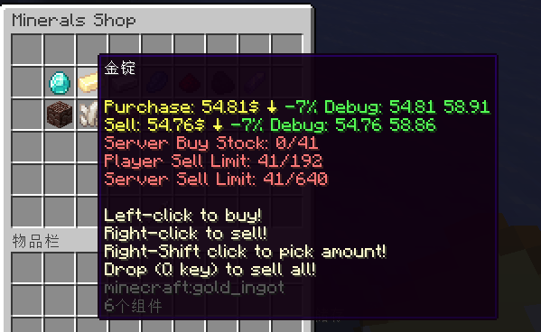

# 🔴 动态定价状态 - 仅付费版

## 动态定价状态

你可以在价格部分的数量选项中使用 `{status}` 变量，如下：

``` YAML
    buy-prices:
      1:
        economy-plugin: Vault
        amount: '550+{buy-times-server}*0.2-{sell-times-server}*0.1'
        max-amount: 5500
        min-amount: 325
        placeholder: '&6{amount} 硬币 {status}' # <--- 在这里使用 {status} 变量.
        start-apply: 0
```

需要注意的是，这个变量若要正常使用，需要确保 `amount` 选项中的第一个价格为基础价格。例如在这个示例中，**550** 就是基础价格。

你也可以在 `config.yml` 中启用 `add-status-in-dynamic-price-placeholder` 来让插件自动为你补全，你无需在每个价格变量下手动添加变量！

## 可用变量

* `{base}` - 动态定价的基本价格。在 `amount` 选项中的第一个数字会被当做基本价格。
* `{compare}` - 当前价格。

这些变量也可以在 `{compare_<xxx>}` 变量中使用。

## 价格百分比变化

如果你的数学够好，你可以自行计算基本价格与当前价格的百分比。如果不行，那么我可以把公式写在这里。

在 `config.yml` 中找到这些内容，并像本示例一样修改它：

``` YAML
  # 仅付费版本
  compare:
    up: '↑ &c+{math_(({compare}-{base})/{base}) * 100}% 调试: {compare} {base}'
    down: '↓ &a-{math_(({base}-{compare})/{base}) * 100}% 调试: {compare} {base}'
    same: '-'
```

## 展示

