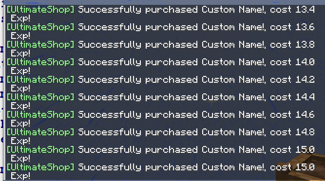

# 🔄 动态定价

## 启用数学功能

修改 `config.yml`：

* 将：

``` YAML
math:
  # 是否启用基本数学运算检测?
  # 仅对 + - * / 四种运算符进行识别.
  enabld: false
```

修改为

``` YAML
math:
  # 是否启用基本数学运算检测?
  # 仅对 + - * / 四种运算符进行识别.
  enabled: true
```

即可。

* 将：

``` YAML
placeholder:
  data:
    can-used-in-amount: false
```

修改为

``` YAML
placeholder:
  data:
    can-used-in-amount: true
```

即可。

## 在物品配置中设置动态值

打开你的商店配置，找到你需要启用动态定价的商品。

例如，我想为该商品启用：

``` YAML
  A:
    display-name: '自定义名称!'
    price-mode: ALL
    product-mode: CLASSIC_ALL
    products:
      1:
        material: sea_lantern
    buy-prices:
      1:
        economy-type: exp
        amount: '5+({buy-times-server}-{sell-times-server})*0.2'
        max-amount: 15
        min-amount: 1
        start-apply: 0
        placeholder: '{amount} 经验值'
    sell-prices:
      1:
        economy-type: exp
        amount: '5+({buy-times-server}-{sell-times-server})*0.2'
        max-amount: 15
        min-amount: 1
        start-apply: 0
        placeholder: '{amount} 经验值'
```

首先，你需要将 `price-mode` 设置为 `ALL` 或 `ANY`。

我在这里写的部分数量设置是数学表达式，如果你数学不好的话就让我给你解释：

- 5 为价格基数，即起始价格；
- 0.2 表示玩家每次交易后的加价，价格会随之变动。
- 我们也添加了诸如 `max-amount` 和 `min-amount` 选项，以防止价格变动幅度过大的情况出现。

这里设置的公式不作限制，但你需要谨慎设置，否则玩家有可能会出现借此刷取货币的情况。因此，`max-amount` 和 `min-amount` 是非常重要的。例如，你可以设置：

* 买价公式：`2.8+{buy-times-server}*0.1-{sell-times-server}*0.06`
* 卖价公式：`2.38+{buy-times-server}*0.1-{sell-times-server}*0.06`

因此，你的 `max-amount` 选项应当小于第 <font color="red">**n**</font> 次交易的价格。

那么，如何获得这个数字？很简单，它必须满足：

$\frac { 购买基础价 - 出售基础价 }  { 购买最高价 - 出售最低价 } \ge \sum_{i=1}^{n}i$ （即 $1+2+3+4+...+n$）

<!-- `(购买基础价 - 出售基础价) / (购买最高价 - 出售最低价) >= 1+2+...+n` -->

<!-- (2.8-2.38)/(0.1-0.06) >= 1+2+3+4 -->

在这个实例中，即：$\frac {2.8-2.38} {0.1-0.06} \ge \sum_{i=1}^{n}$，解得 $n=4$，即本示例中的 $\textcolor{red}{n}$ 为 4。

需要注意的是：<font color="red">不同的计算公式需要设置不同的 `max-amount` 和 `min-amount`。最安全的方法就是将交易价格修改为相同值。</font>



另一个普通的动态定价公式即为基于百分比修改价格，如：`100 * (1.5 ^ ({buy-times-server}-{sell-times-server}))`。在本示例中：

* **100** 为基础价格。
* **1.5** 为交易后价格倍率。
* 在本示例中，第一次只买不卖为 **100**，之后是 **150（+50%）**，之后是 **225（150+150*50%）**。
* 不要忘了设置 `min-amount` 为接近 **100** 的数，以防止价格过低！

## 可用变量

* \{buy-times-player\}
* \{buy-times-server\}
* \{sell-times-player\}
* \{sell-times-server\}
* \{last-buy-player\}
* \{last-buy-server\}
* \{last-sell-player\}
* \{last-sell-server\}

有关这些变量的更多信息，请浏览[该章节](placeholders.built-in-placeholder.md)。

## 单玩家动态定价

只要你可以确保在公式中使用的变量随玩家变化而变化，计算的价格自然也会如此。在上文的示例中，我们使用了诸如 `{buy-times-server}`，你只需要将 `server` 替换为 `player` 即可显示玩家自己的购买价格。相关内容也在“[变量](placeholders.built-in-placeholder.md)”中有所解释。

## 为物品设置交易限制

见“[物品](shops.products.md)”章节获取信息及示例。

## 重置动态定价

许多人都问了这个问题，问这些问题的人肯定没有了解 UltimateShop 的基础。动态定价是由公式决定的，所以你不能直接重置定价。若要这么做，你需要先重置你在公式中使用的变量。如果你使用了诸如上文提到的 `{buy-times-server}`，那么它们就可以被重置。

你可以通过“自动重置”功能重置交易次数，可以在“[交易次数重置](shops.product-config-buy-sell-times-reset.md)”章节中了解更多。