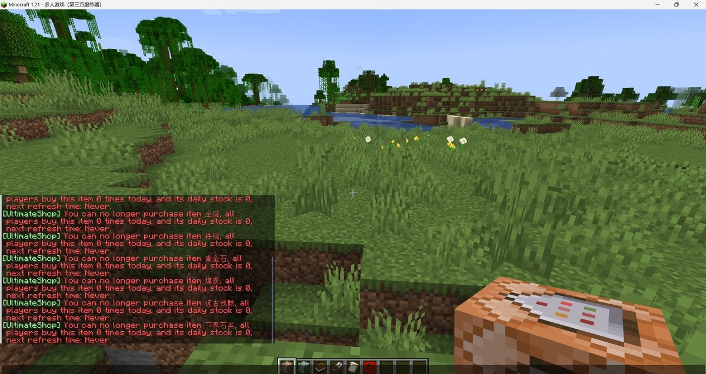

# 🌍 本地化物品名称 - 仅付费版

## 需求

* 服务器版本 1.16+

## 配置

* 打开 `config.yml`，并找到如下内容：

``` YAML
config-files:
  generate-default-files: true
  language: en_US
  minecraft-locate-file:
    enabled: true
    generate-new-one: true
    file: 'zh_cn.json'
```

* 将 `minecraft-locate-file.enabled` 选项设置为 `true`。
* 然后将 `minecraft-locate-file.generate-new-one` 选项设置为 `true`。
* 最后，根据你的本地文件名称设置选项。支持填入如下内容：
    * `af_za.json`
    * `ar_sa.json`
    * `ast_es.json`
    * `az_az.json`
    * `ba_ru.json`
    * `bar.json`
    * `be_by.json`
    * `bg_bg.json`
    * `br_fr.json`
    * `brb.json`
    * `bs_ba.json`
    * `ca_es.json`
    * `cs_cz.json`
    * `cy_gb.json`
    * `da_dk.json`
    * `de_at.json`
    * `de_ch.json`
    * `de_de.json`
    * `el_gr.json`
    * `en_au.json`
    * `en_ca.json`
    * `en_gb.json`
    * `en_nz.json`
    * `en_pt.json`
    * `en_ud.json`
    * `enp.json`
    * `enws.json`
    * `eo_uy.json`
    * `es_ar.json`
    * `es_cl.json`
    * `es_ec.json`
    * `es_es.json`
    * `es_mx.json`
    * `es_uy.json`
    * `es_ve.json`
    * `esan.json`
    * `et_ee.json`
    * `eu_es.json`
    * `fa_ir.json`
    * `fi_fi.json`
    * `fil_ph.json`
    * `fo_fo.json`
    * `fr_ca.json`
    * `fr_fr.json`
    * `fra_de.json`
    * `fur_it.json`
    * `fy_nl.json`
    * `ga_ie.json`
    * `gd_gb.json`
    * `gl_es.json`
    * `haw_us.json`
    * `he_il.json`
    * `hi_in.json`
    * `hr_hr.json`
    * `hu_hu.json`
    * `hy_am.json`
    * `id_id.json`
    * `ig_ng.json`
    * `io_en.json`
    * `is_is.json`
    * `isv.json`
    * `it_it.json`
    * `ja_jp.json`
    * `jbo_en.json`
    * `ka_ge.json`
    * `kk_kz.json`
    * `kn_in.json`
    * `ko_kr.json`
    * `ksh.json`
    * `kw_gb.json`
    * `la_la.json`
    * `lb_lu.json`
    * `li_li.json`
    * `lmo.json`
    * `lo_la.json`
    * `lol_us.json`
    * `lt_lt.json`
    * `lv_lv.json`
    * `lzh.json`
    * `mk_mk.json`
    * `mn_mn.json`
    * `ms_my.json`
    * `mt_mt.json`
    * `nah.json`
    * `nds_de.json`
    * `nl_be.json`
    * `nl_nl.json`
    * `nn_no.json`
    * `no_no.json`
    * `oc_fr.json`
    * `ovd.json`
    * `pl_pl.json`
    * `pt_br.json`
    * `pt_pt.json`
    * `qya_aa.json`
    * `ro_ro.json`
    * `rpr.json`
    * `ru_ru.json`
    * `ry_ua.json`
    * `sah_sah.json`
    * `se_no.json`
    * `sk_sk.json`
    * `sl_si.json`
    * `so_so.json`
    * `sq_al.json`
    * `sr_cs.json`
    * `sr_sp.json`
    * `sv_se.json`
    * `sxu.json`
    * `szl.json`
    * `ta_in.json`
    * `th_th.json`
    * `tl_ph.json`
    * `tlh_aa.json`
    * `tok.json`
    * `tr_tr.json`
    * `tt_ru.json`
    * `uk_ua.json`
    * `val_es.json`
    * `vi_vn.json`
    * `vp_vl.json`
    * `yi_de.json`
    * `yo_ng.json`
    * `zh_hk.json`
    * `zh_cn.json`
    * `zh_tw.json`
    * `zlm_arab.json`
* 例如我在这里输入了 `zh_cn.json`。启动服务器后，插件就会开始下载文件。
* 若下载成功，插件就会显示本地化物品名称，如下所示：



## 问题

你遇到问题了吗？试试看这些方法：

* 删除生成在 `plugins/UltimateShop` 的文件，使其重新生成。
* 你使用的是否为付费版本？只有付费版本才可以使用此功能。
* 插件是否在生成文件时报错？如果是的话，尝试重启服务器，插件会自动重生成文件。

## 注意

* 在生成文件后，请将 `generate-new-one` 选项改回 `false`。
* 若你的服务器更新了游戏版本，你需要删除旧的语言文件，重新生成一个新的。
* 关闭服务器后首次打开商店会导致服务器或插件卡顿，这是因为我们需要为这些本地化物品名称创建新缓存。正常情况下，这个问题不会很明显，除非你的商店中有很多物品。

## 其他方法

### 为物品设置自定义 `display-item` 选项

* 使用物品配置中的 `display-name` 选项。
* 这个方法需要为物品手动设置显示名称。

例如：

``` YAML
items:
  A:
    display-name: '苹果' # 添加的内容!
    products:
      1:
        material: APPLE
    buy-prices:
      1:
        economy-plugin: Vault
        amount: 10
```