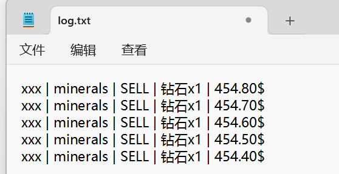

# 💳 日志记录 - 仅付费版

打开 `config.yml` 并找到如下内容：

``` YAML
log-transaction:
  enabled: true
  # 若留空, 则日志只会显示在控制台.
  file: ''
  format: '{player} | {shop} | {buy-or-sell} | {item-name}x{amount} | {price}'
```

* 若你将 `file` 选项留空，我们只会将日志显示在控制台。否则，我们会将其记录至你填入的文件中。该文件必须为 `.txt` 格式。

## 可用格式变量：

* `{player}`
* `{player-uuid}`
* `{item}` - 物品 ID
* `{item-name}` - 物品显示名称
* `{shop}` - 商店 ID
* `{shop-name}` - 商店显示名称
* `{buy-or-sell}`
* `{price}`

## 示例图片

