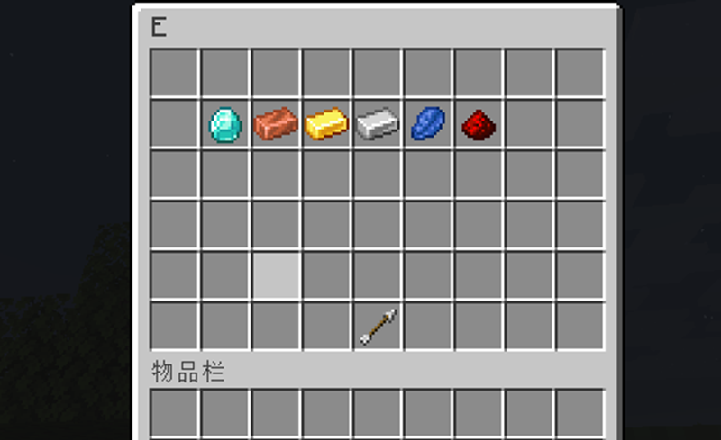

# 📅 示例：每日商店

本页没有任何描述，因为所有能说的都已经在“[商店](shops.shops.md)”提及过了。

## 创建随机变量

我们要先创建随机变量。这个变量可以与“[条件](format.condition-format.md)”组合使用，来实现每天商店中产生不同物品，以此完全达到每日商店插件的效果。

在本示例中，我们在 `random_placeholder` 文件夹下创建了一个名为 `daily.yml` 的随机变量文件。选项如下所述：

* `reset-mode` 与 `reset-time`：变量会每天刷新。
* `element-amount`：这个变量会在刷新时随机选择五个元素，与商店中刷新的物品数量一致。
* `elements`：返回内容决定了商店中出现的物品。所以元素的数量应当与商店中可能出现的物品数量相同。


* 在本示例中，每日商店会有五个格子，七个不同的物品，意味着每天都会隐藏随机的两个物品，剩余五个物品则会被展示在商店的货架上。
* 请参阅“[随机变量](placeholders.random-placeholder-premium.md)”章节来获取更多有关随机变量的信息。

``` YAML
reset-mode: TIMED
reset-time: '00:00:00'
element-amount: 5
elements:
  - 'A'
  - 'B'
  - 'C'
  - 'D'
  - 'E'
  - 'F'
  - 'G'
```

## 配置商店

本示例使用的多个选项都在“[商店](shops.shops.md)”章节中提及。如果你对其中的选项功能有疑问，可以前往这个章节了解。



``` YAML
settings:
  menu: 'example-shop-menu'
  buy-more: true
  shop-name: '每日商店'
  hide-message: false

general-configs:
  price-mode: CLASSIC_ANY
  product-mode: CLASSIC_ANY
  display-item:
    1:
      material: REDSTONE
      amount: 1
      name: '&e红石'
      lore:
        - '&f今日出售:'
        - '&7  - 红石'
    2:
      material: IRON_INGOT
      amount: 1
      name: '&e铁锭'
      lore:
        - '&f今日出售:'
        - '&7  - 铁锭'
    3:
      material: GOLD_INGOT
      amount: 1
      name: '&e金锭'
      lore:
        - '&f今日出售:'
        - '&7  - 金锭'
    4:
      material: COPPER_INGOT
      amount: 1
      name: '&e铜锭'
      lore:
        - '&f今日出售:'
        - '&7  - 铜锭'
    5:
      material: DIAMOND
      amount: 1
      name: '&e钻石'
      lore:
        - '&f今日出售:'
        - '&7  - 钻石'
    6:
      material: LAPIS_LAZULI
      amount: 1
      name: '&eLapis lazuli'
      lore:
        - '&f今日出售:'
        - '&7  - 钻石'
    7:
      material: EMERALD
      amount: 1
      name: '&e绿宝石'
      lore:
        - '&f今日出售:'
        - '&7  - 绿宝石'
  products:
    1:
      material: REDSTONE
      amount: 1
    2:
      material: IRON_INGOT
      amount: 1
    3:
      material: GOLD_INGOT
      amount: 1
    4:
      material: COPPER_INGOT
      amount: 1
    5:
      material: DIAMOND
      amount: 1
    6:
      material: LAPIS_LAZULI
      amount: 1
    7:
      material: EMERALD
      amount: 1
  sell-prices:
    1:
      economy-plugin: Vault
      amount: 1
      placeholder: '&6{amount} 硬币'
      start-apply: 0
  sell-limits:
    global: 640
    default: 18
    vip: 256
  sell-limits-conditions:
    vip:
      - 'permission: group.vip'
  sell-limits-reset-mode: 'TIMED'
  sell-limits-reset-time: '00:00:00'

items:
  A:
    sell-prices:
      1:
        economy-plugin: Vault
        amount: 1
        placeholder: '&6{amount} 硬币'
        start-apply: 0
    display-item-conditions:
      1: 
        1: 
          type: placeholder
          placeholder: '{random_daily;;1}'
          rule: '=='
          value: 'A'
      2: 
        1:
          type: placeholder
          placeholder: '{random_daily;;1}'
          rule: '=='
          value: 'B'
      3:
        1:
          type: placeholder
          placeholder: '{random_daily;;1}'
          rule: '=='
          value: 'C'
      4:
        1:
          type: placeholder
          placeholder: '{random_daily;;1}'
          rule: '=='
          value: 'D'
      5:
        1:
          type: placeholder
          placeholder: '{random_daily;;1}'
          rule: '=='
          value: 'E'
      6:
        1:
          type: placeholder
          placeholder: '{random_daily;;1}'
          rule: '=='
          value: 'F'
      7:
        1:
          type: placeholder
          placeholder: '{random_daily;;1}'
          rule: '=='
          value: 'G'
    products-conditions:
      1: 
        1: 
          type: placeholder
          placeholder: '{random_daily;;1}'
          rule: '=='
          value: 'A'
      2: 
        1:
          type: placeholder
          placeholder: '{random_daily;;1}'
          rule: '=='
          value: 'B'
      3:
        1:
          type: placeholder
          placeholder: '{random_daily;;1}'
          rule: '=='
          value: 'C'
      4:
        1:
          type: placeholder
          placeholder: '{random_daily;;1}'
          rule: '=='
          value: 'D'
      5:
        1:
          type: placeholder
          placeholder: '{random_daily;;1}'
          rule: '=='
          value: 'E'
      6:
        1:
          type: placeholder
          placeholder: '{random_daily;;1}'
          rule: '=='
          value: 'F'
      7:
        1:
          type: placeholder
          placeholder: '{random_daily;;1}'
          rule: '=='
          value: 'G'
  B:
    display-item-conditions:
      1: 
        1: 
          type: placeholder
          placeholder: '{random_daily;;2}'
          rule: '=='
          value: 'A'
      2: 
        1:
          type: placeholder
          placeholder: '{random_daily;;2}'
          rule: '=='
          value: 'B'
      3:
        1:
          type: placeholder
          placeholder: '{random_daily;;2}'
          rule: '=='
          value: 'C'
      4:
        1:
          type: placeholder
          placeholder: '{random_daily;;2}'
          rule: '=='
          value: 'D'
      5:
        1:
          type: placeholder
          placeholder: '{random_daily;;2}'
          rule: '=='
          value: 'E'
      6:
        1:
          type: placeholder
          placeholder: '{random_daily;;2}'
          rule: '=='
          value: 'F'
      7:
        1:
          type: placeholder
          placeholder: '{random_daily;;2}'
          rule: '=='
          value: 'G'
    products-conditions:
      1: 
        1: 
          type: placeholder
          placeholder: '{random_daily;;2}'
          rule: '=='
          value: 'A'
      2: 
        1:
          type: placeholder
          placeholder: '{random_daily;;2}'
          rule: '=='
          value: 'B'
      3:
        1:
          type: placeholder
          placeholder: '{random_daily;;2}'
          rule: '=='
          value: 'C'
      4:
        1:
          type: placeholder
          placeholder: '{random_daily;;2}'
          rule: '=='
          value: 'D'
      5:
        1:
          type: placeholder
          placeholder: '{random_daily;;2}'
          rule: '=='
          value: 'E'
      6:
        1:
          type: placeholder
          placeholder: '{random_daily;;2}'
          rule: '=='
          value: 'F'
      7:
        1:
          type: placeholder
          placeholder: '{random_daily;;2}'
          rule: '=='
          value: 'G'
  C:
    display-item-conditions:
      1: 
        1: 
          type: placeholder
          placeholder: '{random_daily;;3}'
          rule: '=='
          value: 'A'
      2: 
        1:
          type: placeholder
          placeholder: '{random_daily;;3}'
          rule: '=='
          value: 'B'
      3:
        1:
          type: placeholder
          placeholder: '{random_daily;;3}'
          rule: '=='
          value: 'C'
      4:
        1:
          type: placeholder
          placeholder: '{random_daily;;3}'
          rule: '=='
          value: 'D'
      5:
        1:
          type: placeholder
          placeholder: '{random_daily;;3}'
          rule: '=='
          value: 'E'
      6:
        1:
          type: placeholder
          placeholder: '{random_daily;;3}'
          rule: '=='
          value: 'F'
      7:
        1:
          type: placeholder
          placeholder: '{random_daily;;3}'
          rule: '=='
          value: 'G'
    products-conditions:
      1: 
        1: 
          type: placeholder
          placeholder: '{random_daily;;3}'
          rule: '=='
          value: 'A'
      2: 
        1:
          type: placeholder
          placeholder: '{random_daily;;3}'
          rule: '=='
          value: 'B'
      3:
        1:
          type: placeholder
          placeholder: '{random_daily;;3}'
          rule: '=='
          value: 'C'
      4:
        1:
          type: placeholder
          placeholder: '{random_daily;;3}'
          rule: '=='
          value: 'D'
      5:
        1:
          type: placeholder
          placeholder: '{random_daily;;3}'
          rule: '=='
          value: 'E'
      6:
        1:
          type: placeholder
          placeholder: '{random_daily;;3}'
          rule: '=='
          value: 'F'
      7:
        1:
          type: placeholder
          placeholder: '{random_daily;;3}'
          rule: '=='
          value: 'G'
  D:
    display-item-conditions:
      1: 
        1: 
          type: placeholder
          placeholder: '{random_daily;;4}'
          rule: '=='
          value: 'A'
      2: 
        1:
          type: placeholder
          placeholder: '{random_daily;;4}'
          rule: '=='
          value: 'B'
      3:
        1:
          type: placeholder
          placeholder: '{random_daily;;4}'
          rule: '=='
          value: 'C'
      4:
        1:
          type: placeholder
          placeholder: '{random_daily;;4}'
          rule: '=='
          value: 'D'
      5:
        1:
          type: placeholder
          placeholder: '{random_daily;;4}'
          rule: '=='
          value: 'E'
      6:
        1:
          type: placeholder
          placeholder: '{random_daily;;4}'
          rule: '=='
          value: 'F'
      7:
        1:
          type: placeholder
          placeholder: '{random_daily;;4}'
          rule: '=='
          value: 'G'
    products-conditions:
      1: 
        1: 
          type: placeholder
          placeholder: '{random_daily;;4}'
          rule: '=='
          value: 'A'
      2: 
        1:
          type: placeholder
          placeholder: '{random_daily;;4}'
          rule: '=='
          value: 'B'
      3:
        1:
          type: placeholder
          placeholder: '{random_daily;;4}'
          rule: '=='
          value: 'C'
      4:
        1:
          type: placeholder
          placeholder: '{random_daily;;4}'
          rule: '=='
          value: 'D'
      5:
        1:
          type: placeholder
          placeholder: '{random_daily;;4}'
          rule: '=='
          value: 'E'
      6:
        1:
          type: placeholder
          placeholder: '{random_daily;;4}'
          rule: '=='
          value: 'F'
      7:
        1:
          type: placeholder
          placeholder: '{random_daily;;4}'
          rule: '=='
          value: 'G'
  E:
    display-item-conditions:
      1: 
        1: 
          type: placeholder
          placeholder: '{random_daily;;5}'
          rule: '=='
          value: 'A'
      2: 
        1:
          type: placeholder
          placeholder: '{random_daily;;5}'
          rule: '=='
          value: 'B'
      3:
        1:
          type: placeholder
          placeholder: '{random_daily;;5}'
          rule: '=='
          value: 'C'
      4:
        1:
          type: placeholder
          placeholder: '{random_daily;;5}'
          rule: '=='
          value: 'D'
      5:
        1:
          type: placeholder
          placeholder: '{random_daily;;5}'
          rule: '=='
          value: 'E'
      6:
        1:
          type: placeholder
          placeholder: '{random_daily;;5}'
          rule: '=='
          value: 'F'
      7:
        1:
          type: placeholder
          placeholder: '{random_daily;;5}'
          rule: '=='
          value: 'G'
    products-conditions:
      1: 
        1: 
          type: placeholder
          placeholder: '{random_daily;;5}'
          rule: '=='
          value: 'A'
      2: 
        1:
          type: placeholder
          placeholder: '{random_daily;;5}'
          rule: '=='
          value: 'B'
      3:
        1:
          type: placeholder
          placeholder: '{random_daily;;5}'
          rule: '=='
          value: 'C'
      4:
        1:
          type: placeholder
          placeholder: '{random_daily;;5}'
          rule: '=='
          value: 'D'
      5:
        1:
          type: placeholder
          placeholder: '{random_daily;;5}'
          rule: '=='
          value: 'E'
      6:
        1:
          type: placeholder
          placeholder: '{random_daily;;5}'
          rule: '=='
          value: 'F'
      7:
        1:
          type: placeholder
          placeholder: '{random_daily;;5}'
          rule: '=='
          value: 'G'
```

## 常问：过于复杂？

自 3.4.3 开始，你可以自定义**单条目**的条件键名。如果你确认你的物品、买价与卖价使用了相同的条件，你可以将其键名设置为相同的值，避免重复设置条件。你可以在 `config.yml` 下找到这些设置：

``` YAML
conditions:
  products-key: 'conditions'
  buy-prices-key: 'conditions'
  sell-prices-key: 'conditions'
  display-item-key: 'conditions'
```

这个实例让所有 `conditions` 键值使用同一个值，所以商店配置应该看起来像：

``` YAML
items:
  A:
    price-mode: CLASSIC_ANY
    product-mode: CLASSIC_ANY
    products:
      one:
        material: REDSTONE
        amount: 1
        give-actions:
          1:
            type: message
            message: 'Hello!'
      two:
        material: IRON_INGOT
        amount: 1
    sell-prices:
      one:
        economy-plugin: Vault
        amount: 1
        placeholder: '&6{amount} 硬币'
        start-apply: 0
      two:
        economy-plugin: Vault
        amount: 3
        placeholder: '&6{amount} 硬币'
        start-apply: 0
    conditions:
      one:
        1:
          type: placeholder
          placeholder: '{random_daily}'
          rule: '=='
          value: 'A'
      two:
        1:
          type: placeholder
          placeholder: '{random_daily}'
          rule: '=='
          value: 'B'
```

在这个实例中，若满足条件 **one**，我们也会使用 ID 为 **one** 的售价与物品。

对于动作，推荐你在单条目中使用 `give-actions`，而非 `buy-actions` 或 `sell-actions`，因为它们的条件相互分离且不可与单条目条件同步，配置它们会更加困难。 

## 常问：所有物品价格相同？

这是因为你只在这里创建了一个无条件的价格，这会导致所有物品价格相同。若你不需要这样，你可以通过设置 `display-item` 与 `products` 自定义价格。

例如：

``` YAML
general-configs:
  sell-prices:
    1:
      economy-plugin: Vault
      amount: 1
      placeholder: '&6{amount} 硬币'
      start-apply: 0

items:
  sell-prices-conditions:
    1:
      # 条件...
```

`procudts` 会从其对应的条件选项中分离，因为它们在你的商店里是固定的，因此每个格子都有相同的 `products` 选项。但是，每个格子随机选定的物品不是固定的，因此 `conditions` 选项需要分开设置。