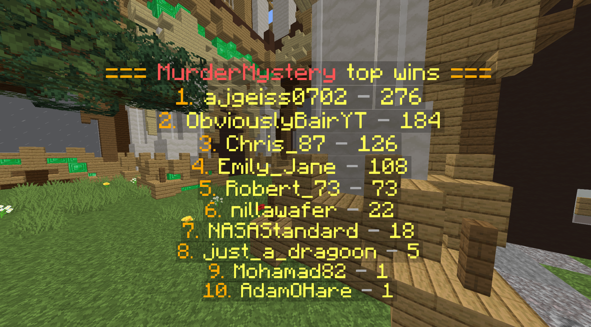

# 安装

这里是设置本插件的步骤。如果遇到任何问题，请联系我（最好在 Discord 上，邀请链接在插件介绍中）

请确保安装插件时拥有权限 `ajleaderboards.use`。

## 1.（必需）找到使用的变量

ajLeaderboards 通过读取玩家在插件中浏览的变量进行排序。正因如此，插件得以支持许多带有变量的插件而无需开发者兼容。

你可以在[这里](https://placeholderapi.com/placeholders)找到可用的变量列表。此列表显示的不是全部变量，而是 PAPI 开发团队及其他插件开发者共同提供的变量。

你选择的变量只可以返回正常数字。这个数字可以有逗号分隔符，但不能有其他格式，同样不能有其他文本。

::: tip 重要内容

在选择使用变量的时候，请确保它不是对应插件的排行榜变量。简单的判断方法就是看看变量名称上有没有诸如“leaderboard”或“top”的类似单词。其他插件的排行榜变量不可以与本插件的变量一起正常工作。

> ::: info 为什么我不能这么做？
> 
> ajLeaderboards 是给那些没有内置排行榜功能的插件提供排行榜的。如果插件已经有内置的排行榜，你可以使用它们。
> ajLeaderboards 通过以玩家身份判断变量（如 `%vault_eco_balance` 来获取玩家的余额） ，再存储它们的值。然后插件将其整理并呈现>在排行榜上。
> :::

部分可使用的变量为 `%vault_eco_balance%`、`%statistic_player_kills%`、`%buildbattle_wins%`、`%statistic_time_played%`、`%villagedefense_kills%`、`%ajpk_stats_highscore%`，以及 `%thebridge_points%`

:::

在本教程中，我会以 `%statistic_player_kills%` 为例子，制作一个击杀排行榜。

## 2.（必需）将变量添加至本插件

在你选择了要使用的变量之后，你需要将变量注册至本插件，这样我们才能开始记录变量的内容并生成排行榜。

若要添加一个变量，请输入命令 `/ajlb add %变量%`，请确保将 `%变量%` 替换为你在第一步选择的变量。

以击杀数为例，我输入的命令是 `/ajlb add %statistic_player_kills%`。

现在你已经添加了变量，请注意 `<排行榜名称>` 是你在命令中添加的变量名称（去掉 % 符号）

**注意：** 任何拥有 [`ajleaderboards.dontupdate.<排行榜名称>`](setup.permissions.md) 的玩家不会被添加至排行榜中。

更多信息[见此](faq.md)。

## 3.（可选）在悬浮字中显示排行榜

如果你需要的话，你可以在悬浮字中显示排行榜。

若要在悬浮字中显示排行榜，你只需使用 [PAPI 变量](setup.placeholders.md)。

你可以使用任何支持 PlaceholderAPI 变量的悬浮字插件。个人推荐使用 [DecentHolograms](https://www.spigotmc.org/resources/decent-holograms-1-8-1-19-papi-support-no-dependencies.96927/)。

多数服主会用到 `%ajlb_lb_<排行榜名称>_<排名>_<时间类型>_name%` 与 `%ajlb_lb_<排行榜名称>_<排名>_<时间类型>_value%`。

`<排行榜名称>` 即为排行榜的名称，而 `<排名>` 即为显示的对应名次，`<时间类型>` 则为刷新时间类型（如 alltime（全时））。

下文可以找到示例排行榜中使用的变量。

### 示例

这里是 MurderMystery **全时**胜场排行榜。

在本实例中，每行都代表悬浮字的一行。

```
&6=== &c谁是杀手&e 胜场排行榜 &6===
&61. &e%ajlb_lb_murdermystery_wins_1_alltime_name% &7- &e%ajlb_lb_murdermystery_wins_1_alltime_value%
&62. &e%ajlb_lb_murdermystery_wins_2_alltime_name% &7- &e%ajlb_lb_murdermystery_wins_2_alltime_value%
&63. &e%ajlb_lb_murdermystery_wins_3_alltime_name% &7- &e%ajlb_lb_murdermystery_wins_3_alltime_value%
&64. &e%ajlb_lb_murdermystery_wins_4_alltime_name% &7- &e%ajlb_lb_murdermystery_wins_4_alltime_value%
&65. &e%ajlb_lb_murdermystery_wins_5_alltime_name% &7- &e%ajlb_lb_murdermystery_wins_5_alltime_value%
&66. &e%ajlb_lb_murdermystery_wins_6_alltime_name% &7- &e%ajlb_lb_murdermystery_wins_6_alltime_value%
&67. &e%ajlb_lb_murdermystery_wins_7_alltime_name% &7- &e%ajlb_lb_murdermystery_wins_7_alltime_value%
&68. &e%ajlb_lb_murdermystery_wins_8_alltime_name% &7- &e%ajlb_lb_murdermystery_wins_8_alltime_value%
&69. &e%ajlb_lb_murdermystery_wins_9_alltime_name% &7- &e%ajlb_lb_murdermystery_wins_9_alltime_value%
&610. &e%ajlb_lb_murdermystery_wins_10_alltime_name% &7- &e%ajlb_lb_murdermystery_wins_10_alltime_value%
```

悬浮字实际效果如下：



如果悬浮字不显示（只显示原来带百分号的一串字），请确保你的悬浮字插件支持 PlaceholderAPI 变量。如果不支持，我还是推荐你使用 [DecentHolograms](https://www.spigotmc.org/resources/decent-holograms-1-8-1-19-papi-support-no-dependencies.96927/)。

## 4.（可选）通过告示牌显示排行榜

你也可以在告示牌上显示排行榜。

若要生成告示牌排行榜，只需放置空白告示牌（每块告示牌都能容纳一名玩家及其分数）

为了将内容添加至告示牌，请输入命令 `/ajlb signs add <排行榜名称> <排名> <时间类型>`

例如，使用先前提及的变量（`statistic_player_kills`），如果你想要显示全时排行的第一名玩家，则你需要看向告示牌并输入命令 `/ajlb signs add statistic_player_kills 1 alltime`。

## 5.（可选）使用头颅显示排行榜

你也可以通过头颅显示排行榜。

与上一步骤相同，只需将头颅放置在告示牌上方或前方，皮肤会自动显示。

## 6.（可选）使用盔甲架显示排行榜

本插件也支持使用盔甲架显示头颅。

与上一步骤相同，只需将盔甲架放置在告示牌上方或前方，带皮肤的头颅会自动显示。

## 7.（可选）使用 NPC 显示排行榜

如果想要使用 NPC 显示排行榜，你可以安装 [Citizens](https://www.spigotmc.org/resources/citizens.13811/) 插件。

请确保你的插件是最新版本。

之后，创建一个 NPC。然后将 NPC 的皮肤设置为本插件的排行榜名称变量，将名称设置为排行榜的分数变量。示例如下。

如果你想要改变 NPC 刷新的速度，你可以修改 Citizens 插件配置中的 `placeholder-update-frequency-ticks`。

### 示例

在这个示例中，我创建了一个显示 `statistic_player_kills` 全时排行第一玩家的 NPC.

1. 按上述步骤创建皮肤和名称为对应变量的 NPC。这个命令会让 NPC 的名称在本示例中变为 `ajgeiss0702 - 12 kills`。

```
/npc create &a%ajlb_lb_statistic_player_kills_1_alltime_name% &7- &6%ajlb_lb_statistic_player_kills_1_alltime_value% kills
```

2. 将皮肤设置为变量

```
/npc skin %ajlb_lb_statistic_player_kills_1_alltime_skin%
```

## 8.（可选）设置时间排行榜

与普通的全时（`alltime`）排行榜一样，你也可以创建每小时、每日、每周、每月或每年刷新一次的排行榜。

::: info 注意

创建定时刷新排行榜前，需要注意的是这只对某些变量有效。

你只能为那些累积性（随时间增加）的变量制作排行榜。

例如，你**可以**制作击杀数、投票数等的定时排行榜。    
但是你**不能**制作诸如最高分的排行榜。

你仍然可以为那些非累积性的变量制作排行榜，但你只应该用 `alltime`。其他时间类型不会正常工作。

:::

若要创建一个定时刷新的排行榜，你需要先遵照步骤 1 与 2 创建一个全时计分板。如果你已经创建了一个全时排行榜，则无需重复步骤。

在向本插件添加变量之后，若要显示时间排行榜，使用方法与上文的 `alltime` 一致，但你需要将它们修改成对应的时间类型。

有效时间类型为 `alltime` `hourly` `daily` `weekly` `monthly` 和 `yearly`。

例如，如果你想要修改上述的全时悬浮字排行榜，至每月刷新，修改后应当是这样的：

```
&61. &e%ajlb_lb_murdermystery_wins_1_monthly_name% &7- &e%ajlb_lb_murdermystery_wins_1_monthly_value%
&62. &e%ajlb_lb_murdermystery_wins_2_monthly_name% &7- &e%ajlb_lb_murdermystery_wins_2_monthly_value%
&63. &e%ajlb_lb_murdermystery_wins_3_monthly_name% &7- &e%ajlb_lb_murdermystery_wins_3_monthly_value%
&64. &e%ajlb_lb_murdermystery_wins_4_monthly_name% &7- &e%ajlb_lb_murdermystery_wins_4_monthly_value%
&65. &e%ajlb_lb_murdermystery_wins_5_monthly_name% &7- &e%ajlb_lb_murdermystery_wins_5_monthly_value%
&66. &e%ajlb_lb_murdermystery_wins_6_monthly_name% &7- &e%ajlb_lb_murdermystery_wins_6_monthly_value%
&67. &e%ajlb_lb_murdermystery_wins_7_monthly_name% &7- &e%ajlb_lb_murdermystery_wins_7_monthly_value%
&68. &e%ajlb_lb_murdermystery_wins_8_monthly_name% &7- &e%ajlb_lb_murdermystery_wins_8_monthly_value%
&69. &e%ajlb_lb_murdermystery_wins_9_monthly_name% &7- &e%ajlb_lb_murdermystery_wins_9_monthly_value%
&610. &e%ajlb_lb_murdermystery_wins_10_monthly_name% &7- &e%ajlb_lb_murdermystery_wins_10_monthly_value%
```

需要注意的是变量中的 `<时间类型>` 从 `alltime` 变成了 `monthly`。