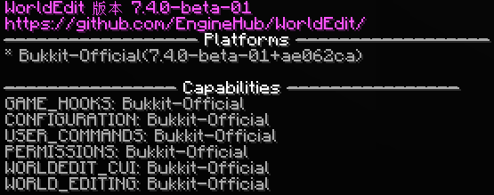
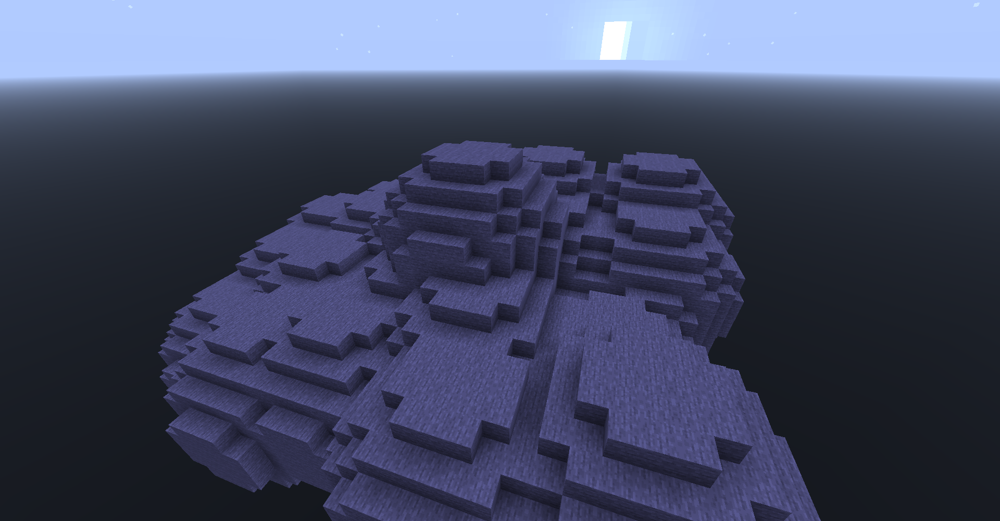
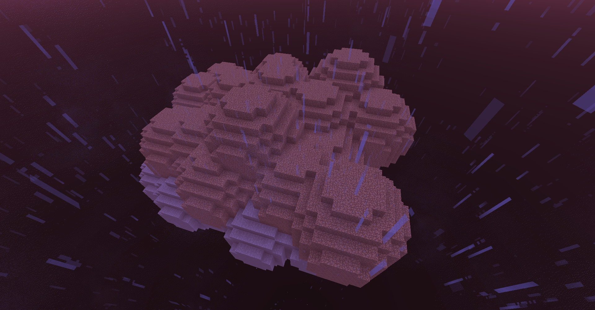
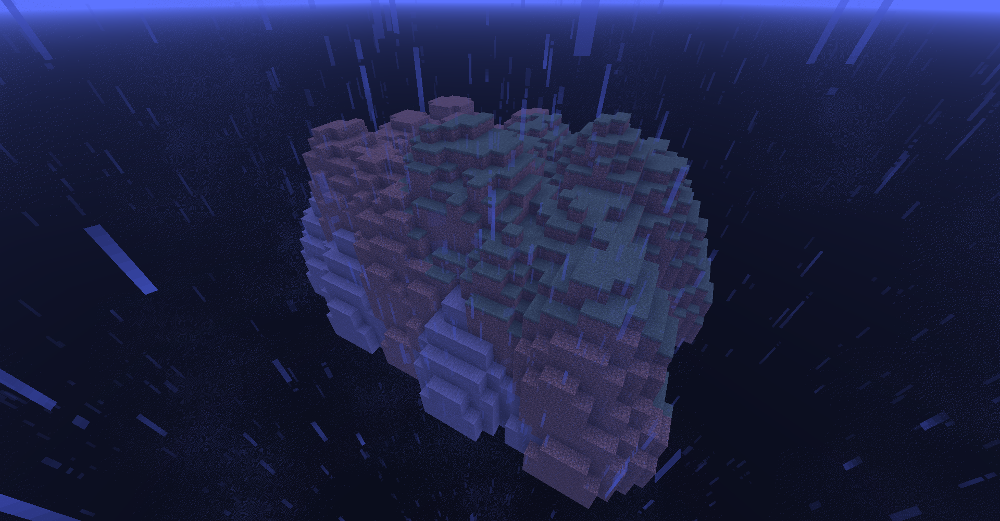
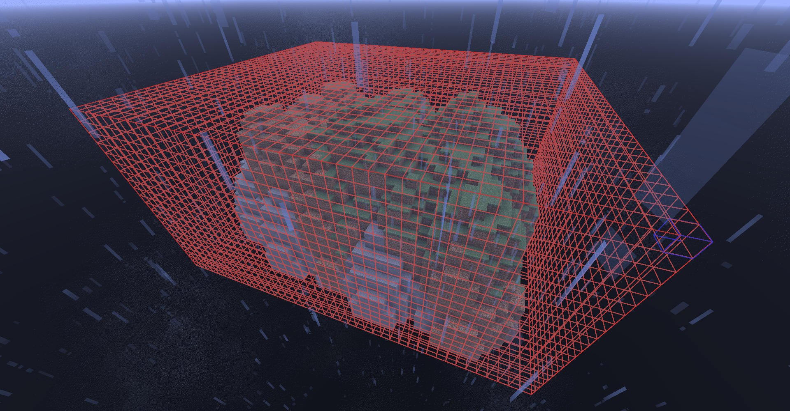
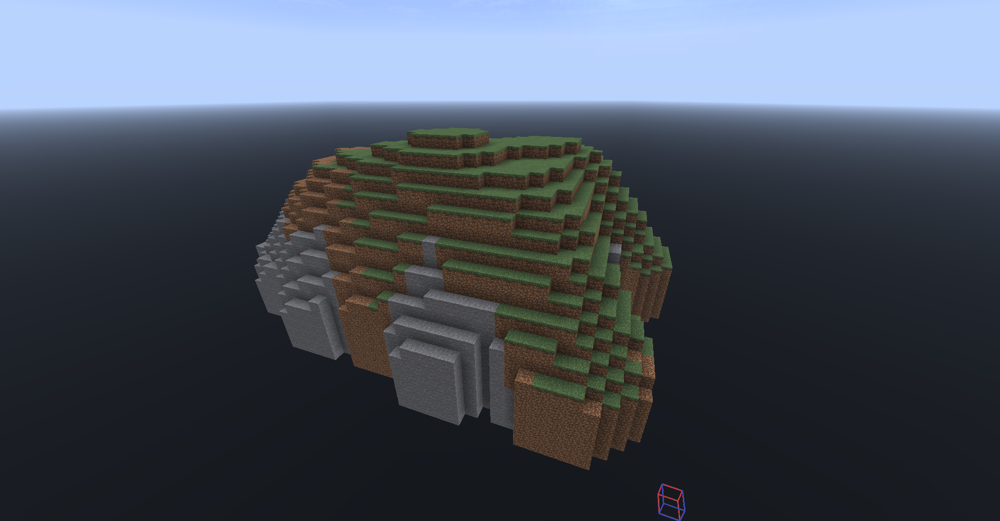
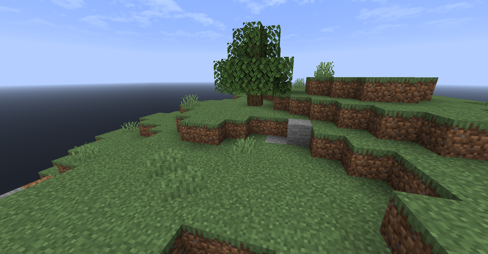

# 使用 WE 制作简单封闭地形

维基部分讲过，WorldEdit 是一款功能强大的地图编辑软件，它提供了包括笔刷、造树、地形平滑、范围替换、生成物体等提升制作地图的效率。如果你是一位负责制作地图的管理，那么使用 WE 甚至更高级的 VoxelSniper 或者 Axiom 都是非常有必要的。不过，因为这个章节是为新手准备的，我们只会在下文讲述如何使用 WorldEdit 制作简单的地形。

## 准备

你需要准备如下插件或者服务端：

* 任意支持 WorldEdit 运行的服务端核心及版本
  - 本教程选择 1.21.4 Purpur，你可以在 [PurpurMC 官网](https://api.purpurmc.org/v2/purpur/1.21.4/2416/download)下载到开服核心文件。
* [WorldEdit](https://modrinth.com/plugin/worldedit)
  - 也可使用 [FastAsyncWorldEdit](https://modrinth.com/plugin/fastasyncworldedit)，不过不推荐在高版本使用，因为它有尚未解决的严重编辑漏洞。
* [WorldEdit CUI](https://modrinth.com/mod/worldedit-cui) 模组（可选），[WorldEditSelectionVisualizer](https://www.spigotmc.org/resources/17311/)插件，或 [WorlddEditSUI](https://www.spigotmc.org/resources/60726/) 插件。它们可以显示你的选择区域，有助于你提高编辑效率。

## 教程

### 1. 首先，安装插件，并启动服务器。如果你已经安装了插件，则可以跳过。

### 2. 输入命令 [`/worldedit version`](../../wiki/WorldEdit/commands.md#通用命令)，如果你见到了如下消息，则说明插件安装成功。



### 3. 根据你需要的副本类型，创建[笔刷](../../wiki/WorldEdit/usage/brushes.md)。

创建笔刷的基本命令是 `//brush [形状] [方块构成] [半径]`。输入命令后，笔刷会被绑定在你手持的物品上。因此，绑定笔刷不能空手进行，否则会返回错误提示。


|参数名称|解释|示例值|
|---|---|---|
|形状|笔刷的形状。在本教程中，我们只需要用到球形的笔刷。WorldEdit 自带了许多类型的笔刷，更多内容可以浏览上述的文章。|`sphere`（球形笔刷）|
|方块构成|笔刷里包含的方块，也就是笔刷“涂抹”后生成的方块。可以用英文逗号 `,` 表示多个方块。|`stone`（“涂抹”时放置石头）<br>`stone,dirt`（“涂抹”时放置石头与泥土的混合方块）|
|半径|笔刷的大小。默认配置下最大值为 5。设置得太大可能会导致服务器在你绘制地形的时候产生卡顿。|`5`（默认配置下允许的最大值）|

根据上述解释，我们先试着拿出一根木棍，再输入命令为其绑定一个**半径为 4，组成为石头（`stone`）的球形笔刷**吧！

::: details 偷看一眼答案？

半径为 4，组成为石头（`stone`），球形笔刷：

``` txt
//brush sphere stone 4
```

:::

::: tip

你可以通过 TAB 键补全提高输入方块名称的速度！

:::

### 4. 绑定完成后，你就可以在世界中通过右键点击涂抹笔刷。



### 5. 按相同的方法为石头上覆盖一层泥土或者草方块。

::: tip

如果你使用的是泥土，你可能需要使用 `//green [半径]` 把周围的泥土替换成草皮。

:::




### 6. 使用重力笔刷压实地形。

重力笔刷是一类特殊的笔刷，它可以让作用范围内的方块立即坠落到最下层的方块，如果底层是虚空，那么它会落在最底层的位置。这个画笔可以用来排空球形笔刷涂抹过程中产生的空洞。

重力笔刷的绑定命令是 `//brush gravity [半径]`。



### 7. 使用小木斧选中你的地形。

你既可以用传统的搭方块设置选区的两个角点，也可以直接选中地面，再用 `//expand [距离]` 将选区朝你看着的方向拓宽。

::: tip 选太多了怎么办？

你可以用 `//contract [距离]` 命令，用相同的方式收缩选区。

:::



这里的红色框是 WorldEdit CUI 带来的效果。\
如果你安装的是上述的两个插件，那么这里有可能是火焰粒子。

### 8. 使用地形平滑命令。

地形平滑（`//smooth [重复次数]`）是本次教程中非常重要的一个指令。它可以让你的地形趋于平滑，更加自然。虽然没有像专业的地形编辑用户那样有酷炫的地形，但是造出一片简单美观的山丘已经非常足够了。

直接输入 `//smooth` 表示执行一次地形平滑。输入 `//smooth 10` 表示对区域内同时施加十次连续的地形平滑。



大功告成！现在，你有了一块相对圆滑的地形。封闭式的地形也可以用相同的方法制作。

### 9.（进阶）利用树木笔刷与植被命令布置简单的装饰

顾名思义，树木笔刷就是在玩家点击的位置生成一棵树。

命令的用法是 `/tree [树种]`，在这个例子中，我们以橡树（`oak`）为例。\
站在你需要的位置，输入 `/tree oak`，笔刷就会绑定在你当前的物品上。\
这时点击地面，一棵树就会生成在这里。

::: tip 卡在树里怎么办？

试试看输入命令 `/unstuck`，它可以把你从方块中解救出来！

:::


再次圈定选区，输入命令 `//flora [密度]`，插件就会为你在区域里生成植被。



这个命令与直接使用骨粉的效果差别不大，它还会为你贴心地往草堆里插花。如果你想要让植被更茂盛一些，试试输入命令 `//flora 80`，这可以让植被密度达到 80%。\
除此之外，命令在区域内生成的植被类型还和生物群系有关系，如果你知道如何通过命令修改选区的生物群系，你就可以让这个命令在区域里生成丛林的蕨类植物。

## 总结

* 通过命令绑定笔刷，修正地形
* 在选区内通过命令平滑地形
* 通过命令与笔刷添加植被，进一步美化地形