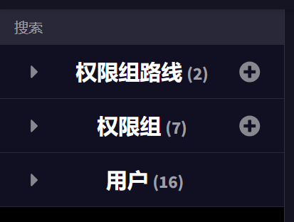
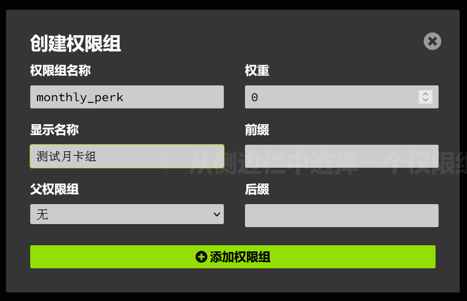

# LuckPerms 月卡权限、指定时间段权限

::: tip

浏览本章节视作你已经学会了 LuckPerms 部分最基础的操作。

:::

## 月卡权限

首先，使用 `/lp editor` 打开编辑器，在编辑器左侧点击新建权限组，名称随意。本示例将以 `monthly_perk` 为例。





随后，通过编辑器向组内添加一系列你需要让月卡组拥有的权限。

这样，月卡组的基本功能就已经做好了。

之后，找到配置文件 `config.yml` 中的 [`temporary-add-behaviour`](../../wiki/LuckPerms/configuration.md#temporary-add-behaviour)，将其改为 `accmulate`（取决于你想让玩家能够连续续费，还是月卡结束时才可以再次购买） 

最后，通过[临时继承命令](../../wiki/LuckPerms/command-usage/parent.md#lp-usergroup-玩家权限组-parent-addtemp-权限组-时间-施加模式-情境)，为玩家临时继承这个权限组。

``` txt
/lp user <玩家> parent addtemp monthly_perk 1mo accmulate
```

## 指定时间段权限

这个功能还是要用到 LuckPerms。除此之外还需要一个任意的，支持指定时间点触发的定时命令。

这里将以 [CommandTimer](../../wiki/CommandTimer/index.md) 为例。

首先，确定好限时权限的开始和结束时间。比如，我希望 `permission.test.a` 权限在每天 `0:00-1:00` 时有效，持续一小时。那么，我们就可以把问题简化为：在 0:00 时给予持续时间为一小时的对应权限。

因此，我们可以这么做：

打开 CommandTimer 的配置界面，设置定时执行（0:00），命令如下：

``` txt
/lp group default permission settemp permission.test.a true 1h
```