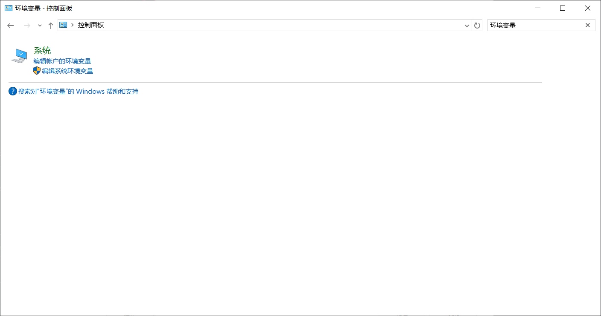
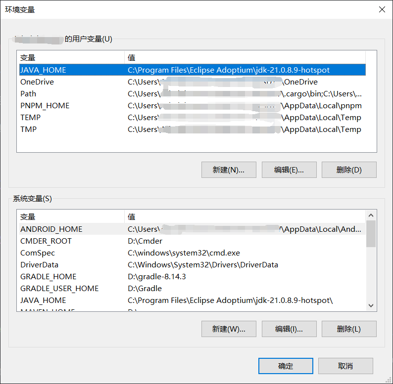
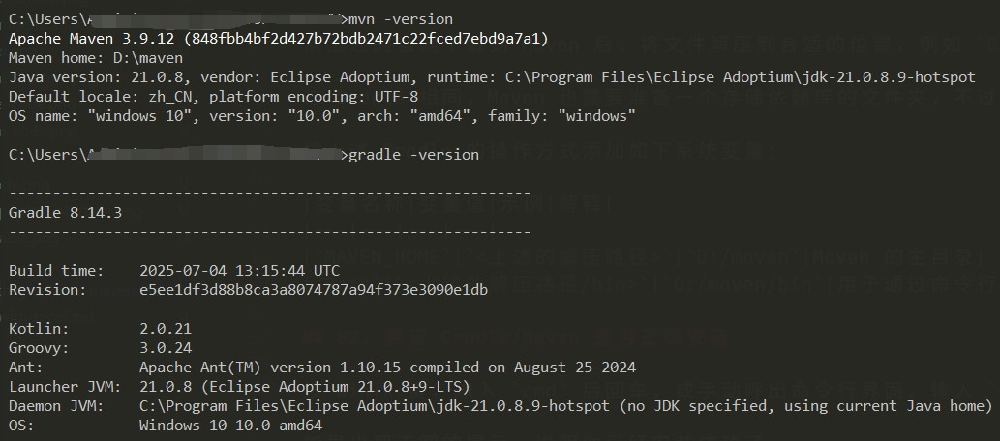
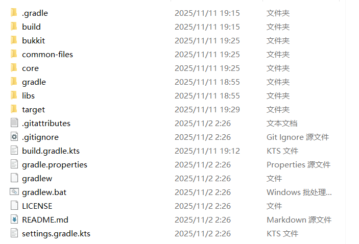
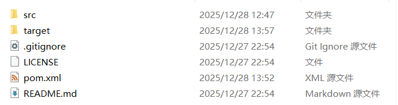

# 用 Gradle 或 Maven 构建 Jar

::: info 阅前注意

本章节使用到的工具可以从这里下载：\
Gradle（推荐安装 8.14.3）：<https://gradle.org/releases/>\
Maven：<https://maven.apache.org/download.cgi?.>

:::

## 01. 下载安装 Gradle/Maven

不同于一般的软件，Gradle/Maven 需要手动下载二进制文件，并通过系统环境对文件进行关联。

### Gradle

从上述的官网下载到 Gradle 后，将文件解压到合适的位置，例如 `D:/gradle`。

另外，还需要准备一个存储依赖库的文件夹，例如 `D:/gradleUserHome`。

之后，打开设置面板，搜索“环境变量”，在“系统”下找到带着盾牌符号的“编辑系统环境变量”。

在弹出的窗口中点击“环境变量”，再找到下侧的“系统变量（S）”，新增/追加如下内容：

|变量名称|变量值|示例|解释|
|---|---|---|---|
|`GRADLE_HOME`|`<上述的解压路径>`|`D:/gradle`|Gradle 的主目录|
|`GRADLE_USER_HOME`|`<上述的存储依赖库路径>`|`D:/gradleUserHome`|用于存放 Gradle 下载的依赖库。 尽可能放在空间充足的地方。|
|`Path`|`<上述的解压路径>/bin`|`D:/gradle/bin`|用于通过命令行启动 Gradle。 需要注意的是，Path 变量会由多个程序用到，因此需要在弹出的编辑框中点击“新增”，再把路径填入。|

此时，点击下方的“确定”即可保存系统变量。

### Maven

从上述的官网下载到 Maven 后，将文件解压到合适的位置，例如 `D:/maven`。

与 Gradle 相同，Maven 也需要准备一个存储依赖库的文件夹，不过我们稍后会讲到如何设置。

按上述 Gradle 的操作方式添加如下系统变量：

|变量名称|变量值|示例|解释|
|---|---|---|---|
|`MAVEN_HOME`|`<上述的解压路径>`|`D:/maven`|Maven 的主目录|
|`Path`|`<上述的解压路径/bin>`|`D:/maven/bin`|用于通过命令行启动 Maven。 注意点与 Gradle 部分相同。|

准备完毕后，打开 `<安装目录>/maven/conf/settings.xml` 文件，按[这篇教程](https://zhuanlan.zhihu.com/p/625000667)第四步和第五步所说，对镜像库和存储目录进行配置。

## 02. 验证 Gradle/Maven 是否正确安装

按 Win+R 键，输入 `cmd` 后回车，或手动呼出命令行界面，输入 `gradle -version` 或 `mvn version`。

如果出现下图的提示，说明你已经安装成功了。

## 03. 执行构建命令

打开插件目录，在文件浏览器的地址一栏输入 `cmd`，按回车。

在弹出的界面中输入 `gradle build`（Gradle 构建器）或 `mvn package`（Maven 构建器），静待下载依赖完成并开始构建即可。

输出的插件可以在 `<插件目录>/build/libs` 中找到。

## ex. 后记

### 01. 关于从源代码构建

有些时候，仓库里可能会有一个 `gradlew.bat` 文件。这是便携式的 Gradle 构建脚本，你可以用 `gradlew.bat clean build` 或 `gradlew.bat build` 进行构建，这样做的好处是不需要下载和配置 Gradle 和系统环境变量。缺点是，每次使用不同的构建时都会往存储目录里安装不同版本的 Gradle，浪费大量空间。

另外，有些源代码构建时需要修改构建脚本。例如，PlotSquared v7 会提醒你 fork 再修改代码，还会自动提交 commit，而本地构建是不需要这些功能的。此时需要进入构建脚本 `build.gradle.kts` 文件中去除相关代码，才可以顺利构建插件。

### 02. 关于构建类型的判别

这个还是很好分辨的。使用 Gradle 构建的项目，一般会存在上述的 `gradlew.bat` 文件，除此之外，还会有 `build.gradle.kts`（构建脚本）、`gradle.properties`（Gradle 设置）这样的文件。

以 craftengine 的源代码为例，这就是一个典型的利用了 Gradle 进行构建的插件。若需要构建这个插件，你可以使用命令 `gradle build`，或上述的 `gradlew.bat build` 构建插件。

而使用了 Maven 构建的项目，一般会有一个 `pom.xml` 文件，并且除了源代码外不会有其他文件的多余，这也是它备受推崇的原因之一。

以 ExtraStorage 的源代码为例，这则是一个典型的利用了 Maven 进行构建的插件。若需要构建这个插件，你可以使用命令 `mvn package`。

### 03. 下载依赖速度太慢

如果你在使用的是 Maven，则可以通过添加镜像源的方式解决。而如果你使用的是 Gradle，恐怕就没那么幸运了。

不过幸好我们有一个相对完善的解决方法——[dev-sidecar](https://github.com/docmirror/dev-sidecar)。

默认开启代理服务和系统代理，成功连接后就可以提升下载速度。