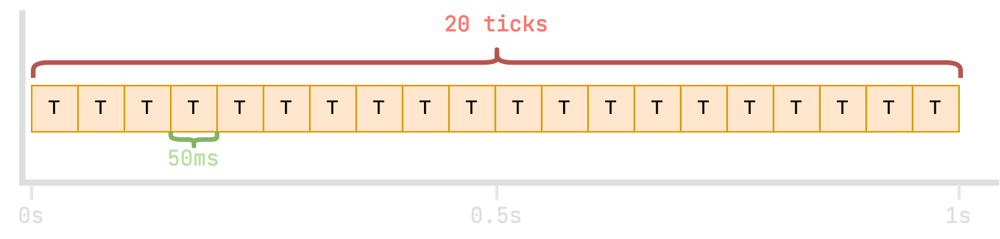

# 刻循环

几乎所有的游戏（包括Minecraft）都是由一个大的程序循环驱动的。服务器（和游戏）的执行内容可以按“刻（下称 `tick`）”拆分。

每次“滴答/刻”后，游戏服务器将会完成一系列的任务，包括但不限于：

* 处理来自玩家的数据包（例如，移动、放置/破坏方块、攻击其他实体）；
* 更新玩家和其他实体的位置；
* 向所有玩家发送服务器相关的数据包（例如方块变动、实体移动以及各种操作）；
* 生产实体、处理实体 AI 以及寻路等；
* 处理红石更新。
以及更多！

## Minecraft 中的刻/滴答

正常情况下的 Minecraft 服务器**每秒会有 20 个“tick”**，或者换言之，**每 50 毫秒一次 tick**。

正常情况下的刻循环示例。

当然，每个刻所分配的任务量是根据游戏实际情况而有所**不同**的，实际情况下的 tick 不会这般整齐！

### 正常情况下

服务器在正常运行时，执行一个完整的 tick 耗时应当小于（或等于）50 毫秒。

若一个 tick 耗时小于 50 毫秒，则服务器会在剩余的时间中“瞌睡”（不做任何事），直到处理下一次 tick。

例如：

* 服务器消耗 15 毫秒处理一个 tick；
* 刻循环控制会会在接下来的 35 毫秒中“瞌睡”，直到执行下一次 tick。

如你所见，本示例中的 tick 耗时均小于 50 毫秒，但是它们还是会空出一段来保持每秒有 20 个 tick。

如果服务器不把这些东西空出来（期间的“瞌睡”）的话，游戏会在“感觉”上变得更快——像是被加速了一样！

### 卡顿情况下

当处理一个 tick 耗时超过 50 毫秒时，下一个 tick 的计算就会被延后，因为 tick 只能排队而不可并行处理。在这种情况下，玩家的游玩体验就会变差，所有东西的反应速度都会变慢，也就是常说的“变卡”。

如你所见，当每个 tick 的耗时变长时，之后的刻就会“向右推移”，这会导致在一段相同的时间中，处理的游戏刻会变少。这就是服务器卡顿的原因，服务器变得更慢了。

你也可以在这里看到**每秒刻数**（Ticks per Second，缩写为TPS）和**每刻毫秒数**（Milliseconds per Tick，缩写为MSPT）的数据来源。

在上述的例子中：

* spark 计算所得的 TPS 为 **17**，因为一秒内只能处理 17 个滴答；
* spark 计算所得的 MSPT 最小为 **~20ms**（状况良好！）而最大为 **~80ms**（状况糟糕！）。 

## spark 报告中的刻/滴答

你可以在 spark 的健康报告中清楚地找到刻循环，它会显示在靠近页面顶部的地方！

在上述的例子中，我们可以看见 `waitForNextTick()` 方法在“服务器主线程”上占用了 81% 的 CPU 活动。这表示服务器一切正常！这也意味着在平均意义上，服务器能在为每个 tick 中的 50 毫秒分配所有任务的同时，还能有 80% 的时间休息。

这是一个好现象，表示服务器仍有余力。如果服务器活动中出现了一些突然的运算增长（例如，玩家加入、更多实体/方块更新），服务器就能游刃有余地处理它。

大体上讲：

* “瞌睡”时间占比越高，服务器越空闲；
* 如果“瞌睡”时间占比小于 20%（也就是处理内容占一整个 tick 的 80%），表示服务器运行良好，但可能会在运算*某些*滴答时卡顿（谨记，这些只是平均值！）
* 如果“瞌睡”时间占比小于 5%（也就是处理内容占一整个 tick 的 95%），你的服务器可能正经历卡顿，且难以应付更多的运算。

**再重复一次，这些只是平均值！**

假如你的服务器处理*大多数* tick 只需 20 毫秒，而处理*某些* tick 则需要超过 300 毫秒（这表示服务器可能运行不畅！）。这就有可能表示你遭遇了突然卡顿而非上文所述的持续卡顿。

如果这是实际情况，那么用于“瞌睡”和“tick”的百分比通常不符——极值会被平均化。

## 另见

* 本文部分译名参考自 Minecraft 中文维基：https://zh.minecraft.wiki/w/%E5%88%BB
