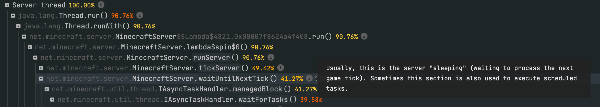

# 信息点

spark 中的“信息点”是一段额外的信息，它在 spark 浏览器中显示的内容一般称作调用框架（在用户将鼠标悬停在 ⓘ 图标上显示的内容）。



这些描述是开源的（可以通过社区简单地编辑/改进），如果你注意到某些东西看起来不太对，或者某个线程/方法调用值得加上一段描述，请务必来为我们贡献！😎

## 贡献

描述在 [**lucko/spark-infopoints**](https://github.com/lucko/spark-infopoints) Github 仓库的 YML 文件中存储。

它们依据所属对象被分为多个文件，命名仅是为了与仓库保持一致，本身并无额外意义。

你既可以克隆仓库在本地进行修改，也可以通过 Github 的网页文本编辑器修改。

### 方法描述格式

一段方法描述看起来会像这样：
```YAML
- method: net.minecraft.network.protocol.PlayerConnectionUtils.run()
  description: >
    Manages player (client) connections to the server, in particular the processing of incoming
    packets (actions performed by players).
```

* `method` 键必须包含在 spark 浏览器内（在任何映射应用前）显示的方法名称。
* `description` 键中的内容会被渲染在浏览器的描述，格式为 Markdown。

### 线程描述格式

对某个方法的描述看起来会像是这样：

```YAML
- thread: Server thread
  description: >
    The main server thread that the game loop is executed on. See the
    [Tick Loop guide](https://spark.lucko.me/docs/guides/The-tick-loop) for more info.
```

* `thread` 键应该包含显示在 spark 浏览器中的线程名称。
* `description` 键中的内容会被渲染在浏览器的描述，格式为 Markdown。

### 描述相同的多个方法/线程

如果多个方法或线程必须拥有同一条描述，它们可以通过 YAML 的列表语法加在一起：
```YAML
- methods:
  - net.minecraft.server.MinecraftServer.waitUntilNextTick()
  - net.minecraft.server.IAsyncTaskHandler.sleepForTick()
  description: >
    todo
```

```YAML
- threads:
  - Server thread
  - Main thread
  description: >
    todo
```

### 正则匹配

`method`/`thread` 键所需的值通常为完全匹配状态。但是，也可以在这里通过 `/` 符号插入正则表达式。
```YAML
- thread: /^Craft Scheduler Thread.*$/
  description: >
    todo
```