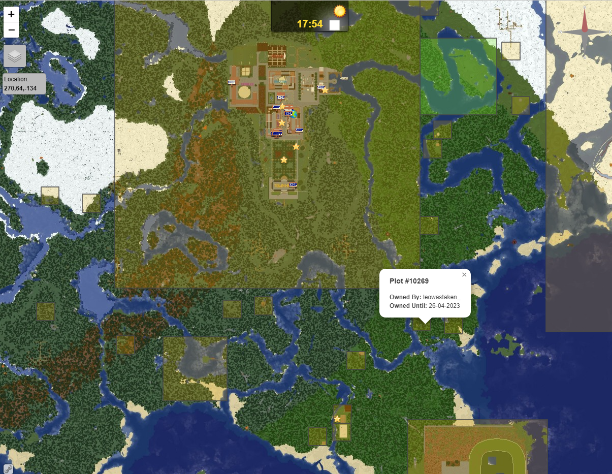

# 附属

## 本页包含所有已知的 Dynmap 附属

::: tip

所有附属都由社区开发，不会在这个 Github 仓库或者 Dynmap Discord 聊天群组中受官方 Dynamp 开发团队的支持。所有有关附属的安装、配置或调试的问题应当联系对应的附属作者或其维护者。如果你想要将你的插件加入这个列表，请按已有格式自行添加，或联系 Discord 上的管理员协助你添加。

:::

本页可分为两部分：活跃和弃坑附属。活跃附属即时常更新并支持最新版本 Dynmap/Minecraft 的附属，和/或有着活跃维护者。如果某个附属仍然生效但长时间不维护，且无法联系开发者支持，它就会被列入弃坑附属中，仅作历史记录与旧版本兼容用。

## 活跃附属

### 网页界面修改

#### [LiveAtlas](https://www.spigotmc.org/resources/86939/)

<!-- 需要改进：
  原因：图片疑似已爆炸 -->

> LiveAtlas 是 Dynmap 或 Pl3xmap 的界面替代，专注于为用户带来更现代的外观及密集地图下的性能提升。LiveAtlas 开箱即用，可替代 Dynmap 或 Pl3xmap，另外后者的地图只需少许修改即可兼容。

* 开发者：https://github.com/JLyne
* 源代码：https://github.com/JLyne/LiveAtlas
* 插件维基：https://github.com/JLyne/LiveAtlas/wiki
* 获取帮助：https://github.com/JLyne/LiveAtlas/issues
* 支持作者：https://ko-fi.com/jlyne

#### [Material-Dynmap](https://github.com/SNDST00M/material-dynmap)

<!-- 需要改进：
  原因：图片疑似已爆炸 -->

> 现代的、使用了 Material UI 并专注于 Webbukkit 的 Dynmap 主题。侧重于通过 Material Design 表达流畅与清爽风格的导航界面。

* 开发者：https://github.com/SNDST00M/
* 源代码：https://github.com/SNDST00M/material-dynmap
* 插件维基：https://github.com/SNDST00M/material-dynmap/wiki
* 获取帮助：https://github.com/SNDST00M/material-dynmap/issues
* 支持作者：https://www.patreon.com/dynmap/

### 渲染器

#### ChunkyMap

[ChunkyMap](https://github.com/leMaik/ChunkyMap) 是一个“结合了照片写实之便利与 Dynmap 自动更新特性”的地图渲染器。

ChunkyMap 开箱即用，可替换 Dynmap 自带的 `HDMap` 渲染方式。

### 插件对接

#### [Dynmap-Towny](https://github.com/TownyAdvanced/Dynmap-Towny)

* 开发者：https://github.com/TownyAdvanced/
* 源代码：https://github.com/TownyAdvanced/Dynmap-Towny
* 插件维基：https://github.com/hankjordan/Dynmap-Towny/wiki
* 获取帮助：https://discord.gg/gnpVs5m
* 支持作者：https://github.com/sponsors/LlmDl

::: tip

SiegeWar 的配置包括了“隐藏地图”，会覆盖 Dynmap 的配置以抹去玩家在郊区/地下/被攻占区域的位置显示。这可能看起来像玩家会“随机地”在地图上不显示其位置。

:::

#### [WorldBorder](https://dev.bukkit.org/projects/worldborder)

使得 Dynmap 能够预先生成与渲染世界。Dynmap 只显示生成的区块，因此它有相当明显的优势。

::: tip

* WorldBorder 只会在输入命令后生成区块。
* Dynmap 会自动显示边界。你需要配置 Dynmap 的可视区域与 WB 边界大小相同。
* 如果你已经生成了超出边界的区域，你可以使用命令 `dynmap purgemap` 进行清理。

:::

#### SkinRestorer

SkinRestorer 是一个为离线模式服务器保存皮肤的插件，同时使得玩家能通过一条简单的命令切换皮肤。

开发者直接提供了代码，但 Dynmap 无法直接支持 - 请告诉他们。

### 其他

#### EarthMC

EarthMC 是一个涉及了部分插件的**地图企划**。

在 2021 年 12 月，Discord 群组聊天内提及 EarthMC 相关问题时有如下信息：

> EarthMC 地图与 Dynmap 有着许多已知问题，如渲染不完整，只渲染玩家所到之处，或者不渲染树叶和其他植物。这个问题与地图制作的过程有关，而与插件本身无关，但好在这里有解决办法：
> 1. 安装 WorldBorder 插件：https://www.spigotmc.org/resources/worldborder.60905/
> 2. 通过命令暂停 Dynmap：`/dynmap pause all`
> 3. 以强制参数运行 WorldBorder：`/wb [世界名称] fill [频率] [界限外数量] [是否强制]`
>   * `[世界名称]` 即为世界所在文件夹的名称
>   * `[频率]` 即为每秒生成多少区块，默认为 20。警告：过高值会导致服务器卡顿。
>   * `[界限外数量]` 即为在边界外再生成多少区块，这可以确保玩家到达边界时邻近所有地形都已生成。默认为 208，不过在 EarthMC 中我推荐将其设置为 0。
>   * `[是否强制]` 选项必须设置为 true。
> 4. 等待插件完成地形生成
> 5. 通过命令 `/dynmap pause none` 解除 Dynmap 的暂停，你还可能需要通过命令 `/dynmap fullrender [世界名称]` 重置完全渲染器。

#### Virtual Realiy - 简单地皮与高级世界保护

Virtual Reality 是一款简单医用的服务器插件，允许玩家创建自己的地皮，为其好友添加信任，建造自己想要的建筑，防止熊孩子破坏，甚至可以切换到预设游戏模式，并在离开时回到原本的模式！

### 混合端

Cardboard、Magma 以及其他为 Forge 和 Fabric 同时提供兼容的模组。

截至目前，混合端尚未支持。见[标记为“不会修复”的议题](https://github.com/webbukkit/dynmap/issues/3482#issuecomment-986661674)获悉详情（2021 年 12 月）。

相似的是，尝试为 Java 版和基岩版提供支持的 Geyser 会使得部分无效名称的玩家可以进入服务器。见[相关议题](https://github.com/webbukkit/dynmap/issues/3514)。

## 弃坑附属

* 弃坑：原 ~Webbukkit Dynmap Towny 附属~ 自 2016 年起便停止更新。请使用上述“TownyAdvanced”分支。
* 弃坑：[~Dynmap Addon for Clans~](https://www.spigotmc.org/resources/abandoned-clans-dynmap-addon-for-clans-free.87028)
* 状态未知：[~dynmap PyLandmarks~](https://dev.bukkit.org/projects/dynmap-pylandmarks)
* ...以及其他**未受** Dynamp 开发者**维护**的插件。