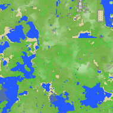
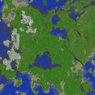
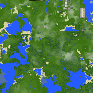
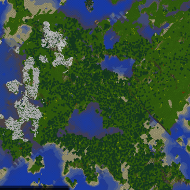
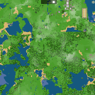
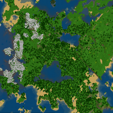
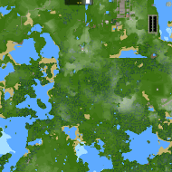
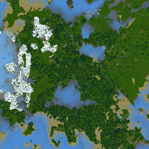

# 颜色结构

0.14 之后的版本，Dynmap 引入了这四种颜色结构文件：`default.txt`、`flames.txt`、`ovocean.txt` 以及 `sk89q.txt`。

如果需要切换，那么只需将每个地图里的 `colorscheme: default` 选项改为你需要的即可（颜色结构名称去掉 `.txt` 结尾）。

如下为每个颜色结构在同一片地形上的示例。由于方向差异，平面地图和默认渲染器采用的地形略有区别。

## 默认

 

## flames

 

## ovocean

 

## sk98q

 