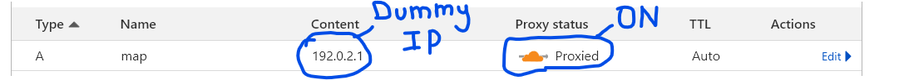
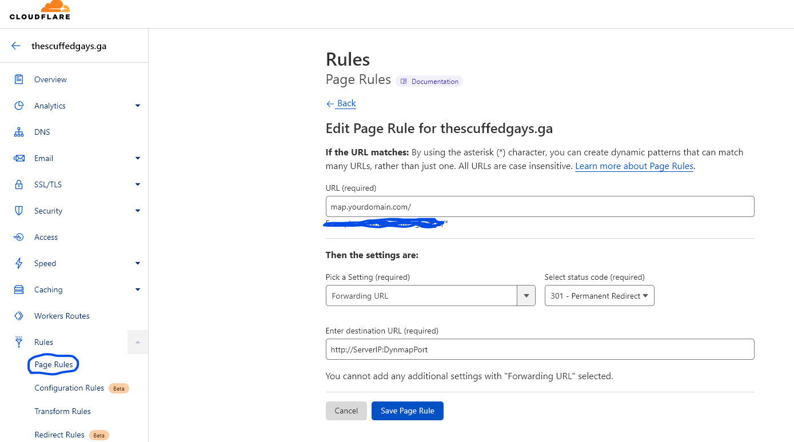

# Cloudflare Dynmap 端口转发

本教程讲述了如何让 Dynmap 通过 Cloudflare 转发服务隐藏端口号，并使用自定义域名（如 `map.域名.com`）。

本教程假设你已经知晓如何在 Cloudflare 中添加和编辑子域名记录。

1. 新建一个指向虚拟 IP 的 A 记录，并启用代理：

2. 在 A 记录基础上新建页面规则，将转发 URL 设置为 301 - 永久重定向，并填入指向 Dynmap 网页地图的完整 `IP:端口号`。

3. 点击保存，稍等片刻，代理就能启动，你就可以通过 `map.域名.com` 访问无端口的网页地图了！

