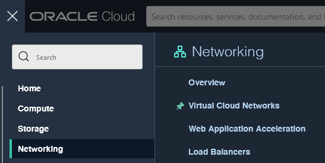
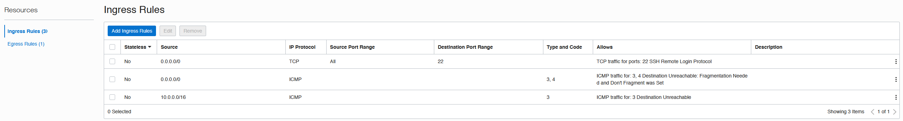
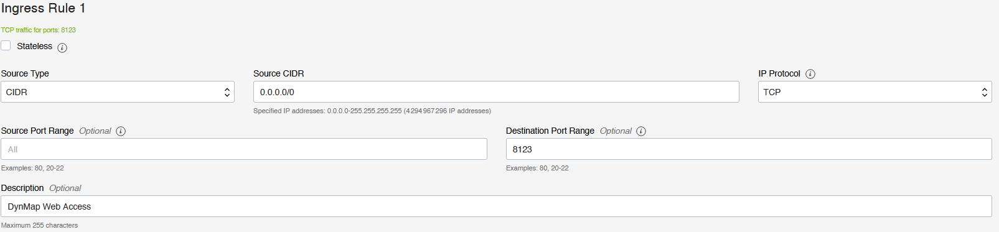
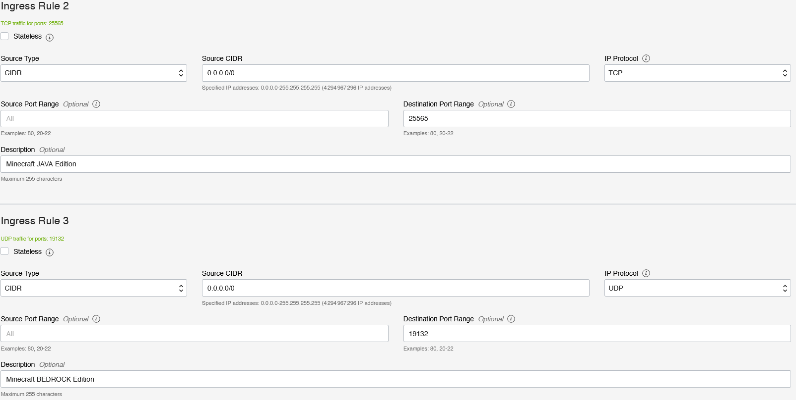
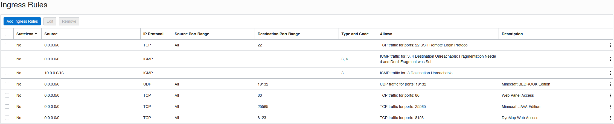
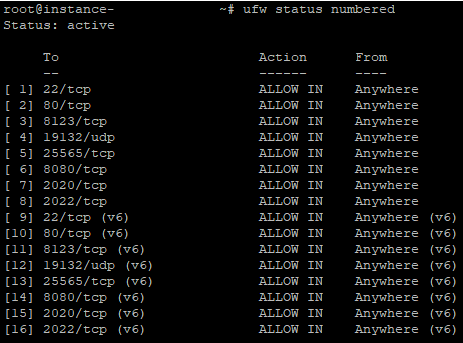
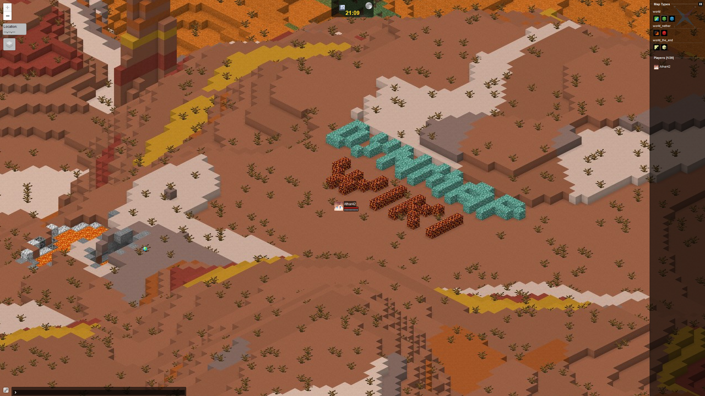

# OCI（Oracle Cloud Instance）；如何启用 Dynmap

本章节使用的是 Ubuntu ARM64 与免费的 Oracle Cloud Instance（4 核，24 GB 内存及 200 GB 存储空间）。

在教程中，我不会详细讲述如何创建实例，也不会讲述安装和/或 Minecraft 服务器的管理方法。

**教程的重点在于插件。**

## 开放端口

打开控制台左侧的菜单，找到“网络（Networking）”，选择“虚拟云网络（Virtual Cloud Networks）”。



在新弹出的页面中，你应该能看到你的虚拟网络（默认以“vcn-...”开头），选中它。\
这之后，选择你的子网，之后选择“默认安全列表（Default Security List）”（每条只需选中一个）。

打开的页面和这个类似：



选择“添加入站规则（Add Ingress Rules）”。

我们添加的第一个规则就是允许 Dynmap 访问：



在来源类型中选择“任意（ANY）”，0.0.0.0/0 为端口号，若为 8123，则为 TCP 协议（HTTP 标准）。

之后，我们还需要放行 Minecraft 服务器（取决于你的版本，和/或允许客户端连接到服务器的模组）：



请根据你自己的需求修改这些设置。

调整之后的规则如下：



解释如下：

* “无状态（Stateless）” - 我们不需要手动创建入站规则，因此无需勾选，将其交由服务器处理。若选择，我们需要新建一个允许“ANY”类型从 Dynmap 所在服务器（到任意目的地端口，因为这是不重复的随机端口）的出站规则。
* “CIDR 源（Source CIDR）” - 我们需要让“ANY”类型的连接能够进入服务器，因此需要在 CICR 部分指定 `0.0.0.0/0`。
* “源端口范围（Source Port Range）” - 由客户端定义（随机），因此需要留空。
* “目标端口范围（Destination Port Range）” - 对于这个，我们需要将目标服务的端口号填入。

## 在实例上开放端口（Ubuntu）

作为 Oracle 的首选系统，他们在这里有着更深入的讲述：
<https://blogs.oracle.com/developers/post/enabling-network-traffic-to-ubuntu-images-in-oracle-cloud-infrastructure>，你可以浏览“防火墙托管”这部分。

这里使用的方法是编辑名为 `etc/iptables/rules.v4` 的文件，将你的规则加入其中。

::: danger

如下操作请明确承担风险，否则后果自负。

:::

有两种方法实现这个目的：

### 方法一 - 默认防火墙应用：UFW

首先，可选（可以跳过初始化命令），限制任意入站连接。

``` bash
sudo ufw default allow outgoing
sudo ufw default deny incoming
```

现在，我们需要开放端口，首先是 SSH 访问端口（若你修改了默认的 SSH 端口（22/tcp），那么你需要自行修改命令中的参数），然后是 Dynmap 服务端口（8123/tcp），以及 Minecraft 服务器的端口（Java 与移动端）：

``` bash
sudo ufw allow ssh
sudo ufw allow 8123/tcp
sudo ufw allow 25565/tcp
sudo ufw allow 19132/udp
```

::: info

对于第一个命令，你能看到我指定了服务名称但并未指定端口，那么第一个命令效果等同于 `sudo ufw allow 22/tcp`。实际上，你可以在这里用其他服务的名称代替输入端口号，完整列表可通过这个命令浏览：

``` bash
cat /etc/services
```

:::

添加所需规则后，应用这些新规则并启用防火墙（记得用状态命令检查内容是否正常生效）：

``` bash
sudo ufw enable
sudo ufw reload
sudo ufw status
```



这就是全部步骤了。如果你的服务器启动成功且安装了 Dynmap，你现在就可以正常打开网页地图了。😉

### 方法二 - 安装 `firewall-cmd`（同时禁用 UFW）

如果你不想使用内置的 UFW 命令，你可以安装 `firewall-cmd`。

首先，通过如下命令安装：

``` bash
sudo apt install firewalld
```

启用新服务，禁用默认服务：

``` bash
sudo systemctl enable firewalld
sudo systemctl start firewalld
sudo ufw disable
```

按如下示例添加所需的规则（开放端口）：

``` bash
sudo firewall-cmd --permanent --zone=public --add-port=22/tcp
sudo firewall-cmd --permanent --zone=public --add-port=8123/tcp
sudo firewall-cmd --permanent --zone=public --add-port=25565/tcp
sudo firewall-cmd --permanent --zone=public --add-port=19132/udp
```

最后，通过如下命令重载规则集，就可以正常使用了：

``` bash
firewall-cmd --reload
```

## 写在最后

最后，你就可以通过网页地图浏览服务器的内容了：

<http://服务器IP:Dynmap端口号>（端口号默认为 8123）


